# SBF-Binnen - Sportbootführerschein Binnen Theorie Fragen

## Description

Dies sind die Lernzettel für den Sportbootführerschein Binnen.
Hierzu wurden die offiziellen Prüfungsfragen von <https://www.elwis.de/> in Karteikarten übersetzt.

Stand des Exports ist: Stand: 01. August 2023

## Cards

### 1. Card

|Attribut|Value|
|---|---|
|Id|e7dcab5603c704b757facb6627db98cd|
|Question|1. Was ist zu tun, wenn vor Antritt der Fahrt nicht feststeht, wer Schiffsführer ist?|
|Correct Answer|Der verantwortliche Schiffsführer muss bestimmt werden.|
|Wrong Answer 1|Der verantwortliche Schiffsführer muss gewählt werden.|
|Wrong Answer 2|Ein Inhaber eines Sportbootführerscheins muss die Fahrzeugführung übernehmen.|
|Wrong Answer 3|Ein Inhaber eines Sportbootführerscheins muss die Verantwortung übernehmen.|

### 2. Card

|Attribut|Value|
|---|---|
|Id|8030caf5db344623a35a5af12612acd1|
|Question|2. In welchen Fällen darf weder ein Sportboot geführt noch dessen Kurs oder Geschwindigkeit selbstständig bestimmt werden?|
|Correct Answer|Wenn man infolge körperlicher oder geistiger Mängel oder infolge des Genusses alkoholischer Getränke oder anderer berauschender Mittel in der sicheren Führung behindert ist oder wenn eine Blutalkoholkonzentration von 0,5 ‰ oder mehr im Körper vorhanden ist.|
|Wrong Answer 1|Wenn man infolge körperlicher oder geistiger Mängel oder infolge des Genusses alkoholischer Getränke oder anderer berauschender Mittel in der sicheren Führung behindert ist oder wenn eine Blutalkoholkonzentration von 0,8 ‰ oder mehr im Körper vorhanden ist.|
|Wrong Answer 2|Wenn man infolge körperlicher oder geistiger Mängel oder infolge des Genusses alkoholischer Getränke oder anderer berauschender Mittel in der sicheren Führung behindert ist oder wenn eine Blutalkoholkonzentration von 1,0 ‰ oder mehr im Körper vorhanden ist.|
|Wrong Answer 3|Wenn man infolge körperlicher oder geistiger Mängel oder infolge des Genusses alkoholischer Getränke oder anderer berauschender Mittel in der sicheren Führung behindert ist oder wenn eine Blutalkoholkonzentration von 0,3 ‰ oder mehr im Körper vorhanden ist.|

### 3. Card

|Attribut|Value|
|---|---|
|Id|90a3e3f50b716c3c6137069cd5818d1a|
|Question|3. Wann ist ein Fahrzeug in Fahrt?|
|Correct Answer|Wenn es weder vor Anker liegt noch an Land festgemacht ist noch auf Grund sitzt.|
|Wrong Answer 1|Wenn es weder vor Anker liegt noch an Land festgemacht ist noch Fahrt über Grund macht.|
|Wrong Answer 2|Wenn es weder auf Grund sitzt noch vor Anker liegt noch manövrierbehindert oder manövrierunfähig ist.|
|Wrong Answer 3|Wenn es weder an Land festgemacht ist noch vor Anker liegt noch Fahrt durchs Wasser macht.|

### 4. Card

|Attribut|Value|
|---|---|
|Id|4548768d6e2e0e8c88e547386503605a|
|Question|4. Wie lang ist die Dauer eines kurzen Tons (		 	)?|
|Image||
|Correct Answer|Etwa 1 Sekunde.|
|Wrong Answer 1|Etwa 2 Sekunden.|
|Wrong Answer 2|Weniger als 1 Sekunde.|
|Wrong Answer 3|Weniger als 4 Sekunden.|

### 5. Card

|Attribut|Value|
|---|---|
|Id|dfd2bc84e29e0c6de243ccc7e35360a9|
|Question|5. Wie lang ist die Dauer eines langen Tons (		 	)?|
|Image||
|Correct Answer|Etwa 4 - 6 Sekunden.|
|Wrong Answer 1|Etwa 2 - 6 Sekunden.|
|Wrong Answer 2|Etwa 1 - 2 Sekunden.|
|Wrong Answer 3|Etwa 6 - 8 Sekunden.|

### 6. Card

|Attribut|Value|
|---|---|
|Id|68f2a5974679cf78ddbfaab74fc05fa6|
|Question|6. Wann gilt ein Fahrzeug unter Segel als Maschinenfahrzeug?|
|Correct Answer|Wenn es gleichzeitig mit Maschinenkraft fährt.|
|Wrong Answer 1|Wenn es mit einer Antriebsmaschine ausgerüstet ist.|
|Wrong Answer 2|Wenn es durch das Segeln keine Fahrt durchs Wasser macht.|
|Wrong Answer 3|Wenn es durch das Segeln keine Fahrt über Grund macht.|

### 7. Card

|Attribut|Value|
|---|---|
|Id|064559c9b3560f44fb93ab0fbe666db1|
|Question|7. Welches Signal führt ein Fahrzeug unter Segel, das als Maschinenfahrzeug gilt, zusätzlich am Tage?|
|Correct Answer|Einen schwarzen Kegel, Spitze unten.|
|Wrong Answer 1|Einen schwarzen Kegel, Spitze oben.|
|Wrong Answer 2|Einen schwarzen Rhombus.|
|Wrong Answer 3|Zwei schwarze Bälle senkrecht übereinander.|

### 8. Card

|Attribut|Value|
|---|---|
|Id|a30d0de63c5a6aa37bd468b9d662ba56|
|Question|8. Welche Seite wird als Luvseite bezeichnet?|
|Correct Answer|Die dem Wind zugekehrte Seite.|
|Wrong Answer 1|Die dem Wind abgewandte Seite.|
|Wrong Answer 2|Die Seite in Fahrtrichtung rechts.|
|Wrong Answer 3|Die Seite in Fahrtrichtung links.|

### 9. Card

|Attribut|Value|
|---|---|
|Id|7efa0e4df36e0e898ae07a06144b1c47|
|Question|9. Welche Seite wird als Leeseite bezeichnet?|
|Correct Answer|Die dem Wind abgewandte Seite.|
|Wrong Answer 1|Die dem Wind zugekehrte Seite.|
|Wrong Answer 2|Die Seite in Fahrtrichtung rechts.|
|Wrong Answer 3|Die Seite in Fahrtrichtung links.|

### 10. Card

|Attribut|Value|
|---|---|
|Id|503f2ca559634d7661fe57728beacd09|
|Question|10. Wann müssen die Lichter von Fahrzeugen geführt oder gezeigt werden?|
|Correct Answer|Von Sonnenuntergang bis Sonnenaufgang und bei verminderter Sicht.|
|Wrong Answer 1|Von Sonnenaufgang bis Sonnenuntergang und bei verminderter Sicht.|
|Wrong Answer 2|Von abends 18:00 Uhr bis morgens 06:00 Uhr und bei verminderter Sicht.|
|Wrong Answer 3|Bei Dunkelheit, schlechtem Wetter und verminderter Sicht.|

### 11. Card

|Attribut|Value|
|---|---|
|Id|cdd9eebd008d19025828a5789ca23d33|
|Question|11. Wozu dient die Lichterführung?|
|Correct Answer|Sie zeigt Fahrtrichtung und Lage eines Fahrzeugs an.|
|Wrong Answer 1|Sie zeigt Kurs und Geschwindigkeit eines Fahrzeugs an.|
|Wrong Answer 2|Sie zeigt Fahrtrichtung und Position eines Fahrzeugs an.|
|Wrong Answer 3|Sie zeigt Fahrtrichtung und Kurs eines Fahrzeugs an.|

### 12. Card

|Attribut|Value|
|---|---|
|Id|47cde9386450239908d51cab7ff69218|
|Question|12. Was für eine Laterne kann ein Segelfahrzeug von weniger als 20 m Länge anstelle der Seitenlichter und des Hecklichtes führen?|
|Correct Answer|Eine Dreifarbenlaterne an oder nahe der Mastspitze.|
|Wrong Answer 1|Eine Zweifarbenlaterne an gut sichtbarer Stelle.|
|Wrong Answer 2|Eine Dreifarbenlaterne an gut sichtbarer Stelle.|
|Wrong Answer 3|Eine Zweifarbenlaterne an oder nahe der Mastspitze.|

### 13. Card

|Attribut|Value|
|---|---|
|Id|e8b5ba95dcd9bdab44e286d2fbc35ddd|
|Question|13. Welche Lichter muss ein Fahrzeug unter Segel, das gleichzeitig mit Maschinenkraft fährt, führen?|
|Correct Answer|Die für ein Maschinenfahrzeug vorgeschriebenen Lichter.|
|Wrong Answer 1|Die für ein Segelfahrzeug vorgeschriebenen Lichter.|
|Wrong Answer 2|Zwei rote Rundumlichter senkrecht übereinander.|
|Wrong Answer 3|Seitenlichter rot und grün und ein rotes Rundumlicht.|

### 14. Card

|Attribut|Value|
|---|---|
|Id|0f16f05c5275fb11c6783e6f7ede3519|
|Question|14. Wie weichen zwei Motorboote aus, die sich auf entgegengesetzten Kursen nähern?|
|Correct Answer|Jedes Fahrzeug muss seinen Kurs nach Steuerbord ändern.|
|Wrong Answer 1|Jedes Fahrzeug muss seinen Kurs nach Backbord ändern.|
|Wrong Answer 2|Es muss das luvwärtige Fahrzeug dem leewärtigen Fahrzeug ausweichen.|
|Wrong Answer 3|Es muss das leewärtige Fahrzeug dem luvwärtigen Fahrzeug ausweichen.|

### 15. Card

|Attribut|Value|
|---|---|
|Id|ed65ff8f01f45cb6f176b10dcfd8bae3|
|Question|15. Zwei Motorboote nähern sich auf kreuzenden Kursen. Es besteht die Gefahr eines Zusammenstoßes. Wer ist ausweichpflichtig?|
|Correct Answer|Dasjenige Fahrzeug muss ausweichen, welches das Andere an seiner Steuerbordseite hat.|
|Wrong Answer 1|Dasjenige Fahrzeug muss ausweichen, welches das Andere an seiner Backbordseite hat.|
|Wrong Answer 2|Es muss das luvwärtige Fahrzeug dem leewärtigen Fahrzeug ausweichen.|
|Wrong Answer 3|Es muss das leewärtige Fahrzeug dem luvwärtigen Fahrzeug ausweichen.|

### 16. Card

|Attribut|Value|
|---|---|
|Id|cc2b2be85409ad045f08290e732d356a|
|Question|16. Welche Bedeutung hat folgendes Schallsignal?|
|Image|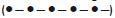|
|Correct Answer|Bleib-weg-Signal, Gefahrenbereich sofort verlassen.|
|Wrong Answer 1|Allgemeines Gefahr- und Warnsignal.|
|Wrong Answer 2|Ankerlieger über 100 m Länge.|
|Wrong Answer 3|Manövrierbehinderter Schleppverband über 200 m Länge.|

### 17. Card

|Attribut|Value|
|---|---|
|Id|d86ee32d2a913cba165530249694b58f|
|Question|17. Welche Bedeutung hat folgendes Tafelzeichen?|
|Image||
|Correct Answer|Überholverbot.|
|Wrong Answer 1|Begegnungsverbot.|
|Wrong Answer 2|Überholverbot für Fahrzeuge unter 20 m Länge.|
|Wrong Answer 3|Begegnungsverbot für Fahrzeuge über 20 m Länge.|

### 18. Card

|Attribut|Value|
|---|---|
|Id|014dc1fbaf2ce39248a73fa62a279e89|
|Question|18. Welche Bedeutung hat folgendes Tafelzeichen?|
|Image||
|Correct Answer|Begegnungsverbot an einer Engstelle.|
|Wrong Answer 1|Begegnungsverbot für Fahrzeuge über 12 m Länge.|
|Wrong Answer 2|Überholverbot; mit Gegenverkehr muss gerechnet werden.|
|Wrong Answer 3|Überholverbot für alle Fahrzeuge.|

### 19. Card

|Attribut|Value|
|---|---|
|Id|968107c72afd53194c3cc567740799d6|
|Question|19. Welche Bedeutung hat folgendes Tafelzeichen?|
|Image|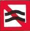|
|Correct Answer|Sog und Wellenschlag vermeiden.|
|Wrong Answer 1|Gefährdeter Strandbereich, Überspülungsgefahr; Mindestpassierabstand 100 m.|
|Wrong Answer 2|Wasserstraße, die jederzeit sicher befahren werden kann; keine Gefahr durch Seegang.|
|Wrong Answer 3|Wasserstraße, die nicht jederzeit sicher befahren werden kann; Gefahr durch Seegang.|

### 20. Card

|Attribut|Value|
|---|---|
|Id|e5003bae267564215d16bd07d4c88953|
|Question|20. Welche Bedeutung hat folgendes Tafelzeichen?|
|Image||
|Correct Answer|Mindestabstand in Metern, der in der nachfolgenden Strecke vom Aufstellungsort der Tafel an eingehalten werden muss.|
|Wrong Answer 1|Maximalgeschwindigkeit in km/h, die auf der in Fahrtrichtung rechten Fahrwasserseite nicht überschritten werden darf.|
|Wrong Answer 2|Maximalabstand in Metern, der in der nachfolgenden Strecke vom Aufstellungsort der Tafel an eingehalten werden muss.|
|Wrong Answer 3|Verengung des Fahrwassers auf 40 m.|

### 21. Card

|Attribut|Value|
|---|---|
|Id|b126cb886d143df2c0149eedfc7c0ba4|
|Question|21. Welche Bedeutung hat folgendes Tafelzeichen?|
|Image||
|Correct Answer|Haltegebot vor beweglichen Brücken, Sperrwerken und Schleusen.|
|Wrong Answer 1|Dauernde Sperrung einer Teilstrecke der Wasserstraße.|
|Wrong Answer 2|Gebot zur Abgabe eines langen Signaltons.|
|Wrong Answer 3|Weiterfahrt für Sportfahrzeuge verboten.|

### 22. Card

|Attribut|Value|
|---|---|
|Id|c6f47feb52ff78ab9edfeb1cad70dd94|
|Question|22. Welche Bedeutung hat folgendes Tafelzeichen?|
|Image|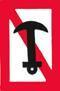|
|Correct Answer|Ankern verboten für alle Fahrzeuge.|
|Wrong Answer 1|Ankern verboten für Kleinfahrzeuge unter 12 m Länge.|
|Wrong Answer 2|Ankern verboten für Kleinfahrzeuge ab 12 m Länge.|
|Wrong Answer 3|Ankern und Festmachen verboten.|

### 23. Card

|Attribut|Value|
|---|---|
|Id|a8632075d80d69747e46b89732190c36|
|Question|23. Welche Bedeutung haben folgende Tafelzeichen?|
|Image||
|Correct Answer|Festmache- und Liegeverbot.|
|Wrong Answer 1|Festmache- und Liegeverbot für Sportboote.|
|Wrong Answer 2|Festmache- und Liegeverbot für Sportboote über 12 m Länge.|
|Wrong Answer 3|Festmache- und Liegeverbot für gewerbliche Schiffe.|

### 24. Card

|Attribut|Value|
|---|---|
|Id|780c56e34a9a10a94df560f502cbf6ee|
|Question|24. Welche Bedeutung hat folgendes Tafelzeichen?|
|Image|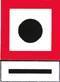|
|Correct Answer|Abgabe eines langen Tons.|
|Wrong Answer 1|Abgabe eines kurzen Tons.|
|Wrong Answer 2|Abgabe von zwei langen Tönen.|
|Wrong Answer 3|Abgabe eines kurzen und eines langen Tons.|

### 25. Card

|Attribut|Value|
|---|---|
|Id|153e50530d9ab00f5474e8af7049be2f|
|Question|25. Welche Bedeutung haben folgende Tafelzeichen?|
|Image||
|Correct Answer|Wasserflächen, auf denen mit Wasserski oder Wassermotorrädern gefahren werden darf.|
|Wrong Answer 1|Genehmigungspflichtige Übungsstrecke für das Fahren mit Wasserski oder Wassermotorrädern.|
|Wrong Answer 2|Fahren mit Wasserski oder Wassermotorrädern erlaubt. Wasserskiläufer und Wassermotorräder haben Vorfahrt.|
|Wrong Answer 3|Genehmigungsfreie Übungsstrecke für das Fahren mit Wasserski oder Wassermotorrädern.|

### 26. Card

|Attribut|Value|
|---|---|
|Id|8d145262728512dbc837db242cd639e3|
|Question|26. Welche Bedeutung hat folgendes Tafelzeichen?|
|Image||
|Correct Answer|Ende einer Gebots- oder Verbotsstrecke.|
|Wrong Answer 1|Streckenabschnitt für eine nicht frei fahrende Fähre.|
|Wrong Answer 2|Queren des Fahrwassers ist gestattet.|
|Wrong Answer 3|Wechseln der Fahrwasserseite ist gestattet.|

### 27. Card

|Attribut|Value|
|---|---|
|Id|0e10fd1f78e3fc59a734d945bb058424|
|Question|27. Welche Bedeutung hat folgendes Tafelzeichen?|
|Image||
|Correct Answer|Verbot der Durchfahrt und Sperrung der Schifffahrt.|
|Wrong Answer 1|Verbot der Durchfahrt und Sperrung für Kleinfahrzeuge.|
|Wrong Answer 2|Verbot der Durchfahrt, jedoch für Kleinfahrzeuge ohne laufende Antriebsmaschine befahrbar.|
|Wrong Answer 3|Verbot der Durchfahrt, jedoch für Kleinfahrzeuge ohne Antriebsmaschine befahrbar.|

### 28. Card

|Attribut|Value|
|---|---|
|Id|2121e086699c28713bade2b7b022c7d0|
|Question|28. Welche Bedeutung haben folgende Schifffahrtszeichen?|
|Image||
|Correct Answer|Brücke, Sperrwerk oder Schleuse geschlossen.|
|Wrong Answer 1|Anlage dauerhaft gesperrt.|
|Wrong Answer 2|Stoppsignal für alle Fahrzeuge.|
|Wrong Answer 3|Außergewöhnliche Schifffahrtsbehinderung.|

### 29. Card

|Attribut|Value|
|---|---|
|Id|7e26b46f73cc2bdc5741b4e13d88bf01|
|Question|29. Welche Bedeutung haben folgende Schifffahrtszeichen?|
|Image||
|Correct Answer|Anlage dauerhaft gesperrt.|
|Wrong Answer 1|Brücke, Sperrwerk oder Schleuse geschlossen.|
|Wrong Answer 2|Stoppsignal für alle Fahrzeuge.|
|Wrong Answer 3|Außergewöhnliche Schifffahrtsbehinderung.|

### 30. Card

|Attribut|Value|
|---|---|
|Id|c35d335b1f78a00e2839357ee35a5adc|
|Question|30. Was bedeuten diese Lichter vor einer Schleuse?|
|Image||
|Correct Answer|Einfahrt frei, Gegenverkehr gesperrt.|
|Wrong Answer 1|Einfahrt frei, Schleusentor öffnet.|
|Wrong Answer 2|Schleuse in Betrieb, auf Einfahrtsignal gemäß Reihenfolge warten.|
|Wrong Answer 3|Schleuse in Betrieb, auf Ausfahrtsignal gemäß Reihenfolge warten.|

### 31. Card

|Attribut|Value|
|---|---|
|Id|f1f3e7d911202abc30a2b9d372ed6fc6|
|Question|31. Welches Merkblatt enthält Hinweise für das Verhalten zum Schutz seltener Tiere und Pflanzen sowie zur Reinhaltung der Gewässer?|
|Correct Answer|Die 10 goldenen Regeln für Wassersportler.|
|Wrong Answer 1|Die 15 goldenen Regeln für Wassersportler.|
|Wrong Answer 2|Die 10 Grundregeln für Wassersportler.|
|Wrong Answer 3|Die 15 Verhaltensregeln für Wassersportler.|

### 32. Card

|Attribut|Value|
|---|---|
|Id|334266d4fd2c774ef2f640a3bbfc4651|
|Question|32. Wie kann mitgeholfen werden, die Lebensmöglichkeiten der Pflanzen- und Tierwelt in Gewässern und Feuchtgebieten zu bewahren und zu fördern?|
|Correct Answer|Durch umweltbewusstes Verhalten und Beachtung der "Zehn goldenen Regeln für das Verhalten von Wassersportlern in der Natur".|
|Wrong Answer 1|Durch umweltbewusstes Verhalten und Beachtung der "Zehn Grundregeln für den Wassersport".|
|Wrong Answer 2|Durch umsichtiges Verhalten und Beachtung der Verkehrsvorschriften.|
|Wrong Answer 3|Durch vorausschauendes Fahren und Ausweichen entsprechend der Verkehrsvorschriften.|

### 33. Card

|Attribut|Value|
|---|---|
|Id|9df0adde197e87d39cd87cc7699eb8ea|
|Question|33. Warum sollte man sich von Schilf- und Röhrichtzonen sowie von dicht bewachsenen Uferzonen möglichst weit fernhalten?|
|Correct Answer|Weil diese Zonen vielfach Rast- und Brutplätze besonders schutzwürdiger Vögel oder Fischlaichplätze sind.|
|Wrong Answer 1|Weil in diesen Zonen die Gefahr von Grundberührungen besteht.|
|Wrong Answer 2|Weil durch die Pflanzen der Propeller blockiert werden könnte.|
|Wrong Answer 3|Weil in diesen Zonen badende Personen schwer zu erkennen sind.|

### 34. Card

|Attribut|Value|
|---|---|
|Id|4f949e95967d2c857bacea4329e18587|
|Question|34. Warum soll ein kleines Fahrzeug nicht dicht an ein großes in Fahrt befindliches Fahrzeug heranfahren?|
|Correct Answer|Es kann durch dessen Bug- oder Heckwelle kentern oder durch den Sog mit dem Fahrzeug kollidieren.|
|Wrong Answer 1|Dichtes Heranfahren ist ein Verstoß gegen die Grundregeln für das Verhalten im Verkehr.|
|Wrong Answer 2|Da es dem großen in Fahrt befindlichen Fahrzeug sonst nicht ausweichen kann.|
|Wrong Answer 3|Es kann durch dessen Bug- oder Heckwelle Seeschlag erleiden.|

### 35. Card

|Attribut|Value|
|---|---|
|Id|4512b6c251bc7400085ee7051a523858|
|Question|35. Warum soll man möglichst gegen Strom und Wind anlegen?|
|Correct Answer|Weil sich das Fahrzeug dabei sicherer manövrieren lässt.|
|Wrong Answer 1|Weil dadurch Sog und Wellenschlag vermieden wird.|
|Wrong Answer 2|Weil dadurch Einflüsse von Wellen und Wassertiefe ausgeglichen werden.|
|Wrong Answer 3|Weil dies die Steuerwirkung der Schraube erhöht.|

### 36. Card

|Attribut|Value|
|---|---|
|Id|c4e5806ed095eb7b37a8bc297f75c990|
|Question|36. Wie verhält man sich beim Begegnen mit anderen Fahrzeugen in einem engen Fahrwasser?|
|Correct Answer|Geschwindigkeit herabsetzen und ausreichenden Passierabstand halten.|
|Wrong Answer 1|Geschwindigkeit erhöhen, um das Begegnungsmanöver zügig durchzuführen.|
|Wrong Answer 2|Das gegen den Strom fahrende Fahrzeug ist ausweichpflichtig.|
|Wrong Answer 3|Das mit dem Strom fahrende Fahrzeug hat aufzustoppen.|

### 37. Card

|Attribut|Value|
|---|---|
|Id|a469eb7dfb7fd354ea2b644ec428fe02|
|Question|37. Welche Gefahren können entstehen, wenn ein kleines von einem größeren Fahrzeug überholt wird?|
|Correct Answer|Das kleinere Fahrzeug kann durch Stau, Sog oder Schwell aus dem Kurs laufen und kollidieren oder querschlagen, in flachen Gewässern auf Grund laufen.|
|Wrong Answer 1|Das größere Fahrzeug kann durch Stau, Sog oder Schwell aus dem Kurs laufen und kollidieren oder querschlagen, in flachen Gewässern auf Grund laufen.|
|Wrong Answer 2|Das kleinere Fahrzeug kann durch Stau, Sog oder Schwell aus dem Kurs laufen und kollidieren oder kentern, in flachen Gewässern extrem versetzt werden.|
|Wrong Answer 3|Das größere Fahrzeug kann durch Wellenbildung aus dem Kurs laufen und kollidieren oder querschlagen, in flachen Gewässern auf Grund laufen.|

### 38. Card

|Attribut|Value|
|---|---|
|Id|220152ba1fdc0452194a0ecb63e44dc7|
|Question|38. Wo finden Sie Informationen über umweltfreundliche Farben, Lacke und Antifouling-Beschichtungen für Ihr Boot?|
|Correct Answer|Beim Umweltbundesamt.|
|Wrong Answer 1|Beim Bundesministerium für Digitales und Verkehr.|
|Wrong Answer 2|In der Sportbootführerscheinverordnung.|
|Wrong Answer 3|In der Sportbootvermietungsverordnung.|

### 39. Card

|Attribut|Value|
|---|---|
|Id|d53e57a39ee7a2720189cf51fbaeac0a|
|Question|39. Woran kann man erkennen, ob der Anker hält?|
|Correct Answer|Wenn beim Handauflegen auf die Ankerkette oder -leine kein Rucken zu verspüren ist und sich die Ankerpeilung nicht ändert.|
|Wrong Answer 1|Wenn Ankerkette oder -leine nicht vibrieren und sich der anliegende Magnetkompasskurs nicht verändert.|
|Wrong Answer 2|Wenn beim Handauflegen auf die Ankerkette oder -leine kein Rucken zu verspüren ist und das Fahrzeug nicht schwojt.|
|Wrong Answer 3|Wenn beim Handauflegen auf die Ankerkette oder -leine kein Rucken zu verspüren ist und sich die Ankerpeilung ändert.|

### 40. Card

|Attribut|Value|
|---|---|
|Id|679902d0aac7084c15757facc5f58dee|
|Question|40. Welches ist der günstigste Anlaufwinkel beim Anlegen?|
|Correct Answer|Ein möglichst spitzer Winkel.|
|Wrong Answer 1|Ein Winkel von 90° bis 100°.|
|Wrong Answer 2|Ein möglichst stumpfer Winkel.|
|Wrong Answer 3|Ein Winkel von 60° bis 70°.|

### 41. Card

|Attribut|Value|
|---|---|
|Id|0079018fa468a2ff99ef4fbedac28acf|
|Question|41. Wie verhält sich im Allgemeinen das Schiff im Rückwärtsgang bei einem rechtsdrehenden Propeller?|
|Correct Answer|Das Heck dreht nach Backbord.|
|Wrong Answer 1|Das Heck dreht nach Steuerbord.|
|Wrong Answer 2|Der Kurs des Schiffes ändert sich nicht.|
|Wrong Answer 3|Der Bug dreht nach Backbord.|

### 42. Card

|Attribut|Value|
|---|---|
|Id|19137990c4589fe001830fc3f95eaf7d|
|Question|42. Was bewirkt der Quickstopp?|
|Correct Answer|Unterbrechung von Zündkontakt bzw. Kraftstoffzufuhr.|
|Wrong Answer 1|Automatisches Anlassen des Motors.|
|Wrong Answer 2|Kurze Unterbrechung des Motorlaufs.|
|Wrong Answer 3|Automatische Schubumkehr.|

### 43. Card

|Attribut|Value|
|---|---|
|Id|cbfe5c6293d2fce094b0c1642b364e36|
|Question|43. Was ist zu unternehmen, wenn Treibstoff oder Öl in die Bilge gelangt?|
|Correct Answer|Mit Lappen aufnehmen und umweltgerecht entsorgen.|
|Wrong Answer 1|Räume lüften und abwarten.|
|Wrong Answer 2|Gleichmäßig verteilen.|
|Wrong Answer 3|Mit entsprechendem Mittel neutralisieren.|

### 44. Card

|Attribut|Value|
|---|---|
|Id|50b1694d5fc17d6793fcf61c137d7cc0|
|Question|44. Was ist unter einem rechtsdrehenden Propeller zu verstehen?|
|Correct Answer|Von achtern gesehen in Vorausfahrt Drehung des Propellers im Uhrzeigersinn.|
|Wrong Answer 1|Von vorne gesehen in Vorausfahrt Drehung des Propellers im Uhrzeigersinn.|
|Wrong Answer 2|Von achtern gesehen in Vorausfahrt Drehung des Propellers gegen den Uhrzeigersinn.|
|Wrong Answer 3|Von vorne gesehen in Rückwärtsfahrt Drehung des Propellers gegen den Uhrzeigersinn.|

### 45. Card

|Attribut|Value|
|---|---|
|Id|b7148899822ea9ca21971b74ac99bf47|
|Question|45. Was ist unter einem linksdrehenden Propeller zu verstehen?|
|Correct Answer|Von achtern gesehen in Vorausfahrt Drehung des Propellers gegen den Uhrzeigersinn.|
|Wrong Answer 1|Von vorne gesehen in Vorausfahrt Drehung des Propellers gegen den Uhrzeigersinn.|
|Wrong Answer 2|Von achtern gesehen in Vorausfahrt Drehung des Propellers im Uhrzeigersinn.|
|Wrong Answer 3|Von vorne gesehen in Rückwärtsfahrt Drehung des Propellers im Uhrzeigersinn.|

### 46. Card

|Attribut|Value|
|---|---|
|Id|6332bb771c44b184ba001d67ac47d7e9|
|Question|46. Was ist unter der indirekten Ruderwirkung (Radeffekt) des Propellers zu verstehen?|
|Correct Answer|Das seitliche Versetzen des Hecks.|
|Wrong Answer 1|Das Versetzen nach vorne.|
|Wrong Answer 2|Das Versetzen nach hinten.|
|Wrong Answer 3|Das seitliche Versetzen des Bugs.|

### 47. Card

|Attribut|Value|
|---|---|
|Id|5b5183cc4d9ba8690ae038e5a50dc7c9|
|Question|47. Weshalb ist die Kenntnis der Propellerdrehrichtung von Bedeutung?|
|Correct Answer|Sie hilft beim Manövrieren.|
|Wrong Answer 1|Sie hilft beim Kurshalten.|
|Wrong Answer 2|Sie hilft beim Überholen.|
|Wrong Answer 3|Sie hilft beim Begegnen.|

### 48. Card

|Attribut|Value|
|---|---|
|Id|30a80e465739aa8f001b63258f85e0c6|
|Question|48. Welche Anlegeseite ist mit rechtsdrehendem Propeller empfehlenswert und warum?|
|Correct Answer|Die Backbordseite - der Radeffekt zieht das Fahrzeug an die Pier.|
|Wrong Answer 1|Die Steuerbordseite - der Radeffekt zieht das Fahrzeug an die Pier.|
|Wrong Answer 2|Die Steuerbord- oder Backbordseite je nach Ruderlage.|
|Wrong Answer 3|Es gibt keine empfehlenswerte Anlegeseite.|

### 49. Card

|Attribut|Value|
|---|---|
|Id|131b7b0ebdc78813d22aa95d586fb0d6|
|Question|49. Was muss beim Tanken beachtet werden?|
|Correct Answer|Motor abstellen, keine elektrischen Schalter betätigen, Vorbereitung gegen das Überlaufen von Kraftstoff treffen, kein offenes Feuer.|
|Wrong Answer 1|Motor in Leerlaufstellung, keine elektrischen Schalter betätigen, Vorbereitung gegen das Überlaufen von Kraftstoff treffen, kein offenes Feuer.|
|Wrong Answer 2|Fenster schließen, keine elektrischen Schalter betätigen, Vorbereitung gegen das Überlaufen von Kraftstoff treffen, kein offenes Feuer.|
|Wrong Answer 3|Motor abstellen, Feuerlöscher bereithalten, Vorbereitung gegen das Überlaufen von Kraftstoff treffen, kein offenes Feuer.|

### 50. Card

|Attribut|Value|
|---|---|
|Id|be7547559303af492a5bc8fd2cff8f20|
|Question|50. Wodurch wird bei einem Fahrzeug mit Außenbordmotor und ohne Ruderanlage die Ruderwirkung erzielt?|
|Correct Answer|Durch Schraubenstrom und Richtung des Propellers.|
|Wrong Answer 1|Durch Schraubenstrom und Anstellwinkel des Propellers.|
|Wrong Answer 2|Durch den Schraubenwiderstand und Anstellwinkel des Propellers.|
|Wrong Answer 3|Durch den Schraubenwiderstand und Richtung des Propellers.|

### 51. Card

|Attribut|Value|
|---|---|
|Id|0917eec1e43546926999dc9622b4f0b2|
|Question|51. Weshalb setzt bei einem Fahrzeug mit Einbaumaschine und starrer Welle bei Aufnahme der Rückwärtsfahrt die Ruderwirkung erst relativ spät ein?|
|Correct Answer|Weil sie erst mit Anströmung des Ruderblattes einsetzt.|
|Wrong Answer 1|Weil sich durch den Radeffekt ein Unterdruck am Propeller entwickelt.|
|Wrong Answer 2|Durch den Abstand von Propeller und Ruderblatt.|
|Wrong Answer 3|Weil sich durch den Radeffekt ein Unterdruck am Ruder entwickelt.|

### 52. Card

|Attribut|Value|
|---|---|
|Id|7e48331a1ed23f1e383ef27d3bfe8c64|
|Question|52. Während der Fahrt sollte die Maschinenanlage ständig überwacht werden. Worauf muss besonders geachtet werden?|
|Correct Answer|Motortemperatur, Öldruck, Ladekontrolle.|
|Wrong Answer 1|Kühlwasseraustritt, Drehzahlmesser, Keilriemenspannung.|
|Wrong Answer 2|Schraubendrehzahl, Getriebeöltemperatur, Öldruck.|
|Wrong Answer 3|Druck der Einspritzpumpe, Impellerpumpe, Ölpumpe.|

### 53. Card

|Attribut|Value|
|---|---|
|Id|9ac32fe31feffa0ee7867613351a773c|
|Question|53. Die Temperatur der Antriebsmaschine überschreitet die zulässigen Grenzwerte. Was könnte die mögliche Ursache sein?|
|Correct Answer|Defektes Thermostat, defekte Impellerpumpe, geschlossenes Seeventil, zu niedriger Kühlwasserstand.|
|Wrong Answer 1|Zu viel Motoröl, defekte Impellerpumpe, geschlossenes Seeventil, zu niedriger Kühlwasserstand.|
|Wrong Answer 2|Defektes Thermostat, defekte Impellerpumpe, geschlossenes Seeventil, zu hohe Batteriespannung.|
|Wrong Answer 3|Defektes Thermostat, defekte Kupplung, geschlossenes Seeventil, zu niedriger Kühlwasserstand.|

### 54. Card

|Attribut|Value|
|---|---|
|Id|c28670e74b55244b7a71937a23c37917|
|Question|54. Die Ladekontrolllampe erlischt nach dem Starten nicht. Was könnte die mögliche Ursache sein?|
|Correct Answer|Lichtmaschine bzw. Regler der Lichtmaschine defekt.|
|Wrong Answer 1|Zu hohe Motordrehzahl.|
|Wrong Answer 2|Keilriemen gerissen und hoher Stromverbrauch.|
|Wrong Answer 3|Anlasser ist nach dem Starten ausgefallen.|

### 55. Card

|Attribut|Value|
|---|---|
|Id|6fa81283ba786ee05d45832164d4803e|
|Question|55. Die Ölkontrollleuchte leuchtet nach dem Starten weiter. Was könnte die mögliche Ursache sein?|
|Correct Answer|Druckschalter bzw. Öldruckpumpe defekt.|
|Wrong Answer 1|Zu viel Motoröl im Motor.|
|Wrong Answer 2|FI-Schalter defekt.|
|Wrong Answer 3|Zu hohe Motordrehzahl.|

### 56. Card

|Attribut|Value|
|---|---|
|Id|0a5bf00fd27caca846730b221e720f51|
|Question|56. Der Motor ist gestartet worden. Was kann die Ursache sein, wenn nach dem Einkuppeln der Antriebswelle der Motor stehenbleibt?|
|Correct Answer|Blockierter Propeller.|
|Wrong Answer 1|Blockierte Kraftstoffzufuhr.|
|Wrong Answer 2|Verschmutzter Ölfilter.|
|Wrong Answer 3|Verschmutzter Luftfilter.|

### 57. Card

|Attribut|Value|
|---|---|
|Id|802db0f257f5b421597f3e74f0750a53|
|Question|57. Ein Außenborder mit gefülltem Tank bleibt während der Fahrt stehen. Was könnten die Ursachen sein?|
|Correct Answer|Belüftungsschraube geschlossen; verstopfte Kraftstoffleitung.|
|Wrong Answer 1|Ansaugdüsen zu groß bzw. zu klein.|
|Wrong Answer 2|Tankdeckel ist offen.|
|Wrong Answer 3|Schraube an der Welle lose.|

### 58. Card

|Attribut|Value|
|---|---|
|Id|3ce2fcfb50807edba447a878ae00740c|
|Question|58. Welche Veröffentlichungen enthalten wichtige Regeln und Tipps für Wassersportler, Empfehlungen zur Ausrüstung von Sportbooten sowie Hinweise zu umweltgerechtem Verhalten auf dem Wasser?|
|Correct Answer|Nautische Publikationen wie „Sicherheit auf dem Wasser“ und „Sicher auf See".|
|Wrong Answer 1|Verordnung über die Sicherung der Seefahrt und nautische Publikationen wie „Sicher auf See".|
|Wrong Answer 2|Nautische Publikation wie „Sicherheit auf dem Wasser“ und Internationales Signalbuch.|
|Wrong Answer 3|Internationales Signalbuch und Verordnung über die Sicherung der Seefahrt.|

### 59. Card

|Attribut|Value|
|---|---|
|Id|c9769aa8b38877da253c446bf7ddf1da|
|Question|59. Unter welchen Voraussetzungen darf ein Sportboot mit Elektromotor ohne Fahrerlaubnis geführt werden?|
|Correct Answer|Die Antriebsleistung beträgt höchstens 7,5 Kilowatt Betriebsart S1 (Dauerbetrieb).|
|Wrong Answer 1|Es darf immer ohne Fahrerlaubnis geführt werden, unabhängig von der Antriebsleistung.|
|Wrong Answer 2|Bis zu einer Antriebsleistung von 11,03 Kilowatt Betriebsart S1 (Dauerbetrieb).|
|Wrong Answer 3|Es darf nie ohne Fahrerlaubnis geführt werden, unabhängig von der Antriebsleistung.|

### 60. Card

|Attribut|Value|
|---|---|
|Id|779cbefacb6f2b65ea6b8e51bf15d914|
|Question|60. Welche Vorkehrungen sind für das längere Verlassen des Fahrzeugs zu treffen?|
|Correct Answer|Alle Seeventile schließen und den Hauptschalter des Bordnetzes ausschalten.|
|Wrong Answer 1|Kraftstoff- und Wassertank auffüllen und das Bordnetz aufladen.|
|Wrong Answer 2|Tagestank schließen und Kraftstofffilter entwässern.|
|Wrong Answer 3|Fahrzeug seefest hinterlassen und den Hafenmeister verständigen.|

### 61. Card

|Attribut|Value|
|---|---|
|Id|b19589ee5a95bce90be073558d6f0ea4|
|Question|61. Wie ist ein enges Gewässer zu befahren, wenn man sich am Ufer festgemachten Fahrzeugen nähert?|
|Correct Answer|Verringerung der Geschwindigkeit, um schädlichen Sog und Wellenschlag zu vermeiden.|
|Wrong Answer 1|Beibehaltung der Geschwindigkeit, um durch Gleitfahrt schädlichen Sog und Wellenschlag auszuschließen.|
|Wrong Answer 2|Verringerung der Geschwindigkeit und nötigenfalls vom Rechtsfahrgebot abweichen.|
|Wrong Answer 3|Auf Höhe der festgemachten Fahrzeuge aufstoppen und überprüfen, dass kein Dritter behindert oder geschädigt wird.|

### 62. Card

|Attribut|Value|
|---|---|
|Id|6ac7dd198b049a956db492f97e85988e|
|Question|62. Wo sollen die Gasbehälter einer Flüssiggasanlage gelagert werden?|
|Correct Answer|Möglichst an Deck, geschützt vor Sonneneinstrahlung, sonst in einem besonders abgeschlossenen Raum für Gasbehälter, der in Bodenhöhe eine Öffnung nach außenbords hat.|
|Wrong Answer 1|Möglichst unten im Schiff, geschützt vor Sonneneinstrahlung, sonst in einem besonders abgeschlossenen Raum für Gasbehälter, der in Bodenhöhe eine Öffnung nach außenbords hat.|
|Wrong Answer 2|Möglichst auf dem Vorschiff, geschützt vor Sonneneinstrahlung, sonst in einem besonders abgeschlossenen Raum für Gasbehälter, der in Bodenhöhe eine Öffnung nach außenbords hat.|
|Wrong Answer 3|Möglichst an Deck, geschützt vor Sonneneinstrahlung, sonst in einem besonders abgeschlossenen Raum für Gasbehälter, der oben belüftet ist.|

### 63. Card

|Attribut|Value|
|---|---|
|Id|70f38e24346332c01dbf05773a5c77fc|
|Question|63. Warum sind die Flüssiggase Propan und Butan an Bord besonders gefährlich?|
|Correct Answer|Beide Gase sind schwerer als Luft und bilden mit Luft ein explosives Gemisch.|
|Wrong Answer 1|Beide Gase sind leichter als Luft und bilden mit Luft ein explosives Gemisch.|
|Wrong Answer 2|Beide Gase sind schwerer als Wasser und bilden mit Wasser ein explosives Gemisch.|
|Wrong Answer 3|Beide Gase sind schwerer als Luft und bilden mit Wasser ein explosives Gemisch.|

### 64. Card

|Attribut|Value|
|---|---|
|Id|b70bc38d287237d67409707bd06f3858|
|Question|64. Was ist zu tun, wenn Flüssiggas in das Innere des Bootes gelangt?|
|Correct Answer|Gaszuführung absperren und für Lüftung sorgen. Außerdem keine elektrischen Schalter betätigen und keinen Funk und keine Mobiltelefone benutzen.|
|Wrong Answer 1|Gasleitung entleeren und für Lüftung sorgen. Außerdem keine elektrischen Schalter betätigen und keine Telefone benutzen.|
|Wrong Answer 2|Gaszuführung absperren und für Lüftung sorgen. Außerdem keine elektrischen Schalter betätigen und per Telefon Hilfe holen.|
|Wrong Answer 3|Gasleitung entleeren und die Gasfreiheit mit dem Feuerzeug prüfen sowie über Funk oder Mobiltelefon Hilfe anfordern.|

### 65. Card

|Attribut|Value|
|---|---|
|Id|c1e91499d44d421b1c994356bd138dc6|
|Question|65. Was ist vor Inbetriebnahme einer Flüssiggasanlage zu prüfen?|
|Correct Answer|Die Anlage muss abgenommen sein, Leitungen und Anschlüsse müssen dicht sein. Haupthahn und andere Absperrventile sind zu öffnen.|
|Wrong Answer 1|Die Anlage muss abgenommen sein, die Inbetriebnahme darf nur durch eine besonders geprüfte Person erfolgen.|
|Wrong Answer 2|Die Anlage muss abgenommen sein und jährlich überprüft werden. Die Inbetriebnahme darf nur durch eine besonders geprüfte Person erfolgen.|
|Wrong Answer 3|Die Abnahme der Anlage darf nicht länger als drei Jahre zurückliegen. Haupthahn und andere Absperrventile sind zu öffnen.|

### 66. Card

|Attribut|Value|
|---|---|
|Id|3ada22b3ec67e7faa28f1f56e1790d35|
|Question|66. Was ist zu beachten, wenn eine Flüssiggasanlage außer Betrieb gesetzt wird?|
|Correct Answer|Haupthahn und Absperrventile sind zu schließen.|
|Wrong Answer 1|Die Anlage ist gasfrei zu machen.|
|Wrong Answer 2|Gasflasche fachgerecht entsorgen.|
|Wrong Answer 3|Der Flüssiggasbehälter ist vollständig zu entleeren.|

### 67. Card

|Attribut|Value|
|---|---|
|Id|156f3086866abd6d742d6c8fcf9f0ca0|
|Question|67. Wie oft muss man aufblasbare Rettungsmittel warten lassen?|
|Correct Answer|Entsprechend der Herstellerangabe, mindestens alle 2 Jahre.|
|Wrong Answer 1|Jährlich und nach jedem Einsatz oder Übungsgebrauch.|
|Wrong Answer 2|Entsprechend der Herstellerangabe, mindestens alle 3 Jahre.|
|Wrong Answer 3|Jährlich, jeweils vor Beginn der Wassersportsaison.|

### 68. Card

|Attribut|Value|
|---|---|
|Id|a8175fa48977d60678d6e3a024a37665|
|Question|68. Welcher Feuerlöscher ist für Sportboote zweckmäßig und wie oft muss man einen Feuerlöscher überprüfen lassen?|
|Correct Answer|ABC-Pulver- und Schaumlöscher, mindestens alle 2 Jahre.|
|Wrong Answer 1|Feuerlöscher mit Löschschaum, mindestens einmal pro Jahr.|
|Wrong Answer 2|CO2-Feuerlöscher, mindestens alle 2 Jahre.|
|Wrong Answer 3|ABC-Pulverlöscher, mindestens einmal pro Jahr.|

### 69. Card

|Attribut|Value|
|---|---|
|Id|509aa127468cda1aa9d120b1c2632a6f|
|Question|69. Welche Maßnahmen muss man ergreifen, um einen Brand mit dem Feuerlöscher wirksam zu bekämpfen?|
|Correct Answer|Luftzufuhr verhindern, Feuerlöscher erst am Brandherd einsetzen und das Feuer möglichst von unten bekämpfen.|
|Wrong Answer 1|Rauchabzug sicherstellen und Feuerlöscher rechtzeitig einsetzen, dabei den Löschstrahl möglichst in die lodernden Flammen halten.|
|Wrong Answer 2|Luftzufuhr verhindern und den Feuerlöscher mit sparsamen Löschstrahlstößen einsetzen, dabei das Feuer möglichst von oben bekämpfen.|
|Wrong Answer 3|Handhabungshinweise durchlesen und den Feuerlöscher sofort einsetzen, dabei das Feuer möglichst von unten bekämpfen.|

### 70. Card

|Attribut|Value|
|---|---|
|Id|a8660eff5e14d463916dbfb796432600|
|Question|70. Wie hat man sich nach einem Zusammenstoß zu verhalten?|
|Correct Answer|Hilfe leisten und so lange am Unfallort bleiben, bis ein weiterer Beistand nicht mehr erforderlich ist; alle erforderlichen Daten austauschen.|
|Wrong Answer 1|Hilfe leisten und so lange am Unfallort bleiben, bis ein weiterer Beistand nicht mehr erforderlich ist; die Wasserschutzpolizei benachrichtigen.|
|Wrong Answer 2|Hilfe leisten und so lange am Unfallort bleiben, bis ein weiterer Beistand nicht mehr erforderlich ist; Notsignal geben.|
|Wrong Answer 3|Hilfe leisten und so lange am Unfallort bleiben, bis ein weiterer Beistand nicht mehr erforderlich ist; Verschlusszustand herstellen.|

### 71. Card

|Attribut|Value|
|---|---|
|Id|c84404ad363a3b3ae831b426990dc83b|
|Question|71. Welche Faktoren sind hauptsächlich für das Wettergeschehen, also für Wind und Niederschläge, ausschlaggebend?|
|Correct Answer|Luftdruckänderung, Luftfeuchtigkeit und Temperatur.|
|Wrong Answer 1|Luftdruckänderung, Sonneneinstrahlung und Höhenlage.|
|Wrong Answer 2|Luftdruckänderung, Luftfeuchtigkeit und Jahreszeit.|
|Wrong Answer 3|Luftdruckänderung, Tageszeit und Temperatur.|

### 72. Card

|Attribut|Value|
|---|---|
|Id|b70549fba1bbc3862957d93ae7059e34|
|Question|72. In welcher Situation dürfen Notsignale gegeben werden?|
|Correct Answer|Wenn Gefahr für Leib oder Leben von Personen besteht und daher Hilfe benötigt wird.|
|Wrong Answer 1|Wenn Gefahr für Leib oder Leben von Personen besteht oder das Schiff nicht mehr sicher manövriert werden kann.|
|Wrong Answer 2|Wenn Gefahr für Leib oder Leben von Personen oder erhebliche Sachwerte besteht und daher Hilfe benötigt wird.|
|Wrong Answer 3|Wenn Gefahr für Leib oder Leben von Personen, erhebliche Sachwerte oder die maritime Umwelt besteht.|

### 73. Card

|Attribut|Value|
|---|---|
|Id|83a62d7623d5db50bb9aa1f2aa9a33bc|
|Question|73. Für welche Sportboote ist der Sportbootführerschein mit dem Geltungsbereich Binnenschifffahrtsstraßen vorgeschrieben?|
|Correct Answer|Für Sportboote von mehr als 11,03 kW (15 PS) Nutzleistung bei Verwendung eines Verbrennungsmotors bzw. 7,5 kW bei Verwendung eines Elektromotors Betriebsart S1 (Dauerbetrieb) und weniger als 20 m Länge.|
|Wrong Answer 1|Für Sportboote von weniger als 11,03 kW (15 PS) Nutzleistung bei Verwendung eines Verbrennungsmotors bzw. 7,5 kW bei Verwendung eines Elektromotors Betriebsart S1 (Dauerbetrieb) und mehr als 20 m Länge.|
|Wrong Answer 2|Für Sportboote von mehr als 11,03 kW (15 PS) Nutzleistung bei Verwendung eines Verbrennungsmotors bzw. 7,5 kW bei Verwendung eines Elektromotors Betriebsart S1 (Dauerbetrieb) und mehr als 20 m Länge.|
|Wrong Answer 3|Für Sportboote von weniger als 11,03 kW (15 PS) Nutzleistung bei Verwendung eines Verbrennungsmotors bzw. 7,5 kW bei Verwendung eines Elektromotors Betriebsart S1 (Dauerbetrieb) und weniger als 20 m Länge.|

### 74. Card

|Attribut|Value|
|---|---|
|Id|7a9300341c2c51867b68b0d3fae10782|
|Question|74. Auf welchen Gewässern gilt der Sportbootführerschein mit dem Geltungsbereich Binnenschifffahrtsstraßen?|
|Correct Answer|Auf den Bundeswasserstraßen im Binnenbereich.|
|Wrong Answer 1|Auf allen Landesgewässern.|
|Wrong Answer 2|Auf den Bundeswasserstraßen und allen Landesgewässern.|
|Wrong Answer 3|Auf allen Seewasserstraßen.|

### 75. Card

|Attribut|Value|
|---|---|
|Id|75eab89f56aa3d1608666210fd1a9bb8|
|Question|75. Aus welchen Gründen muss der Sportbootführerschein mit dem Geltungsbereich Binnenschifffahrtsstraßen entzogen werden?|
|Correct Answer|Bei fehlender Tauglichkeit oder fehlender Zuverlässigkeit.|
|Wrong Answer 1|Bei zweifelhafter Tauglichkeit wegen Alkoholmissbrauch.|
|Wrong Answer 2|Bei zweifelhafter Zuverlässigkeit aus Altersgründen.|
|Wrong Answer 3|Bei fehlender Zuverlässigkeit nach einer begangener Ordnungswidrigkeit.|

### 76. Card

|Attribut|Value|
|---|---|
|Id|f2b80257aaa64428a34aadd3e15d7a8b|
|Question|76. Was beinhaltet die allgemeine Sorgfaltspflicht?|
|Correct Answer|Vermeidung der Gefährdung von Menschenleben, von Beschädigungen an Fahrzeugen, Anlagen oder Ufern, Behinderung der Schifffahrt und Beeinträchtigung der Umwelt.|
|Wrong Answer 1|Gefährdung von Menschenleben, Beschädigungen an Fahrzeugen, Anlagen oder Ufern und Beeinträchtigung der Umwelt.|
|Wrong Answer 2|Es ist alles zu tun, was zur Vermeidung der Gefährdung von Menschenleben, Behinderung der Schifffahrt und Beeinträchtigung der Umwelt nötig ist.|
|Wrong Answer 3|Es ist alles zu tun, was zur Vermeidung von Beschädigungen an Fahrzeugen, Anlagen oder Ufern, Behinderung der Schifffahrt und Beeinträchtigung der Umwelt nötig ist.|

### 77. Card

|Attribut|Value|
|---|---|
|Id|462c81bc57cb5da55a959900e703867a|
|Question|77. Unter welchen Umständen darf von den geltenden Bestimmungen über das Verhalten im Verkehr auf den Binnenschifffahrtsstraßen abgewichen werden?|
|Correct Answer|Bei unmittelbar drohender Gefahr für sich oder andere.|
|Wrong Answer 1|Bei unmittelbar bevorstehender Begegnung.|
|Wrong Answer 2|Bei unmittelbar bevorstehendem Überholvorgang.|
|Wrong Answer 3|Bei mittelbar drohender Gefahr für sich oder andere.|

### 78. Card

|Attribut|Value|
|---|---|
|Id|ec2e1923fca7026c619e541660c03393|
|Question|78. Welche Anforderungen neben der körperlichen und geistigen Tauglichkeit und fachlichen Eignung muss der Führer eines Sportbootes auf Binnenschifffahrtsstraßen erfüllen, wenn die größte Nutzleistung der Antriebsmaschine 11,03 kW bei Verbrennungsmotoren bzw. 7,5 kW bei Elektromotoren Betriebsart S1 (Dauerbetrieb) oder weniger beträgt?|
|Correct Answer|Mindestalter 16 Jahre.|
|Wrong Answer 1|Nachweis der Zuverlässigkeit.|
|Wrong Answer 2|Mindestalter 14 Jahre.|
|Wrong Answer 3|Besitz eines Sportbootführerscheins mit dem Geltungsbereich Binnenschifffahrtsstraßen für Sportboote mit Antriebsmaschine oder eines gleichgestellten Befähigungszeugnisses.|

### 79. Card

|Attribut|Value|
|---|---|
|Id|9862eb45bb7b050289324e21b818d6b5|
|Question|79. Welche Anforderungen neben der körperlichen und geistigen Tauglichkeit und fachlichen Eignung muss der Führer eines Sportbootes auf dem Rhein erfüllen, wenn die Nutzleistung der Antriebsmaschine mehr als 11,03 kW bei Verbrennungsmotoren bzw. 7,5 kW bei Elektromotoren Betriebsart S1 (Dauerbetrieb) beträgt?|
|Correct Answer|Besitz eines Sportbootführerscheins mit dem Geltungsbereich Binnenschifffahrtsstraßen für Sportboote mit Antriebsmaschine oder eines gleichgestellten Befähigungszeugnisses.|
|Wrong Answer 1|Nachweis der Zuverlässigkeit.|
|Wrong Answer 2|Mindestens 14 Jahre.|
|Wrong Answer 3|Mindestalter 16 Jahre.|

### 80. Card

|Attribut|Value|
|---|---|
|Id|d1080f7284c8b1482890088e5ad8ce7d|
|Question|80. Welche Anforderungen werden an die Person gestellt, mit der der Schifffsführer das Ruder eines Sportbootes mit Antriebsmaschine auf Binnenschiffffahrtstraßen besetzen will?|
|Correct Answer|Sie muss mindestens 16 Jahre alt und körperlich, geistig und fachlich geeignet sein.|
|Wrong Answer 1|Sie muss mindestens 18 Jahre alt und körperlich, geistig und fachlich geeignet sein.|
|Wrong Answer 2|Sie muss mindestens 16 Jahre alt und Inhaber des Sportbootführerscheins mit dem Geltungsbereich Binnenschifffahrtsstraßen für Sportboote mit Antriebsmaschine sein.|
|Wrong Answer 3|Sie muss mindestens 14 Jahre alt und körperlich, geistig und fachlich geeignet sein.|

### 81. Card

|Attribut|Value|
|---|---|
|Id|f78be685a1df2d65ad8a6041de0eb64d|
|Question|81. Wo erhält man Auskünfte über Verkehrsbeschränkungen und aktuelle Informationen über Binnenschifffahrtsstraßen?|
|Correct Answer|Bei der Wasserstraßen- und Schifffahrtsverwaltung, im Internet unter www.elwis.de und bei der Wasserschutzpolizei.|
|Wrong Answer 1|Bei einem Wasserwirtschaftsamt und bei der Wasserschutzpolizei.|
|Wrong Answer 2|In der Binnenschifffahrtsstraßen-Ordnung Teil II.|
|Wrong Answer 3|In der Binnenschiffsuntersuchungsordnung.|

### 82. Card

|Attribut|Value|
|---|---|
|Id|c83c310e4d40e3c230e8a450161b7e3b|
|Question|82. Wozu muss der Rudergänger eines Sportbootes zur sicheren Steuerung in der Lage sein?|
|Correct Answer|Alle Informationen und Weisungen zu empfangen und zu geben, alle Schallzeichen wahrzunehmen und nach allen Seiten genügend freie Sicht zu haben.|
|Wrong Answer 1|Alle Informationen und Weisungen zu empfangen und zu geben.|
|Wrong Answer 2|Alle Schallzeichen wahrnehmen zu können und nach allen Seiten genügend freie Sicht zu haben.|
|Wrong Answer 3|Alle Informationen und Weisungen zu empfangen und zu geben und nach allen Seiten genügend freie Sicht zu haben.|

### 83. Card

|Attribut|Value|
|---|---|
|Id|26f7186d99112619b7a32ce01881523c|
|Question|83. Bis zu welcher Schiffslänge berechtigt der Sportbootführerschein mit dem Geltungsbereich Binnenschifffahrtsstraßen zum Führen eines Sportbootes auf Binnenschifffahrtsstraßen?|
|Correct Answer|Bis zu einer Länge von weniger als 20 m (ohne Ruder und Bugspriet).|
|Wrong Answer 1|Bis zu einer Länge von weniger als 25 m (mit Ruder und Bugspriet).|
|Wrong Answer 2|Bis zu einer Länge von weniger als 25 m (ohne Ruder und Bugspriet).|
|Wrong Answer 3|Bis zu einer Länge von weniger als 15 m (mit Ruder und Bugspriet).|

### 84. Card

|Attribut|Value|
|---|---|
|Id|a359e9f81eccf849fa7407c336187661|
|Question|84. Wo findet man die allgemeinen Verkehrsregeln für die Binnenschifffahrtsstraßen und den Rhein?|
|Correct Answer|Binnenschifffahrtsstraßen-Ordnung, Rheinschifffahrtspolizeiverordnung.|
|Wrong Answer 1|Binnenschiffsuntersuchungsordnung, Rheinschifffahrtspolizeiverordnung.|
|Wrong Answer 2|Moselschifffahrtspolizeiverordnung, Donauschifffahrtspolizeiverordnung.|
|Wrong Answer 3|Wassermotorräderverordnung, Wasserskiverordnung.|

### 85. Card

|Attribut|Value|
|---|---|
|Id|e7fc0e01176878d531324ca13f8b1e2b|
|Question|85. Wo findet man die allgemeinen Verkehrsregeln für die Mosel und die Donau?|
|Correct Answer|Moselschifffahrtspolizeiverordnung, Donauschifffahrtspolizeiverordnung.|
|Wrong Answer 1|Donauschifffahrtspolizeiverordnung, Binnenschifffahrtsstraßen-Ordnung.|
|Wrong Answer 2|Moselschifffahrtspolizeiverordnung, Binnenschiffsuntersuchungsordnung.|
|Wrong Answer 3|Wassermotorräderverordnung, Wasserskiverordnung.|

### 86. Card

|Attribut|Value|
|---|---|
|Id|8dc0ab8ffa1c963189bce8a0dfecb505|
|Question|86. Wo findet man Regeln für den Verkehr von Wassermotorrädern und für das Wasserskilaufen?|
|Correct Answer|Wassermotorräderverordnung, Wasserskiverordnung.|
|Wrong Answer 1|Moselschifffahrtspolizeiverordnung, Donauschifffahrtspolizeiverordnung.|
|Wrong Answer 2|Binnenschifffahrtsstraßen-Ordnung, Rheinschifffahrtspolizeiverordnung.|
|Wrong Answer 3|Moselschifffahrtspolizeiverordnung, Binnenschiffsuntersuchungsordnung.|

### 87. Card

|Attribut|Value|
|---|---|
|Id|cac07d099149b97086fcc8f666c1e1af|
|Question|87. Welche Maßnahmen sind zu treffen, wenn das Fahrzeug innerhalb des Fahrwassers bzw der Fahrrinne Grundberührung hat?|
|Correct Answer|Die Wasserstraßen- und Schifffahrtsverwaltung oder die Wasserschutzpolizei ist mit genauer Angabe der Hindernisstelle zu benachrichtigen.|
|Wrong Answer 1|Die Wasserschutzpolizei oder die Wasserstraßen- und Schifffahrtsverwaltung ist mit genauer Angabe der Schiffsdaten zu informieren.|
|Wrong Answer 2|Das Fahrzeug verbleibt vor Ort bis die Wasserschutzpolizei eintrifft.|
|Wrong Answer 3|Ein Baggerunternehmen ist zu verständigen, damit das Hindernis beseitigt wird.|

### 88. Card

|Attribut|Value|
|---|---|
|Id|b7f200f5cb7c2c8a9a38434850f1b4db|
|Question|88. Was versteht man unter "Fahrwasser"?|
|Correct Answer|Den Teil der Wasserstraße, der den örtlichen Umständen nach vom durchgehenden Schiffsverkehr benutzt wird.|
|Wrong Answer 1|Es ist der Teil der Wasserstraße, der durch die Ufer begrenzt ist.|
|Wrong Answer 2|Den Teil der Wasserstraße, in dem für den durchgehenden Schiffsverkehr bestimmte Breiten und Tiefen vorgehalten bzw. angestrebt werden.|
|Wrong Answer 3|Es ist der Teil der Wasserstraße, deren Tiefe bei 2,50 m und mehr beginnt.|

### 89. Card

|Attribut|Value|
|---|---|
|Id|b32fbead4c3fdbd26ece7e460c96dad5|
|Question|89. Was versteht man unter "Fahrrinne"?|
|Correct Answer|Es ist der Teil der Wasserstraße, in dem für den durchgehenden Schiffsverkehr bestimmte Breiten und Tiefen vorgehalten bzw. angestrebt werden.|
|Wrong Answer 1|Den Teil der Wasserstraße, der den örtlichen Umständen nach vom durchgehenden Schiffsverkehr benutzt wird.|
|Wrong Answer 2|Es ist der Teil der Wasserstraße, deren Breite mindestens 150 m und deren Tiefe mindestens 3,00 m beträgt.|
|Wrong Answer 3|Es ist der Teil der Wasserstraße, deren Breite mindestens 88 m und deren Tiefe mindestens 2,50 m beträgt.|

### 90. Card

|Attribut|Value|
|---|---|
|Id|6ba868002c601f4e4a5651ca5d6865af|
|Question|90. Wie wird die Schifffahrt vom Erreichen bestimmter Wasserstände und Hochwassermarken informiert?|
|Correct Answer|Durch Nautischen Informationsfunk, Information im Rundfunk, im Fernsehen und im Internet.|
|Wrong Answer 1|Durch Aushang bei Hafenämtern und Schleusen.|
|Wrong Answer 2|Durch Aushang bei Wasserschutzpolizei-Stationen.|
|Wrong Answer 3|Durch Bekanntgaben der Hochwasserschutzzentrale.|

### 91. Card

|Attribut|Value|
|---|---|
|Id|2a0dc43ba1c4f45ee2f59877e0bcccf8|
|Question|91. Wo kann der Sportbootfahrer vor Ort das Erreichen bestimmter Wasserstände und Hochwassermarken feststellen?|
|Correct Answer|An den Pegeln und ausgewiesenen Hochwassermarken.|
|Wrong Answer 1|An den Aushängen bei Hafenämtern und Schleusen.|
|Wrong Answer 2|An den Aushängen bei Wasserschutzpolizei-Stationen.|
|Wrong Answer 3|An den Pegeln und den Einsenkungsmarken der Fahrzeuge.|

### 92. Card

|Attribut|Value|
|---|---|
|Id|5a21ca8dc98bd00debd7ef1efe3dfb1b|
|Question|92. Welche Auswirkungen kann das Erreichen der Hochwassermarke I für die Sportschifffahrt haben?|
|Correct Answer|Geschwindigkeitsbeschränkung und Fahrverbot für Fahrzeuge ohne Sprechfunk.|
|Wrong Answer 1|Einstellung der Schifffahrt.|
|Wrong Answer 2|Verbot der Schifffahrt bei Nacht und unsichtigem Wetter.|
|Wrong Answer 3|Überholverbot und Fahrverbot für Fahrzeuge ohne Sprechfunk.|

### 93. Card

|Attribut|Value|
|---|---|
|Id|83b5cadf3533a06b14db8174a7ff7b67|
|Question|93. Welche Auswirkungen hat das Erreichen der Hochwassermarke II für die Sportschifffahrt?|
|Correct Answer|Einstellung der Schifffahrt.|
|Wrong Answer 1|Geschwindigkeitsbeschränkung und Fahrverbot für Fahrzeuge ohne Sprechfunk.|
|Wrong Answer 2|Überholverbot und Fahrverbot für Fahrzeuge ohne Sprechfunk.|
|Wrong Answer 3|Verbot der Schifffahrt bei Nacht und unsichtigem Wetter.|

### 94. Card

|Attribut|Value|
|---|---|
|Id|97a505bc4982392930401a58f044e1e6|
|Question|94. In welche Richtung werden bei Flüssen die Uferseiten als rechtes bzw. linkes Ufer bezeichnet?|
|Correct Answer|Von der Quelle bis zur Mündung.|
|Wrong Answer 1|Von der Mündung bis zur Quelle.|
|Wrong Answer 2|Bei der Bergfahrt liegt die rechte Uferseite rechts.|
|Wrong Answer 3|Bei der Talfahrt liegt die rechte Uferseite links.|

### 95. Card

|Attribut|Value|
|---|---|
|Id|c95ecf19bf3edd89d900f0cac2ea40c1|
|Question|95. Was bedeutet "zu Berg" oder "Bergfahrt" auf Flüssen?|
|Correct Answer|Die Fahrt in Richtung Quelle.|
|Wrong Answer 1|Die Fahrt über Grund.|
|Wrong Answer 2|Die Fahrt mit der Strömung.|
|Wrong Answer 3|Die Fahrt in Richtung Mündung.|

### 96. Card

|Attribut|Value|
|---|---|
|Id|1eaede98fe5e313fb8a8a8ad0d3f0f38|
|Question|96. Was bedeutet "zu Berg" oder "Bergfahrt" auf Kanälen?|
|Correct Answer|Die Fahrt, die in Teil II der Binnenschifffahrtsstraßen-Ordnung als Fahrt "zu Berg" oder "Bergfahrt" festgelegt ist.|
|Wrong Answer 1|Die Fahrt, die in Teil I der Binnenschifffahrtsstraßen-Ordnung als Fahrt "zu Berg" oder "Bergfahrt" festgelegt ist.|
|Wrong Answer 2|Die Fahrt in Richtung Quelle.|
|Wrong Answer 3|Die Fahrt gegen die Strömung.|

### 97. Card

|Attribut|Value|
|---|---|
|Id|67dd684b171fc894440a7452fe5c053d|
|Question|97. Welche Zeichen begrenzen die Fahrrinne zum rechten Ufer?|
|Correct Answer|Rote Stumpftonnen oder Schwimmstangen.|
|Wrong Answer 1|Grüne Spitztonnen oder Schwimmstangen.|
|Wrong Answer 2|Rote Spierentonnen oder Schwimmstangen.|
|Wrong Answer 3|Grüne Spierentonnen oder Schwimmstangen.|

### 98. Card

|Attribut|Value|
|---|---|
|Id|0f59eef251215509e40f5b868ac0ff59|
|Question|98. Welche Zeichen begrenzen die Fahrrinne zum linken Ufer?|
|Correct Answer|Grüne Spitztonnen oder Schwimmstangen.|
|Wrong Answer 1|Rote Stumpftonnen oder Schwimmstangen.|
|Wrong Answer 2|Rote Spierentonnen oder Schwimmstangen.|
|Wrong Answer 3|Grüne Spierentonnen oder Schwimmstangen.|

### 99. Card

|Attribut|Value|
|---|---|
|Id|06e97fb794d17f2de3575725b37f0e3a|
|Question|99. Welche Fahrrinnenseite hat ein Bergfahrer an seiner Steuerbordseite und wie ist diese gekennzeichnet?|
|Correct Answer|Die linke Fahrrinnenseite, gekennzeichnet durch grüne Spitztonnen oder Schwimmstangen.|
|Wrong Answer 1|Die rechte Fahrrinnenseite, gekennzeichnet durch rote Stumpftonnen oder Schwimmstangen.|
|Wrong Answer 2|Die linke Fahrrinnenseite, gekennzeichnet durch rote Stumpftonnen oder Schwimmstangen.|
|Wrong Answer 3|Die rechte Fahrrinnenseite, gekennzeichnet durch grüne Spitztonnen oder Schwimmstangen.|

### 100. Card

|Attribut|Value|
|---|---|
|Id|57bd4f5055aa16876548a1f038b365d7|
|Question|100. Was bedeutet eine rot-grün gestreifte Tonne oder Schwimmstange und was ist zu beachten?|
|Correct Answer|Fahrrinnenspaltung. Vorbeifahrt an beiden Seiten möglich.|
|Wrong Answer 1|Fahrrinnenspaltung. In Fahrtrichtung links halten.|
|Wrong Answer 2|Fahrrinnenspaltung. Vorbeifahrt nur an Steuerbord möglich.|
|Wrong Answer 3|Fahrrinnenspaltung. In Fahrtrichtung rechts halten.|

### 101. Card

|Attribut|Value|
|---|---|
|Id|1c525d8c7b5c4072b6f21e883eed06a0|
|Question|101. Mit welchen Zeichen werden Hindernisse wie zum Beispiel Buhnen und Kribben an der rechten Seite der Wasserstraße bezeichnet?|
|Correct Answer|Stangen mit Toppzeichen: roter Kegel, Spitze nach unten, oder rot-weiß gestreifte Schwimmstange mit rotem Zylinder.|
|Wrong Answer 1|Stangen mit Toppzeichen: grüner Kegel, Spitze nach oben, oder grün-weiß gestreifte Schwimmstange mit grünem Kegel.|
|Wrong Answer 2|Stangen mit Toppzeichen: roter Kegel, Spitze nach oben, oder rot-weiß gestreifte Schwimmstange mit rotem Zylinder.|
|Wrong Answer 3|Stangen mit Toppzeichen: grüner Kegel, Spitze nach unten, oder grün-weiß gestreifte Schwimmstange mit grünem Kegel.|

### 102. Card

|Attribut|Value|
|---|---|
|Id|8f7dbbdbbb7b725112a4c9ac33e36058|
|Question|102. Was kennzeichnet eine grün-weiß gestreifte Schwimmstange mit grünem Kegel, Spitze nach oben, oder eine grüne Tonne mit grün-weiß gestreiftem Aufsatz mit grünem Kegel, Spitze nach oben?|
|Correct Answer|Hindernis an der linken Seite der Wasserstraße.|
|Wrong Answer 1|Fahrrinnenrand an der linken Seite der Wasserstraße.|
|Wrong Answer 2|Hindernis an der rechten Seite der Wasserstraße.|
|Wrong Answer 3|Fahrrinnenrand an der rechten Seite der Wasserstraße.|

### 103. Card

|Attribut|Value|
|---|---|
|Id|13cb54d68e586a7bec5f4c9827561d9a|
|Question|103. Was ist in Kanälen verboten?|
|Correct Answer|Ankern.|
|Wrong Answer 1|Wenden.|
|Wrong Answer 2|Überholen.|
|Wrong Answer 3|Begegnen.|

### 104. Card

|Attribut|Value|
|---|---|
|Id|7be65a3c913b0dce39ef55d7ddd4cc73|
|Question|104. Was bedeuten auf einem stillliegenden Fahrzeug zwei weiße Lichter übereinander?|
|Correct Answer|Ein Ankerlieger, dessen Anker die Schifffahrt gefährden kann.|
|Wrong Answer 1|Ein stillliegender Schubverband.|
|Wrong Answer 2|Ein Ankerlieger, der zwei Anker ausgelegt hat.|
|Wrong Answer 3|Ein Fahrzeug über 135 m.|

### 105. Card

|Attribut|Value|
|---|---|
|Id|b635cd50302f7f3fe90f6dbc7ecc7b6a|
|Question|105. Welches Licht setzt ein stillliegendes Fahrzeug?|
|Correct Answer|Ein von allen Seiten sichtbares weißes Rundumlicht auf der Fahrwasserseite.|
|Wrong Answer 1|Ein weißes Topplicht und ein weißes Hecklicht.|
|Wrong Answer 2|Die Seitenlichter und ein sichtbares weißes Rundumlicht.|
|Wrong Answer 3|Ein von allen Seiten sichtbares weißes Blinklicht auf der Fahrwasserseite.|

### 106. Card

|Attribut|Value|
|---|---|
|Id|d7ee470125aaf0b9aa29b1ea27d0850b|
|Question|106. Wie sind Anker am Tage bezeichnet, die die Schifffahrt behindern können?|
|Correct Answer|Mit einem gelben Döpper.|
|Wrong Answer 1|Mit einem weißen Döpper.|
|Wrong Answer 2|Mit einem grünen Döpper.|
|Wrong Answer 3|Mit einem roten Döpper.|

### 107. Card

|Attribut|Value|
|---|---|
|Id|296704ab829da4459a7988d257c20975|
|Question|107. Was bedeutet dieses Tafelzeichen?|
|Image||
|Correct Answer|Liegestelle für Fahrzeuge mit explosiven Stoffen, für Kleinfahrzeuge verboten.|
|Wrong Answer 1|Liegestelle für Fahrzeuge mit brennbaren Stoffen, für Kleinfahrzeuge verboten.|
|Wrong Answer 2|Liegestelle für Fahrzeuge mit gesundheitsgefährdeten Stoffen, für Kleinfahrzeuge verboten.|
|Wrong Answer 3|Liegestelle für alle Fahrzeuge, für Kleinfahrzeuge verboten.|

### 108. Card

|Attribut|Value|
|---|---|
|Id|7de3195e46feaa5afd1cc449227e5a90|
|Question|108. Was bedeuten diese Tafelzeichen?|
|Image||
|Correct Answer|Liegestelle für Fahrzeuge ohne gefährliche Güter, auch für Kleinfahrzeuge.|
|Wrong Answer 1|Liegestelle für Fahrzeuge ohne gefährliche Güter, nicht für Kleinfahrzeuge.|
|Wrong Answer 2|Liegestelle für Fahrzeuge mit gefährlichen Gütern, auch für Kleinfahrzeuge.|
|Wrong Answer 3|Liegestelle für Fahrzeuge mit gefährlichen Gütern, nicht für Kleinfahrzeuge.|

### 109. Card

|Attribut|Value|
|---|---|
|Id|7949ff69ab54a92c6d09633ebec17fa3|
|Question|109. Wo besteht ohne besondere Bezeichnung der Stellen bzw. Strecken ein allgemeines Liegeverbot?|
|Correct Answer|Auf Schifffahrtskanälen und Schleusenkanälen.|
|Wrong Answer 1|Auf Schifffahrtskanälen und vor Schleusenkanälen.|
|Wrong Answer 2|Vor Brücken und Hochspannungsleitungen.|
|Wrong Answer 3|Vor Brücken und nach Hochspannungsleitungen.|

### 110. Card

|Attribut|Value|
|---|---|
|Id|5fe2e82ee40910c2f746eabce5733fb4|
|Question|110. Welche Bedeutung hat das nachstehende Tafelzeichen?|
|Image||
|Correct Answer|Empfohlene Durchfahrtsöffnung, Durchfahrt in beide Richtungen erlaubt.|
|Wrong Answer 1|Empfohlene Durchfahrt, Durchfahrt in Gegenrichtung verboten.|
|Wrong Answer 2|Die Durchfahrt ist nur durch diese Brückenöffnung und nur in eine Richtung gestattet.|
|Wrong Answer 3|Die Durchfahrt ist nur durch diese Brückenöffnung und in beide Richtungen gestattet.|

### 111. Card

|Attribut|Value|
|---|---|
|Id|c83ba70388196861a160c60c41631810|
|Question|111. Welche Bedeutung haben die nachstehenden Tafelzeichen?|
|Image||
|Correct Answer|Empfohlene Durchfahrt, Durchfahrt in Gegenrichtung verboten.|
|Wrong Answer 1|Empfohlene Durchfahrtsöffnung, Durchfahrt in beide Richtungen erlaubt.|
|Wrong Answer 2|Die Durchfahrt ist nur durch diese Brückenöffnung und in beide Richtungen gestattet.|
|Wrong Answer 3|Die Durchfahrt ist nur durch diese Brückenöffnung und nur in eine Richtung gestattet.|

### 112. Card

|Attribut|Value|
|---|---|
|Id|213953c3db5c8f2b9c1ba2fc0c11448c|
|Question|112. Was bedeuten diese Tafelzeichen an Brücken?|
|Image||
|Correct Answer|Durchfahrt nur zwischen den beiden Tafeln erlaubt.|
|Wrong Answer 1|Durchfahrt nur außerhalb der beiden Tafeln erlaubt.|
|Wrong Answer 2|Empfohlene Durchfahrt nur zwischen den beiden Tafeln.|
|Wrong Answer 3|Empfohlene Durchfahrt mit Gegenverkehr.|

### 113. Card

|Attribut|Value|
|---|---|
|Id|9355b3abbf7201294f36624960744caf|
|Question|113. Was bedeuten diese Tafelzeichen an Brücken?|
|Image||
|Correct Answer|Empfohlene Durchfahrt nur zwischen den beiden Tafeln.|
|Wrong Answer 1|Durchfahrt nur zwischen den beiden Tafeln erlaubt.|
|Wrong Answer 2|Durchfahrt nur außerhalb der beiden Tafeln erlaubt.|
|Wrong Answer 3|Empfohlene Durchfahrt mit Gegenverkehr.|

### 114. Card

|Attribut|Value|
|---|---|
|Id|d246ae8bb0dab6ba0d82d7769ededa6f|
|Question|114. Was bedeutet dieses Tafelzeichen an Brücken?|
|Image|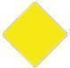|
|Correct Answer|Empfohlene Durchfahrt mit Gegenverkehr.|
|Wrong Answer 1|Empfohlene Durchfahrt ohne Gegenverkehr.|
|Wrong Answer 2|Empfohlene Durchfahrt nur in eine Richtung.|
|Wrong Answer 3|Durchfahrt nur neben der Tafel erlaubt.|

### 115. Card

|Attribut|Value|
|---|---|
|Id|b906860bd9e82d4b550af12fc558228b|
|Question|115. Was bedeuten diese Tafelzeichen an Brücken?|
|Image||
|Correct Answer|Empfohlene Durchfahrt ohne Gegenverkehr.|
|Wrong Answer 1|Empfohlene Durchfahrt mit Gegenverkehr.|
|Wrong Answer 2|Empfohlene Durchfahrt in beide Richtungen.|
|Wrong Answer 3|Durchfahrt nur außerhalb der beiden Tafeln erlaubt.|

### 116. Card

|Attribut|Value|
|---|---|
|Id|562526fa39b7259d7d21336efbf290c9|
|Question|116. Was bedeutet dieses Tafelzeichen im Bereich eines Wehres?|
|Image||
|Correct Answer|Verbot der Durchfahrt und Sperrung der Schifffahrt.|
|Wrong Answer 1|Gesperrte Wasserfläche, jedoch für Kleinfahrzeuge mit Antriebsmaschine befahrbar.|
|Wrong Answer 2|Gesperrte Wasserfläche, jedoch für Kleinfahrzeuge ohne Antriebsmaschine befahrbar.|
|Wrong Answer 3|Schutzbedürftige Anlage.|

### 117. Card

|Attribut|Value|
|---|---|
|Id|958bed11a33e945c9973ae92d8f78a18|
|Question|117. Welche Bedeutung haben vor einer Schleuse ein rotes oder ein rotes und ein grünes Licht?|
|Correct Answer|Einfahrt verboten, Öffnen der Schleuse wird vorbereitet.|
|Wrong Answer 1|Einfahrt verboten, Schließen der Schleuse wird vorbereitet.|
|Wrong Answer 2|Ausfahrt verboten, Öffnen der Schleuse wird vorbereitet.|
|Wrong Answer 3|Ausfahrt verboten, Schließen der Schleuse wird vorbereitet.|

### 118. Card

|Attribut|Value|
|---|---|
|Id|c5bdd2ee2998da8728d44668eb090135|
|Question|118. In welcher Reihenfolge fahren Fahrzeuge, die nicht Kleinfahrzeuge sind, und Kleinfahrzeuge, die gemeinsam geschleust werden sollen, in die Schleuse ein?|
|Correct Answer|Kleinfahrzeuge fahren erst nach den Fahrzeugen, die nicht Kleinfahrzeuge sind und nach Aufforderung durch die Schleusenaufsicht in die Schleuse ein.|
|Wrong Answer 1|Kleinfahrzeuge fahren vor den Fahrzeugen, die nicht Kleinfahrzeuge sind und vor Aufforderung durch die Schleusenaufsicht in die Schleuse ein.|
|Wrong Answer 2|Kleinfahrzeuge fahren vor den Fahrzeugen, die nicht Kleinfahrzeuge sind und ohne Aufforderung durch die Schleusenaufsicht in die Schleuse ein.|
|Wrong Answer 3|Kleinfahrzeuge fahren nach den Fahrzeugen, die nicht Kleinfahrzeuge sind und ohne Aufforderung durch die Schleusenaufsicht in die Schleuse ein.|

### 119. Card

|Attribut|Value|
|---|---|
|Id|27b593f28977b6842aba6e9739203f96|
|Question|119. Mehrere Kleinfahrzeuge sollen gemeinsam vom Oberwasser in das Unterwasser geschleust werden. Worauf ist bei deren Einfahrt in die Schleuse und während des Schleusens besonders zu achten?|
|Correct Answer|Das letzte Kleinfahrzeug muss so weit einfahren, dass es beim Leeren der Schleuse nicht auf den Drempel aufsetzen kann. Die Festmacherleinen sind so zu bedienen, dass Stöße gegen Schleusenwände, Schleusentore, andere Fahrzeuge vermieden werden und ein sicheres Fieren der Leinen möglich ist.|
|Wrong Answer 1|Das erste Kleinfahrzeug muss so weit einfahren, dass es beim Leeren der Schleuse nicht auf den Drempel aufsetzen kann. Die Festmacherleinen sind so zu bedienen, dass Stöße gegen Schleusenwände, Schleusentore, andere Fahrzeuge vermieden werden und ein sicheres Fieren der Leinen möglich ist.|
|Wrong Answer 2|Das erste Kleinfahrzeug muss so weit einfahren, dass es beim Füllen der Schleuse nicht auf den Drempel aufsetzen kann. Die Festmacherleinen sind so zu bedienen, dass Stöße gegen Schleusenwände, Schleusentore, andere Fahrzeuge vermieden werden und ein sicheres Fieren der Leinen möglich ist.|
|Wrong Answer 3|Das letzte Kleinfahrzeug muss so weit einfahren, dass es beim Füllen der Schleuse nicht auf den Drempel aufsetzen kann. Die Festmacherleinen sind so zu bedienen, dass Stöße gegen Schleusenwände, Schleusentore, andere Fahrzeuge vermieden werden und ein sicheres Fieren der Leinen möglich ist.|

### 120. Card

|Attribut|Value|
|---|---|
|Id|a05df5ce4cf8455eafd58942f3bff183|
|Question|120. Was bedeuten diese Lichter?|
|Image||
|Correct Answer|Fahrzeug mit Maschinenantrieb länger als 110 m.|
|Wrong Answer 1|Schubverband kürzer als 110 m.|
|Wrong Answer 2|Schubverband länger als 110 m.|
|Wrong Answer 3|Fahrzeug ohne Maschinenantrieb länger als 110 m.|

### 121. Card

|Attribut|Value|
|---|---|
|Id|f557184e2e88a85badc253c99609da89|
|Question|121. Was bedeutet dieses Sichtzeichen?|
|Image||
|Correct Answer|Schleppfahrzeug an der Spitze eines Schleppverbandes.|
|Wrong Answer 1|Fahrzeug, das vor Anker liegt.|
|Wrong Answer 2|Fahrzeuge mit Vorrang an einer Schleuse.|
|Wrong Answer 3|Fahrzeug eines Schleppverbandes.|

### 122. Card

|Attribut|Value|
|---|---|
|Id|ae33c342ef50669e0f220f53da417ded|
|Question|122. Was bedeutet dieses Sichtzeichen?|
|Image||
|Correct Answer|Fahrzeug eines Schleppverbandes.|
|Wrong Answer 1|Fahrzeug, das vor Anker liegt.|
|Wrong Answer 2|Fahrzeuge mit Vorrang an einer Schleuse.|
|Wrong Answer 3|Schleppfahrzeug an der Spitze eines Schleppverbandes.|

### 123. Card

|Attribut|Value|
|---|---|
|Id|264c139101e3fa0a8d2a8cf9c83cc585|
|Question|123. Was bedeuten diese Lichter?|
|Image||
|Correct Answer|Schubverband in Fahrt von vorne.|
|Wrong Answer 1|Schubverband in Fahrt von achtern.|
|Wrong Answer 2|Schubverband vor Anker liegend.|
|Wrong Answer 3|Schubverband unter 110 m Länge.|

### 124. Card

|Attribut|Value|
|---|---|
|Id|18f43432035a27db8d8f2f5025a4a7bf|
|Question|124. Was bedeuten diese Lichter?|
|Image||
|Correct Answer|Nicht frei fahrende Fähre.|
|Wrong Answer 1|Frei fahrende Fähre.|
|Wrong Answer 2|Schubverband von achtern.|
|Wrong Answer 3|Schubverband von Steuerbordseite.|

### 125. Card

|Attribut|Value|
|---|---|
|Id|4d5c6ac4a9609136b1cd090563328ef5|
|Question|125. Was bedeuten diese Lichter?|
|Image||
|Correct Answer|Frei fahrende Fähre.|
|Wrong Answer 1|Nicht frei fahrende Fähre.|
|Wrong Answer 2|Schubverband von achtern.|
|Wrong Answer 3|Schubverband von Steuerbordseite.|

### 126. Card

|Attribut|Value|
|---|---|
|Id|2a9799fdcaba10374e1e328fe7d4287d|
|Question|126. Was bedeutet auf einem Fahrzeug ein blaues Licht?|
|Correct Answer|Fahrzeug hat brennbare Stoffe geladen. Abstand beim Stillliegen 10 m.|
|Wrong Answer 1|Fahrzeug hat gesundheitsschädliche Stoffe geladen. Abstand beim Stillliegen 50 m.|
|Wrong Answer 2|Fahrzeug hat explosive Stoffe geladen. Abstand beim Stillliegen 100 m.|
|Wrong Answer 3|Fahrzeug der Überwachungsbehörden im Einsatz.|

### 127. Card

|Attribut|Value|
|---|---|
|Id|f3cfae2d786fbf1cc2625f084afb3547|
|Question|127. Was bedeutet dieses Sichtzeichen?|
|Image||
|Correct Answer|Fahrzeug hat brennbare Stoffe geladen, Abstand beim Stillliegen 10 m.|
|Wrong Answer 1|Fahrzeug hat gesundheitsschädliche Stoffe geladen, Abstand beim Stillliegen 50 m.|
|Wrong Answer 2|Fahrzeug hat explosive Stoffe geladen. Abstand beim Stillliegen 100 m.|
|Wrong Answer 3|Fahrzeug der Überwachungsbehörden im Einsatz.|

### 128. Card

|Attribut|Value|
|---|---|
|Id|ae9bc9a5dc95925b6a8a24d3b54bdcdc|
|Question|128. Was bedeuten auf einem Fahrzeug zwei blaue Lichter übereinander?|
|Correct Answer|Fahrzeug hat gesundheitsschädliche Stoffe geladen, Abstand beim Stillliegen 50 m.|
|Wrong Answer 1|Fahrzeug hat explosive Stoffe geladen, Abstand beim Stillliegen 100 m.|
|Wrong Answer 2|Fahrzeug hat brennbare Stoffe geladen, Abstand beim Stillliegen 10 m.|
|Wrong Answer 3|Fahrzeug der Überwachungsbehörden im Einsatz.|

### 129. Card

|Attribut|Value|
|---|---|
|Id|c8fbaba7892bb403fc81d530e880584c|
|Question|129. Was bedeutet dieses Sichtzeichen?|
|Image||
|Correct Answer|Fahrzeug hat gesundheitsschädliche Stoffe geladen, Abstand beim Stillliegen 50 m.|
|Wrong Answer 1|Fahrzeug hat explosive Stoffe geladen, Abstand beim Stillliegen 100 m.|
|Wrong Answer 2|Fahrzeug hat brennbare Stoffe geladen, Abstand beim Stillliegen 10 m.|
|Wrong Answer 3|Fahrzeug der Überwachungsbehörden im Einsatz.|

### 130. Card

|Attribut|Value|
|---|---|
|Id|8a196ecc9f1f3d0218cc8197d469f33f|
|Question|130. Was bedeuten auf einem Fahrzeug drei blaue Lichter übereinander?|
|Correct Answer|Fahrzeug hat explosive Stoffe geladen, Abstand beim Stillliegen 100 m.|
|Wrong Answer 1|Fahrzeug hat gesundheitsschädliche Stoffe geladen, Abstand beim Stillliegen 50 m.|
|Wrong Answer 2|Fahrzeug hat brennbare Stoffe geladen, Abstand beim Stillliegen 10 m.|
|Wrong Answer 3|Fahrzeug der Überwachungsbehörden im Einsatz.|

### 131. Card

|Attribut|Value|
|---|---|
|Id|6e6e8eaa6b39f281220280d7392a77a8|
|Question|131. Was bedeutet dieses Sichtzeichen?|
|Image||
|Correct Answer|Fahrzeug hat explosive Stoffe geladen, Abstand beim Stillliegen 100 m.|
|Wrong Answer 1|Fahrzeug hat gesundheitsschädliche Stoffe geladen, Abstand beim Stillliegen 50 m.|
|Wrong Answer 2|Fahrzeug hat brennbare Stoffe geladen, Abstand beim Stillliegen 10 m.|
|Wrong Answer 3|Fahrzeug der Überwachungsbehörden im Einsatz.|

### 132. Card

|Attribut|Value|
|---|---|
|Id|c9ee4b13e5dccab9cffc3e3f7bd71195|
|Question|132. Welches Fahrzeug führt die nachstehende Tagbezeichnung?|
|Image||
|Correct Answer|Ein Fahrzeug, dem die zuständige Behörde einen Vorrang zur Durchfahrt durch Stellen an denen eine bestimmte Reihenfolge gilt eingeräumt hat.|
|Wrong Answer 1|Fahrzeug unter 20 m Länge, für mehr als 12 Fahrgäste zugelassen.|
|Wrong Answer 2|Geschlepptes Fahrzeug eines Schleppverbandes.|
|Wrong Answer 3|Festgefahrenes Fahrzeug, das einseitig nicht passierbar ist.|

### 133. Card

|Attribut|Value|
|---|---|
|Id|9a9c8fa65b68406c3b24cc1d6f814a19|
|Question|133. Ein Kleinfahrzeug unter Segel fährt nachts auf einer Binnenschifffahrtsstraße und führt ein weißes Rundumlicht im Topp. Wie wird zweckmäßigerweise die weiße Handlampe, die bei Annäherung anderer Fahrzeuge gezeigt werden muss, benutzt?|
|Correct Answer|Die eigenen Segel anleuchten.|
|Wrong Answer 1|Das Wasser anleuchten.|
|Wrong Answer 2|Das heranfahrende Fahrzeug anleuchten.|
|Wrong Answer 3|Die Handlampe nach oben halten.|

### 134. Card

|Attribut|Value|
|---|---|
|Id|55c1ce1ffed553296da8efed3cea73de|
|Question|134. Ein Kleinfahrzeug unter Segel fährt nachts auf einer Binnenschifffahrtsstraße und führt ein weißes Rundumlicht im Topp. Welche zusätzlichen Lichter müssen gesetzt werden, wenn der Motor angeworfen wird?|
|Correct Answer|Seitenlichter unmittelbar nebeneinander oder in einer einzigen Laterne.|
|Wrong Answer 1|Es muss ein weißes Funkellicht geführt werden.|
|Wrong Answer 2|Es muss kein weiteres Licht geführt werden.|
|Wrong Answer 3|Es muss ein zweites weißes Topplicht geführt werden.|

### 135. Card

|Attribut|Value|
|---|---|
|Id|d23c10e24fd757ec3444271c97ebb649|
|Question|135. Welche Lichter muss ein Kleinfahrzeug unter Motor führen, wenn es ein anderes Kleinfahrzeug ohne Maschinenantrieb schleppt?|
|Correct Answer|Lichter eines Kleinfahrzeugs mit Maschinenantrieb.|
|Wrong Answer 1|Zwei weiße Lichter übereinander.|
|Wrong Answer 2|Weißes Rundumlicht.|
|Wrong Answer 3|Lichter eines Kleinfahrzeugs mit Maschinenantrieb und ein zweites weißes Topplicht.|

### 136. Card

|Attribut|Value|
|---|---|
|Id|bb4165917a779fe4f1a2d2296982cc0c|
|Question|136. Welche Lichter muss ein geschlepptes Kleinfahrzeug führen?|
|Correct Answer|Weißes Rundumlicht.|
|Wrong Answer 1|Lichter eines Kleinfahrzeugs mit Maschinenantrieb.|
|Wrong Answer 2|Zwei weiße Lichter übereinander.|
|Wrong Answer 3|Weißes Funkellicht.|

### 137. Card

|Attribut|Value|
|---|---|
|Id|7231b2ac1244394620bd6041957d19d8|
|Question|137. Wann gilt ein Sportboot auf den Binnenschifffahrtsstraßen nicht mehr als Kleinfahrzeug?|
|Correct Answer|Wenn es 20 m oder länger ist.|
|Wrong Answer 1|Wenn es 15 m oder länger ist.|
|Wrong Answer 2|Wenn es 10 m oder länger ist.|
|Wrong Answer 3|Wenn es 18 m oder länger ist.|

### 138. Card

|Attribut|Value|
|---|---|
|Id|409ecf96d83a6bed103b9df2ea83a60e|
|Question|138. Welchen Sichtwinkel und welche Farben haben die vorgeschriebenen Lichter an Bord?|
|Correct Answer|Topplicht: weiß 225°, Hecklicht 135° weiß, Seitenlichter: Backbord rot und Steuerbord grün, jeweils 112,5°.|
|Wrong Answer 1|Topplicht: weiß 135°, Hecklicht 225° weiß, Seitenlichter: Backbord rot und Steuerbord grün, jeweils 112,5°|
|Wrong Answer 2|Topplicht: weiß 225°, Hecklicht 112,5° weiß, Seitenlichter: Backbord rot und Steuerbord grün, jeweils 135°|
|Wrong Answer 3|Topplicht: weiß 112,5°, Hecklicht 225° weiß, Seitenlichter: Backbord rot und Steuerbord grün, jeweils 112,5°|

### 139. Card

|Attribut|Value|
|---|---|
|Id|51bccdb701b1943b73c76d0ee182cd6d|
|Question|139. Welches Licht muss ein Kleinfahrzeug ohne Maschinenantrieb mindestens führen?|
|Correct Answer|Ein von allen Seiten sichtbares weißes Licht.|
|Wrong Answer 1|Dreifarbenlaterne im Topp.|
|Wrong Answer 2|Seitenlichter.|
|Wrong Answer 3|Topp- und Hecklicht.|

### 140. Card

|Attribut|Value|
|---|---|
|Id|04e69593707e6552aedc74dee9ccacb7|
|Question|140. Wie muss sich ein Segelfahrzeug auf einer Binnenschifffahrtsstraße, welches sich auf Kollisionskurs mit einem Kleinfahrzeug mit Maschinenantrieb befindet, verhalten?|
|Correct Answer|Es hält Kurs und Geschwindigkeit bei.|
|Wrong Answer 1|Es wechselt den Kurs nach Steuerbord und reduziert die Geschwindigkeit.|
|Wrong Answer 2|Es hält Kurs und reduziert die Geschwindigkeit.|
|Wrong Answer 3|Es wechselt den Kurs nach Steuerbord und hält die Geschwindigkeit.|

### 141. Card

|Attribut|Value|
|---|---|
|Id|cbb4bf12b5fcc004a7f321e10e40ff52|
|Question|141. Wie muss sich ein Fahrzeug mit Topplicht und Seitenlichtern gegenüber einem Kleinfahrzeug mit Seitenlichtern, welches sich auf Kollisionskurs befindet, verhalten?|
|Correct Answer|Es hält Kurs und Geschwindigkeit bei.|
|Wrong Answer 1|Es wechselt den Kurs nach Steuerbord und reduziert die Geschwindigkeit.|
|Wrong Answer 2|Es hält Kurs und reduziert die Geschwindigkeit.|
|Wrong Answer 3|Es muss ausweichen.|

### 142. Card

|Attribut|Value|
|---|---|
|Id|fd14ce36e1022848e29ea584350f7f32|
|Question|142. Wie muss sich ein Kleinfahrzeug mit Maschinenantrieb gegenüber einem Segelsurfer, der auf Kollisionskurs liegt, verhalten?|
|Correct Answer|Es muss ausweichen.|
|Wrong Answer 1|Es hält Kurs und Geschwindigkeit bei.|
|Wrong Answer 2|Es hält Kurs und reduziert die Geschwindigkeit.|
|Wrong Answer 3|Es muss nicht ausweichen.|

### 143. Card

|Attribut|Value|
|---|---|
|Id|f573190846a2e31d8d8cd3ca4214610b|
|Question|143. Wer ist ausweichpflichtig, wenn ein Segler mit Wind von Backbord einer Segelyacht mit Wind von Steuerbord und einem schwarzen Kegel auf Kollisionskurs begegnet?|
|Correct Answer|Die Segelyacht mit Wind von Steuerbord, weil sie als Kleinfahrzeug mit Maschinenantrieb gilt.|
|Wrong Answer 1|Die Segelyacht mit Wind von Backbord, weil sie als Kleinfahrzeug unter Segel gilt.|
|Wrong Answer 2|Die Segelyacht mit Wind von Steuerbord, weil sie als Kleinfahrzeug unter Segel gilt.|
|Wrong Answer 3|Beide Segelyachten, weil eines als Kleinfahrzeug mit Maschinenantrieb gilt und das andere den Wind von Backbord hat.|

### 144. Card

|Attribut|Value|
|---|---|
|Id|e3b0ef9f1fe899af469e4584a90c1c52|
|Question|144. Wie lautet eine der drei Grundregeln der Binnenschifffahrtsstraßen-Ordnung, nach denen Kleinfahrzeuge unter Segel einander ausweichen?|
|Correct Answer|Wenn sie den Wind nicht von derselben Seite haben, muss das Segelfahrzeug mit Wind von Backbord dem Segelfahrzeug mit Wind von Steuerbord ausweichen.|
|Wrong Answer 1|Wenn sie den Wind nicht von derselben Seite haben, muss das Segelfahrzeug mit Wind von Steuerbord dem Segelfahrzeug mit Wind von Backbord ausweichen.|
|Wrong Answer 2|Wenn sie den Wind von derselben Seite haben, muss das leeseitige dem luvseitigen ausweichen.|
|Wrong Answer 3|Wenn sie den Wind von derselben Seite haben, müssen beide Fahrzeuge ausweichen.|

### 145. Card

|Attribut|Value|
|---|---|
|Id|77279acf5655a090cab1ed0b8b8593d0|
|Question|145. Was bedeuten diese Lichter?|
|Image||
|Correct Answer|Schwimmendes Gerät bei der Arbeit. Vorbeifahrt an jeder Seite gestattet. Sog und Wellenschlag vermeiden.|
|Wrong Answer 1|Schwimmendes Gerät bei der Arbeit. Vorbeifahrt nicht gestattet.|
|Wrong Answer 2|Festgefahrenes oder gesunkenes Fahrzeug. Vorbeifahrt an der Steuerbordseite gestattet. Sog und Wellenschlag vermeiden.|
|Wrong Answer 3|Festgefahrenes oder gesunkenes Fahrzeug. Vorbeifahrt nicht gestattet.|

### 146. Card

|Attribut|Value|
|---|---|
|Id|e2a3ebe7581fbda519b571b613ce7e77|
|Question|146. Was bedeuten diese Sichtzeichen?|
|Image||
|Correct Answer|Schwimmendes Gerät bei der Arbeit. Vorbeifahrt an jeder Seite gestattet. Sog und Wellenschlag vermeiden.|
|Wrong Answer 1|Schwimmendes Gerät bei der Arbeit. Vorbeifahrt nicht gestattet.|
|Wrong Answer 2|Festgefahrenes oder gesunkenes Fahrzeug. Vorbeifahrt an der Steuerbordseite gestattet. Sog und Wellenschlag vermeiden.|
|Wrong Answer 3|Festgefahrenes oder gesunkenes Fahrzeug. Vorbeifahrt nicht gestattet.|

### 147. Card

|Attribut|Value|
|---|---|
|Id|afc4138413a4a9343d9a31ac6608341c|
|Question|147. Was bedeuten diese Lichter?|
|Image||
|Correct Answer|Festgefahrenes oder gesunkenes Fahrzeug. Vorbeifahrt an der rot-weißen Seite gestattet; rote Seite gesperrt. Sog und Wellenschlag vermeiden.|
|Wrong Answer 1|Festgefahrenes oder gesunkenes Fahrzeug. Vorbeifahrt an der rot-weißen Seite gestattet; rote Seite gesperrt. Vorbeifahrt mit unverminderter Geschwindigkeit möglich.|
|Wrong Answer 2|Festgefahrenes oder gesunkenes Fahrzeug. Vorbeifahrt an der roten Seite gestattet; rot-weiße Seite gesperrt. Vorbeifahrt mit unverminderter Geschwindigkeit möglich.|
|Wrong Answer 3|Festgefahrenes oder gesunkenes Fahrzeug. Vorbeifahrt an der roten Seite gestattet; rot-weiße Seite gesperrt. Sog und Wellenschlag vermeiden.|

### 148. Card

|Attribut|Value|
|---|---|
|Id|b16ecdf6e3927a56ce8429593bbe6c38|
|Question|148. Was bedeuten diese Sichtzeichen?|
|Image||
|Correct Answer|Festgefahrenes oder gesunkenes Fahrzeug. Vorbeifahrt an der rot-weißen Seite gestattet; rote Seite gesperrt. Sog und Wellenschlag vermeiden.|
|Wrong Answer 1|Festgefahrenes oder gesunkenes Fahrzeug. Vorbeifahrt an der rot-weißen Seite gestattet; rote Seite gesperrt. Vorbeifahrt mit unverminderter Geschwindigkeit möglich.|
|Wrong Answer 2|Festgefahrenes oder gesunkenes Fahrzeug. Vorbeifahrt an der roten Seite gestattet; rot-weiße Seite gesperrt. Vorbeifahrt mit unverminderter Geschwindigkeit möglich.|
|Wrong Answer 3|Festgefahrenes oder gesunkenes Fahrzeug. Vorbeifahrt an der roten Seite gestattet; rot-weiße Seite gesperrt. Sog und Wellenschlag vermeiden.|

### 149. Card

|Attribut|Value|
|---|---|
|Id|7ee23320cf16199663232af21a2e3fff|
|Question|149. Was bedeuten diese Lichter?|
|Image||
|Correct Answer|Schwimmendes Gerät bei der Arbeit. Vorbeifahrt an der grünen Seite gestattet; rote Seite gesperrt.|
|Wrong Answer 1|Schwimmendes Gerät bei der Arbeit. Vorbeifahrt an der grünen Seite gestattet; rote Seite gesperrt. Sog und Wellenschlag vermeiden.|
|Wrong Answer 2|Schwimmendes Gerät bei der Arbeit. Vorbeifahrt an der grünen Seite gestattet. Vorbeifahrt an der roten Seite mit unverminderter Geschwindigkeit möglich.|
|Wrong Answer 3|Schwimmendes Gerät bei der Arbeit. Vorbeifahrt an der roten Seite gestattet; grüne Seite gesperrt.|

### 150. Card

|Attribut|Value|
|---|---|
|Id|418508a61c5509e8d2dfb4b433dbecfb|
|Question|150. Was bedeuten diese Sichtzeichen?|
|Image|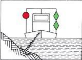|
|Correct Answer|Schwimmendes Gerät bei der Arbeit. Vorbeifahrt an der grünen Seite gestattet; rote Seite gesperrt.|
|Wrong Answer 1|Schwimmendes Gerät bei der Arbeit. Vorbeifahrt an der grünen Seite gestattet; rote Seite gesperrt. Sog und Wellenschlag vermeiden.|
|Wrong Answer 2|Schwimmendes Gerät bei der Arbeit. Vorbeifahrt an der grünen Seite gestattet. Vorbeifahrt an der roten Seite mit unverminderter Geschwindigkeit möglich.|
|Wrong Answer 3|Schwimmendes Gerät bei der Arbeit. Vorbeifahrt an der roten Seite gestattet; grüne Seite gesperrt.|

### 151. Card

|Attribut|Value|
|---|---|
|Id|384af0da845c73a3aafaa3ebc06e636f|
|Question|151. Was bedeuten im Fahrwasser nachstehende Zeichen?|
|Image||
|Correct Answer|Schwimmendes Gerät bei der Arbeit. Vorbeifahrt an der Seite mit dem grün-weiß-grünen Tafelzeichen gestattet; rot-weiß-rote Seite gesperrt.|
|Wrong Answer 1|Festgefahrenes oder gesunkenes Fahrzeug. Vorbeifahrt an der Seite mit dem grün-weiß-grünen Tafelzeichen gestattet; rot-weiß-rote Seite gesperrt. Sog und Wellenschlag vermeiden.|
|Wrong Answer 2|Schwimmendes Gerät bei der Arbeit. Vorbeifahrt an der Seite mit dem grün-weiß-grünen Tafelzeichen gestattet; rot-weiß-rote Seite gesperrt. Sog und Wellenschlag vermeiden.|
|Wrong Answer 3|Festgefahrenes oder gesunkenes Fahrzeug. Vorbeifahrt an der Seite mit dem rot-weiß-roten Tafelzeichen gestattet; grün-weiß-grüne Seite gesperrt.|

### 152. Card

|Attribut|Value|
|---|---|
|Id|b19cf53a877ad6f1a0c8dc59bbec328d|
|Question|152. Was bedeuten diese Lichter?|
|Image||
|Correct Answer|Schwimmendes Gerät bei der Arbeit. Vorbeifahrt an jeder Seite gestattet.|
|Wrong Answer 1|Schwimmendes Gerät bei der Arbeit. Vorbeifahrt nicht gestattet.|
|Wrong Answer 2|Festgefahrenes oder gesunkenes Fahrzeug. Vorbeifahrt an der Steuerbordseite gestattet.|
|Wrong Answer 3|Festgefahrenes oder gesunkenes Fahrzeug. Vorbeifahrt nicht gestattet.|

### 153. Card

|Attribut|Value|
|---|---|
|Id|950e3066035ee3f30ce70c8db405bb05|
|Question|153. Was bedeuten diese Sichtzeichen?|
|Image||
|Correct Answer|Schwimmendes Gerät bei der Arbeit. Vorbeifahrt an jeder Seite gestattet.|
|Wrong Answer 1|Schwimmendes Gerät bei der Arbeit. Vorbeifahrt nicht gestattet.|
|Wrong Answer 2|Festgefahrenes oder gesunkenes Fahrzeug. Vorbeifahrt an der Steuerbordseite gestattet.|
|Wrong Answer 3|Festgefahrenes oder gesunkenes Fahrzeug. Vorbeifahrt nicht gestattet.|

### 154. Card

|Attribut|Value|
|---|---|
|Id|77fcfea9db60f60e63a34ac28b1bac4d|
|Question|154. Was bedeuten diese Sichtzeichen?|
|Image|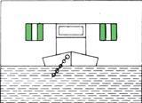|
|Correct Answer|Schwimmendes Gerät bei der Arbeit. Vorbeifahrt an jeder Seite gestattet.|
|Wrong Answer 1|Schwimmendes Gerät bei der Arbeit. Vorbeifahrt nicht gestattet.|
|Wrong Answer 2|Festgefahrenes oder gesunkenes Fahrzeug. Vorbeifahrt an der Steuerbordseite gestattet. Sog und Wellenschlag vermeiden.|
|Wrong Answer 3|Festgefahrenes oder gesunkenes Fahrzeug. Vorbeifahrt nicht gestattet.|

### 155. Card

|Attribut|Value|
|---|---|
|Id|5a9c7f0b971bf6ada9f44cd707fd811a|
|Question|155. Was bedeutet diese Tag- und Nachtbezeichnung?|
|Image||
|Correct Answer|Schutzbedürftiges Fahrzeug, Vorbeifahrt in möglichst weitem Abstand, Geschwindigkeit vermindern, Sog und Wellenschlag vermeiden.|
|Wrong Answer 1|Ein festgefahrenes oder gesunkenes Fahrzeug. Vorbeifahrt nicht gestattet.|
|Wrong Answer 2|Ein festgefahrenes oder gesunkenes Fahrzeug. Vorbeifahrt an jeder Seite mit unverminderter Geschwindigkeit gestattet.|
|Wrong Answer 3|Schwimmende Anlage / Schwimmkörper. Vorbeifahrt in möglichst weitem Abstand, Geschwindigkeit vermindern, Sog und Wellenschlag vermeiden.|

### 156. Card

|Attribut|Value|
|---|---|
|Id|9d359d42464537e1d6ea0c89aa821207|
|Question|156. Was bedeutet dieses Tafelzeichen?|
|Image|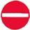|
|Correct Answer|Gesperrte Wasserfläche, jedoch für Kleinfahrzeuge ohne Antriebsmaschine befahrbar.|
|Wrong Answer 1|Gesperrte Wasserfläche, jedoch für Kleinfahrzeuge ohne laufende Antriebsmaschine befahrbar.|
|Wrong Answer 2|Gesperrte Wasserfläche, für Kleinfahrzeuge nicht befahrbar.|
|Wrong Answer 3|Gesperrte Wasserfläche, Verbot der Durchfahrt und Sperrung der Schifffahrt.|

### 157. Card

|Attribut|Value|
|---|---|
|Id|f3ec02e61f836f2ab5f1d9057a4fe9ba|
|Question|157. Was bedeutet dieses Tafelzeichen?|
|Image||
|Correct Answer|Fahrverbot für Fahrzeuge mit Maschinenantrieb.|
|Wrong Answer 1|Fahrverbot für Kleinfahrzeuge mit Maschinenantrieb.|
|Wrong Answer 2|Fahrverbot für Fahrzeuge ohne Antriebsmaschine.|
|Wrong Answer 3|Fahrverbot für Kleinfahrzeuge ohne laufende Antriebsmaschine.|

### 158. Card

|Attribut|Value|
|---|---|
|Id|de40ca678c6ac2c1e23a02d4e6391cf5|
|Question|158. Wie ist eine geschützte Badezone gekennzeichnet?|
|Correct Answer|Durch gelbe Tonnen.|
|Wrong Answer 1|Durch grüne Tonnen.|
|Wrong Answer 2|Durch rote Tonnen.|
|Wrong Answer 3|Durch rot-grün gestreifte Tonnen.|

### 159. Card

|Attribut|Value|
|---|---|
|Id|f6b97087bbd47e90ff24c65eb8a790c7|
|Question|159. Was bedeutet ein langer Ton?|
|Correct Answer|Achtung!|
|Wrong Answer 1|Maschine geht rückwärts.|
|Wrong Answer 2|Fahrzeug ist manövrierunfähig.|
|Wrong Answer 3|Überholen nicht möglich.|

### 160. Card

|Attribut|Value|
|---|---|
|Id|5222bd13c502784d0bacbe08a7ebb4ba|
|Question|160. Was bedeuten vier kurze Töne?|
|Correct Answer|Fahrzeug ist manövrierunfähig.|
|Wrong Answer 1|Maschine geht rückwärts.|
|Wrong Answer 2|Achtung!|
|Wrong Answer 3|Überholen nicht möglich.|

### 161. Card

|Attribut|Value|
|---|---|
|Id|d67665ebb21e1ecb2a1b08184f2f67d6|
|Question|161. Was bedeuten fünf kurze Töne?|
|Correct Answer|Überholen nicht möglich.|
|Wrong Answer 1|Maschine geht rückwärts.|
|Wrong Answer 2|Fahrzeug ist manövrierunfähig.|
|Wrong Answer 3|Achtung!|

### 162. Card

|Attribut|Value|
|---|---|
|Id|bb50b4c4038d5314eeacc8d30de981c1|
|Question|162. Was bedeutet dieses Schallsignal?|
|Image|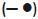|
|Correct Answer|Wenden über Steuerbord.|
|Wrong Answer 1|Kursänderung über Steuerbord.|
|Wrong Answer 2|Kursänderung nach Backbord.|
|Wrong Answer 3|Wenden über Backbord.|

### 163. Card

|Attribut|Value|
|---|---|
|Id|fbc5d0dabc39c5264d2ec34fb9ae0597|
|Question|163. Was bedeutet dieses Schallsignal?|
|Image|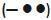|
|Correct Answer|Wenden über Backbord.|
|Wrong Answer 1|Wenden über Steuerbord.|
|Wrong Answer 2|Kursänderung nach Backbord.|
|Wrong Answer 3|Kursänderung nach Steuerbord.|

### 164. Card

|Attribut|Value|
|---|---|
|Id|cd2c25def49dd3399892fe226d863f94|
|Question|164. Was bedeutet dieses Schallsignal?|
|Image||
|Correct Answer|Überholen an der Steuerbordseite des Vorausfahrenden.|
|Wrong Answer 1|Überholen an der Backbordseite des Vorausfahrenden.|
|Wrong Answer 2|Hafen oder Nebenwasserstraße; Ein- oder Ausfahrt mit Kursänderung nach Steuerbord.|
|Wrong Answer 3|Hafen oder Nebenwasserstraße; Ein- oder Ausfahrt mit Kursänderung nach Backbord.|

### 165. Card

|Attribut|Value|
|---|---|
|Id|26569eb98a7320631c2a0fd294c4235a|
|Question|165. Was bedeutet dieses Schallsignal?|
|Image||
|Correct Answer|Überholen an der Backbordseite des Vorausfahrenden.|
|Wrong Answer 1|Überholen an der Steuerbordseite des Vorausfahrenden.|
|Wrong Answer 2|Hafen oder Nebenwasserstraße; Ein- oder Ausfahrt mit Kursänderung nach Steuerbord.|
|Wrong Answer 3|Hafen oder Nebenwasserstraße; Ein- oder Ausfahrt mit Kursänderung nach Backbord.|

### 166. Card

|Attribut|Value|
|---|---|
|Id|9894e6d8f79df5554bef888f85e11e66|
|Question|166. Was bedeutet dieses Schallsignal?|
|Image|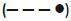|
|Correct Answer|Hafen oder Nebenwasserstraße; Ein- oder Ausfahrt mit Kursänderung nach Steuerbord.|
|Wrong Answer 1|Überholen an der Backbordseite des Vorausfahrenden.|
|Wrong Answer 2|Überholen an der Steuerbordseite des Vorausfahrenden.|
|Wrong Answer 3|Hafen oder Nebenwasserstraße; Ein- oder Ausfahrt mit Kursänderung nach Backbord.|

### 167. Card

|Attribut|Value|
|---|---|
|Id|e0140e92b734e23de7eeb78003023876|
|Question|167. Was bedeutet dieses Schallsignal?|
|Image|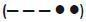|
|Correct Answer|Hafen oder Nebenwasserstraße; Ein- oder Ausfahrt mit Kursänderung nach Backbord.|
|Wrong Answer 1|Überholen an der Backbordseite des Vorausfahrenden.|
|Wrong Answer 2|Hafen oder Nebenwasserstraße; Ein- oder Ausfahrt mit Kursänderung nach Steuerbord.|
|Wrong Answer 3|Überholen an der Steuerbordseite des Vorausfahrenden.|

### 168. Card

|Attribut|Value|
|---|---|
|Id|64756a0433199c3475a2d6f1ca7a32be|
|Question|168. Was ist eine Folge sehr kurzer Töne?|
|Correct Answer|Eine Folge von mindestens 6 Tönen, von je etwa einer viertel Sekunde Dauer und mit je einer viertel Sekunde Pause.|
|Wrong Answer 1|Eine Folge von mindestens 4 Tönen von je etwa einer viertel Sekunde Dauer und mit je einer viertel Sekunde Pause.|
|Wrong Answer 2|Eine Folge von mindestens 2 Tönen von je etwa einer viertel Sekunde Dauer und mit je einer viertel Sekunde Pause.|
|Wrong Answer 3|Eine Folge von mindestens 8 Tönen von je etwa einer viertel Sekunde Dauer und mit je einer viertel Sekunde Pause.|

### 169. Card

|Attribut|Value|
|---|---|
|Id|eb51ed9d621eca0d5238bf660fee1b58|
|Question|169. Was bedeutet eine Folge sehr kurzer Töne?|
|Correct Answer|Gefahr eines Zusammenstoßes.|
|Wrong Answer 1|Achtung!|
|Wrong Answer 2|Fahrzeug ist manövrierunfähig.|
|Wrong Answer 3|Überholen nicht möglich.|

### 170. Card

|Attribut|Value|
|---|---|
|Id|646f3d05191f08f592f209062b795816|
|Question|170. Welche Schallsignale bzw. Zeichen sind zu geben, wenn das Boot manövrierunfähig geworden ist?|
|Correct Answer|Vier kurze Töne. Bei Tag eine rote Flagge, bei Nacht ein rotes Licht im unteren Halbkreis schwenken.|
|Wrong Answer 1|Fünf kurze Töne. Bei Tag eine rote Flagge, bei Nacht ein rotes Licht im oberen Halbkreis schwenken.|
|Wrong Answer 2|Ein langer, vier kurze Töne. Bei Tag eine rote Flagge, bei Nacht ein rotes Licht setzen.|
|Wrong Answer 3|Eine Gruppe von kurzen und langen Tönen im Intervall geben. Bei Nacht ein rotes Blinklicht einschalten.|

### 171. Card

|Attribut|Value|
|---|---|
|Id|a8e53782e2ab82d77752b18c7c9e4aae|
|Question|171. Ein Fahrzeug zeigt an der Steuerbordseite seines Ruderhauses eine blaue Tafel mit weißem Funkellicht. Welche Bedeutung hat dieses Zeichen?|
|Correct Answer|Fahrzeuge begegnen sich an Steuerbord. Dieses Zeichen gilt nicht für Kleinfahrzeuge, verpflichtet aber zu erhöhter Aufmerksamkeit.|
|Wrong Answer 1|Fahrzeuge begegnen sich an Steuerbord. Dieses Zeichen gilt nur für Kleinfahrzeuge.|
|Wrong Answer 2|Fahrzeuge begegnen sich an Steuerbord. Dieses Zeichen braucht gar nicht beachtet zu werden.|
|Wrong Answer 3|Fahrzeuge begegnen sich an Steuerbord. Dieses Zeichen gilt auch für alle Kleinfahrzeuge.|

### 172. Card

|Attribut|Value|
|---|---|
|Id|2ee12abc16492b101b02939f874d73dc|
|Question|172. Ein Sportfahrzeug fährt hinter einem Fahrzeug, das nicht Kleinfahrzeug ist, in den Schleusenvorhafen ein. Aus der Schleusenkammer kommt ein Fahrzeug, das an Steuerbord eine blaue Tafel mit einem weißen Funkellicht zeigt. Was bedeutet dieses Zeichen?|
|Correct Answer|Das aus- und die einfahrenden Fahrzeuge passieren sich an der Steuerbordseite, das Kleinfahrzeug ist nur zu erhöhter Aufmerksamkeit verpflichtet.|
|Wrong Answer 1|Das aus- und die einfahrenden Fahrzeuge passieren sich an der Backbordseite, das Kleinfahrzeug ist nur zu erhöhter Aufmerksamkeit verpflichtet.|
|Wrong Answer 2|Das aus- und die einfahrenden Fahrzeuge passieren sich an der Steuerbordseite, das Kleinfahrzeug ist wartepflichtig.|
|Wrong Answer 3|Das aus- und die einfahrenden Fahrzeuge passieren sich an der Backbordseite, das Kleinfahrzeug hat Vorrang.|

### 173. Card

|Attribut|Value|
|---|---|
|Id|4afa12a1bcf2a26cf07a30b9e414c6ea|
|Question|173. Wo kann man von bestehenden Höchstgeschwindigkeiten auf den Binnenschifffahrtsstraßen Kenntnis erhalten?|
|Correct Answer|In der Binnenschifffahrtsstraßen-Ordnung, bei der Wasserstraßen- und Schifffahrtsverwaltung und der Wasserschutzpolizei.|
|Wrong Answer 1|In der Binnenschiffsuntersuchungsordnung, bei der Wasserstraßen- und Schifffahrtsverwaltung und der Wasserschutzpolizei.|
|Wrong Answer 2|In der Sportbootführerscheinverordnung, bei der Wasserstraßen- und Schifffahrtsverwaltung und der Wasserschutzpolizei.|
|Wrong Answer 3|In der Binnenschifferpatentverordnung, bei der Wasserstraßen- und Schifffahrtsverwaltung und der Wasserschutzpolizei.|

### 174. Card

|Attribut|Value|
|---|---|
|Id|4709ef8d7c8b08267764489119c34a24|
|Question|174. Wie ist ein Überholmanöver durchzuführen?|
|Correct Answer|Zügig überholen. Beteiligte Fahrzeuge nicht behindern. Verkehrslage und eventuelle Schallzeichen beachten. Ausreichend Abstand halten.|
|Wrong Answer 1|Zügig überholen. Gegebenenfalls das Fahrzeug stark beschleunigen, um schnell passieren zu können.|
|Wrong Answer 2|Zügig überholen; überholen nur auf der Steuerbordseite erlaubt, ausreichend Abstand halten.|
|Wrong Answer 3|Zügig überholen. Dicht am Ufer entlang fahren, eventuelle Schallzeichen müssen von Kleinfahrzeugen beachtet werden.|

### 175. Card

|Attribut|Value|
|---|---|
|Id|4c0e5576953008eeca346442f4cd7183|
|Question|175. Wann besteht die Gefahr eines Zusammenstoßes?|
|Correct Answer|Wenn sich zwei Fahrzeuge bei gleichbleibender Peilung einander nähern.|
|Wrong Answer 1|Wenn sich zwei Fahrzeuge einander nähern und sich der Kurs der Fahrzeuge nicht ändert.|
|Wrong Answer 2|Wenn sich zwei Fahrzeuge einander nähern und sich der Kurs eines Fahrzeuges ändert.|
|Wrong Answer 3|Wenn sich zwei Fahrzeuge einander nähern und beide Fahrzeuge ihren Kurs nach steuerbord ändern.|

### 176. Card

|Attribut|Value|
|---|---|
|Id|91c13d088fff654d45bcb41bde205d40|
|Question|176. Wie müssen Ausweichmanöver durchgeführt werden?|
|Correct Answer|Rechtzeitig, klar erkennbar und entschlossen.|
|Wrong Answer 1|Rechtzeitig, klar erkennbar und nach Steuerbord.|
|Wrong Answer 2|Rechtzeitig, klar erkennbar und nach Backbord.|
|Wrong Answer 3|Rechtzeitig, klar erkennbar und vorsichtig.|

### 177. Card

|Attribut|Value|
|---|---|
|Id|32334733fabe9c9037e513dc0bf2ca4b|
|Question|177. Ein Kleinfahrzeug und ein Fahrzeug über 20 m Länge nähern sich auf kreuzenden Kursen. Es besteht die Gefahr eines Zusammenstoßes. Wer ist ausweichpflichtig?|
|Correct Answer|Ausweichpflichtig ist das Kleinfahrzeug.|
|Wrong Answer 1|Ausweichpflichtig ist das Fahrzeug über 20 m Länge.|
|Wrong Answer 2|Ausweichpflichtig ist das Fahrzeug, welches das andere an seiner Steuerbordseite sieht.|
|Wrong Answer 3|Ausweichpflichtig ist das Fahrzeug, welches das andere an seiner Backbordseite sieht.|

### 178. Card

|Attribut|Value|
|---|---|
|Id|527a4c03517ee23fa9131097ab9ff97a|
|Question|178. Welche Fahrzeuge in Fahrt führen nachts nur ein weißes Rundumlicht?|
|Correct Answer|Geschleppte oder längsseits gekuppelte Kleinfahrzeuge.|
|Wrong Answer 1|Kleinfahrzeuge mit Maschinenantrieb unter 20 m Länge.|
|Wrong Answer 2|Kleinfahrzeuge mit Maschinenantrieb und geschleppte Fahrzeuge.|
|Wrong Answer 3|Fahrzeuge die geschoben werden.|

### 179. Card

|Attribut|Value|
|---|---|
|Id|9a41abf3304ec51b2e5af15de9185a95|
|Question|179. Wie muss sich ein kreuzendes Kleinfahrzeug unter Segel am Wind in der Nähe eines Ufers gegenüber einem anderen Kleinfahrzeug verhalten?|
|Correct Answer|Es darf ein anderes Kleinfahrzeug, das sein steuerbordseitiges Ufer anhält, nicht zum Ausweichen zwingen.|
|Wrong Answer 1|Es darf ein anderes Kleinfahrzeug, das sein steuerbordseitiges Ufer verlässt, nicht zum Ausweichen zwingen.|
|Wrong Answer 2|Es darf ein anderes Kleinfahrzeug, das sein backbordseitiges Ufer verlässt, zum Ausweichen zwingen.|
|Wrong Answer 3|Es darf ein anderes Kleinfahrzeug, das sein steuerbordseitiges Ufer anhält, zum Ausweichen zwingen.|

### 180. Card

|Attribut|Value|
|---|---|
|Id|ce1bc4e0a8d90575fa189d2804e92029|
|Question|180. Wer ist ausweichpflichtig bzw. wer ist nicht ausweichpflichtig?|
|Image||
|Correct Answer|Das Fahrzeug unter Segel ist ausweichpflichtig.|
|Wrong Answer 1|Das Fahrzeug unter Segel ist nicht ausweichpflichtig.|
|Wrong Answer 2|Das Fahrzeug unter Maschinenantrieb ist ausweichpflichtig.|
|Wrong Answer 3|Beide Fahrzeuge sind ausweichpflichtig.|

### 181. Card

|Attribut|Value|
|---|---|
|Id|440732fb2676bf43250673f8927a6e8a|
|Question|181. Was hat der Schiffsführer eines Kleinfahrzeugs beim Begegnen mit Fahrzeugen, die nicht Kleinfahrzeuge sind, zu beachten?|
|Correct Answer|Kleinfahrzeuge sind gegenüber Fahrzeugen, die nicht Kleinfahrzeuge sind, ausweichpflichtig. Sie müssen für deren Kurs und zum Manövrieren notwendigen Raum lassen.|
|Wrong Answer 1|Kleinfahrzeuge sind gegenüber anderen Fahrzeugen, die nicht Kleinfahrzeuge sind, nicht ausweichpflichtig.|
|Wrong Answer 2|Kleinfahrzeuge sind gegenüber Fahrzeugen, die nicht Kleinfahrzeuge sind, bei der Begegnung gleichgestellt.|
|Wrong Answer 3|Kleinfahrzeuge sind gegenüber Fahrzeugen, die nicht Kleinfahrzeuge sind, ausweichpflichtig. Sie brauchen aber keinen besonderen Raum zum Manövrieren frei zu geben.|

### 182. Card

|Attribut|Value|
|---|---|
|Id|aaf61dccc2107238d6c0d1ff97b6f4e8|
|Question|182. Von Backbord kommend kreuzt ein Fahrzeug unter Segel mit einem schwarzen Kegel, Spitze nach unten, den Kurs eines Fahrzeuges mit Maschinenantrieb. Wer ist ausweichpflichtig?|
|Correct Answer|Das Fahrzeug unter Segel mit einem schwarzen Kegel ist ausweichpflichtig.|
|Wrong Answer 1|Das Fahrzeug ohne Segel ist ausweichpflichtig.|
|Wrong Answer 2|Das Fahrzeug unter Segel mit einem schwarzen Kegel ist nicht ausweichpflichtig.|
|Wrong Answer 3|Beide Fahrzeuge sind ausweichpflichtig.|

### 183. Card

|Attribut|Value|
|---|---|
|Id|f54e5b4dcb52dd820d65d64da52ceb4b|
|Question|183. Zwei Kleinfahrzeuge unter Segel A und B liegen auf Kollisionskurs; A führt einen schwarzen Kegel. Wer ist ausweichpflichtig?|
|Image|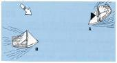|
|Correct Answer|Fahrzeug A ist ausweichpflichtig.|
|Wrong Answer 1|Fahrzeug B ist ausweichpflichtig.|
|Wrong Answer 2|Ausweichpflichtig ist das Fahrzeug, welches das Andere an seiner Backbordseite sieht.|
|Wrong Answer 3|Ausweichpflichtig ist das Fahrzeug, welches den Wind von Backbord hat.|

### 184. Card

|Attribut|Value|
|---|---|
|Id|839fdf80d44aff41e7b2793413d4ff2e|
|Question|184. Ein Fahrzeug unter Segel kreuzt eine Binnenschifffahrtsstraße. In der Fahrwassermitte kommt ihm ein Kleinfahrzeug mit Maschinenantrieb zu Berg entgegen. Wer ist ausweichpflichtig?|
|Correct Answer|Fahrzeug mit Maschinenantrieb.|
|Wrong Answer 1|Fahrzeug in der Talfahrt.|
|Wrong Answer 2|Fahrzeug unter Segel.|
|Wrong Answer 3|Beide sind ausweichpflichtig.|

### 185. Card

|Attribut|Value|
|---|---|
|Id|8d87074ec025a6bf8034062712b2f1c9|
|Question|185. Zwei Kleinfahrzeuge A und B unter Segel liegen auf Kollisionskurs (Skizze). Wer ist ausweichpflichtig?|
|Image||
|Correct Answer|A ist ausweichpflichtig. Segelfahrzeuge mit Wind von Backbord müssen Segelfahrzeugen mit Wind von Steuerbord ausweichen.|
|Wrong Answer 1|B ist ausweichpflichtig. Segelfahrzeuge mit Wind von Backbord müssen Segelfahrzeugen mit Wind von Steuerbord ausweichen.|
|Wrong Answer 2|A ist ausweichpflichtig. Segelfahrzeuge mit Wind von Steuerbord müssen Segelfahrzeugen mit Wind von Backbord ausweichen.|
|Wrong Answer 3|B ist ausweichpflichtig. Segelfahrzeuge mit Wind von Steuerbord müssen Segelfahrzeugen mit Wind von Backbord ausweichen.|

### 186. Card

|Attribut|Value|
|---|---|
|Id|bda906109cb02eee16d518cb80a54e32|
|Question|186. Zwei Kleinfahrzeuge unter Segel liegen auf Kollisionskurs. Wer ist ausweichpflichtig?|
|Image||
|Correct Answer|B ist ausweichpflichtig. Das luvseitige Boot muss dem leeseitigen ausweichen.|
|Wrong Answer 1|A ist ausweichpflichtig. Das luvseitige Boot muss dem leeseitigen ausweichen.|
|Wrong Answer 2|A ist ausweichpflichtig. Das leeseitige Boot muss dem luvseitigen ausweichen.|
|Wrong Answer 3|B ist ausweichpflichtig. Das leeseitige Boot muss dem luvseitigen ausweichen.|

### 187. Card

|Attribut|Value|
|---|---|
|Id|6d091b42cf9371ab3643b83babc2ac26|
|Question|187. Ein Kleinfahrzeug A segelt nachts auf Vorwindkurs stromab, Großsegel an Steuerbord. Backbord querab kommt ein grünes Seitenlicht eines Bootes B immer näher, das kein Topplicht führt. Wer ist ausweichpflichtig?|
|Correct Answer|Das Kleinfahrzeug A ist ausweichpflichtig. Ein Boot mit Wind von Backbord muss ausweichen, wenn es nicht klar ausmachen kann, ob das luvseitige Boot den Wind von Steuerbord hat.|
|Wrong Answer 1|Das Kleinfahrzeug A ist ausweichpflichtig. Ein Boot mit Wind von Steuerbord muss ausweichen, wenn es nicht klar ausmachen kann, ob das luvseitige Boot den Wind von Backbord hat.|
|Wrong Answer 2|Boot B ist ausweichpflichtig, weil es sich bei Fahrzeug A um ein Kleinfahrzeug unter Segel handelt, das den Wind von Backbord hat.|
|Wrong Answer 3|Boot B ist ausweichpflichtig, weil es sich um ein Kleinfahrzeug handelt und Kleinfahrzeuge anderen Kleinfahrzeugen unter Segel ausweichen müssen.|

### 188. Card

|Attribut|Value|
|---|---|
|Id|c7d9c9ad633308c9149ecc7494acc808|
|Question|188. Der seitliche Abstand zwischen den Booten A, B und C verringert sich ständig. Welches Boot kann seinen Kurs beibehalten?|
|Image||
|Correct Answer|Boot A, weil leeseitig.|
|Wrong Answer 1|Boot A, weil luvseitig.|
|Wrong Answer 2|Boot B, weil leeseitig.|
|Wrong Answer 3|Boot C, weil leeseitig.|

### 189. Card

|Attribut|Value|
|---|---|
|Id|83b653996692bd501077cb147cd13ffd|
|Question|189. Wer ist wem gegenüber kurshaltepflichtig?|
|Image||
|Correct Answer|A gegenüber B und C, B gegenüber C.|
|Wrong Answer 1|C gegenüber A und B, B gegenüber A.|
|Wrong Answer 2|B gegenüber C und A, A gegenüber C.|
|Wrong Answer 3|A gegenüber B und C, C gegenüber B.|

### 190. Card

|Attribut|Value|
|---|---|
|Id|c1c328946b58b3f9778de77459f09c43|
|Question|190. Was ist vorrangig zu beachten, wenn eine Jolle gekentert ist und sie nicht wieder aufgerichtet werden kann?|
|Correct Answer|Vollständigkeit der Crew überprüfen, gegebenenfalls Hilfe leisten. Am Boot festhalten oder gegebenenfalls aufs Boot legen, Hilfe abwarten.|
|Wrong Answer 1|Sofort vorgeschriebene Notsignale geben, mit allen Mitteln versuchen, das Fahrzeug aus dem Fahrwasser zu bringen.|
|Wrong Answer 2|Auf das gekenterte Boot steigen und sich ruhig verhalten, um Wärmeverlust zu minimieren. Sollte das nicht möglich sein, ans benachbarte Ufer schwimmen und Hilfe holen.|
|Wrong Answer 3|Rettungswesten anlegen und mit geeigneten Mitteln Hilfe herbeiholen. Gegebenenfalls Segel bergen.|

### 191. Card

|Attribut|Value|
|---|---|
|Id|a45af9aaad72061a09ef233e83b972a1|
|Question|191. Ein Segelboot gerät in das Feld einer Segelregatta, ohne selbst Teilnehmer zu sein. Welche Ausweichregeln sind zu beachten?|
|Correct Answer|Die der Binnenschifffahrtsstraßen-Ordnung.|
|Wrong Answer 1|Die der Wettsegelbestimmungen.|
|Wrong Answer 2|Gegenüber Regattateilnehmern, die der Wettfahrtregeln, gegenüber anderen Fahrzeugen die der Binnenschifffahrtsstraßen-Ordnung.|
|Wrong Answer 3|Fahrzeuge, die an einer Regatta teilnehmen, müssen unbeteiligten Fahrzeugen ausweichen.|

### 192. Card

|Attribut|Value|
|---|---|
|Id|0ef5be4111944af7952af57923142d84|
|Question|192. Ein Kleinfahrzeug unter Segel kreuzt nachts das Fahrwasser. An Backbord tauchen die nachstehenden Lichter eines Fahrzeugs auf, das in spitzem Winkel den Kurs des Kleinfahrzeugs unter Segel kreuzen will. Was bedeuten diese Lichter?|
|Image||
|Correct Answer|Kleinfahrzeug mit Maschinenantrieb.|
|Wrong Answer 1|Frei fahrende Fähre.|
|Wrong Answer 2|Schubverband von vorne.|
|Wrong Answer 3|Geschlepptes Kleinfahrzeug.|

### 193. Card

|Attribut|Value|
|---|---|
|Id|997c8b11ea7f4d508c98224b34334e13|
|Question|193. Ein Kleinfahrzeug unter Segel kreuzt nachts das Fahrwasser. An Backbord tauchen die nachstehenden Lichter eines Fahrzeugs auf, das in spitzem Winkel den Kurs des Kleinfahrzeugs unter Segel kreuzen will. Wer ist ausweichpflichtig?|
|Image||
|Correct Answer|Kleinfahrzeug mit Maschinenantrieb.|
|Wrong Answer 1|Kleinfahrzeug unter Segel.|
|Wrong Answer 2|Kleinfahrzeug, welches das Andere auf der Backbordseite hat.|
|Wrong Answer 3|Beide sind ausweichpflichtig.|

### 194. Card

|Attribut|Value|
|---|---|
|Id|852a4ff24bf68a55378e773aedb6bd89|
|Question|194. Ein Kleinfahrzeug unter Segel und mit Maschinenantrieb kreuzt nachts stromauf. Ein Fahrzeug kommt entgegen, das nur ein weißes Licht führt. Was bedeutet dieses Licht?|
|Correct Answer|Kleinfahrzeug ohne Maschinenantrieb.|
|Wrong Answer 1|Kleinfahrzeug mit Maschinenantrieb.|
|Wrong Answer 2|Kleinfahrzeug unter Segel.|
|Wrong Answer 3|Kleinfahrzeug unter Segel mit Maschinenantrieb.|

### 195. Card

|Attribut|Value|
|---|---|
|Id|c25554d9b5e2ffc59c819648613849ea|
|Question|195. Ein Kleinfahrzeug unter Segel kreuzt nachts im Fahrwasser. Von achtern kommt ein Fahrzeug, das eine Zweifarbenlaterne und ein Topplicht führt. Was bedeuten diese Lichter?|
|Correct Answer|Kleinfahrzeug mit Maschinenantrieb.|
|Wrong Answer 1|Kleinfahrzeug ohne Maschinenantrieb.|
|Wrong Answer 2|Kleinfahrzeug unter Segel.|
|Wrong Answer 3|Kleinfahrzeug unter Segel mit Maschinenantrieb.|

### 196. Card

|Attribut|Value|
|---|---|
|Id|f5f64485c2a178c51cc90e401b8e6d52|
|Question|196. Was bedeuten nachts auf einer Binnenschifffahrtsstraße die nachstehenden Lichter?|
|Image|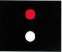|
|Correct Answer|Sog und Wellenschlag vermeiden.|
|Wrong Answer 1|Keine Durchfahrt für Kleinfahrzeuge.|
|Wrong Answer 2|Sperrung der Schifffahrt.|
|Wrong Answer 3|Durchfahrt für Kleinfahrzeuge.|

### 197. Card

|Attribut|Value|
|---|---|
|Id|37c5c2a742251b9340c5786563863e63|
|Question|197. Wo ist die Geschwindigkeit zu vermindern, um Sog und Wellenschlag zu vermeiden?|
|Correct Answer|Vor Hafeneinmündungen, an Lade-, Lösch- und Liegeplätzen, in der Nähe nicht frei fahrender Fähren, auf gekennzeichneten Strecken, in der Nähe schwimmender Geräte bei der Arbeit.|
|Wrong Answer 1|Vor Einmündungen, an Lade-, Lösch- und Liegeplätzen, in der Nähe nicht frei fahrender Fähren, auf gekennzeichneten Strecken, in der Nähe schwimmender Geräte bei der Arbeit.|
|Wrong Answer 2|Vor Hafeneinmündungen, an Lade-, Lösch- und Liegeplätzen, in der Nähe frei fahrender Fähren, auf gekennzeichneten Strecken, in der Nähe schwimmender Geräte bei der Arbeit.|
|Wrong Answer 3|Vor Hafeneinmündungen, an Lade-, Lösch- und Liegeplätzen, in der Nähe nicht frei fahrender Fähren, auf gekennzeichneten Strecken, in der Nähe schwimmender Schifffahrtszeichen.|

### 198. Card

|Attribut|Value|
|---|---|
|Id|df6a7c765b6d425c5fb476e203ec53af|
|Question|198. Was bedeutet dieses Tafelzeichen?|
|Image||
|Correct Answer|Vorgeschriebene Fahrtrichtung.|
|Wrong Answer 1|Fahrtrichtung nach links verboten.|
|Wrong Answer 2|Vorgeschriebene Fahrtrichtung nur für Kleinfahrzeuge.|
|Wrong Answer 3|Empfohlene Fahrtrichtung.|

### 199. Card

|Attribut|Value|
|---|---|
|Id|de38fb8669f016790217d5d2de2e9350|
|Question|199. Welche Bedeutung hat das nachstehende Tafelzeichen, wenn das rote Licht leuchtet?|
|Image||
|Correct Answer|Verbot der Einfahrt in einen Hafen oder eine Nebenwasserstraße.|
|Wrong Answer 1|Verbot des Überholens auf dem Streckenabschnitt.|
|Wrong Answer 2|Achtung Doppelschleuse, linke Kammer gesperrt.|
|Wrong Answer 3|Achtung Ausfahrt aus Hafen oder Nebenfahrwasser.|

### 200. Card

|Attribut|Value|
|---|---|
|Id|34703249b916121f163cc5e21b0c7f1e|
|Question|200. Was bedeutet dieses Tafelzeichen?|
|Image|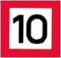|
|Correct Answer|10 km/h Höchstgeschwindigkeit gegenüber dem Ufer.|
|Wrong Answer 1|10 km/h Höchstgeschwindigkeit gegenüber der Strömung.|
|Wrong Answer 2|10 km/h Höchstgeschwindigkeit für Kleinfahrzeuge.|
|Wrong Answer 3|10 km/h für größere Fahrzeuge.|

### 201. Card

|Attribut|Value|
|---|---|
|Id|a08bd7a3a54789c0940d7ab6cad16f99|
|Question|201. Was bedeutet dieses Tafelzeichen?|
|Image|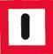|
|Correct Answer|Gebot: Besondere Vorsicht walten lassen.|
|Wrong Answer 1|Gebot: Geradeaus zu fahren.|
|Wrong Answer 2|Gebot: Achtungssignal geben.|
|Wrong Answer 3|Gebot: Vor dem Schild anhalten.|

### 202. Card

|Attribut|Value|
|---|---|
|Id|e61fe638b8229222ecdaf60d52f27405|
|Question|202. Was bedeutet dieses Tafelzeichen?|
|Image||
|Correct Answer|Wendeverbot.|
|Wrong Answer 1|Verbotene Fahrtrichtung rechts oder links.|
|Wrong Answer 2|Verbote in beiden angezeigten Richtungen zu fahren.|
|Wrong Answer 3|Wendeverbot in der Mitte des Fahrwassers.|

### 203. Card

|Attribut|Value|
|---|---|
|Id|335aca28528f1504b21093812a9ab291|
|Question|203. Was bedeutet dieses Tafelzeichen?|
|Image||
|Correct Answer|Empfohlener Wendeplatz. Stillliegen für alle Fahrzeuge verboten.|
|Wrong Answer 1|Empfohlener Wendeplatz. Stillliegen von Kleinfahrzeugen erlaubt.|
|Wrong Answer 2|Vorgeschriebener Wendeplatz. Stillliegen für alle Fahrzeuge verboten.|
|Wrong Answer 3|Vorgeschriebener Wendeplatz. Stillliegen von Kleinfahrzeugen erlaubt.|

### 204. Card

|Attribut|Value|
|---|---|
|Id|fd440687a56b83912167bb21122f28bf|
|Question|204. Was bedeutet dieses Tafelzeichen?|
|Image||
|Correct Answer|Wehr.|
|Wrong Answer 1|Hubbrücke.|
|Wrong Answer 2|Schleuse.|
|Wrong Answer 3|Sicherheitstor.|

### 205. Card

|Attribut|Value|
|---|---|
|Id|7ea48008bb944d18e2b63de0729953dd|
|Question|205. Welche Sichtbeeinträchtigungen führen zu unsichtigem Wetter?|
|Correct Answer|Nebel, Schneefall, starker Regen.|
|Wrong Answer 1|Dunkelheit, Nebel, Schneefall, starker Regen.|
|Wrong Answer 2|Nacht, Schneefall, starker Regen.|
|Wrong Answer 3|Dämmerung, Nebel, Schneefall, starker Regen.|

### 206. Card

|Attribut|Value|
|---|---|
|Id|b04abef11b365722ad82343b0acc63a8|
|Question|206. Wie muss ein Fahrzeug ausgerüstet sein, um bei unsichtigem Wetter zu fahren?|
|Correct Answer|Mit einer für die Binnenschifffahrt zugelassenen funktionsfähigen Radaranlage und einer Sprechfunkanlage für den Binnenschifffahrtsfunk.|
|Wrong Answer 1|Mit einer für die Binnenschifffahrt zugelassenen funktionsfähigen Radaranlage und einer Sprechfunkanlage ohne ATIS.|
|Wrong Answer 2|Mit einer für die Binnenschifffahrt zugelassenen funktionsfähigen Radaranlage und einer Sprechfunkanlage für den Seefunkdienst.|
|Wrong Answer 3|Mit einer Radaranlage ohne Wendeanzeiger und einer Sprechfunkanlage für den Binnenschifffahrtsfunk.|

### 207. Card

|Attribut|Value|
|---|---|
|Id|ae6b5c88e9fb1d886203d5edd70183fc|
|Question|207. Was ist zu beachten, wenn während der Fahrt unsichtiges Wetter eintritt?|
|Correct Answer|Auf bestimmten Wasserstraßen ist ohne Radar und Sprechfunk die Fahrt unverzüglich einzustellen.|
|Wrong Answer 1|Auf allen Wasserstraßen ist ohne Radar und Sprechfunk die Fahrt unverzüglich einzustellen.|
|Wrong Answer 2|Auf bestimmten Wasserstraßen ist ohne Radar und AIS-- die Fahrt unverzüglich einzustellen.|
|Wrong Answer 3|Auf allen Wasserstraßen ist ohne Radar und ECDIS die Fahrt unverzüglich einzustellen.|

### 208. Card

|Attribut|Value|
|---|---|
|Id|3e20f4ecb882ee545620c9984f9a6b23|
|Question|208. Welchen Vorteil bietet ein Radarreflektor auf einem Sportboot?|
|Correct Answer|Bessere Erkennbarkeit des Sportbootes auf Radarbildschirmen.|
|Wrong Answer 1|Bessere Erkennbarkeit des Sportbootes bei Nacht.|
|Wrong Answer 2|Bessere Erkennbarkeit des Sportbootes bei Taglicht.|
|Wrong Answer 3|Bessere Erkennbarkeit des Sportbootes bei unsichtigem Wetter.|

### 209. Card

|Attribut|Value|
|---|---|
|Id|3aa44a6c7bd54170543d8742eb13ea9c|
|Question|209. Welche technische Einrichtung gegen einen Stromschlag muss in der Landstromversorgung unbedingt installiert sein?|
|Correct Answer|Ein Fehlerstromschutzschalter.|
|Wrong Answer 1|Ein geringer Ladungsstrom ist ungefährlich.|
|Wrong Answer 2|Ein Überspannungsschutz.|
|Wrong Answer 3|Ein Schutzkleinspannungsschalter.|

### 210. Card

|Attribut|Value|
|---|---|
|Id|77e379de28b8425399028589b38263ba|
|Question|210. Welches Schallsignal ist zu geben, wenn in einer Notsituation Hilfe gebraucht wird?|
|Correct Answer|Wiederholte lange Töne geben oder Gruppen von Glockenschlägen.|
|Wrong Answer 1|Wiederholte kurze Töne geben, keine Glockenschläge.|
|Wrong Answer 2|Einen langen Ton geben, vereinzelt Glockenschläge.|
|Wrong Answer 3|Drei kurze Töne geben, keine Glockenschläge.|

### 211. Card

|Attribut|Value|
|---|---|
|Id|3e243b8df9212e70bb86783412e13cd9|
|Question|211. Welche Bedeutung hat am Tag das Kreisen einer roten Flagge auf einem Wasserfahrzeug?|
|Correct Answer|Ein in Not befindliches Fahrzeug, das durch Sichtzeichen Hilfe herbeirufen will.|
|Wrong Answer 1|Ein manövrierbehindertes Fahrzeug, das durch Sichtzeichen Hilfe herbeirufen will.|
|Wrong Answer 2|Keine Bedeutung für den durchgehenden Schiffsverkehr.|
|Wrong Answer 3|Schützenswertes Fahrzeug, Vermeidung von Sog und Wellenschlag.|

### 212. Card

|Attribut|Value|
|---|---|
|Id|21dcbb70f7630cf1ad8bac95eb540239|
|Question|212. Welche Notsignale kann ein Segelsurfer auf Binnenschifffahrtsstraßen geben?|
|Correct Answer|Kreisförmiges Schwenken der Arme oder eines Gegenstandes.|
|Wrong Answer 1|Kreisförmiges Schwenken einer grünen Flagge, die mit anderen Zeichen nicht verwechselt werden kann.|
|Wrong Answer 2|Wiederholt lange Gruppen von Glockenschlägen.|
|Wrong Answer 3|Kreisförmiges Schwenken der Arme ist zu vermeiden, das Surfsegel ist möglichst senkrecht zu stellen.|

### 213. Card

|Attribut|Value|
|---|---|
|Id|02be2b693ecbabebe733dc9476f1b7a2|
|Question|213. Was ist mit Abfällen jeglicher Art zu tun, die an Bord anfallen?|
|Correct Answer|An Bord sammeln und an Land in den entsprechenden Abfallsammelbehältern umweltgerecht entsorgen.|
|Wrong Answer 1|An Bord sammeln und bei einer Liegestelle an Land stellen.|
|Wrong Answer 2|An Bord sammeln und nur in geschlossenen Behältern über Bord werfen.|
|Wrong Answer 3|An Bord sammeln. Die Abgabe ist an jeder Schleuse möglich.|

### 214. Card

|Attribut|Value|
|---|---|
|Id|ef4cd2696a87626e9d126b7027387484|
|Question|214. Wem darf der Schiffsführer das Ruder eines motorisierten Sportbootes überlassen?|
|Correct Answer|Einer Person, die mindestens 16 Jahre alt, sowie körperlich und geistig geeignet ist.|
|Wrong Answer 1|Einer Person, die mindestens 18 Jahre alt, sowie körperlich und geistig geeignet ist.|
|Wrong Answer 2|Einer Person, die mindestens 14 Jahre alt, sowie körperlich und geistig geeignet ist.|
|Wrong Answer 3|Einer Person jeden Alters, die körperlich und geistig geeignet ist.|

### 215. Card

|Attribut|Value|
|---|---|
|Id|4450c8ba3b927dd260a8deedeff5d8dc|
|Question|215. Wie müssen Abfälle entsorgt werden?|
|Correct Answer|Es dürfen keinerlei Abfälle ins Wasser gelangen, Fäkalien und Öle sind an Land zu entsorgen.|
|Wrong Answer 1|Nur Abfälle, die die Umwelt nicht gefährden, dürfen 300 m vom Ufer ins Wasser eingeleitet werden.|
|Wrong Answer 2|Auf Seen dürfen keine Abfälle ins Wasser gelangen, auf Binnenschifffahrtsstraßen gibt es Sonderregelungen.|
|Wrong Answer 3|Alle Schiffe müssen mit Fäkalientanks ausgerüstet sein und geeignete Behältnisse für die getrennte Aufnahme von Abfällen an Bord haben.|

### 216. Card

|Attribut|Value|
|---|---|
|Id|58508a177c1de4d24f75b796daa52320|
|Question|216. Was ist beim Neuanstrich des Unterwasserschiffs und bei der Entfernung des alten Anstrichs zu beachten?|
|Correct Answer|Der Arbeitsbereich ist großzügig abzudecken und der anfallende Abfall ist als Sondermüll zu behandeln und entsprechend zu entsorgen.|
|Wrong Answer 1|Es dürfen nur Unterwasseranstriche verwendet werden, deren Umweltverträglichkeit an der EU-Kennzeichnung erkenntlich ist.|
|Wrong Answer 2|Es sind bei Arbeiten mit Unterwasseranstrichen die Richtlinien der Schiffsuntersuchungskommission zu beachten.|
|Wrong Answer 3|Unterwasserarbeiten dürfen nur von zertifizierten Fachbetrieben, nach den Bestimmungen des Umweltschutzes ausgeführt werden.|

### 217. Card

|Attribut|Value|
|---|---|
|Id|fabb28d97d251ec2c09c8d04727c7366|
|Question|217. Was ist bei Sturmwarnung vom Schiffsführer eines Sportbootes unter Segel auf einem größeren Gewässer zu veranlassen?|
|Correct Answer|Rettungsweste anlegen. Segel bergen, versuchen einen Hafen oder eine geschützte Bucht anzulaufen.|
|Wrong Answer 1|Rettungsweste anlegen. Alle Segel setzen, versuchen, einen Hafen oder eine geschützte Bucht anzulaufen.|
|Wrong Answer 2|Rettungsweste bereit halten. Segel bergen, versuchen, einen Hafen oder eine geschützte Bucht anzulaufen.|
|Wrong Answer 3|Rettungsweste anlegen. Segel setzen, versuchen die Gewässermitte anzulaufen.|

### 218. Card

|Attribut|Value|
|---|---|
|Id|fd3634eec6280a2b7503663ef3a1dc36|
|Question|218. Welche Fahrrinnenseite hat ein Talfahrer an seiner Backbordseite?|
|Correct Answer|Die linke Fahrrinnenseite, gekennzeichnet durch grüne Spitztonnen oder Schwimmstangen.|
|Wrong Answer 1|Die rechte Fahrrinnenseite, gekennzeichnet durch rote Stumpftonnen oder Schwimmstangen.|
|Wrong Answer 2|Die linke Fahrrinnenseite, gekennzeichnet durch rote Stumpftonnen oder Schwimmstangen.|
|Wrong Answer 3|Die rechte Fahrrinnenseite, gekennzeichnet durch grüne Spitztonnen oder Schwimmstangen.|

### 219. Card

|Attribut|Value|
|---|---|
|Id|bae478148a4350b59dd8dc90d82567d4|
|Question|219. Mit welcher Wetterentwicklung ist bei schnellem und stetig fallendem Luftdruck zu rechnen?|
|Correct Answer|Schlechtes Wetter, Starkwind oder Sturm.|
|Wrong Answer 1|Besseres Wetter, steigende Temperatur.|
|Wrong Answer 2|Schlechtes Wetter ist nicht zu erwarten.|
|Wrong Answer 3|Besseres Wetter, Sonne.|

### 220. Card

|Attribut|Value|
|---|---|
|Id|61cfaddb037fc60ef3bb75dbcff1bb62|
|Question|220. Welches Wetter ist zu erwarten, wenn der Luftdruck langsam aber stetig steigt?|
|Correct Answer|Besseres Wetter, Sonne.|
|Wrong Answer 1|Besseres Wetter, steigende Temperatur.|
|Wrong Answer 2|Schlechtes Wetter ist nicht zu erwarten.|
|Wrong Answer 3|Schlechtes Wetter, Starkwind oder Sturm.|

### 221. Card

|Attribut|Value|
|---|---|
|Id|d53fdd8479554368d28531aa5907f379|
|Question|221. Wo darf auf Binnenschifffahrtsstraßen Wasserski gelaufen werden?|
|Correct Answer|Nur in durch Tafelzeichen freigegebenen Bereichen.|
|Wrong Answer 1|Außerhalb des Fahrwassers.|
|Wrong Answer 2|Außerhalb der Fahrrinne.|
|Wrong Answer 3|Überall, ohne die Schifffahrt zu gefährden.|

### 222. Card

|Attribut|Value|
|---|---|
|Id|9773c4167f6e18809784490a3544b022|
|Question|222. Zu welcher Tageszeit und bei welchen Sichtweiten darf auf den erlaubten Gewässerabschnitten Wasserski gelaufen werden?|
|Correct Answer|Sonnenaufgang bis -untergang, Sicht 1 000 m und mehr.|
|Wrong Answer 1|Sonnenaufgang bis -untergang, Sicht 1 500 m und mehr.|
|Wrong Answer 2|Sonnenaufgang bis -untergang, Sicht 500 m und mehr.|
|Wrong Answer 3|Sonnenaufgang bis -untergang, Sicht 300 m und mehr.|

### 223. Card

|Attribut|Value|
|---|---|
|Id|12a47912758f4dd2519840cb9fdfb9ce|
|Question|223. Wie muss sich der Wasserskiläufer bei der Vorbeifahrt an Fahrzeugen, Schwimmkörpern oder Badenden verhalten?|
|Correct Answer|Er muss im Kielwasser des Zugbootes bleiben.|
|Wrong Answer 1|Er darf bis zu 10 m beiderseits außerhalb des Kielwassers fahren.|
|Wrong Answer 2|Er darf bis zu 5 m beiderseits außerhalb des Kielwassers fahren.|
|Wrong Answer 3|Er muss uferseitig des Kielwassers fahren.|

### 224. Card

|Attribut|Value|
|---|---|
|Id|f98874ba22234561f087ae1f58904c74|
|Question|224. Unter welchen Voraussetzungen darf außerhalb der ausgewiesenen Strecken/Wasserflächen Wassermotorrad gefahren werden?|
|Correct Answer|Bei Touren- und Wanderfahrten mit klarem Geradeauskurs.|
|Wrong Answer 1|Bei großen Sonderveranstaltungen außerhalb der Fahrrinne.|
|Wrong Answer 2|Wenn kein anderer Verkehrsteilnehmer behindert wird.|
|Wrong Answer 3|Ab Hochwassermarke I nur im Fahrwasser.|

### 225. Card

|Attribut|Value|
|---|---|
|Id|4fc0e9e248dba563394e6371ea881e70|
|Question|225. Wie hat sich der Führer eines Wassermotorrades außerhalb der ausgewiesenen Strecken/Wasserflächen zu verhalten?|
|Correct Answer|Klaren Geradeauskurs fahren.|
|Wrong Answer 1|Im Abstand von 10 m zum Ufer fahren.|
|Wrong Answer 2|Im Abstand von 10 m außerhalb des Tonnenstrichs fahren.|
|Wrong Answer 3|Am Rande der Fahrrinne fahren.|

### 226. Card

|Attribut|Value|
|---|---|
|Id|dabab3ec0d6e2817174d29c7034eacb7|
|Question|226. Auf welchen Gewässern ist die Fahrerlaubnis für Sportboote unter Segeln erforderlich?|
|Correct Answer|Auf bestimmten Wasserstraßen in Berlin und Brandenburg.|
|Wrong Answer 1|Auf allen Landesgewässern.|
|Wrong Answer 2|Auf den Binnenschifffahrtsstraßen und allen Landesgewässern.|
|Wrong Answer 3|Auf allen deutschen Wasserstraßen.|

### 227. Card

|Attribut|Value|
|---|---|
|Id|cab0ed044afd5c2a2742f8f56e5715be|
|Question|227. Weshalb muss sich der Schiffsführer vor dem Befahren fremder Gewässer über die dort geltenden Vorschriften informieren?|
|Correct Answer|Um die jeweils geltenden Vorschriften einhalten zu können.|
|Wrong Answer 1|Da diese auf Landesgewässern grundsätzlich inhaltlich abweichen.|
|Wrong Answer 2|Da diese auf Bundesgewässern grundsätzlich inhaltlich abweichen.|
|Wrong Answer 3|Weil die jeweils geltenden Vorschriften wichtige Informationen über die Brückendurchfahrtshöhen enthalten.|

### 228. Card

|Attribut|Value|
|---|---|
|Id|e859b5ef770441b6f6bd92177efe2685|
|Question|228. Welcher Befähigungsnachweis berechtigt zum Führen eines Sportbootes bis zu einer Länge von 25 m auf dem Rhein?|
|Correct Answer|Das Sportpatent.|
|Wrong Answer 1|Das Sportschifferzeugnis.|
|Wrong Answer 2|Der Sportbootführerschein mit dem Geltungsbereich Binnenschifffahrtsstraßen.|
|Wrong Answer 3|Der Sportbootführerschein mit dem Geltungsbereich Seeschifffahrtsstraßen.|

### 229. Card

|Attribut|Value|
|---|---|
|Id|274f16341a14d787376f1b509ba7a3a2|
|Question|229. Welcher Befähigungsnachweis berechtigt zum Führen eines Sportbootes mit einer Länge von 20 m bis 25 m auf den Binnenschifffahrtsstraßen außerhalb des Rheins?|
|Correct Answer|Das Sportschifferzeugnis oder das Sportpatent.|
|Wrong Answer 1|Der Sportbootführerschein mit dem Geltungsbereich Binnenschifffahrtsstraßen.|
|Wrong Answer 2|Der Sportbootführerschein mit dem Geltungsbereich Seeschifffahrtsstraßen.|
|Wrong Answer 3|Der Sportbootführerschein mit dem Geltungsbereich Binnenschifffahrtsstraßen zum Führen von Sportbooten mit Antriebsmaschine oder das Sportpatent.|

### 230. Card

|Attribut|Value|
|---|---|
|Id|0ac66b2211a95f66c23e3e4559750e37|
|Question|230. Wo sind umfangreiche Hinweise auf die Binnenschifffahrtsstraßen und deren Grenzen zu finden?|
|Correct Answer|Im Teil II der Binnenschifffahrtsstraßen-Ordnung.|
|Wrong Answer 1|Im Teil I der Binnenschifffahrtsstraßen-Ordnung.|
|Wrong Answer 2|In der Binnenschiffsuntersuchungsordnung.|
|Wrong Answer 3|In der Kleinfahrzeugkennzeichenverordnung.|

### 231. Card

|Attribut|Value|
|---|---|
|Id|98fd4ee5d310f160903e940c79f15543|
|Question|231. Was ist bei der Ausübung des Wassersports auf Gewässern außerhalb der Bundeswasserstraßen (z. B. Landeswasserstraßen, kommunale und private Gewässer) zu beachten?|
|Correct Answer|Es ist gegebenenfalls die Genehmigung des Eigentümers einzuholen sowie die jeweilige Befahrensordnung zu beachten.|
|Wrong Answer 1|Es ist immer die Genehmigung des Eigentümers einzuholen sowie die jeweilige Befahrensordnung zu beachten.|
|Wrong Answer 2|Es ist immer die Genehmigung des Wasserstraßen- und Schifffahrtsamtes einzuholen sowie die jeweilige Befahrensordnung zu beachten.|
|Wrong Answer 3|Es ist gegebenenfalls die Genehmigung des Eigentümers einzuholen sowie die Binnenschifffahrtsstraßen-Ordnung zu beachten.|

### 232. Card

|Attribut|Value|
|---|---|
|Id|a6a7dde0fea43403922028c5616701bb|
|Question|232. Welche Kennzeichnungsarten für Sportboote gibt es?|
|Correct Answer|Amtliche Kennzeichen und amtlich anerkannte Kennzeichen.|
|Wrong Answer 1|Nur amtliche Kennzeichen.|
|Wrong Answer 2|Nur amtlich anerkannte Kennzeichen.|
|Wrong Answer 3|Kennzeichen gemäß Konformitätserklärung (CE-Zeichen).|

### 233. Card

|Attribut|Value|
|---|---|
|Id|4c6192e3433bf9d3d1b0f817e023d70b|
|Question|233. Welche Stelle ist für die Zuteilung eines amtlichen Kennzeichens für Sportboote zuständig?|
|Correct Answer|Jedes Wasserstraßen- und Schifffahrtsamt.|
|Wrong Answer 1|Der Deutsche Motoryachtverband.|
|Wrong Answer 2|Der Deutsche Segler-Verband.|
|Wrong Answer 3|Der Allgemeine Deutsche Automobilclub.|

### 234. Card

|Attribut|Value|
|---|---|
|Id|4e6bb628fb148d22836d2c3dbee8a3ac|
|Question|234. Woraus bestehen die amtlich anerkannten Kennzeichen?|
|Correct Answer|Nummer des Internationalen Bootsscheins, gefolgt vom Kennbuchstaben für die ausstellende Organisation.|
|Wrong Answer 1|Nummer des Binnenschiffsregisters, gefolgt vom Kennbuchstaben für die ausstellende Organisation.|
|Wrong Answer 2|Nummer des Seeschiffsregisters, gefolgt vom Kennbuchstaben für die ausstellende Organisation.|
|Wrong Answer 3|Die europäische Schiffsnummer, gefolgt vom Kennbuchstaben für die ausstellende Organisation.|

### 235. Card

|Attribut|Value|
|---|---|
|Id|fa56d13ddba6869418c3765e6f3ff760|
|Question|235. Welche Stellen sind für die Zuteilung eines amtlich anerkannten Kennzeichens für Sportboote zuständig?|
|Correct Answer|Der Deutsche Motoryachtverband, der Deutsche Segler-Verband, der Allgemeine Deutsche Automobilclub.|
|Wrong Answer 1|Die Wasserstraßen- und Schifffahrtsämter.|
|Wrong Answer 2|Die Wasserschutzpolizei.|
|Wrong Answer 3|Amtsgerichte, bei denen ein Schiffsregister geführt wird.|

### 236. Card

|Attribut|Value|
|---|---|
|Id|14d12c95a2240ea13494dfec8b7a74a6|
|Question|236. Wann muss ein Wassersportfahrzeug in das Binnenschiffsregister eingetragen werden?|
|Correct Answer|Ab 10 cbm Wasserverdrängung.|
|Wrong Answer 1|Ab 15 cbm Wasserverdrängung.|
|Wrong Answer 2|Ab 10 m Schiffslänge.|
|Wrong Answer 3|Ab 15 m Schiffslänge.|

### 237. Card

|Attribut|Value|
|---|---|
|Id|d8f709c000b44f1b5ab4df0ab67f6026|
|Question|237. Wie hat sich ein Schiffsführer bei Hochwasser zu verhalten?|
|Correct Answer|Er muss die Geschwindigkeit anpassen und soweit wie möglich in der Fahrwassermitte bleiben, gegebenenfalls besondere Geschwindigkeitsbegrenzungen und Fahrtbeschränkungen beachten.|
|Wrong Answer 1|Er muss die Geschwindigkeit anpassen und soweit wie möglich in seiner Fahrtrichtung rechts fahren, gegebenenfalls besondere Geschwindigkeitsbegrenzungen und Fahrtbeschränkungen beachten.|
|Wrong Answer 2|Er muss die Geschwindigkeit anpassen und soweit wie möglich in seiner Fahrtrichtung links fahren, gegebenenfalls besondere Geschwindigkeitsbegrenzungen und Fahrtbeschränkungen beachten.|
|Wrong Answer 3|Er muss die Geschwindigkeit anpassen und soweit wie möglich in der Fahrwassermitte bleiben, besondere Geschwindigkeitsbegrenzungen und Fahrtbeschränkungen sind nicht zu beachten.|

### 238. Card

|Attribut|Value|
|---|---|
|Id|6239519f696cbcea6285b489e7dd6d07|
|Question|238. Wie hat sich ein Schiffsführer bei Erreichen der Hochwassermarke II zu verhalten?|
|Correct Answer|Er hat die Fahrt unverzüglich einzustellen.|
|Wrong Answer 1|Er hat die Geschwindigkeit anzupassen.|
|Wrong Answer 2|Er hat das Fahrverbot für Fahrzeuge ohne Sprechfunk zu beachten.|
|Wrong Answer 3|Er hat das Verbot der Schifffahrt bei Nacht zu beachten.|

### 239. Card

|Attribut|Value|
|---|---|
|Id|d557875ad16831f6fc6dbc260a9b3d53|
|Question|239. Ein Fahrzeug fährt zu Tal. Voraus liegt eine rote Tonne. Auf welcher Fahrrinnenseite befindet sich diese Tonne und an welcher Schiffsseite muss diese Tonne passiert werden?|
|Correct Answer|Sie befindet sich auf der rechten Fahrrinnenseite und muss an der Steuerbordseite des Schiffes passiert werden.|
|Wrong Answer 1|Sie befindet sich auf der rechten Fahrrinnenseite und muss an der Backbordseite des Schiffes passiert werden.|
|Wrong Answer 2|Sie befindet sich auf der linken Fahrrinnenseite und muss an der Steuerbordseite des Schiffes passiert werden.|
|Wrong Answer 3|Sie befindet sich auf der linken Fahrrinnenseite und muss an Backbordseite des Schiffes passiert werden.|

### 240. Card

|Attribut|Value|
|---|---|
|Id|927ab9c0366fd154dd64b7682b237222|
|Question|240. Ein Fahrzeug fährt zu Berg. Voraus liegt eine rote Tonne. Auf welcher Fahrrinnenseite befindet sich diese Tonne und an welcher Schiffsseite muss diese Tonne passiert werden?|
|Correct Answer|Sie befindet sich auf der rechten Fahrrinnenseite und muss an der Backbordseite des Schiffes passiert werden.|
|Wrong Answer 1|Sie befindet sich auf der rechten Fahrrinnenseite und muss an der Steuerbordseite des Schiffes passiert werden.|
|Wrong Answer 2|Sie befindet sich auf der linken Fahrrinnenseite und muss an der Backbordseite des Schiffes passiert werden.|
|Wrong Answer 3|Sie befindet sich auf der linken Fahrrinnenseite und muss an der Steuerbordseite des Schiffes passiert werden.|

### 241. Card

|Attribut|Value|
|---|---|
|Id|ed67a3cb93add86fca33e184f908393b|
|Question|241. Ein Fahrzeug fährt in der Fahrrinne gegen den Strom. Voraus liegt eine grüne Tonne. Auf welcher Fahrrinnenseite befindet sich diese Tonne und an welcher Schiffsseite muss diese Tonne passiert werden?|
|Correct Answer|Sie befindet sich auf der linken Fahrrinnenseite und muss an der Steuerbordseite des Schiffes passiert werden.|
|Wrong Answer 1|Sie befindet sich auf der rechten Fahrrinnenseite und muss an der Steuerbordseite des Schiffes passiert werden.|
|Wrong Answer 2|Sie befindet sich auf der linken Fahrrinnenseite und muss an der Backbordseite des Schiffes passiert werden.|
|Wrong Answer 3|Sie befindet sich auf der rechten Fahrrinnenseite und muss an der Backbordseite des Schiffes passiert werden.|

### 242. Card

|Attribut|Value|
|---|---|
|Id|84b7d8b1dd868c60ba52d37e5b023165|
|Question|242. Welche Funktion haben gelbe Tonnen mit einem Radarreflektor vor Brückenpfeilern?|
|Correct Answer|Kenntlichmachung der Brückenpfeiler auf dem Radarschirm.|
|Wrong Answer 1|Kenntlichmachung der Höhe der Brückenpfeiler.|
|Wrong Answer 2|Kenntlichmachung einer gesperrten Brückendurchfahrt.|
|Wrong Answer 3|Kenntlichmachung einer Untiefe im Brückenbereich.|

### 243. Card

|Attribut|Value|
|---|---|
|Id|f985459eeb4a046b381842f2ddee7214|
|Question|243. Welche Bedeutung haben diese Tafeln an der nachstehenden gekennzeichneten Brücke?|
|Image||
|Correct Answer|Empfohlene Durchfahrt mit Gegenverkehr und seitlicher Begrenzung der erlaubten Brückendurchfahrt.|
|Wrong Answer 1|Empfohlene Durchfahrt ohne Gegenverkehr und seitlicher Begrenzung der erlaubten Brückendurchfahrt.|
|Wrong Answer 2|Vorgeschriebene Durchfahrt mit Gegenverkehr und seitlicher Begrenzung der erlaubten Brückendurchfahrt.|
|Wrong Answer 3|Empfohlene Durchfahrt mit Gegenverkehr ohne seitliche Begrenzung der erlaubten Brückendurchfahrt.|

### 244. Card

|Attribut|Value|
|---|---|
|Id|262278596498669eeef8d20e4b9f0aa6|
|Question|244. Was bedeutet dieses Tafelzeichen an einer Brückendurchfahrt?|
|Image||
|Correct Answer|Verbot der Durchfahrt und Sperrung der Schifffahrt.|
|Wrong Answer 1|Gesperrte Durchfahrt, jedoch für Kleinfahrzeuge mit Antriebsmaschine befahrbar.|
|Wrong Answer 2|Gesperrte Durchfahrt, jedoch für Kleinfahrzeuge ohne Antriebsmaschine befahrbar.|
|Wrong Answer 3|Schutzbedürftige Anlage.|

### 245. Card

|Attribut|Value|
|---|---|
|Id|48459180456a987d02592681cf6adc75|
|Question|245. Warum ist es bei der Schleusendurchfahrt verboten, Autoreifen als Fender zu benutzen?|
|Correct Answer|Autoreifen sind nicht schwimmfähig und können in den Schleusen zu erheblichen Störungen führen.|
|Wrong Answer 1|Autoreifen erzeugen eine zu hohe Reibung.|
|Wrong Answer 2|Autoreifen erzeugen schwarze Farbspuren am Boot und an der Schleusenmauer.|
|Wrong Answer 3|Autoreifen sind schwimmfähig und können in der Schleuse zu erheblichen Störungen führen.|

### 246. Card

|Attribut|Value|
|---|---|
|Id|8c8e5caf7cedddd064e42728b3c826ca|
|Question|246. Welche Lichter führt ein Schubverband?|
|Correct Answer|Drei weiße Topplichter in einem Dreieck angebracht, die Seitenlichter und drei weiße Hecklichter waagerecht nebeneinander.|
|Wrong Answer 1|Drei weiße Topplichter senkrecht untereinander angebracht, die Seitenlichter und drei weiße Hecklichter waagerecht nebeneinander.|
|Wrong Answer 2|Drei weiße Topplichter in einem Dreieck angebracht, die Seitenlichter und zwei weiße Hecklichter waagerecht nebeneinander.|
|Wrong Answer 3|Drei weiße Topplichter waagerecht nebeneinander, die Seitenlichter und drei weiße Hecklichter waagerecht nebeneinander.|

### 247. Card

|Attribut|Value|
|---|---|
|Id|18e02413d65ed03e1e0a56bb90795f0b|
|Question|247. Welches Fahrzeug führt am Bug einen roten Wimpel?|
|Correct Answer|Ein Fahrzeug mit Vorrang beim Schleusen.|
|Wrong Answer 1|Ein Fahrzeug mit Vorrang beim Be- und Entladen.|
|Wrong Answer 2|Ein Fahrzeug, das explosive Stoffe geladen hat.|
|Wrong Answer 3|Ein Fahrzeug, das brennbare Stoffe geladen hat.|

### 248. Card

|Attribut|Value|
|---|---|
|Id|4c4b6ec76cfcf92ec11e3448bc0e12fb|
|Question|248. Wann gilt ein Sportboot auf den Binnenschifffahrtsstraßen als Kleinfahrzeug?|
|Correct Answer|Wenn das Fahrzeug eine Länge von weniger als 20 m hat.|
|Wrong Answer 1|Wenn das Fahrzeug eine Länge von 20 m hat.|
|Wrong Answer 2|Wenn das Fahrzeug eine Länge von 25 m hat.|
|Wrong Answer 3|Wenn das Fahrzeug eine Länge von mehr als 20 m hat.|

### 249. Card

|Attribut|Value|
|---|---|
|Id|f39c6dcd3f1fca6c723d1f0d448065e4|
|Question|249. Welche Bedeutung hat die Bezeichnung eines Fahrzeuges mit einer rot-weißen Flagge und was ist zu beachten?|
|Correct Answer|Schutzbedürftiges Fahrzeug, Geschwindigkeit vermindern und Sog und Wellenschlag vermeiden.|
|Wrong Answer 1|Schutzbedürftiges Fahrzeug, Geschwindigkeit beibehalten und Sog und Wellenschlag vermeiden.|
|Wrong Answer 2|Schutzbedürftiges Fahrzeug, Geschwindigkeit vermindern.|
|Wrong Answer 3|Schutzbedürftiges Fahrzeug, Sog und Wellenschlag vermeiden.|

### 250. Card

|Attribut|Value|
|---|---|
|Id|ec3c47e9d9a83ca5cead0c12de8ababf|
|Question|250. Welches optische Zeichen kann am Tage anstelle von vier kurzen Tönen gegeben werden?|
|Correct Answer|Eine rote Flagge im unteren Halbkreis schwenken.|
|Wrong Answer 1|Eine rote Flagge im oberen Halbkreis schwenken.|
|Wrong Answer 2|Eine rote Flagge im Kreis schwenken.|
|Wrong Answer 3|Eine rote Flagge zeigen.|

### 251. Card

|Attribut|Value|
|---|---|
|Id|b0b80152e96cde07bc8c5ab7824f022c|
|Question|251. Welches optische Zeichen kann in der Nacht oder bei verminderter Sicht anstelle von vier kurzen Tönen gegeben werden?|
|Correct Answer|Ein rotes Licht im unteren Halbkreis schwenken.|
|Wrong Answer 1|Ein rotes Licht im oberen Halbkreis schwenken.|
|Wrong Answer 2|Ein rotes Licht im Kreis schwenken.|
|Wrong Answer 3|Ein rotes Licht zeigen.|

### 252. Card

|Attribut|Value|
|---|---|
|Id|ca3e95825e8994980945021afc16a79f|
|Question|252. Welcher Befähigungsnachweis ist zur Teilnahme am Binnenschifffahrtsfunk erforderlich?|
|Correct Answer|Das UKW-Sprechfunkzeugnis für den Binnenschifffahrtsfunk.|
|Wrong Answer 1|Das CB-Sprechfunkzeugnis für den Binnenschifffahrtsfunk.|
|Wrong Answer 2|Das Seefunkzeugnis für den Binnenschifffahrtsfunk.|
|Wrong Answer 3|Das SRC-Sprechfunkzeugnis für den Binnenschifffahrtsfunk.|

### 253. Card

|Attribut|Value|
|---|---|
|Id|93f20480ec084dd1e0406cebcffd15d1|
|Question|253. Was bedeutet Radarfahrt?|
|Correct Answer|Eine Fahrt bei unsichtigem Wetter mit Radar.|
|Wrong Answer 1|Eine Fahrt bei Nacht mit Radar.|
|Wrong Answer 2|Eine Fahrt mit Radar.|
|Wrong Answer 3|Eine Fahrt am Tage mit Radar.|

### 254. Card

|Attribut|Value|
|---|---|
|Id|83a867d38fb2e011d6df103b4ba550e3|
|Question|254. Was wird unter einem "Kimmkieler" verstanden?|
|Correct Answer|Eine Yacht mit zwei Seitenkielen.|
|Wrong Answer 1|Eine Yacht mit zwei Seitenschwertern.|
|Wrong Answer 2|Eine Yacht mit einem Kielschwert.|
|Wrong Answer 3|Eine Yacht mit zwei Kielen hintereinander.|

### 255. Card

|Attribut|Value|
|---|---|
|Id|2348cb680545e9c02ab9f6488787929b|
|Question|255. Worin besteht der Vorteil eines Kimmkielers gegenüber anderen Kielbooten?|
|Correct Answer|Er kann problemlos aufrecht trocken fallen.|
|Wrong Answer 1|Sein Tiefgang ist größer.|
|Wrong Answer 2|Die Abdrift ist geringer als bei anderen Kielbooten.|
|Wrong Answer 3|Der Kiel lässt sich aufholen.|

### 256. Card

|Attribut|Value|
|---|---|
|Id|b1a0b5eb143887683a5ef67970df752d|
|Question|256. Was wird unter einer "Kielschwertyacht" verstanden?|
|Correct Answer|Eine Yacht mit flach gehendem Ballastkiel und zusätzlichem aufholbarem Schwert.|
|Wrong Answer 1|Eine Yacht mit einem Ballastkiel und einem zusätzlichen Schwert.|
|Wrong Answer 2|Eine Yacht mit einem aufholbaren Ballastkiel.|
|Wrong Answer 3|Eine Yacht mit zwei Seitenkielen.|

### 257. Card

|Attribut|Value|
|---|---|
|Id|59c4cc4d2ab13ea17c26a71c7adb11d4|
|Question|257. Wodurch wirken die Bodenlenzventile einer Jolle, die unterhalb der Wasserlinie liegen?|
|Correct Answer|Durch den Sog, der bei Fahrt durchs Wasser entsteht.|
|Wrong Answer 1|Durch die Schwerkraft fließt das Wasser außenbords.|
|Wrong Answer 2|Durch die Massenträgheit, die das Boot besitzt.|
|Wrong Answer 3|Durch das Druckgefälle zwischen Luft- und Wasserdruck.|

### 258. Card

|Attribut|Value|
|---|---|
|Id|97b91e9db6601b1b8ea1947844cd4a5d|
|Question|258. Was wird unter "Formstabilität" verstanden?|
|Correct Answer|Die Fähigkeit eines Schiffes, durch seine Rumpfform der Krängung entgegenzuwirken.|
|Wrong Answer 1|Die Fähigkeit eines Schiffes, sich nach einer Kenterung wieder von selbst aufzurichten.|
|Wrong Answer 2|Die Fähigkeit eines Schiffes beim Loslassen der Pinne den Kurs beizubehalten.|
|Wrong Answer 3|Die Fähigkeit eines Schiffes über Jahre die Rumpfform auch bei starker Beanspruchung beizubehalten.|

### 259. Card

|Attribut|Value|
|---|---|
|Id|361cb53e6d5b9e7340f0c5d221dfa74e|
|Question|259. Was wird unter "Gewichtsstabilität" verstanden?|
|Correct Answer|Die Fähigkeit eines Schiffes, durch seinen tief liegenden Ballast der Krängung entgegenzuwirken.|
|Wrong Answer 1|Die Möglichkeit durch zusätzlichen Innenballast die Krängung zu verringern.|
|Wrong Answer 2|Die Möglichkeit durch ein hohes Crewgewicht der Krängung entgegenzuwirken.|
|Wrong Answer 3|Die Fähigkeit eines Schiffes, durch seine Rumpfform der Krängung entgegenzuwirken.|

### 260. Card

|Attribut|Value|
|---|---|
|Id|c47b313ba2eea5a5cd213b34120a3308|
|Question|260. Welche Boote sind vorwiegend "gewichtsstabil"?|
|Correct Answer|Kielyachten sind vorwiegend "gewichtsstabil".|
|Wrong Answer 1|Jollen sind vorwiegend "gewichtsstabil".|
|Wrong Answer 2|Katamarane sind vorwiegend "gewichtsstabil".|
|Wrong Answer 3|Trimarane sind vorwiegend "gewichtsstabil".|

### 261. Card

|Attribut|Value|
|---|---|
|Id|2e7a5c2799d6e43c0d5d4171a2cec282|
|Question|261. Welche Boote sind vorwiegend "formstabil"?|
|Correct Answer|Jollen sind vorwiegend "formstabil".|
|Wrong Answer 1|Kielyachten sind vorwiegend "formstabil".|
|Wrong Answer 2|Kimmkieler sind vorwiegend "formstabil".|
|Wrong Answer 3|Kielschwertyachten sind vorwiegend "formstabil".|

### 262. Card

|Attribut|Value|
|---|---|
|Id|6118500d3074fc9f9ac4717277297f97|
|Question|262. Wodurch kann bei formstabilen Booten bei viel Wind die Stabilität erhöht werden?|
|Correct Answer|Durch Ausreiten bzw. durch Benutzung der Trapezeinrichtung.|
|Wrong Answer 1|Durch Verlagerung von Innenballast.|
|Wrong Answer 2|Durch Umpumpen von Wasserballast.|
|Wrong Answer 3|Durch Ausfahren von sogenannten Trimmklappen oder eines Zusatzschwertes.|

### 263. Card

|Attribut|Value|
|---|---|
|Id|6fae1d36c0593da676179250ec24b7de|
|Question|263. Wie verändert sich das aufrichtende Kraftmoment einer Jolle bei Krängung?|
|Correct Answer|Es nimmt anfangs zu bis zu einem Maximum, von da wieder ab, bis Auftriebs- und Gewischtsschwerpunkt übereinander liegen, anschließend kentert die Jolle.|
|Wrong Answer 1|Es nimmt anfangs ab bis zu einem Minimum, von da wieder zu, bis Auftriebs- und Gewichtsschwerpunkt übereinander liegen, anschließend kentert die Jolle.|
|Wrong Answer 2|Es nimmt anfangs ab und erreicht ein Maximum, wenn Auftriebs- und Gewichtsschwerpunkt übereinander liegen, anschließend kentert die Jolle.|
|Wrong Answer 3|Es nimmt anfangs ab und erreicht sein Minimum, bis Auftriebs- und Gewichtsschwerpunkt übereinander liegen, anschließend kentert die Jolle.|

### 264. Card

|Attribut|Value|
|---|---|
|Id|6b1a22fd0aa4ab96a8f5975691f6af5c|
|Question|264. Wie verändert sich das aufrichtende Kraftmoment einer Kielyacht bei stetig zunehmender Krängung?|
|Correct Answer|Es nimmt zu und erreicht nach Überschreitung des Maximums seinen kritischen Winkel erst bei über 90°.|
|Wrong Answer 1|Es nimmt bis zum Erreichen des kritischen Winkels zu, der bei etwa 70° liegt.|
|Wrong Answer 2|Es nimmt bis zum Erreichen des kritischen Winkels von 90° ab.|
|Wrong Answer 3|Es nimmt bis 90° Krängung ab und dann stetig zu.|

### 265. Card

|Attribut|Value|
|---|---|
|Id|ce8a1e331c3a6bdc6938d3146f7159d1|
|Question|265. Welche Maßnahme ist bei Ruderbruch auf einer Jolle zu treffen?|
|Correct Answer|Notruder oder Paddel als Ersatz nehmen, Fahrwasser verlassen, sich als manövrierunfähig zu erkennen geben.|
|Wrong Answer 1|Sofort ankern und einen Notruf absetzen, Signalkörper (blauer Kegel) setzen.|
|Wrong Answer 2|Rote Flagge kreisförmig schwenken, Schleppleine bereithalten.|
|Wrong Answer 3|Segel bergen, Motor starten und in Rückwärtsfahrt das Ufer ansteuern.|

### 266. Card

|Attribut|Value|
|---|---|
|Id|cf4a59f8cc121304f87f8f1d243ad360|
|Question|266. Wodurch kann eine Pinnensteuerung auch bei Krängung des Bootes sicher erreicht und bedient werden?|
|Correct Answer|Durch einen Pinnenausleger.|
|Wrong Answer 1|Durch Verstellen des Travellers.|
|Wrong Answer 2|Durch das Ausreiten mit Hilfe des Trapezes.|
|Wrong Answer 3|Durch Ersetzen der Pinne durch ein Rad.|

### 267. Card

|Attribut|Value|
|---|---|
|Id|af6582c21bff09dbc7943ac44c9d978a|
|Question|267. Warum sollte Tauwerk an Bord stets ordentlich aufgeschossen werden?|
|Correct Answer|Damit es im Gebrauchsfall klar liegt.|
|Wrong Answer 1|Damit es trocknen kann und nicht verrottet.|
|Wrong Answer 2|Damit die Reißfestigkeit erhalten bleibt.|
|Wrong Answer 3|Damit es nicht durch UV-Strahlung beschädigt wird.|

### 268. Card

|Attribut|Value|
|---|---|
|Id|510b378384808b079b142d4c724befff|
|Question|268. Warum sollten Fallen stets ordentlich aufgeschossen werden?|
|Correct Answer|Damit sie im Gebrauchsfall schnell und sicher gefiert werden können.|
|Wrong Answer 1|Damit sie trocknen können und nicht verrotten.|
|Wrong Answer 2|Damit sie nicht durch UV-Strahlung beschädigt werden.|
|Wrong Answer 3|Damit sie nicht mit den Schoten verwechselt werden können.|

### 269. Card

|Attribut|Value|
|---|---|
|Id|2a327e2152de8c2fd1fd0ecc1e582fe6|
|Question|269. Wie heißen die Ecken eines Segels?|
|Correct Answer|Kopf, Hals, Schothorn.|
|Wrong Answer 1|Kopf, Hals, Nock.|
|Wrong Answer 2|Vorliek, Unterliek, Achterliek.|
|Wrong Answer 3|Vorstag, Unterwant, Achterstag.|

### 270. Card

|Attribut|Value|
|---|---|
|Id|9d3477fa6fb0eb61c8b5ad101840e7a0|
|Question|270. Wie heißen die Kanten eines Segels?|
|Correct Answer|Vorliek, Unterliek, Achterliek.|
|Wrong Answer 1|Kopf, Hals, Nock.|
|Wrong Answer 2|Vorstag, Unterwant, Achterstag.|
|Wrong Answer 3|Kopf, Hals, Schothorn.|

### 271. Card

|Attribut|Value|
|---|---|
|Id|e85a38a99a31cbedce143d3c87f0ec82|
|Question|271. Wozu dienen Segellatten?|
|Correct Answer|Der Formgebung und Aussteifung des Segels.|
|Wrong Answer 1|Der Erleichterung des Reffens.|
|Wrong Answer 2|Der Verhinderung des Killens von Segeln.|
|Wrong Answer 3|Der Möglichkeit das Segel auch bei Starkwind nutzen zu können.|

### 272. Card

|Attribut|Value|
|---|---|
|Id|ff6a8cf68ed8e50f2a4485841a52b6bb|
|Question|272. Weshalb dürfen Segel nicht über einen längeren Zeitraum killen?|
|Correct Answer|Killen schädigt das Tuch und lässt Nähte aufgehen.|
|Wrong Answer 1|Killen lässt das Boot bei stärkerem Wind kentern.|
|Wrong Answer 2|Killen führt zu Verletzungen der Besatzung.|
|Wrong Answer 3|Killen führt zu Beschädigungen an nebeneinander liegenden Schiffen.|

### 273. Card

|Attribut|Value|
|---|---|
|Id|b2388feccdecb669668f9d57dee7aaa7|
|Question|273. Warum müssen auch kleine Schäden an den Segeln sofort repariert werden?|
|Correct Answer|Weil unter Winddruck daraus schnell große Schäden werden.|
|Wrong Answer 1|Weil dadurch der Vortrieb des Segels leidet.|
|Wrong Answer 2|Weil es nur noch bei Flaute eingesetzt werden kann.|
|Wrong Answer 3|Weil Feuchtigkeit in das Segel eindringen kann.|

### 274. Card

|Attribut|Value|
|---|---|
|Id|91b63cfe583b2e75a6ec37f49a946cba|
|Question|274. Woran kann wärend der Fahrt die Richtung des wahren Windes erkannt werden?|
|Correct Answer|An Flaggen oder anderen Anzeichen an Land.|
|Wrong Answer 1|An der Zugrichtung von Wolken.|
|Wrong Answer 2|An der Nationalflagge am Heck.|
|Wrong Answer 3|An den Trimmfäden im Großsegel.|

### 275. Card

|Attribut|Value|
|---|---|
|Id|12ae096c45d9e819b6f349d3c5d926f4|
|Question|275. Welcher Wind wird in Fahrt von Standern bzw. Verklickern angezeigt?|
|Correct Answer|Der scheinbare Wind.|
|Wrong Answer 1|Der Fahrtwind.|
|Wrong Answer 2|Der wahre Wind.|
|Wrong Answer 3|Die Windrichtung.|

### 276. Card

|Attribut|Value|
|---|---|
|Id|a72654bd1c27914df73a0c2a81f09634|
|Question|276. Wann kommen wahrer Wind und scheinbarer Wind auf einem segelnden Boot aus der gleichen Richtung?|
|Correct Answer|Auf Vorwindkurs.|
|Wrong Answer 1|Auf Halbwindkurs.|
|Wrong Answer 2|Auf Amwindkurs.|
|Wrong Answer 3|Auf Raumschotkurs.|

### 277. Card

|Attribut|Value|
|---|---|
|Id|5fa4bfbaeb503a482496bdce1644a576|
|Question|277. Warum ist der scheinbare Wind auf einem Vorwindkurs schwächer als der wahre Wind?|
|Correct Answer|Der wahre Wind vermindert sich um den entgegenstehenden Fahrtwind.|
|Wrong Answer 1|Der wahre Wind wird durch den Fahrtwind abgebremst.|
|Wrong Answer 2|Der scheinbare Wind wird durch den Unterdruck am Segel entlang abgebremst.|
|Wrong Answer 3|Der scheinbare Wind ist unabhängig von der Windrichtung immer schwächer als der wahre Wind.|

### 278. Card

|Attribut|Value|
|---|---|
|Id|d926748ee98756a08f8a7bb401e0029b|
|Question|278. Warum ist der scheinbare Wind auf einem Kurs hoch am Wind stärker als der wahre Wind?|
|Correct Answer|Da sich auf diesem Kurs der wahre Wind und der Fahrtwind in Richtung und Stärke addieren.|
|Wrong Answer 1|Da sich auf diesem Kurs eine Düse zwischen Fock- und Großsegel bildet, die den Wind verstärkt.|
|Wrong Answer 2|Da der wahre Wind beim Amwindkurs stärker ist als bei raumen Kursen.|
|Wrong Answer 3|Da der scheinbare Wind unabhängig von der Windrichtung immer stärker als der wahre Wind ist.|

### 279. Card

|Attribut|Value|
|---|---|
|Id|7fe2e2c70842cddafaa9de5e0bb13c68|
|Question|279. Auf einem Amwindkurs wurde gerefft. Ein entgegenkommendes Boot gleichen Typs segelt ungerefft. Wie lässt sich das erklären?|
|Correct Answer|Der scheinbare Wind ist auf Amwindkursen stärker, auf Raumschot- und Vorwindkursen schwächer als der wahre Wind.|
|Wrong Answer 1|Boote sind stabiler, wenn der Wind achterlicher einfällt.|
|Wrong Answer 2|Der wahre Wind staut sich am Segel bei Raumschotkurs und ist deshalb schwächer.|
|Wrong Answer 3|Bei Amwindkurs streicht der Wind am tragflächenartig gewölbten Segel entlang und wird dadurch beschleunigt.|

### 280. Card

|Attribut|Value|
|---|---|
|Id|3fd36234d189fee8dfef12c369feb2f1|
|Question|280. Warum raumt beim Einfallen einer Bö auf Amwindkurs der scheinbare Wind?|
|Correct Answer|Da der Fahrtwind zunächst gleich bleibt, der wahre Wind jedoch zunimmt, kommt der daraus resultierende scheinbare Wind raumer.|
|Wrong Answer 1|Da durch die Koreoliskraft der Wind auch seine Richtung ändert, wenn er stärker wird.|
|Wrong Answer 2|Da durch den Trimm des Bootes sich der Kurs automatisch ändert, wenn der Wind zunimmt.|
|Wrong Answer 3|Da die Windrichtung durch die Segelstellung beeinflusst wird, verändert sich auch der scheinbare Wind.|

### 281. Card

|Attribut|Value|
|---|---|
|Id|2d1e4bc6e0dcd5c188fd8cf00a9dff66|
|Question|281. Beim Einfallen einer Bö auf Amwindkurs raumt der scheinbare Wind. Welchen Nutzen kann auf der Kreuz daraus gezogen werden?|
|Correct Answer|Mitluven, um weitere Höhe zu gewinnen.|
|Wrong Answer 1|Abfallen, um maximale Höhe zu segeln.|
|Wrong Answer 2|Segel etwas fieren, um die Bö in Krängung umzusetzen.|
|Wrong Answer 3|Ein Spinnacker kann gesetzt werden.|

### 282. Card

|Attribut|Value|
|---|---|
|Id|9999869d79561b1167bfca94c0889259|
|Question|282. Wie sollte das Schwert einer Jolle auf Vorwindkurs gefahren werden und warum?|
|Correct Answer|Es sollte aufgeholt werden. Dadurch vermindert sich der Reibungswiderstand, aber auch die Gefahr der Kenterung bei einer unfreiwilligen Halse.|
|Wrong Answer 1|Es sollte gefiert werden. Dadurch wird das Boot stabiler und die Gefahr der Kenterung bei einer unfreiwilligen Halse reduziert.|
|Wrong Answer 2|Es sollte nie ganz aufgeholt werden, da es sonst bei einer Kenterung zum Aufrichten der Jolle nicht mehr greifbar ist.|
|Wrong Answer 3|Es sollte bei stärkerem Wind ganz aufgeholt werden, um die Steuerfähigkeit der Jolle zu verbessern.|

### 283. Card

|Attribut|Value|
|---|---|
|Id|b56f94ac597a45e48a02fe78cc2b5c9a|
|Question|283. Wie verändern sich Abdrift und Krängung, wenn das Schwert einer Jolle auf einem Amwindkurs etwas aufgeholt wird?|
|Correct Answer|Die Abdrift wird größer, die Krängung nimmt ab.|
|Wrong Answer 1|Die Abdrift wird größer, die Krängung nimmt zu.|
|Wrong Answer 2|Die Abdrift nimmt ab, das Boot wird aufgrund des geringeren Wasserwiderstandes schneller.|
|Wrong Answer 3|Die Abdrift wird kleiner, die Krängung nimmt ab.|

### 284. Card

|Attribut|Value|
|---|---|
|Id|8dc038d3279942320b5740539fb110d0|
|Question|284. Mit welcher Krängung sollte eine Jolle üblicherweise gesegelt werden und weshalb?|
|Correct Answer|Möglichst aufrecht, da sonst Abdrift und Luvgierigkeit zunehmen.|
|Wrong Answer 1|Möglichst aufrecht, weil sonst Abdrift und Leegierigkeit zunehmen.|
|Wrong Answer 2|Leicht nach Lee geneigt, da sonst die Segel leicht nach Luv überkommen können.|
|Wrong Answer 3|Möglichst nach Luv geneigt, weil dadurch die Abdrift und die Luvgierigkeit abnehmen.|

### 285. Card

|Attribut|Value|
|---|---|
|Id|202667c8662ca481d2d420207fbd8ee7|
|Question|285. Wie wirkt sich auf einem Halbwindkurs ein zu dicht geholtes Großsegel auf die Geschwindigkeit des Bootes aus?|
|Correct Answer|Die Krängung nimmt zu, die Geschwindigkeit nimmt ab.|
|Wrong Answer 1|Die Krängung und die Geschwindigkeit nehmen bis zum kritischen Punkt zu, darüber hinaus schnell ab.|
|Wrong Answer 2|Die Geschwindigkeit nimmt zu, da dadurch die Windkräfte optimaler genutzt werden.|
|Wrong Answer 3|Das Boot bleibt stehen, da die Strömung abreißt.|

### 286. Card

|Attribut|Value|
|---|---|
|Id|e4a6e2b7a4d8d30e53df366566266d30|
|Question|286. Wie wirkt sich ein Holepunkt, der zu weit vorne liegt, auf Stand und Beanspruchung des Vorsegels aus?|
|Correct Answer|Das Unterliek killt, das Achterliek wird übermäßig gereckt.|
|Wrong Answer 1|Das Achterliek killt, das Vorliek wird übermäßig gereckt.|
|Wrong Answer 2|Das Vorliek killt, das Unterliek wird übermäßig gereckt.|
|Wrong Answer 3|Das Vorliek killt, das Achterliek wird übermäßig gereckt.|

### 287. Card

|Attribut|Value|
|---|---|
|Id|3804ce280bb82ac2ad2bc9c070b7345e|
|Question|287. Wie wirkt sich ein Holepunkt, der zu weit achtern liegt, auf Stand und Beanspruchung des Vorsegels aus?|
|Correct Answer|Das Achterliek killt, das Unterliek wird übermäßig gereckt.|
|Wrong Answer 1|Das Vorliek killt, das Unterliek wird übermäßig gereckt.|
|Wrong Answer 2|Das Unterliek killt, das Achterliek wird übermäßig gereckt.|
|Wrong Answer 3|Das Achterliek killt, das Vorliek wird übermäßig gereckt.|

### 288. Card

|Attribut|Value|
|---|---|
|Id|91e963cf1b940d538b2f1f048397c59b|
|Question|288. Wie muss ein Segel bei leichtem Wind getrimmt werden?|
|Correct Answer|Das Segel soll bauchig stehen.|
|Wrong Answer 1|Das Segel soll flach getrimmt werden.|
|Wrong Answer 2|Die Schoten müssen gefiert werden.|
|Wrong Answer 3|Die Schoten müssen dicht geholt werden.|

### 289. Card

|Attribut|Value|
|---|---|
|Id|3b0f761aa981c4c71cbe5824b42e75e6|
|Question|289. Wie muss ein Segel bei starkem Wind getrimmt werden?|
|Correct Answer|Das Segel soll flach getrimmt werden.|
|Wrong Answer 1|Es soll bauchig getrimmt werden.|
|Wrong Answer 2|Die Schoten müssen dicht geholt werden.|
|Wrong Answer 3|Die Schoten müssen gefiert werden.|

### 290. Card

|Attribut|Value|
|---|---|
|Id|c91bf13125954c01de64e6b6d737df69|
|Question|290. Wie beeinflusst ein Unterliekstrecker den Trimm des Segels?|
|Correct Answer|Je nach Zugkraft wird der untere Teil des Großsegels bauchiger oder flacher.|
|Wrong Answer 1|Je nach Zugkraft wird der untere Teil des Vorsegels bauchiger oder flacher.|
|Wrong Answer 2|Je nach Zugkraft wird der achtere Teil des Vorsegels bauchiger oder flacher.|
|Wrong Answer 3|Je nach Zugkraft wird der achtere Teil des Großsegels bauchiger oder flacher.|

### 291. Card

|Attribut|Value|
|---|---|
|Id|50ed5af4a5dea38e9e7c2feeea4a22a3|
|Question|291. Um auf Amwindkursen eine Jolle auf Kurs zu halten, muss die Pinne stets stark von der Seite der Segel weggezogen werden. Wie kann der Trimmfehler behoben werden?|
|Correct Answer|Großsegel flacher trimmen; Gewichtsverlagerung nach achtern.|
|Wrong Answer 1|Großsegel flacher trimmen; Gewichtsverlagerung nach vorne.|
|Wrong Answer 2|Vorsegel flacher trimmen; Gewichtsverlagerung nach achtern.|
|Wrong Answer 3|Vorsegel flacher trimmen; Gewichtsverlagerung nach vorne.|

### 292. Card

|Attribut|Value|
|---|---|
|Id|46d7823d80b5af8e55eaa4c634f47739|
|Question|292. Um auf Amwindkursen eine Jolle auf Kurs zu halten, muss die Pinne stets stark zur Seite der Segel hingedrückt werden. Wie kann der Trimmfehler behoben werden?|
|Correct Answer|Großsegel bauchiger trimmen, Gewichtsverlagerung nach vorn.|
|Wrong Answer 1|Großsegel flacher trimmen, Gewichtsverlagerung nach vorn.|
|Wrong Answer 2|Großsegel bauchiger trimmen, Gewichtsverlagerung nach hinten.|
|Wrong Answer 3|Großsegel flacher trimmen, Gewichtsverlagerung nach hinten.|

### 293. Card

|Attribut|Value|
|---|---|
|Id|babafafab1a7504f82bb275f79336901|
|Question|293. Warum soll ein gut getrimmtes Segelboot leicht luvgierig sein?|
|Correct Answer|Weil es im Notfall von selbst in den Wind schießt.|
|Wrong Answer 1|Weil es sich so anspruchsvoller steuern lässt.|
|Wrong Answer 2|Weil es so weniger Höhe läuft.|
|Wrong Answer 3|Weil es auf Raumschotkurs mehr Geschwindigkeit läuft.|

### 294. Card

|Attribut|Value|
|---|---|
|Id|9c94907ffa5a57907d13985d7eb2e637|
|Question|294. Welchen Einfluss hat zunehmende Krängung auf den Trimm des Bootes?|
|Correct Answer|Die Luvgierigkeit nimmt zu.|
|Wrong Answer 1|Die Leegierigkeit nimmt zu.|
|Wrong Answer 2|Keinen.|
|Wrong Answer 3|Bis 45° Krängung nimmt die Luvgierigkeit zu, dann wieder ab.|

### 295. Card

|Attribut|Value|
|---|---|
|Id|867789597a9b5328651d4d5895627f90|
|Question|295. Welche Manöver hat das Boot auf dem eingezeichneten Kurs an den Punkten 1, 2 und 3 gefahren?|
|Image||
|Correct Answer|1 Wende, 2 Halse, 3 Q-Wende.|
|Wrong Answer 1|1 Q-Wende, 2 Halse, 3 Wende.|
|Wrong Answer 2|1 Halse, 2 Wende, 3 Q-Wende.|
|Wrong Answer 3|1 Wende, 2 Q-Wende, 3 Halse.|

### 296. Card

|Attribut|Value|
|---|---|
|Id|ec8cef1abc9273d2f43e433feb9347f7|
|Question|296. Was ist mit Schwert und Ruder einer Jolle zu tun, wenn das Boot an einer Boje liegen gelassen wird?|
|Correct Answer|Schwert und Ruderblatt aufholen, damit das Boot frei schwojen kann.|
|Wrong Answer 1|Schwert absenken, Ruder aufholen, damit das Boot frei schwojen kann.|
|Wrong Answer 2|Schwert aufholen, Ruder absenken, damit das Boot frei schwojen kann.|
|Wrong Answer 3|Schwert und Ruder absenken, damit das Boot frei schwojen kann.|

### 297. Card

|Attribut|Value|
|---|---|
|Id|2535bba86043873f90e1b4be3bcbfe8e|
|Question|297. Warum ist eine Patenthalse gefährlich?|
|Correct Answer|Es kann zu Verletzungen der Crew, zu Riggschäden und zur Kenterung führen.|
|Wrong Answer 1|Es kann zur plötzlichen Änderung der Ausweichpflicht kommen.|
|Wrong Answer 2|Es kann zum Verlust der Steuerfähigkeit des Fahrzeuges führen.|
|Wrong Answer 3|Es kann erneut eine Patenthalse folgen, wenn nicht sofort abgefallen wird.|

### 298. Card

|Attribut|Value|
|---|---|
|Id|47efd2158ea503b9844c18941f1fc385|
|Question|298. Ein Segelboot segelt am Wind, plötzlich bricht das Luvwant. Welches Manöver ist sinnvoll?|
|Correct Answer|Wende.|
|Wrong Answer 1|Halse.|
|Wrong Answer 2|Q-Wende.|
|Wrong Answer 3|Aufschießer.|

### 299. Card

|Attribut|Value|
|---|---|
|Id|9039e97afe554c0b5d5a9c6bcbcdd115|
|Question|299. Ein Segelboot segelt bei starkem Wind nur unter Großsegel auf Amwindkurs. Plötzlich bricht das Vorstag. Was ist sofort zu unternehmen?|
|Correct Answer|Abfallen auf Vorwindkurs.|
|Wrong Answer 1|Dichtholen und Anluven.|
|Wrong Answer 2|Einen Aufschießer fahren.|
|Wrong Answer 3|Eine Halse fahren.|

### 300. Card

|Attribut|Value|
|---|---|
|Id|572bed5f68bbd5ddc915f2b4f4d9a925|
|Question|300. Ein Segelboot segelt bei starkem Wind nur unter Großsegel auf Amwindkurs. Plötzlich bricht das Vorstag. Womit kann das gebrochene Vorstag schnell provisorisch ersetzt werden?|
|Correct Answer|Durch die Fock oder ein Fall.|
|Wrong Answer 1|Durch die Fockschot oder das Großfall.|
|Wrong Answer 2|Durch die Vor- oder die Achterleine.|
|Wrong Answer 3|Durch die Fockschot oder eine Reffleine.|

## Internal Id
87eac9dc-ca01-47e0-beea-4210858f5460