# SBF-See - Sportbootführerschein See Theorie Fragen

## Description

Dies sind die Lernzettel für den Sportbootführerschein See.
Hierzu wurden die offiziellen Prüfungsfragen von <https://www.elwis.de/> in Karteikarten übersetzt.

Stand des Exports ist: Stand: 01. August 2023

## Cards

### 1. Card

|Attribut|Value|
|---|---|
|Id|e7dcab5603c704b757facb6627db98cd|
|Question|1. Was ist zu tun, wenn vor Antritt der Fahrt nicht feststeht, wer Schiffsführer ist?|
|Correct Answer|Der verantwortliche Schiffsführer muss bestimmt werden.|
|Wrong Answer 1|Der verantwortliche Schiffsführer muss gewählt werden.|
|Wrong Answer 2|Ein Inhaber eines Sportbootführerscheins muss die Fahrzeugführung übernehmen.|
|Wrong Answer 3|Ein Inhaber eines Sportbootführerscheins muss die Verantwortung übernehmen.|

### 2. Card

|Attribut|Value|
|---|---|
|Id|8030caf5db344623a35a5af12612acd1|
|Question|2. In welchen Fällen darf weder ein Sportboot geführt noch dessen Kurs oder Geschwindigkeit selbstständig bestimmt werden?|
|Correct Answer|Wenn man infolge körperlicher oder geistiger Mängel oder infolge des Genusses alkoholischer Getränke oder anderer berauschender Mittel in der sicheren Führung behindert ist oder wenn eine Blutalkoholkonzentration von 0,5 ‰ oder mehr im Körper vorhanden ist.|
|Wrong Answer 1|Wenn man infolge körperlicher oder geistiger Mängel oder infolge des Genusses alkoholischer Getränke oder anderer berauschender Mittel in der sicheren Führung behindert ist oder wenn eine Blutalkoholkonzentration von 0,8 ‰ oder mehr im Körper vorhanden ist.|
|Wrong Answer 2|Wenn man infolge körperlicher oder geistiger Mängel oder infolge des Genusses alkoholischer Getränke oder anderer berauschender Mittel in der sicheren Führung behindert ist oder wenn eine Blutalkoholkonzentration von 1,0 ‰ oder mehr im Körper vorhanden ist.|
|Wrong Answer 3|Wenn man infolge körperlicher oder geistiger Mängel oder infolge des Genusses alkoholischer Getränke oder anderer berauschender Mittel in der sicheren Führung behindert ist oder wenn eine Blutalkoholkonzentration von 0,3 ‰ oder mehr im Körper vorhanden ist.|

### 3. Card

|Attribut|Value|
|---|---|
|Id|90a3e3f50b716c3c6137069cd5818d1a|
|Question|3. Wann ist ein Fahrzeug in Fahrt?|
|Correct Answer|Wenn es weder vor Anker liegt noch an Land festgemacht ist noch auf Grund sitzt.|
|Wrong Answer 1|Wenn es weder vor Anker liegt noch an Land festgemacht ist noch Fahrt über Grund macht.|
|Wrong Answer 2|Wenn es weder auf Grund sitzt noch vor Anker liegt noch manövrierbehindert oder manövrierunfähig ist.|
|Wrong Answer 3|Wenn es weder an Land festgemacht ist noch vor Anker liegt noch Fahrt durchs Wasser macht.|

### 4. Card

|Attribut|Value|
|---|---|
|Id|4548768d6e2e0e8c88e547386503605a|
|Question|4. Wie lang ist die Dauer eines kurzen Tons (		 	)?|
|Image||
|Correct Answer|Etwa 1 Sekunde.|
|Wrong Answer 1|Etwa 2 Sekunden.|
|Wrong Answer 2|Weniger als 1 Sekunde.|
|Wrong Answer 3|Weniger als 4 Sekunden.|

### 5. Card

|Attribut|Value|
|---|---|
|Id|dfd2bc84e29e0c6de243ccc7e35360a9|
|Question|5. Wie lang ist die Dauer eines langen Tons (		 	)?|
|Image||
|Correct Answer|Etwa 4 - 6 Sekunden.|
|Wrong Answer 1|Etwa 2 - 6 Sekunden.|
|Wrong Answer 2|Etwa 1 - 2 Sekunden.|
|Wrong Answer 3|Etwa 6 - 8 Sekunden.|

### 6. Card

|Attribut|Value|
|---|---|
|Id|68f2a5974679cf78ddbfaab74fc05fa6|
|Question|6. Wann gilt ein Fahrzeug unter Segel als Maschinenfahrzeug?|
|Correct Answer|Wenn es gleichzeitig mit Maschinenkraft fährt.|
|Wrong Answer 1|Wenn es mit einer Antriebsmaschine ausgerüstet ist.|
|Wrong Answer 2|Wenn es durch das Segeln keine Fahrt durchs Wasser macht.|
|Wrong Answer 3|Wenn es durch das Segeln keine Fahrt über Grund macht.|

### 7. Card

|Attribut|Value|
|---|---|
|Id|064559c9b3560f44fb93ab0fbe666db1|
|Question|7. Welches Signal führt ein Fahrzeug unter Segel, das als Maschinenfahrzeug gilt, zusätzlich am Tage?|
|Correct Answer|Einen schwarzen Kegel, Spitze unten.|
|Wrong Answer 1|Einen schwarzen Kegel, Spitze oben.|
|Wrong Answer 2|Einen schwarzen Rhombus.|
|Wrong Answer 3|Zwei schwarze Bälle senkrecht übereinander.|

### 8. Card

|Attribut|Value|
|---|---|
|Id|a30d0de63c5a6aa37bd468b9d662ba56|
|Question|8. Welche Seite wird als Luvseite bezeichnet?|
|Correct Answer|Die dem Wind zugekehrte Seite.|
|Wrong Answer 1|Die dem Wind abgewandte Seite.|
|Wrong Answer 2|Die Seite in Fahrtrichtung rechts.|
|Wrong Answer 3|Die Seite in Fahrtrichtung links.|

### 9. Card

|Attribut|Value|
|---|---|
|Id|7efa0e4df36e0e898ae07a06144b1c47|
|Question|9. Welche Seite wird als Leeseite bezeichnet?|
|Correct Answer|Die dem Wind abgewandte Seite.|
|Wrong Answer 1|Die dem Wind zugekehrte Seite.|
|Wrong Answer 2|Die Seite in Fahrtrichtung rechts.|
|Wrong Answer 3|Die Seite in Fahrtrichtung links.|

### 10. Card

|Attribut|Value|
|---|---|
|Id|503f2ca559634d7661fe57728beacd09|
|Question|10. Wann müssen die Lichter von Fahrzeugen geführt oder gezeigt werden?|
|Correct Answer|Von Sonnenuntergang bis Sonnenaufgang und bei verminderter Sicht.|
|Wrong Answer 1|Von Sonnenaufgang bis Sonnenuntergang und bei verminderter Sicht.|
|Wrong Answer 2|Von abends 18:00 Uhr bis morgens 06:00 Uhr und bei verminderter Sicht.|
|Wrong Answer 3|Bei Dunkelheit, schlechtem Wetter und verminderter Sicht.|

### 11. Card

|Attribut|Value|
|---|---|
|Id|cdd9eebd008d19025828a5789ca23d33|
|Question|11. Wozu dient die Lichterführung?|
|Correct Answer|Sie zeigt Fahrtrichtung und Lage eines Fahrzeugs an.|
|Wrong Answer 1|Sie zeigt Kurs und Geschwindigkeit eines Fahrzeugs an.|
|Wrong Answer 2|Sie zeigt Fahrtrichtung und Position eines Fahrzeugs an.|
|Wrong Answer 3|Sie zeigt Fahrtrichtung und Kurs eines Fahrzeugs an.|

### 12. Card

|Attribut|Value|
|---|---|
|Id|47cde9386450239908d51cab7ff69218|
|Question|12. Was für eine Laterne kann ein Segelfahrzeug von weniger als 20 m Länge anstelle der Seitenlichter und des Hecklichtes führen?|
|Correct Answer|Eine Dreifarbenlaterne an oder nahe der Mastspitze.|
|Wrong Answer 1|Eine Zweifarbenlaterne an gut sichtbarer Stelle.|
|Wrong Answer 2|Eine Dreifarbenlaterne an gut sichtbarer Stelle.|
|Wrong Answer 3|Eine Zweifarbenlaterne an oder nahe der Mastspitze.|

### 13. Card

|Attribut|Value|
|---|---|
|Id|e8b5ba95dcd9bdab44e286d2fbc35ddd|
|Question|13. Welche Lichter muss ein Fahrzeug unter Segel, das gleichzeitig mit Maschinenkraft fährt, führen?|
|Correct Answer|Die für ein Maschinenfahrzeug vorgeschriebenen Lichter.|
|Wrong Answer 1|Die für ein Segelfahrzeug vorgeschriebenen Lichter.|
|Wrong Answer 2|Zwei rote Rundumlichter senkrecht übereinander.|
|Wrong Answer 3|Seitenlichter rot und grün und ein rotes Rundumlicht.|

### 14. Card

|Attribut|Value|
|---|---|
|Id|0f16f05c5275fb11c6783e6f7ede3519|
|Question|14. Wie weichen zwei Motorboote aus, die sich auf entgegengesetzten Kursen nähern?|
|Correct Answer|Jedes Fahrzeug muss seinen Kurs nach Steuerbord ändern.|
|Wrong Answer 1|Jedes Fahrzeug muss seinen Kurs nach Backbord ändern.|
|Wrong Answer 2|Es muss das luvwärtige Fahrzeug dem leewärtigen Fahrzeug ausweichen.|
|Wrong Answer 3|Es muss das leewärtige Fahrzeug dem luvwärtigen Fahrzeug ausweichen.|

### 15. Card

|Attribut|Value|
|---|---|
|Id|ed65ff8f01f45cb6f176b10dcfd8bae3|
|Question|15. Zwei Motorboote nähern sich auf kreuzenden Kursen. Es besteht die Gefahr eines Zusammenstoßes. Wer ist ausweichpflichtig?|
|Correct Answer|Dasjenige Fahrzeug muss ausweichen, welches das Andere an seiner Steuerbordseite hat.|
|Wrong Answer 1|Dasjenige Fahrzeug muss ausweichen, welches das Andere an seiner Backbordseite hat.|
|Wrong Answer 2|Es muss das luvwärtige Fahrzeug dem leewärtigen Fahrzeug ausweichen.|
|Wrong Answer 3|Es muss das leewärtige Fahrzeug dem luvwärtigen Fahrzeug ausweichen.|

### 16. Card

|Attribut|Value|
|---|---|
|Id|cc2b2be85409ad045f08290e732d356a|
|Question|16. Welche Bedeutung hat folgendes Schallsignal?|
|Image||
|Correct Answer|Bleib-weg-Signal, Gefahrenbereich sofort verlassen.|
|Wrong Answer 1|Allgemeines Gefahr- und Warnsignal.|
|Wrong Answer 2|Ankerlieger über 100 m Länge.|
|Wrong Answer 3|Manövrierbehinderter Schleppverband über 200 m Länge.|

### 17. Card

|Attribut|Value|
|---|---|
|Id|d86ee32d2a913cba165530249694b58f|
|Question|17. Welche Bedeutung hat folgendes Tafelzeichen?|
|Image|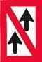|
|Correct Answer|Überholverbot.|
|Wrong Answer 1|Begegnungsverbot.|
|Wrong Answer 2|Überholverbot für Fahrzeuge unter 20 m Länge.|
|Wrong Answer 3|Begegnungsverbot für Fahrzeuge über 20 m Länge.|

### 18. Card

|Attribut|Value|
|---|---|
|Id|014dc1fbaf2ce39248a73fa62a279e89|
|Question|18. Welche Bedeutung hat folgendes Tafelzeichen?|
|Image||
|Correct Answer|Begegnungsverbot an einer Engstelle.|
|Wrong Answer 1|Begegnungsverbot für Fahrzeuge über 12 m Länge.|
|Wrong Answer 2|Überholverbot; mit Gegenverkehr muss gerechnet werden.|
|Wrong Answer 3|Überholverbot für alle Fahrzeuge.|

### 19. Card

|Attribut|Value|
|---|---|
|Id|968107c72afd53194c3cc567740799d6|
|Question|19. Welche Bedeutung hat folgendes Tafelzeichen?|
|Image||
|Correct Answer|Sog und Wellenschlag vermeiden.|
|Wrong Answer 1|Gefährdeter Strandbereich, Überspülungsgefahr; Mindestpassierabstand 100 m.|
|Wrong Answer 2|Wasserstraße, die jederzeit sicher befahren werden kann; keine Gefahr durch Seegang.|
|Wrong Answer 3|Wasserstraße, die nicht jederzeit sicher befahren werden kann; Gefahr durch Seegang.|

### 20. Card

|Attribut|Value|
|---|---|
|Id|e5003bae267564215d16bd07d4c88953|
|Question|20. Welche Bedeutung hat folgendes Tafelzeichen?|
|Image||
|Correct Answer|Mindestabstand in Metern, der in der nachfolgenden Strecke vom Aufstellungsort der Tafel an eingehalten werden muss.|
|Wrong Answer 1|Maximalgeschwindigkeit in km/h, die auf der in Fahrtrichtung rechten Fahrwasserseite nicht überschritten werden darf.|
|Wrong Answer 2|Maximalabstand in Metern, der in der nachfolgenden Strecke vom Aufstellungsort der Tafel an eingehalten werden muss.|
|Wrong Answer 3|Verengung des Fahrwassers auf 40 m.|

### 21. Card

|Attribut|Value|
|---|---|
|Id|b126cb886d143df2c0149eedfc7c0ba4|
|Question|21. Welche Bedeutung hat folgendes Tafelzeichen?|
|Image||
|Correct Answer|Haltegebot vor beweglichen Brücken, Sperrwerken und Schleusen.|
|Wrong Answer 1|Dauernde Sperrung einer Teilstrecke der Wasserstraße.|
|Wrong Answer 2|Gebot zur Abgabe eines langen Signaltons.|
|Wrong Answer 3|Weiterfahrt für Sportfahrzeuge verboten.|

### 22. Card

|Attribut|Value|
|---|---|
|Id|c6f47feb52ff78ab9edfeb1cad70dd94|
|Question|22. Welche Bedeutung hat folgendes Tafelzeichen?|
|Image||
|Correct Answer|Ankern verboten für alle Fahrzeuge.|
|Wrong Answer 1|Ankern verboten für Kleinfahrzeuge unter 12 m Länge.|
|Wrong Answer 2|Ankern verboten für Kleinfahrzeuge ab 12 m Länge.|
|Wrong Answer 3|Ankern und Festmachen verboten.|

### 23. Card

|Attribut|Value|
|---|---|
|Id|a8632075d80d69747e46b89732190c36|
|Question|23. Welche Bedeutung haben folgende Tafelzeichen?|
|Image||
|Correct Answer|Festmache- und Liegeverbot.|
|Wrong Answer 1|Festmache- und Liegeverbot für Sportboote.|
|Wrong Answer 2|Festmache- und Liegeverbot für Sportboote über 12 m Länge.|
|Wrong Answer 3|Festmache- und Liegeverbot für gewerbliche Schiffe.|

### 24. Card

|Attribut|Value|
|---|---|
|Id|780c56e34a9a10a94df560f502cbf6ee|
|Question|24. Welche Bedeutung hat folgendes Tafelzeichen?|
|Image||
|Correct Answer|Abgabe eines langen Tons.|
|Wrong Answer 1|Abgabe eines kurzen Tons.|
|Wrong Answer 2|Abgabe von zwei langen Tönen.|
|Wrong Answer 3|Abgabe eines kurzen und eines langen Tons.|

### 25. Card

|Attribut|Value|
|---|---|
|Id|153e50530d9ab00f5474e8af7049be2f|
|Question|25. Welche Bedeutung haben folgende Tafelzeichen?|
|Image|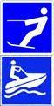|
|Correct Answer|Wasserflächen, auf denen mit Wasserski oder Wassermotorrädern gefahren werden darf.|
|Wrong Answer 1|Genehmigungspflichtige Übungsstrecke für das Fahren mit Wasserski oder Wassermotorrädern.|
|Wrong Answer 2|Fahren mit Wasserski oder Wassermotorrädern erlaubt. Wasserskiläufer und Wassermotorräder haben Vorfahrt.|
|Wrong Answer 3|Genehmigungsfreie Übungsstrecke für das Fahren mit Wasserski oder Wassermotorrädern.|

### 26. Card

|Attribut|Value|
|---|---|
|Id|8d145262728512dbc837db242cd639e3|
|Question|26. Welche Bedeutung hat folgendes Tafelzeichen?|
|Image||
|Correct Answer|Ende einer Gebots- oder Verbotsstrecke.|
|Wrong Answer 1|Streckenabschnitt für eine nicht frei fahrende Fähre.|
|Wrong Answer 2|Queren des Fahrwassers ist gestattet.|
|Wrong Answer 3|Wechseln der Fahrwasserseite ist gestattet.|

### 27. Card

|Attribut|Value|
|---|---|
|Id|0e10fd1f78e3fc59a734d945bb058424|
|Question|27. Welche Bedeutung hat folgendes Tafelzeichen?|
|Image||
|Correct Answer|Verbot der Durchfahrt und Sperrung der Schifffahrt.|
|Wrong Answer 1|Verbot der Durchfahrt und Sperrung für Kleinfahrzeuge.|
|Wrong Answer 2|Verbot der Durchfahrt, jedoch für Kleinfahrzeuge ohne laufende Antriebsmaschine befahrbar.|
|Wrong Answer 3|Verbot der Durchfahrt, jedoch für Kleinfahrzeuge ohne Antriebsmaschine befahrbar.|

### 28. Card

|Attribut|Value|
|---|---|
|Id|2121e086699c28713bade2b7b022c7d0|
|Question|28. Welche Bedeutung haben folgende Schifffahrtszeichen?|
|Image||
|Correct Answer|Brücke, Sperrwerk oder Schleuse geschlossen.|
|Wrong Answer 1|Anlage dauerhaft gesperrt.|
|Wrong Answer 2|Stoppsignal für alle Fahrzeuge.|
|Wrong Answer 3|Außergewöhnliche Schifffahrtsbehinderung.|

### 29. Card

|Attribut|Value|
|---|---|
|Id|7e26b46f73cc2bdc5741b4e13d88bf01|
|Question|29. Welche Bedeutung haben folgende Schifffahrtszeichen?|
|Image||
|Correct Answer|Anlage dauerhaft gesperrt.|
|Wrong Answer 1|Brücke, Sperrwerk oder Schleuse geschlossen.|
|Wrong Answer 2|Stoppsignal für alle Fahrzeuge.|
|Wrong Answer 3|Außergewöhnliche Schifffahrtsbehinderung.|

### 30. Card

|Attribut|Value|
|---|---|
|Id|c35d335b1f78a00e2839357ee35a5adc|
|Question|30. Was bedeuten diese Lichter vor einer Schleuse?|
|Image||
|Correct Answer|Einfahrt frei, Gegenverkehr gesperrt.|
|Wrong Answer 1|Einfahrt frei, Schleusentor öffnet.|
|Wrong Answer 2|Schleuse in Betrieb, auf Einfahrtsignal gemäß Reihenfolge warten.|
|Wrong Answer 3|Schleuse in Betrieb, auf Ausfahrtsignal gemäß Reihenfolge warten.|

### 31. Card

|Attribut|Value|
|---|---|
|Id|f1f3e7d911202abc30a2b9d372ed6fc6|
|Question|31. Welches Merkblatt enthält Hinweise für das Verhalten zum Schutz seltener Tiere und Pflanzen sowie zur Reinhaltung der Gewässer?|
|Correct Answer|Die 10 goldenen Regeln für Wassersportler.|
|Wrong Answer 1|Die 15 goldenen Regeln für Wassersportler.|
|Wrong Answer 2|Die 10 Grundregeln für Wassersportler.|
|Wrong Answer 3|Die 15 Verhaltensregeln für Wassersportler.|

### 32. Card

|Attribut|Value|
|---|---|
|Id|334266d4fd2c774ef2f640a3bbfc4651|
|Question|32. Wie kann mitgeholfen werden, die Lebensmöglichkeiten der Pflanzen- und Tierwelt in Gewässern und Feuchtgebieten zu bewahren und zu fördern?|
|Correct Answer|Durch umweltbewusstes Verhalten und Beachtung der "Zehn goldenen Regeln für das Verhalten von Wassersportlern in der Natur".|
|Wrong Answer 1|Durch umweltbewusstes Verhalten und Beachtung der "Zehn Grundregeln für den Wassersport".|
|Wrong Answer 2|Durch umsichtiges Verhalten und Beachtung der Verkehrsvorschriften.|
|Wrong Answer 3|Durch vorausschauendes Fahren und Ausweichen entsprechend der Verkehrsvorschriften.|

### 33. Card

|Attribut|Value|
|---|---|
|Id|9df0adde197e87d39cd87cc7699eb8ea|
|Question|33. Warum sollte man sich von Schilf- und Röhrichtzonen sowie von dicht bewachsenen Uferzonen möglichst weit fernhalten?|
|Correct Answer|Weil diese Zonen vielfach Rast- und Brutplätze besonders schutzwürdiger Vögel oder Fischlaichplätze sind.|
|Wrong Answer 1|Weil in diesen Zonen die Gefahr von Grundberührungen besteht.|
|Wrong Answer 2|Weil durch die Pflanzen der Propeller blockiert werden könnte.|
|Wrong Answer 3|Weil in diesen Zonen badende Personen schwer zu erkennen sind.|

### 34. Card

|Attribut|Value|
|---|---|
|Id|4f949e95967d2c857bacea4329e18587|
|Question|34. Warum soll ein kleines Fahrzeug nicht dicht an ein großes in Fahrt befindliches Fahrzeug heranfahren?|
|Correct Answer|Es kann durch dessen Bug- oder Heckwelle kentern oder durch den Sog mit dem Fahrzeug kollidieren.|
|Wrong Answer 1|Dichtes Heranfahren ist ein Verstoß gegen die Grundregeln für das Verhalten im Verkehr.|
|Wrong Answer 2|Da es dem großen in Fahrt befindlichen Fahrzeug sonst nicht ausweichen kann.|
|Wrong Answer 3|Es kann durch dessen Bug- oder Heckwelle Seeschlag erleiden.|

### 35. Card

|Attribut|Value|
|---|---|
|Id|4512b6c251bc7400085ee7051a523858|
|Question|35. Warum soll man möglichst gegen Strom und Wind anlegen?|
|Correct Answer|Weil sich das Fahrzeug dabei sicherer manövrieren lässt.|
|Wrong Answer 1|Weil dadurch Sog und Wellenschlag vermieden wird.|
|Wrong Answer 2|Weil dadurch Einflüsse von Wellen und Wassertiefe ausgeglichen werden.|
|Wrong Answer 3|Weil dies die Steuerwirkung der Schraube erhöht.|

### 36. Card

|Attribut|Value|
|---|---|
|Id|c4e5806ed095eb7b37a8bc297f75c990|
|Question|36. Wie verhält man sich beim Begegnen mit anderen Fahrzeugen in einem engen Fahrwasser?|
|Correct Answer|Geschwindigkeit herabsetzen und ausreichenden Passierabstand halten.|
|Wrong Answer 1|Geschwindigkeit erhöhen, um das Begegnungsmanöver zügig durchzuführen.|
|Wrong Answer 2|Das gegen den Strom fahrende Fahrzeug ist ausweichpflichtig.|
|Wrong Answer 3|Das mit dem Strom fahrende Fahrzeug hat aufzustoppen.|

### 37. Card

|Attribut|Value|
|---|---|
|Id|a469eb7dfb7fd354ea2b644ec428fe02|
|Question|37. Welche Gefahren können entstehen, wenn ein kleines von einem größeren Fahrzeug überholt wird?|
|Correct Answer|Das kleinere Fahrzeug kann durch Stau, Sog oder Schwell aus dem Kurs laufen und kollidieren oder querschlagen, in flachen Gewässern auf Grund laufen.|
|Wrong Answer 1|Das größere Fahrzeug kann durch Stau, Sog oder Schwell aus dem Kurs laufen und kollidieren oder querschlagen, in flachen Gewässern auf Grund laufen.|
|Wrong Answer 2|Das kleinere Fahrzeug kann durch Stau, Sog oder Schwell aus dem Kurs laufen und kollidieren oder kentern, in flachen Gewässern extrem versetzt werden.|
|Wrong Answer 3|Das größere Fahrzeug kann durch Wellenbildung aus dem Kurs laufen und kollidieren oder querschlagen, in flachen Gewässern auf Grund laufen.|

### 38. Card

|Attribut|Value|
|---|---|
|Id|220152ba1fdc0452194a0ecb63e44dc7|
|Question|38. Wo finden Sie Informationen über umweltfreundliche Farben, Lacke und Antifouling-Beschichtungen für Ihr Boot?|
|Correct Answer|Beim Umweltbundesamt.|
|Wrong Answer 1|Beim Bundesministerium für Digitales und Verkehr.|
|Wrong Answer 2|In der Sportbootführerscheinverordnung.|
|Wrong Answer 3|In der Sportbootvermietungsverordnung.|

### 39. Card

|Attribut|Value|
|---|---|
|Id|d53e57a39ee7a2720189cf51fbaeac0a|
|Question|39. Woran kann man erkennen, ob der Anker hält?|
|Correct Answer|Wenn beim Handauflegen auf die Ankerkette oder -leine kein Rucken zu verspüren ist und sich die Ankerpeilung nicht ändert.|
|Wrong Answer 1|Wenn Ankerkette oder -leine nicht vibrieren und sich der anliegende Magnetkompasskurs nicht verändert.|
|Wrong Answer 2|Wenn beim Handauflegen auf die Ankerkette oder -leine kein Rucken zu verspüren ist und das Fahrzeug nicht schwojt.|
|Wrong Answer 3|Wenn beim Handauflegen auf die Ankerkette oder -leine kein Rucken zu verspüren ist und sich die Ankerpeilung ändert.|

### 40. Card

|Attribut|Value|
|---|---|
|Id|679902d0aac7084c15757facc5f58dee|
|Question|40. Welches ist der günstigste Anlaufwinkel beim Anlegen?|
|Correct Answer|Ein möglichst spitzer Winkel.|
|Wrong Answer 1|Ein Winkel von 90° bis 100°.|
|Wrong Answer 2|Ein möglichst stumpfer Winkel.|
|Wrong Answer 3|Ein Winkel von 60° bis 70°.|

### 41. Card

|Attribut|Value|
|---|---|
|Id|0079018fa468a2ff99ef4fbedac28acf|
|Question|41. Wie verhält sich im Allgemeinen das Schiff im Rückwärtsgang bei einem rechtsdrehenden Propeller?|
|Correct Answer|Das Heck dreht nach Backbord.|
|Wrong Answer 1|Das Heck dreht nach Steuerbord.|
|Wrong Answer 2|Der Kurs des Schiffes ändert sich nicht.|
|Wrong Answer 3|Der Bug dreht nach Backbord.|

### 42. Card

|Attribut|Value|
|---|---|
|Id|19137990c4589fe001830fc3f95eaf7d|
|Question|42. Was bewirkt der Quickstopp?|
|Correct Answer|Unterbrechung von Zündkontakt bzw. Kraftstoffzufuhr.|
|Wrong Answer 1|Automatisches Anlassen des Motors.|
|Wrong Answer 2|Kurze Unterbrechung des Motorlaufs.|
|Wrong Answer 3|Automatische Schubumkehr.|

### 43. Card

|Attribut|Value|
|---|---|
|Id|cbfe5c6293d2fce094b0c1642b364e36|
|Question|43. Was ist zu unternehmen, wenn Treibstoff oder Öl in die Bilge gelangt?|
|Correct Answer|Mit Lappen aufnehmen und umweltgerecht entsorgen.|
|Wrong Answer 1|Räume lüften und abwarten.|
|Wrong Answer 2|Gleichmäßig verteilen.|
|Wrong Answer 3|Mit entsprechendem Mittel neutralisieren.|

### 44. Card

|Attribut|Value|
|---|---|
|Id|50b1694d5fc17d6793fcf61c137d7cc0|
|Question|44. Was ist unter einem rechtsdrehenden Propeller zu verstehen?|
|Correct Answer|Von achtern gesehen in Vorausfahrt Drehung des Propellers im Uhrzeigersinn.|
|Wrong Answer 1|Von vorne gesehen in Vorausfahrt Drehung des Propellers im Uhrzeigersinn.|
|Wrong Answer 2|Von achtern gesehen in Vorausfahrt Drehung des Propellers gegen den Uhrzeigersinn.|
|Wrong Answer 3|Von vorne gesehen in Rückwärtsfahrt Drehung des Propellers gegen den Uhrzeigersinn.|

### 45. Card

|Attribut|Value|
|---|---|
|Id|b7148899822ea9ca21971b74ac99bf47|
|Question|45. Was ist unter einem linksdrehenden Propeller zu verstehen?|
|Correct Answer|Von achtern gesehen in Vorausfahrt Drehung des Propellers gegen den Uhrzeigersinn.|
|Wrong Answer 1|Von vorne gesehen in Vorausfahrt Drehung des Propellers gegen den Uhrzeigersinn.|
|Wrong Answer 2|Von achtern gesehen in Vorausfahrt Drehung des Propellers im Uhrzeigersinn.|
|Wrong Answer 3|Von vorne gesehen in Rückwärtsfahrt Drehung des Propellers im Uhrzeigersinn.|

### 46. Card

|Attribut|Value|
|---|---|
|Id|6332bb771c44b184ba001d67ac47d7e9|
|Question|46. Was ist unter der indirekten Ruderwirkung (Radeffekt) des Propellers zu verstehen?|
|Correct Answer|Das seitliche Versetzen des Hecks.|
|Wrong Answer 1|Das Versetzen nach vorne.|
|Wrong Answer 2|Das Versetzen nach hinten.|
|Wrong Answer 3|Das seitliche Versetzen des Bugs.|

### 47. Card

|Attribut|Value|
|---|---|
|Id|5b5183cc4d9ba8690ae038e5a50dc7c9|
|Question|47. Weshalb ist die Kenntnis der Propellerdrehrichtung von Bedeutung?|
|Correct Answer|Sie hilft beim Manövrieren.|
|Wrong Answer 1|Sie hilft beim Kurshalten.|
|Wrong Answer 2|Sie hilft beim Überholen.|
|Wrong Answer 3|Sie hilft beim Begegnen.|

### 48. Card

|Attribut|Value|
|---|---|
|Id|30a80e465739aa8f001b63258f85e0c6|
|Question|48. Welche Anlegeseite ist mit rechtsdrehendem Propeller empfehlenswert und warum?|
|Correct Answer|Die Backbordseite - der Radeffekt zieht das Fahrzeug an die Pier.|
|Wrong Answer 1|Die Steuerbordseite - der Radeffekt zieht das Fahrzeug an die Pier.|
|Wrong Answer 2|Die Steuerbord- oder Backbordseite je nach Ruderlage.|
|Wrong Answer 3|Es gibt keine empfehlenswerte Anlegeseite.|

### 49. Card

|Attribut|Value|
|---|---|
|Id|131b7b0ebdc78813d22aa95d586fb0d6|
|Question|49. Was muss beim Tanken beachtet werden?|
|Correct Answer|Motor abstellen, keine elektrischen Schalter betätigen, Vorbereitung gegen das Überlaufen von Kraftstoff treffen, kein offenes Feuer.|
|Wrong Answer 1|Motor in Leerlaufstellung, keine elektrischen Schalter betätigen, Vorbereitung gegen das Überlaufen von Kraftstoff treffen, kein offenes Feuer.|
|Wrong Answer 2|Fenster schließen, keine elektrischen Schalter betätigen, Vorbereitung gegen das Überlaufen von Kraftstoff treffen, kein offenes Feuer.|
|Wrong Answer 3|Motor abstellen, Feuerlöscher bereithalten, Vorbereitung gegen das Überlaufen von Kraftstoff treffen, kein offenes Feuer.|

### 50. Card

|Attribut|Value|
|---|---|
|Id|be7547559303af492a5bc8fd2cff8f20|
|Question|50. Wodurch wird bei einem Fahrzeug mit Außenbordmotor und ohne Ruderanlage die Ruderwirkung erzielt?|
|Correct Answer|Durch Schraubenstrom und Richtung des Propellers.|
|Wrong Answer 1|Durch Schraubenstrom und Anstellwinkel des Propellers.|
|Wrong Answer 2|Durch den Schraubenwiderstand und Anstellwinkel des Propellers.|
|Wrong Answer 3|Durch den Schraubenwiderstand und Richtung des Propellers.|

### 51. Card

|Attribut|Value|
|---|---|
|Id|0917eec1e43546926999dc9622b4f0b2|
|Question|51. Weshalb setzt bei einem Fahrzeug mit Einbaumaschine und starrer Welle bei Aufnahme der Rückwärtsfahrt die Ruderwirkung erst relativ spät ein?|
|Correct Answer|Weil sie erst mit Anströmung des Ruderblattes einsetzt.|
|Wrong Answer 1|Weil sich durch den Radeffekt ein Unterdruck am Propeller entwickelt.|
|Wrong Answer 2|Durch den Abstand von Propeller und Ruderblatt.|
|Wrong Answer 3|Weil sich durch den Radeffekt ein Unterdruck am Ruder entwickelt.|

### 52. Card

|Attribut|Value|
|---|---|
|Id|7e48331a1ed23f1e383ef27d3bfe8c64|
|Question|52. Während der Fahrt sollte die Maschinenanlage ständig überwacht werden. Worauf muss besonders geachtet werden?|
|Correct Answer|Motortemperatur, Öldruck, Ladekontrolle.|
|Wrong Answer 1|Kühlwasseraustritt, Drehzahlmesser, Keilriemenspannung.|
|Wrong Answer 2|Schraubendrehzahl, Getriebeöltemperatur, Öldruck.|
|Wrong Answer 3|Druck der Einspritzpumpe, Impellerpumpe, Ölpumpe.|

### 53. Card

|Attribut|Value|
|---|---|
|Id|9ac32fe31feffa0ee7867613351a773c|
|Question|53. Die Temperatur der Antriebsmaschine überschreitet die zulässigen Grenzwerte. Was könnte die mögliche Ursache sein?|
|Correct Answer|Defektes Thermostat, defekte Impellerpumpe, geschlossenes Seeventil, zu niedriger Kühlwasserstand.|
|Wrong Answer 1|Zu viel Motoröl, defekte Impellerpumpe, geschlossenes Seeventil, zu niedriger Kühlwasserstand.|
|Wrong Answer 2|Defektes Thermostat, defekte Impellerpumpe, geschlossenes Seeventil, zu hohe Batteriespannung.|
|Wrong Answer 3|Defektes Thermostat, defekte Kupplung, geschlossenes Seeventil, zu niedriger Kühlwasserstand.|

### 54. Card

|Attribut|Value|
|---|---|
|Id|c28670e74b55244b7a71937a23c37917|
|Question|54. Die Ladekontrolllampe erlischt nach dem Starten nicht. Was könnte die mögliche Ursache sein?|
|Correct Answer|Lichtmaschine bzw. Regler der Lichtmaschine defekt.|
|Wrong Answer 1|Zu hohe Motordrehzahl.|
|Wrong Answer 2|Keilriemen gerissen und hoher Stromverbrauch.|
|Wrong Answer 3|Anlasser ist nach dem Starten ausgefallen.|

### 55. Card

|Attribut|Value|
|---|---|
|Id|6fa81283ba786ee05d45832164d4803e|
|Question|55. Die Ölkontrollleuchte leuchtet nach dem Starten weiter. Was könnte die mögliche Ursache sein?|
|Correct Answer|Druckschalter bzw. Öldruckpumpe defekt.|
|Wrong Answer 1|Zu viel Motoröl im Motor.|
|Wrong Answer 2|FI-Schalter defekt.|
|Wrong Answer 3|Zu hohe Motordrehzahl.|

### 56. Card

|Attribut|Value|
|---|---|
|Id|0a5bf00fd27caca846730b221e720f51|
|Question|56. Der Motor ist gestartet worden. Was kann die Ursache sein, wenn nach dem Einkuppeln der Antriebswelle der Motor stehenbleibt?|
|Correct Answer|Blockierter Propeller.|
|Wrong Answer 1|Blockierte Kraftstoffzufuhr.|
|Wrong Answer 2|Verschmutzter Ölfilter.|
|Wrong Answer 3|Verschmutzter Luftfilter.|

### 57. Card

|Attribut|Value|
|---|---|
|Id|802db0f257f5b421597f3e74f0750a53|
|Question|57. Ein Außenborder mit gefülltem Tank bleibt während der Fahrt stehen. Was könnten die Ursachen sein?|
|Correct Answer|Belüftungsschraube geschlossen; verstopfte Kraftstoffleitung.|
|Wrong Answer 1|Ansaugdüsen zu groß bzw. zu klein.|
|Wrong Answer 2|Tankdeckel ist offen.|
|Wrong Answer 3|Schraube an der Welle lose.|

### 58. Card

|Attribut|Value|
|---|---|
|Id|3ce2fcfb50807edba447a878ae00740c|
|Question|58. Welche Veröffentlichungen enthalten wichtige Regeln und Tipps für Wassersportler, Empfehlungen zur Ausrüstung von Sportbooten sowie Hinweise zu umweltgerechtem Verhalten auf dem Wasser?|
|Correct Answer|Nautische Publikationen wie „Sicherheit auf dem Wasser“ und „Sicher auf See".|
|Wrong Answer 1|Verordnung über die Sicherung der Seefahrt und nautische Publikationen wie „Sicher auf See".|
|Wrong Answer 2|Nautische Publikation wie „Sicherheit auf dem Wasser“ und Internationales Signalbuch.|
|Wrong Answer 3|Internationales Signalbuch und Verordnung über die Sicherung der Seefahrt.|

### 59. Card

|Attribut|Value|
|---|---|
|Id|c9769aa8b38877da253c446bf7ddf1da|
|Question|59. Unter welchen Voraussetzungen darf ein Sportboot mit Elektromotor ohne Fahrerlaubnis geführt werden?|
|Correct Answer|Die Antriebsleistung beträgt höchstens 7,5 Kilowatt Betriebsart S1 (Dauerbetrieb).|
|Wrong Answer 1|Es darf immer ohne Fahrerlaubnis geführt werden, unabhängig von der Antriebsleistung.|
|Wrong Answer 2|Bis zu einer Antriebsleistung von 11,03 Kilowatt Betriebsart S1 (Dauerbetrieb).|
|Wrong Answer 3|Es darf nie ohne Fahrerlaubnis geführt werden, unabhängig von der Antriebsleistung.|

### 60. Card

|Attribut|Value|
|---|---|
|Id|779cbefacb6f2b65ea6b8e51bf15d914|
|Question|60. Welche Vorkehrungen sind für das längere Verlassen des Fahrzeugs zu treffen?|
|Correct Answer|Alle Seeventile schließen und den Hauptschalter des Bordnetzes ausschalten.|
|Wrong Answer 1|Kraftstoff- und Wassertank auffüllen und das Bordnetz aufladen.|
|Wrong Answer 2|Tagestank schließen und Kraftstofffilter entwässern.|
|Wrong Answer 3|Fahrzeug seefest hinterlassen und den Hafenmeister verständigen.|

### 61. Card

|Attribut|Value|
|---|---|
|Id|b19589ee5a95bce90be073558d6f0ea4|
|Question|61. Wie ist ein enges Gewässer zu befahren, wenn man sich am Ufer festgemachten Fahrzeugen nähert?|
|Correct Answer|Verringerung der Geschwindigkeit, um schädlichen Sog und Wellenschlag zu vermeiden.|
|Wrong Answer 1|Beibehaltung der Geschwindigkeit, um durch Gleitfahrt schädlichen Sog und Wellenschlag auszuschließen.|
|Wrong Answer 2|Verringerung der Geschwindigkeit und nötigenfalls vom Rechtsfahrgebot abweichen.|
|Wrong Answer 3|Auf Höhe der festgemachten Fahrzeuge aufstoppen und überprüfen, dass kein Dritter behindert oder geschädigt wird.|

### 62. Card

|Attribut|Value|
|---|---|
|Id|6ac7dd198b049a956db492f97e85988e|
|Question|62. Wo sollen die Gasbehälter einer Flüssiggasanlage gelagert werden?|
|Correct Answer|Möglichst an Deck, geschützt vor Sonneneinstrahlung, sonst in einem besonders abgeschlossenen Raum für Gasbehälter, der in Bodenhöhe eine Öffnung nach außenbords hat.|
|Wrong Answer 1|Möglichst unten im Schiff, geschützt vor Sonneneinstrahlung, sonst in einem besonders abgeschlossenen Raum für Gasbehälter, der in Bodenhöhe eine Öffnung nach außenbords hat.|
|Wrong Answer 2|Möglichst auf dem Vorschiff, geschützt vor Sonneneinstrahlung, sonst in einem besonders abgeschlossenen Raum für Gasbehälter, der in Bodenhöhe eine Öffnung nach außenbords hat.|
|Wrong Answer 3|Möglichst an Deck, geschützt vor Sonneneinstrahlung, sonst in einem besonders abgeschlossenen Raum für Gasbehälter, der oben belüftet ist.|

### 63. Card

|Attribut|Value|
|---|---|
|Id|70f38e24346332c01dbf05773a5c77fc|
|Question|63. Warum sind die Flüssiggase Propan und Butan an Bord besonders gefährlich?|
|Correct Answer|Beide Gase sind schwerer als Luft und bilden mit Luft ein explosives Gemisch.|
|Wrong Answer 1|Beide Gase sind leichter als Luft und bilden mit Luft ein explosives Gemisch.|
|Wrong Answer 2|Beide Gase sind schwerer als Wasser und bilden mit Wasser ein explosives Gemisch.|
|Wrong Answer 3|Beide Gase sind schwerer als Luft und bilden mit Wasser ein explosives Gemisch.|

### 64. Card

|Attribut|Value|
|---|---|
|Id|b70bc38d287237d67409707bd06f3858|
|Question|64. Was ist zu tun, wenn Flüssiggas in das Innere des Bootes gelangt?|
|Correct Answer|Gaszuführung absperren und für Lüftung sorgen. Außerdem keine elektrischen Schalter betätigen und keinen Funk und keine Mobiltelefone benutzen.|
|Wrong Answer 1|Gasleitung entleeren und für Lüftung sorgen. Außerdem keine elektrischen Schalter betätigen und keine Telefone benutzen.|
|Wrong Answer 2|Gaszuführung absperren und für Lüftung sorgen. Außerdem keine elektrischen Schalter betätigen und per Telefon Hilfe holen.|
|Wrong Answer 3|Gasleitung entleeren und die Gasfreiheit mit dem Feuerzeug prüfen sowie über Funk oder Mobiltelefon Hilfe anfordern.|

### 65. Card

|Attribut|Value|
|---|---|
|Id|c1e91499d44d421b1c994356bd138dc6|
|Question|65. Was ist vor Inbetriebnahme einer Flüssiggasanlage zu prüfen?|
|Correct Answer|Die Anlage muss abgenommen sein, Leitungen und Anschlüsse müssen dicht sein. Haupthahn und andere Absperrventile sind zu öffnen.|
|Wrong Answer 1|Die Anlage muss abgenommen sein, die Inbetriebnahme darf nur durch eine besonders geprüfte Person erfolgen.|
|Wrong Answer 2|Die Anlage muss abgenommen sein und jährlich überprüft werden. Die Inbetriebnahme darf nur durch eine besonders geprüfte Person erfolgen.|
|Wrong Answer 3|Die Abnahme der Anlage darf nicht länger als drei Jahre zurückliegen. Haupthahn und andere Absperrventile sind zu öffnen.|

### 66. Card

|Attribut|Value|
|---|---|
|Id|3ada22b3ec67e7faa28f1f56e1790d35|
|Question|66. Was ist zu beachten, wenn eine Flüssiggasanlage außer Betrieb gesetzt wird?|
|Correct Answer|Haupthahn und Absperrventile sind zu schließen.|
|Wrong Answer 1|Die Anlage ist gasfrei zu machen.|
|Wrong Answer 2|Gasflasche fachgerecht entsorgen.|
|Wrong Answer 3|Der Flüssiggasbehälter ist vollständig zu entleeren.|

### 67. Card

|Attribut|Value|
|---|---|
|Id|156f3086866abd6d742d6c8fcf9f0ca0|
|Question|67. Wie oft muss man aufblasbare Rettungsmittel warten lassen?|
|Correct Answer|Entsprechend der Herstellerangabe, mindestens alle 2 Jahre.|
|Wrong Answer 1|Jährlich und nach jedem Einsatz oder Übungsgebrauch.|
|Wrong Answer 2|Entsprechend der Herstellerangabe, mindestens alle 3 Jahre.|
|Wrong Answer 3|Jährlich, jeweils vor Beginn der Wassersportsaison.|

### 68. Card

|Attribut|Value|
|---|---|
|Id|a8175fa48977d60678d6e3a024a37665|
|Question|68. Welcher Feuerlöscher ist für Sportboote zweckmäßig und wie oft muss man einen Feuerlöscher überprüfen lassen?|
|Correct Answer|ABC-Pulver- und Schaumlöscher, mindestens alle 2 Jahre.|
|Wrong Answer 1|Feuerlöscher mit Löschschaum, mindestens einmal pro Jahr.|
|Wrong Answer 2|CO2-Feuerlöscher, mindestens alle 2 Jahre.|
|Wrong Answer 3|ABC-Pulverlöscher, mindestens einmal pro Jahr.|

### 69. Card

|Attribut|Value|
|---|---|
|Id|509aa127468cda1aa9d120b1c2632a6f|
|Question|69. Welche Maßnahmen muss man ergreifen, um einen Brand mit dem Feuerlöscher wirksam zu bekämpfen?|
|Correct Answer|Luftzufuhr verhindern, Feuerlöscher erst am Brandherd einsetzen und das Feuer möglichst von unten bekämpfen.|
|Wrong Answer 1|Rauchabzug sicherstellen und Feuerlöscher rechtzeitig einsetzen, dabei den Löschstrahl möglichst in die lodernden Flammen halten.|
|Wrong Answer 2|Luftzufuhr verhindern und den Feuerlöscher mit sparsamen Löschstrahlstößen einsetzen, dabei das Feuer möglichst von oben bekämpfen.|
|Wrong Answer 3|Handhabungshinweise durchlesen und den Feuerlöscher sofort einsetzen, dabei das Feuer möglichst von unten bekämpfen.|

### 70. Card

|Attribut|Value|
|---|---|
|Id|a8660eff5e14d463916dbfb796432600|
|Question|70. Wie hat man sich nach einem Zusammenstoß zu verhalten?|
|Correct Answer|Hilfe leisten und so lange am Unfallort bleiben, bis ein weiterer Beistand nicht mehr erforderlich ist; alle erforderlichen Daten austauschen.|
|Wrong Answer 1|Hilfe leisten und so lange am Unfallort bleiben, bis ein weiterer Beistand nicht mehr erforderlich ist; die Wasserschutzpolizei benachrichtigen.|
|Wrong Answer 2|Hilfe leisten und so lange am Unfallort bleiben, bis ein weiterer Beistand nicht mehr erforderlich ist; Notsignal geben.|
|Wrong Answer 3|Hilfe leisten und so lange am Unfallort bleiben, bis ein weiterer Beistand nicht mehr erforderlich ist; Verschlusszustand herstellen.|

### 71. Card

|Attribut|Value|
|---|---|
|Id|c84404ad363a3b3ae831b426990dc83b|
|Question|71. Welche Faktoren sind hauptsächlich für das Wettergeschehen, also für Wind und Niederschläge, ausschlaggebend?|
|Correct Answer|Luftdruckänderung, Luftfeuchtigkeit und Temperatur.|
|Wrong Answer 1|Luftdruckänderung, Sonneneinstrahlung und Höhenlage.|
|Wrong Answer 2|Luftdruckänderung, Luftfeuchtigkeit und Jahreszeit.|
|Wrong Answer 3|Luftdruckänderung, Tageszeit und Temperatur.|

### 72. Card

|Attribut|Value|
|---|---|
|Id|b70549fba1bbc3862957d93ae7059e34|
|Question|72. In welcher Situation dürfen Notsignale gegeben werden?|
|Correct Answer|Wenn Gefahr für Leib oder Leben von Personen besteht und daher Hilfe benötigt wird.|
|Wrong Answer 1|Wenn Gefahr für Leib oder Leben von Personen besteht oder das Schiff nicht mehr sicher manövriert werden kann.|
|Wrong Answer 2|Wenn Gefahr für Leib oder Leben von Personen oder erhebliche Sachwerte besteht und daher Hilfe benötigt wird.|
|Wrong Answer 3|Wenn Gefahr für Leib oder Leben von Personen, erhebliche Sachwerte oder die maritime Umwelt besteht.|

### 73. Card

|Attribut|Value|
|---|---|
|Id|dd7c5bc876fb31586ec293b50553bf6c|
|Question|73. Wo gelten die Kollisionsverhütungsregeln (KVR)?|
|Correct Answer|Auf der Hohen See und auf den mit dieser zusammenhängenden, von Seeschiffen befahrbaren Gewässern.|
|Wrong Answer 1|Auf der Hohen See und den deutschen Seeschifffahrtsstraßen, die von Seeschiffen befahren werden.|
|Wrong Answer 2|Auf den Seeschifffahrtsstraßen und den küstennahen deutschen Seegewässern, die von Seeschiffen befahren werden.|
|Wrong Answer 3|Auf der Hohen See und den von Seeschiffen befahrbaren Randmeeren, mit Ausnahme der Verkehrstrennungsgebiete.|

### 74. Card

|Attribut|Value|
|---|---|
|Id|5974276664640ac9d8cd9e0a8c326a32|
|Question|74. Was gilt, wenn eine Bestimmung der Seeschifffahrtsstraßen-Ordnung (SeeSchStrO) mit den Kollisionsverhütungsregeln (KVR) im Widerspruch steht?|
|Correct Answer|Die Vorschrift der Seeschifffahrtsstraßen-Ordnung.|
|Wrong Answer 1|Die Vorschrift der Kollisionsverhütungsregeln (KVR).|
|Wrong Answer 2|Die Grundregeln für das Verhalten im Verkehr.|
|Wrong Answer 3|Die Vorschrift der Schifffahrtsordnung Emsmündung.|

### 75. Card

|Attribut|Value|
|---|---|
|Id|96650d6b1d73977c1a3047265140b62f|
|Question|75. Welche Sportboote sind von der Fahrerlaubnispflicht auf den Seeschifffahrtsstraßen ausgenommen?|
|Correct Answer|Sportboote ohne Antriebsmaschine oder solche mit einer größten, nicht überschreitbaren Nutzleistung von 11,03 Kilowatt (15 PS) bei Verwendung eines Verbrennungsmotors bzw. 7,5 Kilowatt bei Verwendung eines Elektromotors Betriebsart S1 (Dauerbetrieb) oder weniger.|
|Wrong Answer 1|Sportboote unter Segel mit einer Rumpflänge unter 20 m und solche deren Antriebsmaschine nicht benutzt wird.|
|Wrong Answer 2|Sportboote mit Antriebsmaschine mit einer größeren Nutzleistung als 11,03 Kilowatt (15 PS) bei Verwendung eines Verbrennungsmotors bzw. 7,5 Kilowatt bei Verwendung eines Elektromotors Betriebsart S1 (Dauerbetrieb).|
|Wrong Answer 3|Sportboote, die entweder vor Anker liegen oder an Land festgemacht sind oder auf Grund sitzen.|

### 76. Card

|Attribut|Value|
|---|---|
|Id|8f75c3f71cd12979ff838594ff1bda00|
|Question|76. Wer ist für die Befolgung der Verkehrsvorschriften verantwortlich?|
|Correct Answer|Der Fahrzeugführer oder sein Stellvertreter.|
|Wrong Answer 1|Der Fahrzeugführer und sein Stellvertreter.|
|Wrong Answer 2|Der Fahrzeugführer und jeder sonst Verantwortliche.|
|Wrong Answer 3|Der Fahrzeugführer oder jeder sonst Verantwortliche.|

### 77. Card

|Attribut|Value|
|---|---|
|Id|94c7bf30662b481abc1fc990c8325b3a|
|Question|77. Was bedeutet "seemännische Sorgfaltspflicht"?|
|Correct Answer|Die Verpflichtung zur Beachtung von Vorsichtsmaßregeln über die Verkehrsvorschriften hinaus, die Seemannsbrauch oder besondere Umstände des Falles erfordern.|
|Wrong Answer 1|Die Verpflichtung zur Beachtung der Seeschifffahrtsstraßen-Ordnung (SeeSchStrO), der Kollisionsverhütungsregeln (KVR), der Grundregeln für das Verhalten im Verkehr und der Ausweichregeln mit dem Manöver des letzten Augenblicks.|
|Wrong Answer 2|Die Verpflichtung zur Beachtung der Vorsichtsmaßregeln und Sicherheitsregeln der Verkehrsvorschriften und der Grundregeln für das Verhalten im Verkehr.|
|Wrong Answer 3|Die Verpflichtung zur Beachtung von Vorsichtsmaßregeln der Kollisionsverhütungsregeln (KVR), der Grundregeln für das Verhalten im Verkehr und der Ausweichregeln mit dem Manöver des letzten Augenblicks.|

### 78. Card

|Attribut|Value|
|---|---|
|Id|fc6fa65982a14d3c6331d98729de3333|
|Question|78. Welche Sicherheitsmaßnahmen hat der Fahrzeugführer im Rahmen seiner seemännischen Sorgfaltspflicht vor Fahrtantritt zum Schutze und für die Sicherheit der Personen an Bord zu treffen?|
|Correct Answer|Der Fahrzeugführer hat die Besatzungsmitglieder und Gäste über die Sicherheitsvorkehrungen an Bord zu unterrichten, in die Handhabung der Rettungs- und Feuerlöschmittel einzuweisen und auf geeignete Maßnahmen gegen das Überbordfallen hinzuweisen, zudem darauf, dass ständig angelegte Rettungswesten die Überlebenschancen im Wasser erhöhen.|
|Wrong Answer 1|Der Fahrzeugführer muss die Besatzungsmitglieder und Gäste anweisen, dass sie sich über die Sicherheitsvorkehrungen an Bord informieren, sich die Gebrauchsanweisungen der Rettungs- und Feuerlöschmittel ansehen und auf geeignete Maßnahmen gegen das Überbordfallen achten, zudem darauf, dass ständig angelegte Rettungswesten die Überlebenschancen im Wasser erhöhen.|
|Wrong Answer 2|Der Fahrzeugführer hat die verantwortlichen Besatzungsmitglieder über die Sicherheitsvorkehrungen an Bord zu unterrichten, in die Handhabung der Rettungs- und Feuerlöschmittel einzuweisen und auf geeignete Maßnahmen gegen das Überbordfallen hinzuweisen, zudem darauf, dass ständig angelegte Rettungswesten die Überlebenschancen im Wasser erhöhen.|
|Wrong Answer 3|Der Fahrzeugführer hat die Gäste an Bord über die Sicherheitsvorkehrungen an Bord zu unterrichten, in die Handhabung der Rettungs- und Feuerlöschmittel einzuweisen und auf geeignete Maßnahmen gegen das Überbordfallen hinzuweisen, zudem darauf, dass ständig angelegte Rettungswesten die Überlebenschancen im Wasser erhöhen.|

### 79. Card

|Attribut|Value|
|---|---|
|Id|594106568943c3e406ec30368fb8606a|
|Question|79. Was bedeutet das "Manöver des letzten Augenblicks"?|
|Correct Answer|Ausweichmanöver des Kurshalters.|
|Wrong Answer 1|Ausweichmanöver des Ausweichpflichtigen.|
|Wrong Answer 2|Ausweichmanöver des Kurshalters und des Ausweichpflichtigen.|
|Wrong Answer 3|Ausweichmanöver des Kurshalters oder des Ausweichpflichtigen.|

### 80. Card

|Attribut|Value|
|---|---|
|Id|23daac819daa7b011554c1cba84bc2ad|
|Question|80. Wann ist das "Manöver des letzten Augenblicks" durchzuführen?|
|Correct Answer|Es muss durchgeführt werden, wenn ein Zusammenstoß durch Manöver des Ausweichpflichtigen allein nicht mehr vermieden werden kann.|
|Wrong Answer 1|Es muss durchgeführt werden, wenn ein Zusammenstoß durch Manöver des Kurshalters allein nicht mehr vermieden werden kann.|
|Wrong Answer 2|Es muss im letzten Augenblick von jedem durchgeführt werden, wenn ein Zusammenstoß sonst nicht mehr vermieden werden kann.|
|Wrong Answer 3|Es muss kurz vor der Kollision durchgeführt werden, wenn sonst ein Zusammenstoß durch Manöver des Kurshalters allein nicht mehr vermieden werden kann.|

### 81. Card

|Attribut|Value|
|---|---|
|Id|d8ccf6987d6237bba8388d010bef67fd|
|Question|81. Wann gilt ein Fahrzeug als überholendes Fahrzeug?|
|Correct Answer|Wenn es sich einem anderen Fahrzeug aus einer Richtung von mehr als 22,5° achterlicher als querab (Bereich des Hecklichtes) nähert.|
|Wrong Answer 1|Wenn es sich einem anderen Fahrzeug aus einer Richtung von mehr als 112,5° achterlicher als querab (Bereich der Seitenlichter) nähert.|
|Wrong Answer 2|Wenn es sich einem anderen Fahrzeug gegenüber in einer Richtung von mehr als 22,5° achterlicher als querab (Bereich des Hecklichtes) befindet.|
|Wrong Answer 3|Wenn es an einem anderen Fahrzeug aus einer achterlichen Richtung von mehr als 22,5° querab kommend (Bereich des Topplichtes) vorbeifährt.|

### 82. Card

|Attribut|Value|
|---|---|
|Id|d4e9178686bf5b45d7c959df24ca983b|
|Question|82. Wann ist ein Fahrzeug manövrierunfähig?|
|Correct Answer|Wenn es wegen außergewöhnlicher Umstände, z. B. Ausfall der Ruder- oder Maschinenanlage, nicht so wie vorgeschrieben manövrieren und daher einem anderen Fahrzeug nicht ausweichen kann.|
|Wrong Answer 1|Wenn es wegen der Art seines Einsatzes behindert ist und deshalb nicht so wie vorgeschrieben manövrieren und daher einem anderen Fahrzeug nicht ausweichen kann.|
|Wrong Answer 2|Wenn es wegen seines Tiefgangs im Verhältnis zu der vorhandenen Tiefe und Breite des befahrbaren Gewässers erheblich behindert ist, von seinem zu verfolgenden Kurs abzuweichen.|
|Wrong Answer 3|Wenn es mit Netzen, Leinen, Schleppnetzen oder anderen Fanggeräten fischt, welche die Manövrierfähigkeit einschränken.|

### 83. Card

|Attribut|Value|
|---|---|
|Id|955ee644d445421adeb5b72154aeecc6|
|Question|83. Wann ist ein Fahrzeug manövrierbehindert?|
|Correct Answer|Wenn es wegen der Art seines Einsatzes behindert ist und deshalb nicht so wie vorgeschrieben manövrieren und daher einem anderen Fahrzeug nicht ausweichen kann.|
|Wrong Answer 1|Wenn es wegen außergewöhnlicher Umstände, z. B. Ausfall der Ruder- oder Maschinenanlage, nicht so wie vorgeschrieben manövrieren und daher einem anderen Fahrzeug nicht ausweichen kann.|
|Wrong Answer 2|Wenn es wegen seines Tiefgangs im Verhältnis zu der vorhandenen Tiefe und Breite des befahrbaren Gewässers erheblich behindert ist, von seinem zu verfolgenden Kurs abzuweichen.|
|Wrong Answer 3|Wenn es mit Netzen, Leinen, Schleppnetzen oder anderen Fanggeräten fischt, welche die Manövrierfähigkeit einschränken.|

### 84. Card

|Attribut|Value|
|---|---|
|Id|1583db96a8e0c077cb26adc703744eb9|
|Question|84. Welche besonderen Maßnahmen sind bei verminderter Sicht zu treffen?|
|Correct Answer|Es muss mit sicherer, den verminderten Sichtverhältnissen angepasster Geschwindigkeit gefahren werden, es müssen Schallsignale gegeben werden, es müssen Positionslichter eingeschaltet werden und es muss gehörig Ausguck gegangen werden.|
|Wrong Answer 1|Es muss mit sicherer, den verminderten Sichtverhältnissen angepasster Geschwindigkeit gefahren werden, es müssen Schallsignale gegeben werden, das Radargerät muss eingeschaltet werden und es muss Ausguck gegangen werden.|
|Wrong Answer 2|Es muss mit sicherer, den verminderten Sichtverhältnissen angepasster Geschwindigkeit gefahren werden, es müssen Schallsinale gegeben werden, es müssen Positionslichter eingeschaltet werden und es muss der Radarreflektor eingesetzt werden.|
|Wrong Answer 3|Es muss mit verminderter Geschwindigkeit gefahren werden, es müssen Schallsignale gegeben werden, es müssen Positionslichter eingeschaltet werden und es muss das AIS (Automatic Identifikation System) eingeschaltet werden.|

### 85. Card

|Attribut|Value|
|---|---|
|Id|e2915119cc331d769619cca47174dff5|
|Question|85. Welche Vorschriften regeln die Ausrüstung, Anordnung und Anbringung der Positionslaternen, Sichtzeichen und Schallsignalanlagen auf Fahrzeugen?|
|Correct Answer|Die Kollisionsverhütungsregeln (KVR), die Seeschifffahrtsstraßen-Ordnung (SeeSchStrO) und die Schifffahrtsordnung Emsmündung (EmsSchO).|
|Wrong Answer 1|Die Kollisionsverhütungsregeln (KVR), die Seeschifffahrtsstraßen-Ordnung (SeeSchStrO) und die Sportbootführerscheinverordnung.|
|Wrong Answer 2|Die Kollisionsverhütungsregeln (KVR), die Seeschifffahrtsstraßen-Ordnung (SeeSchStrO) und die Schiffssicherheitsverordnung.|
|Wrong Answer 3|Die Kollisionsverhütungsregeln (KVR), die Seeschifffahrtsstraßen-Ordnung (SeeSchStrO) und die Verordnung zur Sicherung der Seefahrt.|

### 86. Card

|Attribut|Value|
|---|---|
|Id|d2b69492b1b363380e828f0e03acc357|
|Question|86. Welche Positionslaternen und Schallsignalanlagen dürfen auf Sportbooten unter deutscher Flagge verwendet werden?|
|Correct Answer|Solche, deren Baumuster vom Bundesamt für Seeschifffahrt und Hydrographie (BSH) zur Verwendung zugelassen sind oder eine als gleichwertig anerkannte Zulassung eines EU-Staates besitzen.|
|Wrong Answer 1|Solche, die die vorgeschriebene Mindesttragweite von drei Seemeilen, die Größe und Farbgebung bzw. Lautstärke erreichen und mit einer Bescheinigung einer Klassifikationsgesellschaft versehen sind.|
|Wrong Answer 2|Solche, die gemäß der Kollisionsverhütungsregeln (KVR), der Seeschifffahrtsstraßen-Ordnung (SeeSchStrO) und der Schifffahrtsordnung Emsmündung (EmsSchO) vorgeschrieben sind und ein CE-Zeichen haben.|
|Wrong Answer 3|Solche, die vom Technischen Überwachungsverein (TÜV) geprüft und mit dem Zeichen für geprüfte Sicherheit (GS) versehen sind.|

### 87. Card

|Attribut|Value|
|---|---|
|Id|89ff37d8a3c61753ff876143cb364f40|
|Question|87. Was sind "Verkehrstrennungsgebiete"?|
|Correct Answer|Es sind bekannt gemachte Schifffahrtswege, die durch Trennlinien oder Trennzonen in Einbahnwege geteilt sind.|
|Wrong Answer 1|Es sind bekannt gemachte Fahrwasser, die durch Trennlinien oder Trennzonen in Einbahnwege geteilt sind.|
|Wrong Answer 2|Es sind bekannt gemachte Seeschifffahrtsstraßen, die durch Trennlinien oder Trennzonen in Einbahnwege geteilt sind.|
|Wrong Answer 3|Es sind bekannt gemachte Bundeswasserstraßen, die durch Trennlinien oder Trennzonen in Einbahnwege geteilt sind.|

### 88. Card

|Attribut|Value|
|---|---|
|Id|1d0f2e1b43ec057e1e1a2da6f4713777|
|Question|88. Wie sind Verkehrstrennungsgebiete zu befahren?|
|Correct Answer|Sie dürfen jeweils nur in der allgemeinen Verkehrsrichtung rechts der Trennlinie oder Trennzone befahren werden.|
|Wrong Answer 1|Sie dürfen jeweils nur in Fahrtrichtung links der Trennlinie oder Trennzone befahren werden.|
|Wrong Answer 2|Sie dürfen innerhalb der äußeren Trennlinien nur in einer Fahrtrichtung befahren werden.|
|Wrong Answer 3|Sie dürfen nur vom Anfang bis zum Ende und jeweils nur in Fahrtrichtung rechts der Trennzone befahren werden.|

### 89. Card

|Attribut|Value|
|---|---|
|Id|52eb08e2d93107573d2079c86414cc9e|
|Question|89. Was bedeutet "in Sicht befindlich"?|
|Correct Answer|Wenn jedes Fahrzeug vom anderen optisch wahrgenommen werden kann.|
|Wrong Answer 1|Wenn jeder Fahrzeugführer vom anderen optisch wahrgenommen werden kann.|
|Wrong Answer 2|Wenn beide Fahrzeuge optisch wahrgenommen werden können.|
|Wrong Answer 3|Wenn jedes Fahrzeug auch bei unsichtigem Wetter optisch wahrgenommen werden kann.|

### 90. Card

|Attribut|Value|
|---|---|
|Id|4b53d935880baefba2723c706134fde9|
|Question|90. Was bedeutet sichere Geschwindigkeit?|
|Correct Answer|Die Geschwindigkeit muss der Verkehrslage, den Sicht- und Witterungsverhältnissen angepasst sein und es muss jederzeit aufgestoppt werden können.|
|Wrong Answer 1|Die Geschwindigkeit muss der Verkehrslage, den Sicht- und Witterungsverhältnissen angepasst sein und der Verkehr darf nicht behindert werden.|
|Wrong Answer 2|Die Geschwindigkeit muss der Verkehrslage, den Sicht- und Witterungsverhältnissen und dem Treibstoffverbrauch angepasst sein.|
|Wrong Answer 3|Die Geschwindigkeit muss der Verkehrslage, dem Verkehrsaufkommen, den Seegangs- und Windverhältnissen angepasst sein, so dass kein Sog und Wellenschlag entsteht.|

### 91. Card

|Attribut|Value|
|---|---|
|Id|6f311175bd7b45d37069fb54c66c2d31|
|Question|91. Welches Fahrzeug führt diese Lichter?|
|Correct Answer|Maschinenfahrzeug in Fahrt von weniger als 50 m Länge.|
|Wrong Answer 1|Maschinenfahrzeug in Fahrt von 50 und mehr Meter Länge.|
|Wrong Answer 2|Ein manövrierunfähiges Fahrzeug in Fahrt.|
|Wrong Answer 3|Ein manövrierbehindertes Fahrzeug mit Fahrt durchs Wasser von 50 und mehr Meter Länge.|

### 92. Card

|Attribut|Value|
|---|---|
|Id|97ab871449c1d465d2150e05ed347f1c|
|Question|92. Welches Fahrzeug muss diese Lichter führen?|
|Image|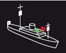|
|Correct Answer|Maschinenfahrzeug in Fahrt von 50 und mehr Meter Länge.|
|Wrong Answer 1|Maschinenfahrzeug in Fahrt von weniger als 50 m Länge.|
|Wrong Answer 2|Ein manövrierunfähiges Fahrzeug in Fahrt.|
|Wrong Answer 3|Ein manövrierbehindertes Fahrzeug mit Fahrt durchs Wasser von 50 und mehr Meter Länge.|

### 93. Card

|Attribut|Value|
|---|---|
|Id|9c6873ccaf9c4b2b57e80880a0413d62|
|Question|93. Welches Fahrzeug führt diese Lichter?|
|Image||
|Correct Answer|Manövrierbehinderter Schleppverband in Fahrt von 200 m Länge oder weniger.|
|Wrong Answer 1|Manövrierbehinderter Schleppverband in Fahrt von mehr als 200 m Länge.|
|Wrong Answer 2|Manövrierbehinderter Schleppverband in Fahrt von 200 m Länge oder weniger, ohne Fahrt durchs Wasser.|
|Wrong Answer 3|Ein manövrierbehindertes Fahrzeug mit Fahrt durchs Wasser von 50 und mehr Meter Länge.|

### 94. Card

|Attribut|Value|
|---|---|
|Id|c1f31130543e4f5fffca6514946656b7|
|Question|94. Welches Fahrzeug führt diese Lichter?|
|Image|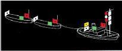|
|Correct Answer|Manövrierbehinderter Schleppverband in Fahrt von mehr als 200 m Länge.|
|Wrong Answer 1|Manövrierbehinderter Schleppverband in Fahrt von 200 m Länge oder weniger.|
|Wrong Answer 2|Manövrierbehinderter Schleppverband in Fahrt von mehr als 200 m Länge, ohne Fahrt durch das Wasser.|
|Wrong Answer 3|Ein manövrierbehindertes Fahrzeug, das baggert oder Unterwasserarbeiten ausführt und dabei die Schifffahrt behindert.|

### 95. Card

|Attribut|Value|
|---|---|
|Id|9d37bbe2b410f60dd0525ccacce43541|
|Question|95. Welche Lichter führen geschleppte Fahrzeuge?|
|Correct Answer|Seitenlichter rot und grün und ein weißes Hecklicht.|
|Wrong Answer 1|Seitenlichter rot und grün und ein weißes Rundumlicht.|
|Wrong Answer 2|Seitenlichter rot und grün und zwei rote Rundumlichter senkrecht übereinander.|
|Wrong Answer 3|Seitenlichter rot und grün und ein rotes Rundumlicht senkrecht über einem weißen Rundumlicht.|

### 96. Card

|Attribut|Value|
|---|---|
|Id|4e64ceb3d5f521f9761ed15997a365fd|
|Question|96. Was bedeutet es, wenn jedes Fahrzeug eines Schleppverbandes einen schwarzen Rhombus führt?|
|Correct Answer|Schleppverband von mehr als 200 m Länge.|
|Wrong Answer 1|Schleppverband von mehr als 100 m Länge.|
|Wrong Answer 2|Schleppverband von mehr als 50 m Länge.|
|Wrong Answer 3|Schleppverband von weniger als 50 m Länge.|

### 97. Card

|Attribut|Value|
|---|---|
|Id|668592225d65e6082e67f73cee39cddc|
|Question|97. Welches Fahrzeug führt diese Lichter?|
|Image||
|Correct Answer|Ein manövrierunfähiges Fahrzeug in Fahrt.|
|Wrong Answer 1|Ein manövrierbehindertes Fahrzeug in Fahrt.|
|Wrong Answer 2|Ein tiefgangbehindertes Fahrzeug in Fahrt.|
|Wrong Answer 3|Ein Grundsitzer von 50 und mehr Meter Länge.|

### 98. Card

|Attribut|Value|
|---|---|
|Id|5885201a5a7b5503ca6a3ab94b0873b8|
|Question|98. Welches Fahrzeug führt diese Lichter?|
|Image|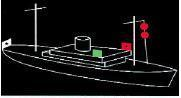|
|Correct Answer|Ein manövrierunfähiges Fahrzeug mit Fahrt durch das Wasser.|
|Wrong Answer 1|Ein manövrierbehindertes Fahrzeug mit Fahrt durch das Wasser von 50 und mehr Meter Länge.|
|Wrong Answer 2|Ein manövrierbehindertes Fahrzeug mit Fahrt durch das Wasser.|
|Wrong Answer 3|Ein fischender Trawler (Fischereifahrzeug) mit Fahrt durch das Wasser von 50 und mehr Meter Länge.|

### 99. Card

|Attribut|Value|
|---|---|
|Id|aeb9baf54a13e2e39e8e4eb0e89d4183|
|Question|99. Welches Fahrzeug führt diese Signalkörper?|
|Image|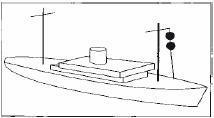|
|Correct Answer|Ein manövrierunfähiges Fahrzeug.|
|Wrong Answer 1|Ein manövrierbehindertes Fahrzeug in Fahrt.|
|Wrong Answer 2|Ein fischendes Fahrzeug in Fahrt.|
|Wrong Answer 3|Ein Grundsitzer von 50 und mehr Meter Länge.|

### 100. Card

|Attribut|Value|
|---|---|
|Id|5bec7a04a8fb6eb997467d4deb12547d|
|Question|100. Welche Lichter führen manövrierunfähige Fahrzeuge von 12 und mehr Meter Länge in Fahrt, ohne Fahrt durch das Wasser?|
|Correct Answer|Zwei rote Rundumlichter senkrecht übereinander.|
|Wrong Answer 1|Zwei rote Rundumlichter senkrecht übereinander und zusätzlich die Seitenlichter und das Hecklicht.|
|Wrong Answer 2|Drei rote Rundumlichter senkrecht übereinander.|
|Wrong Answer 3|Drei rote Rundumlichter senkrecht übereinander und zusätzlich die Seitenlichter und das Hecklicht.|

### 101. Card

|Attribut|Value|
|---|---|
|Id|1439604a8a6a524f310d4b1254e1f223|
|Question|101. Welche Lichter führen manövrierunfähige Fahrzeuge von 12 und mehr Meter Länge in Fahrt mit Fahrt durch das Wasser?|
|Correct Answer|Zwei rote Rundumlichter senkrecht übereinander und zusätzlich die Seitenlichter und das Hecklicht.|
|Wrong Answer 1|Zwei rote Rundumlichter senkrecht übereinander.|
|Wrong Answer 2|Drei rote Rundumlichter senkrecht übereinander.|
|Wrong Answer 3|Drei rote Rundumlichter senkrecht übereinander und zusätzlich die Seitenlichter und das Hecklicht.|

### 102. Card

|Attribut|Value|
|---|---|
|Id|edea2360a912b92146c12f9d38cbcc8a|
|Question|102. Welches Fahrzeug führt diese Lichter?|
|Image||
|Correct Answer|Ein manövrierbehindertes Fahrzeug in Fahrt.|
|Wrong Answer 1|Ein manövrierunfähiges Fahrzeug in Fahrt.|
|Wrong Answer 2|Ein fischendes Fahrzeug in Fahrt.|
|Wrong Answer 3|Ein Grundsitzer von weniger als 50 m Länge.|

### 103. Card

|Attribut|Value|
|---|---|
|Id|182dff73bd6a316534ef26823ab287e7|
|Question|103. Welches Fahrzeug muss diese Lichter führen?|
|Image||
|Correct Answer|Ein manövrierbehindertes Fahrzeug mit Fahrt durch das Wasser von 50 und mehr Meter Länge.|
|Wrong Answer 1|Ein manövrierunfähiges Fahrzeug mit Fahrt durch das Wasser von 50 und mehr Meter Länge.|
|Wrong Answer 2|Ein manövrierbehindertes Fahrzeug ohne Fahrt durch das Wasser von 50 und mehr Meter Länge.|
|Wrong Answer 3|Ein fischender Trawler (Fischereifahrzeug) mit Fahrt durch das Wasser von 50 und mehr Meter Länge.|

### 104. Card

|Attribut|Value|
|---|---|
|Id|4ffaea738f69902d9f5f51dab3a88c36|
|Question|104. Welches Fahrzeug führt diese Signalkörper?|
|Image|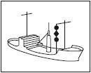|
|Correct Answer|Ein manövrierbehindertes Fahrzeug.|
|Wrong Answer 1|Ein manövrierunfähiges Fahrzeug in Fahrt.|
|Wrong Answer 2|Ein fischendes Fahrzeug in Fahrt.|
|Wrong Answer 3|Ein Grundsitzer von weniger als 50 m Länge.|

### 105. Card

|Attribut|Value|
|---|---|
|Id|45211193b5e696e010c52ff1058998a7|
|Question|105. Welches Fahrzeug führt diese Lichter?|
|Image||
|Correct Answer|Ein Grundsitzer von weniger als 50 m Länge.|
|Wrong Answer 1|Ein manövrierbehindertes Fahrzeug.|
|Wrong Answer 2|Ein manövrierunfähiges Fahrzeug in Fahrt.|
|Wrong Answer 3|Ein Grundsitzer von 50 m und mehr Meter Länge.|

### 106. Card

|Attribut|Value|
|---|---|
|Id|034c86f7c168b1c4906d50369510145b|
|Question|106. Welches Fahrzeug führt diese Signalkörper?|
|Image||
|Correct Answer|Ein Grundsitzer.|
|Wrong Answer 1|Ein manövrierunfähiges Fahrzeug.|
|Wrong Answer 2|Ein manövrierbehindertes Fahrzeug.|
|Wrong Answer 3|Ein fischendes Fahrzeug.|

### 107. Card

|Attribut|Value|
|---|---|
|Id|9895a886cea947a589f564d87e6da3cd|
|Question|107. Welches Fahrzeug führt diese Lichter?|
|Image||
|Correct Answer|Ein Grundsitzer von 50 und mehr Meter Länge.|
|Wrong Answer 1|Ein manövrierbehindertes Fahrzeug.|
|Wrong Answer 2|Ein manövrierunfähiges Fahrzeug in Fahrt.|
|Wrong Answer 3|Ein Grundsitzer von weniger als 50 m Länge.|

### 108. Card

|Attribut|Value|
|---|---|
|Id|369e0ec9ee11c7994b0a18f0c8780196|
|Question|108. Welches Fahrzeug muss diese Lichter führen?|
|Image|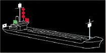|
|Correct Answer|Ein tiefgangbehindertes Fahrzeug von 50 und mehr Meter Länge in Fahrt.|
|Wrong Answer 1|Ein manövrierbehindertes Fahrzeug.|
|Wrong Answer 2|Ein manövrierunfähiges Fahrzeug.|
|Wrong Answer 3|Ein Grundsitzer von weniger als 50 m Länge.|

### 109. Card

|Attribut|Value|
|---|---|
|Id|6e1e325289c0f2e92c9f949d63f06552|
|Question|109. Welches Fahrzeug führt diese Signalkörper?|
|Image|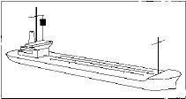|
|Correct Answer|Ein tiefgangbehindertes Fahrzeug in Fahrt.|
|Wrong Answer 1|Ein manövrierbehindertes Fahrzeug in Fahrt.|
|Wrong Answer 2|Ein manövrierunfähiges Fahrzeug in Fahrt.|
|Wrong Answer 3|Ein Grundsitzer von weniger als 50 Meter Länge.|

### 110. Card

|Attribut|Value|
|---|---|
|Id|7d593b003c5ac0d745af763e4f189f8a|
|Question|110. Welches Fahrzeug muss diese Lichter führen?|
|Image||
|Correct Answer|Ein fischender Trawler (Fischereifahrzeug) mit Fahrt durch das Wasser von 50 und mehr Meter Länge.|
|Wrong Answer 1|Ein fischendes Fahrzeug in Fahrt, das nicht trawlt, z. B. Treibnetzfischer.|
|Wrong Answer 2|Ein Behördenfahrzeug im Einsatz.|
|Wrong Answer 3|Ein manövrierbehindertes Fahrzeug in Fahrt.|

### 111. Card

|Attribut|Value|
|---|---|
|Id|a52745163c14f161016cf6a5075a3190|
|Question|111. Welches Fahrzeug führt diese Lichter?|
|Image||
|Correct Answer|Ein fischendes Fahrzeug in Fahrt oder vor Anker, das nicht trawlt, z. B. Treibnetzfischer.|
|Wrong Answer 1|Ein Lotsenfahrzeug im Einsatz.|
|Wrong Answer 2|Ein manövrierbehindertes Fahrzeug in Fahrt.|
|Wrong Answer 3|Ein fischender Trawler (Fischereifahrzeug) mit Fahrt durchs Wasser von 50 und mehr Meter Länge.|

### 112. Card

|Attribut|Value|
|---|---|
|Id|4e5a07a7c91c2dac047267af0b53a477|
|Question|112. Welches Fahrzeug führt diese Signalkörper?|
|Image||
|Correct Answer|Ein fischendes Fahrzeug in Fahrt oder vor Anker.|
|Wrong Answer 1|Ein manövrierbehindertes Fahrzeug.|
|Wrong Answer 2|Ein manövrierunfähiges Fahrzeug in Fahrt.|
|Wrong Answer 3|Ein Grundsitzer von weniger als 50 m Länge.|

### 113. Card

|Attribut|Value|
|---|---|
|Id|493d715af8912ae7434f119c7e8759bf|
|Question|113. Welche Fahrzeuge führen nur Seitenlichter rot und grün und ein weißes Hecklicht?|
|Correct Answer|Segelfahrzeuge, Ruderboote und geschleppte Fahrzeuge.|
|Wrong Answer 1|Segelfahrzeuge, Ruderboote und Maschinenfahrzeuge in Fahrt von weniger als 50 m Länge.|
|Wrong Answer 2|Segelfahrzeuge, fischende Fahrzeuge und geschleppte Fahrzeuge.|
|Wrong Answer 3|Segelfahrzeuge, Grundsitzer und geschleppte Fahrzeuge.|

### 114. Card

|Attribut|Value|
|---|---|
|Id|1a2649e94278647077e927c268ba2128|
|Question|114. Was für ein Licht muss ein Ankerlieger von weniger als 50 m Länge führen?|
|Correct Answer|Ein weißes Rundumlicht an gut sichtbarer Stelle.|
|Wrong Answer 1|Ein rotes Rundumlicht an gut sichtbarer Stelle.|
|Wrong Answer 2|Zwei weiße Rundumlichter an gut sichtbarer Stelle.|
|Wrong Answer 3|Zwei rote Rundumlichter an gut sichtbarer Stelle.|

### 115. Card

|Attribut|Value|
|---|---|
|Id|ea141bd9fde870e9004d78623618c76f|
|Question|115. Welches Fahrzeug muss diese Lichter führen?|
|Image|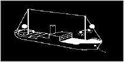|
|Correct Answer|Ein vor Anker liegendes Fahrzeug von 100 und mehr Meter Länge.|
|Wrong Answer 1|Ein fischender Trawler (Fischereifahrzeug) mit Fahrt durchs Wasser von 50 und mehr Meter Länge.|
|Wrong Answer 2|Ein manövrierbehindertes Fahrzeug, das baggert oder Unterwasserarbeiten ausführt und dabei die Schifffahrt behindert.|
|Wrong Answer 3|Ein Grundsitzer von 200 und mehr Meter Länge.|

### 116. Card

|Attribut|Value|
|---|---|
|Id|1fff652a02f0ca6faf9b17573408f70a|
|Question|116. Sie hören bei verminderter Sicht mindestens alle zwei Minuten einen langen Ton mit der Pfeife (		 	). Welches Fahrzeug gibt dieses Signal?|
|Image||
|Correct Answer|Ein Maschinenfahrzeug, das Fahrt durchs Wasser macht.|
|Wrong Answer 1|Ein geschlepptes Fahrzeug oder das letzte bemannte Fahrzeug eines Schleppverbandes in Fahrt.|
|Wrong Answer 2|Ein Fahrzeug mit gefährlicher Ladung vor Anker von weniger als 100 m Länge.|
|Wrong Answer 3|Ein vor Anker liegendes Fahrzeug von 100 und mehr Meter Länge.|

### 117. Card

|Attribut|Value|
|---|---|
|Id|6c3d72452e0ec62c4b59b2e4fceab558|
|Question|117. Sie hören bei verminderter Sicht mindestens alle zwei Minuten zwei aufeinander folgende lange Töne mit der Pfeife (		 	). Welches Fahrzeug gibt dieses Signal?|
|Image||
|Correct Answer|Ein Maschinenfahrzeug in Fahrt, das seine Maschine gestoppt hat und keine Fahrt durchs Wasser macht.|
|Wrong Answer 1|Ein geschlepptes Fahrzeug oder das letzte bemannte Fahrzeug eines Schleppverbandes in Fahrt.|
|Wrong Answer 2|Ein Fahrzeug mit gefährlicher Ladung vor Anker von weniger als 100 m Länge.|
|Wrong Answer 3|Ein vor Anker liegendes Fahrzeug von 100 und mehr Meter Länge.|

### 118. Card

|Attribut|Value|
|---|---|
|Id|efa18e3bedba1ee68e500e2a1d40d897|
|Question|118. Welche Fahrzeuge geben bei verminderter Sicht mindestens alle zwei Minuten drei aufeinander folgende Töne mit der Pfeife, und zwar lang, kurz, kurz 		 	?|
|Image|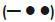|
|Correct Answer|Ein manövrierunfähiges Fahrzeug in Fahrt, ein manövrierbehindertes Fahrzeug in Fahrt oder vor Anker, ein tiefgangbehindertes Fahrzeug in Fahrt, ein Segelfahrzeug in Fahrt, ein schleppendes oder schiebendes Fahrzeug in Fahrt, ein fischendes Fahrzeug in Fahrt oder vor Anker.|
|Wrong Answer 1|Ein manövrierunfähiges Fahrzeug in Fahrt, ein manövrierbehindertes Fahrzeug in Fahrt oder vor Anker, ein tiefgangbehindertes Fahrzeug in Fahrt, ein Maschinenfahrzeug in Fahrt, das Fahrt durchs Wasser macht, ein schleppendes oder schiebendes Fahrzeug in Fahrt, ein fischendes Fahrzeug in Fahrt oder vor Anker.|
|Wrong Answer 2|Ein manövrierunfähiges Fahrzeug in Fahrt, ein manövrierbehindertes Fahrzeug in Fahrt oder vor Anker, ein tiefgangbehindertes Fahrzeug in Fahrt, ein Segelfahrzeug in Fahrt, ein schleppendes oder schiebendes Fahrzeug in Fahrt, ein fischendes Fahrzeug in Fahrt oder vor Anker, ein Maschinenfahrzeug in Fahrt, das seine Maschine gestoppt hat und keine Fahrt durchs Wasser macht.|
|Wrong Answer 3|Ein manövrierunfähiges Fahrzeug in Fahrt, ein manövrierbehindertes Fahrzeug in Fahrt oder vor Anker, ein tiefgangbehindertes Fahrzeug in Fahrt, ein Segelfahrzeug in Fahrt, ein schleppendes oder schiebendes Fahrzeug in Fahrt, ein geschlepptes Fahrzeug oder das letzte bemannte Fahrzeug eines Schleppverbandes in Fahrt, ein fischendes Fahrzeug in Fahrt oder vor Anker.|

### 119. Card

|Attribut|Value|
|---|---|
|Id|59cac796b3a521b10842c3b6253b00b4|
|Question|119. Welches Fahrzeug gibt bei verminderter Sicht - im Anschluss an das Signal: lang, kurz, kurz 		 	 - vier aufeinander folgende Töne mit der Pfeife, und zwar: lang, kurz, kurz, kurz 		 	?|
|Image||
|Correct Answer|Ein geschlepptes Fahrzeug oder das letzte bemannte Fahrzeug eines Schleppverbandes in Fahrt.|
|Wrong Answer 1|Ein Maschinenfahrzeug in Fahrt, das seine Maschine gestoppt hat und keine Fahrt durchs Wasser macht.|
|Wrong Answer 2|Ein Fahrzeug mit gefährlicher Ladung vor Anker von weniger als 100 m Länge.|
|Wrong Answer 3|Ein manövrierunfähiges Fahrzeug von weniger als 100 m Länge.|

### 120. Card

|Attribut|Value|
|---|---|
|Id|892a7d001b70726aafe1075acb5c8bcf|
|Question|120. Was für ein Schallsignal muss ein Segelfahrzeug in Fahrt von 12 und mehr Meter Länge bei verminderter Sicht geben?|
|Correct Answer|Mindestens alle zwei Minuten drei aufeinander folgende Töne mit der Pfeife, und zwar lang, kurz, kurz|
|Wrong Answer 1|Mindestens alle zwei Minuten drei aufeinander folgende Töne mit der Pfeife, und zwar lang, lang, kurz|
|Wrong Answer 2|Mindestens alle zwei Minuten ein kräftiges Schallsignal, das mit den vorgeschriebenen nicht verwechselt werden kann.|
|Wrong Answer 3|Mit der Pfeife kurz, lang, kurz|

### 121. Card

|Attribut|Value|
|---|---|
|Id|c4c34de26b50fdd654f9cdcf5c1ce7a0|
|Question|121. Welches Schallsignal muss ein Fahrzeug in Fahrt von weniger als 12 m Länge bei verminderter Sicht geben, wenn es die sonst vorgeschriebenen Schallsignale nicht geben kann?|
|Correct Answer|Mindestens alle zwei Minuten ein kräftiges Schallsignal, das mit den vorgeschriebenen nicht verwechselt werden kann.|
|Wrong Answer 1|Mindestens alle zwei Minuten drei aufeinander folgende Töne mit der Pfeife, und zwar lang, kurz, kurz|
|Wrong Answer 2|Mindestens alle zwei Minuten drei aufeinander folgende Töne mit der Pfeife, und zwar lang, lang, kurz|
|Wrong Answer 3|Mit der Pfeife kurz, lang, kurz|

### 122. Card

|Attribut|Value|
|---|---|
|Id|0ba4ebf08a43c567ec143930499d5800|
|Question|122. Welches Fahrzeug gibt bei verminderter Sicht mindestens jede Minute etwa 5 Sekunden lang rasches Läuten der Glocke?|
|Image|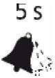|
|Correct Answer|Ein Fahrzeug vor Anker von weniger als 100 m Länge.|
|Wrong Answer 1|Ein Fahrzeug vor Anker von 100 und mehr Meter Länge.|
|Wrong Answer 2|Ein geschlepptes Fahrzeug oder das letzte bemannte Fahrzeug eines Schleppverbandes in Fahrt.|
|Wrong Answer 3|Ein Maschinenfahrzeug in Fahrt, das seine Maschine gestoppt hat und keine Fahrt durchs Wasser macht.|

### 123. Card

|Attribut|Value|
|---|---|
|Id|b49cf73bd60090667de427b68ffe4fb4|
|Question|123. Welches Fahrzeug gibt bei verminderter Sicht mindestens jede Minute etwa 5 Sekunden lang rasches Läuten der Glocke und unmittelbar danach ungefähr 5 Sekunden lang rasch den Gong schlagen?|
|Image||
|Correct Answer|Ein Fahrzeug vor Anker von 100 und mehr Meter Länge.|
|Wrong Answer 1|Ein Fahrzeug vor Anker von weniger als 100 m Länge.|
|Wrong Answer 2|Ein geschlepptes Fahrzeug oder das letzte bemannte Fahrzeug eines Schleppverbandes in Fahrt.|
|Wrong Answer 3|Ein Maschinenfahrzeug in Fahrt, das seine Maschine gestoppt hat und keine Fahrt durchs Wasser macht.|

### 124. Card

|Attribut|Value|
|---|---|
|Id|f16a1b9ceb40a58224f32bcc6a7fb6a4|
|Question|124. Welches zusätzliche Schallsignal darf jeder Ankerlieger bei verminderter Sicht geben, um einem sich nähernden Fahrzeug seinen Standort anzuzeigen?|
|Correct Answer|Mit der Pfeife kurz, lang, kurz|
|Wrong Answer 1|Mindestens alle zwei Minuten ein kräftiges Schallsignal, das mit den vorgeschriebenen nicht verwechselt werden kann.|
|Wrong Answer 2|Mindestens alle zwei Minuten drei aufeinander folgende Töne mit der Pfeife, und zwar lang, kurz, kurz|
|Wrong Answer 3|Mindestens alle zwei Minuten drei aufeinander folgende Töne mit der Pfeife, und zwar lang, lang, kurz|

### 125. Card

|Attribut|Value|
|---|---|
|Id|ef1f526c3957b9b5cf786ae7887c787b|
|Question|125. Woran kann man feststellen, ob die Möglichkeit der Gefahr eines Zusammenstoßes besteht?|
|Correct Answer|Wenn sich der Abstand zum anderen Fahrzeug verringert und sich die Peilung nicht oder nicht merklich ändert.|
|Wrong Answer 1|Wenn sich der Abstand zum anderen Fahrzeug verringert und sich der Kurs nicht oder nicht merklich ändert.|
|Wrong Answer 2|Wenn sich der Abstand zum anderen Fahrzeug verringert und sich die Kompasspeilung ändert.|
|Wrong Answer 3|Wenn sich der Abstand zum anderen Fahrzeug verringert und sich der Kurs ändert.|

### 126. Card

|Attribut|Value|
|---|---|
|Id|c55475f7658172652c649f0409465ed2|
|Question|126. Zwei in Sicht befindliche Segelfahrzeuge nähern sich im freien Seeraum oder außerhalb des Fahrwassers so, dass die Möglichkeit der Gefahr eines Zusammenstoßes besteht. Welches Fahrzeug muss dem anderen ausweichen, wenn sie den Wind von derselben Seite haben?|
|Correct Answer|Das luvwärtige Fahrzeug dem leewärtigen Fahrzeug.|
|Wrong Answer 1|Das leewärtige Fahrzeug dem luvwärtigen Fahrzeug.|
|Wrong Answer 2|Dasjenige Fahrzeug, das den Wind von Backbord hat.|
|Wrong Answer 3|Dasjenige Fahrzeug, das den Wind von Steuerbord hat.|

### 127. Card

|Attribut|Value|
|---|---|
|Id|eb1ecb422c4cfc7144f2702beaacde3c|
|Question|127. Wie müssen sich zwei in Sicht befindliche Maschinenfahrzeuge verhalten, die sich einander auf entgegengesetzten oder fast entgegengesetzten Kursen nähern, um die Möglichkeit der Gefahr eines Zusammenstoßes zu vermeiden?|
|Correct Answer|Jedes Fahrzeug muss seinen Kurs nach Steuerbord ändern.|
|Wrong Answer 1|Jedes Fahrzeug muss seinen Kurs nach Backbord ändern.|
|Wrong Answer 2|Es muss das luvwärtige Fahrzeug dem leewärtigen Fahrzeug ausweichen.|
|Wrong Answer 3|Es muss das leewärtige Fahrzeug dem luvwärtigen Fahrzeug ausweichen.|

### 128. Card

|Attribut|Value|
|---|---|
|Id|5fd91c66ee8d7bd1bd3f6a03f7db5562|
|Question|128. Wie hat sich ein Maschinenfahrzeug im freien Seeraum oder außerhalb des Fahrwassers gegenüber einem in Sicht befindlichen Segelfahrzeug zu verhalten, wenn die Möglichkeit der Gefahr eines Zusammenstoßes besteht?|
|Correct Answer|Das Maschinenfahrzeug muss ausweichen.|
|Wrong Answer 1|Das Maschinenfahrzeug muss Kurs und Geschwindigkeit beibehalten.|
|Wrong Answer 2|Das Maschinenfahrzeug muss seine Fahrt verringern.|
|Wrong Answer 3|Das Maschinenfahrzeug muss vorsichtig manövrieren bis die Gefahr vorüber ist.|

### 129. Card

|Attribut|Value|
|---|---|
|Id|a2de7cc1e8dda3d031c7a59e7a01eb3a|
|Question|129. Wie hat sich ein Maschinenfahrzeug im freien Seeraum oder außerhalb des Fahrwassers gegenüber einem in Sicht befindlichen manövrierunfähigen Fahrzeug zu verhalten, wenn die Möglichkeit der Gefahr eines Zusammenstoßes besteht?|
|Correct Answer|Das Maschinenfahrzeug muss ausweichen.|
|Wrong Answer 1|Das Maschinenfahrzeug muss Kurs und Geschwindigkeit beibehalten.|
|Wrong Answer 2|Das Maschinenfahrzeug muss seinen Kurs nach Steuerbord ändern.|
|Wrong Answer 3|Das Maschinenfahrzeug muss seine Fahrt verringern.|

### 130. Card

|Attribut|Value|
|---|---|
|Id|a74941ea7a4762a682dd987d1c05e36a|
|Question|130. Wie hat sich ein Maschinenfahrzeug im freien Seeraum oder außerhalb des Fahrwassers gegenüber einem in Sicht befindlichen manövrierbehinderten Fahrzeug zu verhalten, wenn die Möglichkeit der Gefahr eines Zusammenstoßes besteht?|
|Correct Answer|Das Maschinenfahrzeug muss ausweichen.|
|Wrong Answer 1|Das Maschinenfahrzeug muss Kurs und Geschwindigkeit beibehalten.|
|Wrong Answer 2|Das Maschinenfahrzeug muss seinen Kurs nach Steuerbord ändern.|
|Wrong Answer 3|Das Maschinenfahrzeug muss seine Fahrt verringern.|

### 131. Card

|Attribut|Value|
|---|---|
|Id|75921c8fcb7c61c9b8c593e132b9407a|
|Question|131. Wie hat sich ein Maschinenfahrzeug im freien Seeraum oder außerhalb des Fahrwassers gegenüber einem in Sicht befindlichen fischenden Fahrzeug zu verhalten, wenn die Möglichkeit der Gefahr eines Zusammenstoßes besteht?|
|Correct Answer|Das Maschinenfahrzeug muss ausweichen.|
|Wrong Answer 1|Das Maschinenfahrzeug muss Kurs und Geschwindigkeit beibehalten.|
|Wrong Answer 2|Das Maschinenfahrzeug muss seinen Kurs nach Steuerbord ändern.|
|Wrong Answer 3|Das Maschinenfahrzeug muss vorsichtig manövrieren, bis die Gefahr vorüber ist.|

### 132. Card

|Attribut|Value|
|---|---|
|Id|cabd06a5979e35d130f3d546934a6724|
|Question|132. Wie hat sich ein Segelfahrzeug im freien Seeraum oder außerhalb des Fahrwassers gegenüber einem in Sicht befindlichen fischenden Fahrzeug zu verhalten, wenn die Möglichkeit der Gefahr eines Zusammenstoßes besteht?|
|Correct Answer|Das Segelfahrzeug muss ausweichen.|
|Wrong Answer 1|Das Segelfahrzeug muss seinen Kurs nach Steuerbord ändern.|
|Wrong Answer 2|Das Segelfahrzeug darf die sichere Durchfahrt nicht behindern.|
|Wrong Answer 3|Das Segelfahrzeug muss Kurs und Geschwindigkeit zunächst beibehalten.|

### 133. Card

|Attribut|Value|
|---|---|
|Id|1df74849a09acf5bc20f1ec307df6838|
|Question|133. Wie muss man sich gegenüber diesem Fahrzeug verhalten?|
|Image||
|Correct Answer|Die sichere Durchfahrt des Fahrzeugs darf nicht behindert werden.|
|Wrong Answer 1|Das Fahrzeug muss an Steuerbord passiert werden.|
|Wrong Answer 2|Sog und Wellenschlag vermeiden.|
|Wrong Answer 3|Kurs und Geschwindigkeit beibehalten.|

### 134. Card

|Attribut|Value|
|---|---|
|Id|0683b1ab36c053976e99e6d8ed10aa06|
|Question|134. Wie muss man sich gegenüber diesem Fahrzeug verhalten?|
|Image|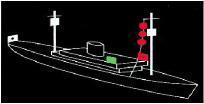|
|Correct Answer|Die sichere Durchfahrt des Fahrzeugs darf nicht behindert werden.|
|Wrong Answer 1|Das Fahrzeug muss an Steuerbord passiert werden.|
|Wrong Answer 2|Sog und Wellenschlag vermeiden.|
|Wrong Answer 3|Kurs und Geschwindigkeit beibehalten.|

### 135. Card

|Attribut|Value|
|---|---|
|Id|bdd0c2a100eff6a9e6b0a49f3dd439e9|
|Question|135. Wie verhält sich der Kurshaltepflichtige vor Einleitung des Manövers des letzten Augenblicks gegenüber einem ausweichpflichtigen Fahrzeug?|
|Correct Answer|Kurs und Geschwindigkeit zunächst beibehalten und dem Ausweichpflichtigen besondere Aufmerksamkeit widmen.|
|Wrong Answer 1|Kurs oder Geschwindigkeit anpassen und dem Ausweichpflichtigen besondere Aufmerksamkeit widmen.|
|Wrong Answer 2|Kurs nach Steuerbord ändern. Geschwindigkeit verringern und dem Ausweichpflichtigen besondere Aufmerksamkeit widmen.|
|Wrong Answer 3|Kurs nach Steuerbord ändern, Geschwindigkeit zunächst beibehalten und dem Ausweichpflichtigen besondere Aufmerksamkeit widmen.|

### 136. Card

|Attribut|Value|
|---|---|
|Id|a19c42e8771a011eea0e601092f162ab|
|Question|136. Wie muss sich ein Ausweichpflichtiger gegenüber einem Kurshalter verhalten?|
|Correct Answer|Das Ausweichmanöver muss frühzeitig, durchgreifend und klar erkennbar durchgeführt werden.|
|Wrong Answer 1|Der Kurs muss bei Annäherung an den Kurshalter Schritt für Schritt so angepasst werden, dass das Heck des Anderen sicher umfahren wird.|
|Wrong Answer 2|Das Manöver des letzten Augenblicks ist durchzuführen. Es muss so ausgewichen werden, wie es zur Vermeidung eines Zusammenstoßes am dienlichsten ist.|
|Wrong Answer 3|Die Fahrt ist auf das für die Steuerfähigkeit erforderliche Mindestmaß zu reduzieren; im Zweifelsfall muss ganz aufgestoppt werden.|

### 137. Card

|Attribut|Value|
|---|---|
|Id|265b22aa8c92d12567271f1949290b04|
|Question|137. Wie hat sich ein überholendes Fahrzeug zu verhalten?|
|Correct Answer|Es hat dem zu überholenden Fahrzeug auszuweichen.|
|Wrong Answer 1|Es muss den größtmöglichen Abstand zum überholten Fahrzeug einhalten und Sog und Wellenschlag vermeiden.|
|Wrong Answer 2|Es darf die sichere Durchfahrt des zu überholenden Fahrzeugs nicht behindern.|
|Wrong Answer 3|Es muss vor dem Überholen ein Schallsignal abgeben, um die Zustimmung des zu überholenden Fahrzeugs einzuholen.|

### 138. Card

|Attribut|Value|
|---|---|
|Id|755df935f1444e3d6b08cc270de5d92c|
|Question|138. Wie hat man sich zu verhalten, wenn man bei verminderter Sicht anscheinend vorlicher als querab das Schallsignal eines anderen Fahrzeugs hört?|
|Correct Answer|Es ist ebenfalls ein Schallsignal abzugeben und die Fahrt soweit zu verlangsamen, dass die Steuerfähigkeit noch erhalten bleibt. Erforderlichenfalls ist ganz aufzustoppen. In jedem Fall ist vorsichtig zu manövrieren, bis die Gefahr eines Zusammenstoßes vorüber ist.|
|Wrong Answer 1|Es ist ebenfalls ein Schallsignal abzugeben und frühzeitig, durchgreifend und klar erkennbar auszuweichen.|
|Wrong Answer 2|Es sind mindestens fünf kurze Töne mit der Pfeife abzugeben und das Manöver des letzten Augenblicks durchzuführen. Dabei ist so zu manövrieren, wie es zur Vermeidung eines Zusammenstoßes am dienlichsten ist.|
|Wrong Answer 3|Es ist ebenfalls ein Schallsignal abzugeben. Kurs und Geschwindigkeit sind so lange beizubehalten, bis das andere Fahrzeug in Sicht kommt. Dann ist die Ausweichsituation nach KVR zu prüfen und man muss sich entsprechend verhalten.|

### 139. Card

|Attribut|Value|
|---|---|
|Id|c20af8eeb792281941c7cd1625602dc4|
|Question|139. Wie verhält man sich als Kurshalter, wenn man feststellt, dass ein anderes Fahrzeug seiner Ausweichpflicht nicht nachkommt und die Gefahr einer unmittelbaren Kollision bevorsteht?|
|Correct Answer|Man gibt mindestens fünf kurze Töne mit der Pfeife ab und führt das "Manöver des letzten Augenblicks" durch. Dabei ist so zu manövrieren, wie es zur Vermeidung eines Zusammenstoßes am dienlichsten ist.|
|Wrong Answer 1|Man gibt ein Schallsignal (vier kurze Töne) ab und verlangsamt die Fahrt soweit, dass die Steuerfähigkeit noch erhalten bleibt. Erforderlichenfalls ist ganz aufzustoppen. In jedem Fall ist vorsichtig zu manövrieren, bis die Gefahr eines Zusammenstoßes vorüber ist.|
|Wrong Answer 2|Man gibt mindestens fünf kurze Töne mit der Pfeife ab und reduziert die Geschwindigkeit, um Sog und Wellenschlag zu vermeiden.|
|Wrong Answer 3|Man behält Kurs und Geschwindigkeit zunächst bei und widmet dem Ausweichpflichtigen besondere Aufmerksamkeit.|

### 140. Card

|Attribut|Value|
|---|---|
|Id|a438b194cf845ba319a13fabce80093a|
|Question|140. Welche Bedeutung hat folgendes Schallsignal?	(mindestens 		 	)|
|Image||
|Correct Answer|Ein ausweichpflichtiges Fahrzeug wird auf seine Ausweichpflicht aufmerksam gemacht.|
|Wrong Answer 1|Allgemeines Gefahren- und Warnsignal.|
|Wrong Answer 2|Bleib-Weg-Signal, Explosionsgefahr durch gefährliche Güter. Sofort den Gefahrenbereich verlassen. Feuer und Zündfunken vermeiden.|
|Wrong Answer 3|Seeschifffahrtsstraße gesperrt. Weiterfahrt verboten, sofort aufstoppen.|

### 141. Card

|Attribut|Value|
|---|---|
|Id|29395035145d17ade1047e530de7fa4d|
|Question|141. Welche Bedeutung hat folgendes Schallsignal?|
|Image||
|Correct Answer|Ein Ankerlieger macht ein sich näherndes Fahrzeug auf eine gefährliche Annäherung aufmerksam.|
|Wrong Answer 1|Die Maschine des Fahrzeugs läuft rückwärts.|
|Wrong Answer 2|Schutzbedürftige Anlage; Geschwindigkeit reduzieren, Sog und Wellenschlag vermeiden.|
|Wrong Answer 3|Maschinenfahrzeug, das seine Maschinen gestoppt hat und keine Fahrt durchs Wasser macht.|

### 142. Card

|Attribut|Value|
|---|---|
|Id|c631edd7ed91a9cbe5b454cc90031fd7|
|Question|142. Was ist bei der Benutzung eines Verkehrstrennungsgebietes zu beachten?|
|Correct Answer|Auf dem entsprechenden Einbahnweg in der allgemeinen Verkehrsrichtung fahren, soweit wie möglich von der Trennzone/Trennlinie klar halten, in der Regel an den Enden des Einbahnweges ein- oder auslaufen, seitliches Ein- oder Auslaufen in möglichst kleinem Winkel zur allgemeinen Verkehrsrichtung.|
|Wrong Answer 1|Auf dem entsprechenden Einbahnweg in Verkehrsrichtung links von der Trennzone fahren, so nah wie möglich an der Trennzone/Trennlinie fahren, in der Regel an den Enden des Einbahnweges ein- oder auslaufen, seitliches Ein- oder Auslaufen in möglichst rechtem Winkel zur allgemeinen Verkehrsrichtung.|
|Wrong Answer 2|Die Benutzung von Verkehrstrennungsgebieten ist für Segelfahrzeuge sowie für Maschinenfahrzeuge unter 20 m Länge nicht gestattet. Diese Fahrzeuge haben sich soweit wie möglich von Verkehrstrennungsgebieten klar zu halten und müssen durch ihren Kurs klar zu erkennen geben, dass sie ein Verkehrstrennungsgebiet nicht benutzen.|
|Wrong Answer 3|Auf den entsprechenden Einbahnwegen in der allgemeinen Verkehrsrichtung fahrende Fahrzeuge müssen sich soweit wie möglich von der Trennzone/Trennlinie klar halten und haben Vorfahrt gegenüber allen Fahrzeugen, die in ein Verkehrstrennungsgebiet einlaufen oder ein solches queren.|

### 143. Card

|Attribut|Value|
|---|---|
|Id|f8b8cf7e4418fdc26246a95e57cb9a89|
|Question|143. Was ist hinsichtlich des Querens eines Verkehrstrennungsgebietes zu beachten?|
|Correct Answer|Das Queren ist möglichst zu vermeiden. Falls gequert werden muss, hat dies möglichst mit der Kielrichtung im rechten Winkel zur allgemeinen Verkehrsrichtung zu erfolgen. Die Kielrichtung des querenden Fahrzeugs muss auch dann einen rechten Winkel zur allgemeinen Verkehrsrichtung bilden, wenn das Fahrzeug durch Wind oder Strom versetzt wird.|
|Wrong Answer 1|Das Queren ist möglichst zu vermeiden. Falls gequert werden muss, hat dies möglichst mit einem rechtweisenden Kurs zur allgemeinen Verkehrsrichtung zu erfolgen. Der rechtweisende Kurs des querenden Fahrzeugs muss auch dann einen rechten Winkel zur allgemeinen Verkehrsrichtung bilden, wenn das Fahrzeug durch Wind oder Strom versetzt wird.|
|Wrong Answer 2|Das Queren von Verkehrstrennungsgebieten ist für Segelfahrzeuge sowie für Maschinenfahrzeuge unter 20 m Länge verboten. Diese Fahrzeuge haben sich soweit wie möglich von den Enden der Verkehrstrennungsgebiete klar zu halten und müssen durch ihren Kurs zu erkennen geben, dass sie ein Verkehrstrennungsgebiet nicht queren.|
|Wrong Answer 3|Das Queren ist möglichst zu vermeiden. Falls gequert werden muss, hat dies mit der Kielrichtung in einem möglichst spitzen Winkel zur allgemeinen Verkehrsrichtung zu erfolgen. Die Kielrichtung des querenden Fahrzeugs muss auch dann einen möglichst spitzen Winkel zur allgemeinen Verkehrsrichtung bilden, wenn das Fahrzeug durch Wind oder Strom versetzt wird.|

### 144. Card

|Attribut|Value|
|---|---|
|Id|4c39422d12f23489b534a6590800dddf|
|Question|144. In welcher Vorschrift findet man die Regeln zum Befahren von Verkehrstrennungsgebieten?|
|Correct Answer|In den Kollisionsverhütungsregeln.|
|Wrong Answer 1|In der Seeschifffahrtsstraßen-Ordnung.|
|Wrong Answer 2|In den Kollisionsverhütungsregeln und der Seeschifffahrtsstraßen-Ordnung.|
|Wrong Answer 3|In den "Bekanntmachungen der Generaldirektion Wasserstraßen und Schifffahrt (GDWS)".|

### 145. Card

|Attribut|Value|
|---|---|
|Id|bde93be19df8565656c5189caa9db125|
|Question|145. Wie hat sich ein Maschinenfahrzeug bei Kollisionsgefahr in einem Einbahnweg eines Verkehrstrennungsgebietes gegenüber einem Maschinenfahrzeug zu verhalten, das den Einbahnweg von Steuerbord kommend quert?|
|Correct Answer|Es muss dem anderen Fahrzeug ausweichen.|
|Wrong Answer 1|Es darf die sichere Durchfahrt des Maschinenfahrzeugs nicht behindern.|
|Wrong Answer 2|Dem querenden Fahrzeug hat es besondere Aufmerksamkeit zu widmen.|
|Wrong Answer 3|Es muss das Manöver des letzten Augenblicks durchführen.|

### 146. Card

|Attribut|Value|
|---|---|
|Id|1fb6b1285b5944f503fd059acd1ba887|
|Question|146. Wie hat sich ein Segelfahrzeug beim Queren eines Verkehrstrennungsgebietes gegenüber einem Maschinenfahrzeug zu verhalten, das auf einem Einbahnweg in der allgemeinen Verkehrsrichtung fährt?|
|Correct Answer|Es darf die sichere Durchfahrt des Maschinenfahrzeugs nicht behindern.|
|Wrong Answer 1|Es unterliegt der Kurshaltepflicht. Kurs und Geschwindigkeit sind beizubehalten.|
|Wrong Answer 2|Es muss warten. Alle dem Einbahnweg folgenden Fahrzeuge haben Vorfahrt.|
|Wrong Answer 3|Es hat Vorfahrt. Alle dem Einbahnweg folgenden Fahrzeuge müssen warten.|

### 147. Card

|Attribut|Value|
|---|---|
|Id|92f13e7fe65f1e4baf06a4060b8eca00|
|Question|147. Wie haben sich Fahrzeuge von weniger als 20 m Länge oder Segelfahrzeuge in Verkehrstrennungsgebieten zu verhalten?|
|Correct Answer|Sie dürfen die sichere Durchfahrt eines dem Einbahnweg folgenden Maschinenfahrzeugs nicht behindern.|
|Wrong Answer 1|Sie gelten als Kleinfahrzeuge und dürfen Verkehrstrennungsgebiete nicht befahren.|
|Wrong Answer 2|Sie gelten als Kleinfahrzeuge und dürfen Verkehrstrennungsgebiete nur am Tage und bei guter Sicht befahren.|
|Wrong Answer 3|Sie dürfen die Trennzone befahren, damit der durchgehende Verkehr nicht behindert wird.|

### 148. Card

|Attribut|Value|
|---|---|
|Id|e30de245d963a9d9371529d6edd4c216|
|Question|148. Was ist das für ein Fahrzeug und was ist zu beachten?|
|Image||
|Correct Answer|Ein manövrierbehindertes Fahrzeug, das baggert oder Unterwasserarbeiten ausführt und dabei die Schifffahrt behindert. Es ist an der Seite zu passieren, an der zwei schwarze Rhomben senkrecht übereinander angeordnet sind.|
|Wrong Answer 1|Ein manövrierbehindertes Fahrzeug, das die Schifffahrt behindert. Es ist an der Seite zu passieren, an der zwei schwarze Bälle senkrecht übereinander angeordnet sind.|
|Wrong Answer 2|Ein manövrierbehindertes Fahrzeug, das baggert oder Unterwasserarbeiten ausführt und dabei die Schifffahrt behindert. Es ist an der Seite zu passieren, die in meiner Fahrtrichtung rechts liegt.|
|Wrong Answer 3|Ein manövrierbehindertes Fahrzeug, das baggert oder Unterwasserarbeiten ausführt und dabei die Schifffahrt behindert. Es darf an keiner Seite passiert werden.|

### 149. Card

|Attribut|Value|
|---|---|
|Id|0bcb38d9d617cb9431a8777587673e7c|
|Question|149. Was ist das für ein Fahrzeug und was ist zu beachten?|
|Image|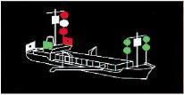|
|Correct Answer|Ein manövrierbehindertes Fahrzeug mit Fahrt durchs Wasser, das baggert oder Unterwasserarbeiten ausführt und dabei die Schifffahrt nicht behindert. Es ist an der Seite zu passieren, die in Fahrtrichtung rechts liegt.|
|Wrong Answer 1|Ein manövrierbehindertes Fahrzeug mit Fahrt durchs Wasser, das baggert oder Unterwasserarbeiten ausführt und dabei die Schifffahrt behindert. Es ist an der Seite zu passieren, die in Fahrtrichtung links liegt.|
|Wrong Answer 2|Ein manövrierunfähiges Fahrzeug mit Fahrt durchs Wasser, das baggert oder Unterwasserarbeiten ausführt und dabei die Schifffahrt behindert. Es ist an der Seite zu passieren, die in Fahrtrichtung rechts liegt.|
|Wrong Answer 3|Ein manövrierbehindertes Fahrzeug mit Fahrt durchs Wasser, das baggert oder Unterwasserarbeiten ausführt und dabei die Schifffahrt behindert. Es darf an beiden Seiten passiert werden.|

### 150. Card

|Attribut|Value|
|---|---|
|Id|09e768445a013da2cc2695f35c4b09ea|
|Question|150. Was ist das für ein Fahrzeug und was ist zu beachten?|
|Image||
|Correct Answer|Ein manövrierbehindertes Fahrzeug ohne Fahrt durchs Wasser, das baggert oder Unterwasserarbeiten ausführt und dabei die Schifffahrt behindert. Es ist an der Seite zu passieren, an der zwei grüne Rundumlichter senkrecht übereinander angeordnet sind.|
|Wrong Answer 1|Ein manövrierbehindertes Fahrzeug ohne Fahrt durchs Wasser, das die Schifffahrt behindert. Es ist an der Seite zu passieren, an der zwei rote Rundumlichter senkrecht übereinander angeordnet sind.|
|Wrong Answer 2|Ein manövrierbehindertes Fahrzeug ohne Fahrt durchs Wasser, das baggert oder Unterwasserarbeiten ausführt und dabei die Schifffahrt behindert. Es ist an der Seite zu passieren, die in Fahrtrichtung links liegt.|
|Wrong Answer 3|Ein manövrierbehindertes Fahrzeug ohne Fahrt durchs Wasser, das baggert oder Unterwasserarbeiten ausführt und dabei die Schifffahrt behindert. Es ist an der Steuerbordseite des Fahrwassers (Rechtsfahrgebot) zu passieren.|

### 151. Card

|Attribut|Value|
|---|---|
|Id|2d5bd647aba3dd5873b19ca0ac71f8b9|
|Question|151. Was ist das für ein Fahrzeug und was ist zu beachten?|
|Image|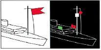|
|Correct Answer|Fahrzeug mit gefährlichen Gütern, Abstand halten, Rauchen und offenes Feuer verboten.|
|Wrong Answer 1|Fahrzeug des öffentlichen Dienstes. Es darf von den Verkehrsregeln abweichen.|
|Wrong Answer 2|Fahrzeug in Seenot. Hilfe leisten bzw. weitere Hilfe anfordern.|
|Wrong Answer 3|Fahrzeug mit Taucher im Einsatz. Großen Abstand halten.|

### 152. Card

|Attribut|Value|
|---|---|
|Id|0f451cf367cb3328cc7173e5e6493e0b|
|Question|152. Wo ist festgelegt, welche Wasserflächen Seeschifffahrtsstraßen sind?|
|Correct Answer|Seeschifffahrtsstraßen-Ordnung und Schifffahrtsordnung Emsmündung.|
|Wrong Answer 1|Seeschifffahrtsstraßen-Ordnung und Kollisionsverhütungsregeln.|
|Wrong Answer 2|Kollisionsverhütungsregeln und Schifffahrtsordnung Emsmündung.|
|Wrong Answer 3|Kollisionsverhütungsregeln und Seeaufgabengesetz.|

### 153. Card

|Attribut|Value|
|---|---|
|Id|f4725c5b046d2518270b9ed64ba4e8dd|
|Question|153. Welche örtlichen Sondervorschriften zusätzlich zur Seeschifffahrtsstraßen-Ordnung (SeeSchStrO) und zur Schifffahrtsordnung Emsmündung (EmsSchO) gibt es und was ist darin geregelt?|
|Correct Answer|Die Bekanntmachungen der Generaldirektion Wasserstraßen- und Schifffahrt (GDWS), die besondere örtliche Regelungen enthalten und Hinweise für die einzelnen Seeschifffahrtsstraßen geben.|
|Wrong Answer 1|Die Nachrichten für Seefahrer (NfS), herausgegeben vom Bundesamt für Seeschifffahrt und Hydrographie, sowie die Bekanntmachungen für Seefahrer (BfS) der örtlich zuständigen Wasserstraßen- und Schifffahrtsämter, die auf alle Veränderungen hinsichtlich Betonnung, Befeuerung, Wracks und Untiefen sowie auf die Schifffahrt betreffende Maßnahmen und Ereignisse hinweisen.|
|Wrong Answer 2|Die Bekanntmachung der Generaldirektion Wasserstraßen- und Schifffahrt (GDWS) sowie die nautische Veröffentlichung "Sicherheit auf dem Wasser", herausgegeben durch das Bundesministerium für Digitales und Verkehr (BMDV), mit wichtigen Regeln und Tipps für Wassersportler.|
|Wrong Answer 3|Das Seesicherheitsuntersuchungsgesetz sowie die Verordnung über die Sicherung der Seefahrt, die jeweils wichtige Vorschriften über das Verhalten nach einem Zusammenstoß auf den jeweiligen Seeschifffahrtsstraßen enthalten.|

### 154. Card

|Attribut|Value|
|---|---|
|Id|d3ffbe28e9f80a9443f524bd4a07eeaf|
|Question|154. Was ist das für ein Fahrzeug und was ist zu beachten?|
|Image||
|Correct Answer|Fahrzeug des öffentlichen Dienstes im Einsatz. Es darf von den Verkehrsvorschriften abweichen.|
|Wrong Answer 1|Fahrzeug der Bundesmarine im Einsatz. Es hat Munition oder andere Gefahrgüter an Bord.|
|Wrong Answer 2|Lotsenfahrzeug mit Sonderrechten im Einsatz. Es darf vom Rechtsfahrgebot abweichen.|
|Wrong Answer 3|Tiefgangbehindertes Fahrzeug. Es darf nicht behindert werden.|

### 155. Card

|Attribut|Value|
|---|---|
|Id|8064e1b4f097c2d9e67ca9396bb5801a|
|Question|155. Wer gibt das Sichtzeichen "Leuchtkugeln mit weißen Sternen" und was ist zu beachten?|
|Correct Answer|Fahrzeug der Bundeswehr, der Bundespolizei oder Maschinenfahrzeug, das Schießscheiben schleppt bei Übungen. Man hält sich frei.|
|Wrong Answer 1|Fahrzeug, das mit Netzen, Leinen, Schleppnetzen oder anderen Fanggeräten fischt und auf sich aufmerksam macht. Ausreichenden Abstand halten.|
|Wrong Answer 2|Fahrzeug in Seenot, das auf sich aufmerksam macht. Hilfe leisten, ggf. weitere Hilfe anfordern.|
|Wrong Answer 3|Maschinenfahrzeug über 50 m Länge bei der Anforderung eines Lotsen. Man behält Kurs und Geschwindigkeit bei.|

### 156. Card

|Attribut|Value|
|---|---|
|Id|3099b366bdfc56a383038c0cf56c148e|
|Question|156. Was sind Fahrwasser im Sinne der Seeschifffahrtsstraßen-Ordnung (SeeSchStrO) und der Schifffahrtsordnung Emsmündung (EmsSchO)?|
|Correct Answer|Es sind Wasserflächen, die durchgehend durch Fahrwasserseitenbezeichnung begrenzt oder gekennzeichnet sind, binnenwärts der Flussmündungen auch nicht gekennzeichnete Wasserflächen, die für die durchgehende Schifffahrt bestimmt sind.|
|Wrong Answer 1|Es sind Wasserflächen, die für Seeschiffe zugelassen sind; binnenwärts der Flussmündungen sind auch Binnenschiffe und Sportboote zugelassen.|
|Wrong Answer 2|Es sind Wasserflächen, die durchgehend durch Fahrwasserseitenbezeichnung begrenzt oder gekennzeichnet sind und auf denen das Wasserskifahren sowie das Fahren mit Wassermotorrädern erlaubt ist, sofern die durchgehende Schifffahrt nicht behindert wird.|
|Wrong Answer 3|Es sind Wasserflächen, die durchgehend durch Fahrwasserseitenbezeichnung begrenzt oder gekennzeichnet sind und auf denen die Sportbootführerscheinverordnung Gültigkeit hat.|

### 157. Card

|Attribut|Value|
|---|---|
|Id|05fee1e1e6f4fc1e3fbe1eb98441eb21|
|Question|157. Welches ist - außer in Wattgebieten - die Steuerbordseite eines Fahrwassers?|
|Correct Answer|Es ist die Seite, die ein von See kommendes Schiff an seiner Steuerbordseite hat.|
|Wrong Answer 1|Es ist die Seite, die ein von See kommendes Schiff an seiner Backbordseite hat.|
|Wrong Answer 2|Es ist die Seite, die von See kommend mit roten Tonnen bezeichnet ist.|
|Wrong Answer 3|Es ist die Seite, auf der die Tonnen mit fortlaufenden geraden Zahlen gekennzeichnet sind.|

### 158. Card

|Attribut|Value|
|---|---|
|Id|bf3d0fab8b2de8bde2d7b381c2a04cfb|
|Question|158. Welche verkehrsrechtliche Verpflichtung hat ein Fahrzeugführer nach § 3 der Seeschifffahrtsstraßen-Ordnung (SeeSchStrO), dessen Fahrzeug mit einer UKW-Funkanlage ausgerüstet ist?|
|Correct Answer|Er ist verpflichtet, die von der Verkehrszentrale gegebenen Verkehrsinformationen und -unterstützungen abzuhören und zu berücksichtigen.|
|Wrong Answer 1|Er ist verpflichtet, bei der Nutzung einer UKW-Funkanlage im Besitz des entsprechenden Funkzeugnisses zu sein.|
|Wrong Answer 2|Er ist verpflichtet, bei verminderter Sicht regelmäßig seinen Schiffsnamen und seine Position der Verkehrszentrale mitzuteilen.|
|Wrong Answer 3|Er ist verpflichtet, die Funkanlage während der Fahrt in Betrieb zu halten und alle sein Fahrzeug betreffenden Mitteilungen im Schiffslogbuch festzuhalten.|

### 159. Card

|Attribut|Value|
|---|---|
|Id|73aa04116a6c6f5ac0943351e9e4b9b8|
|Question|159. Welches Licht muss ein Fahrzeug unter Segel von weniger als 12 m Länge oder ein Fahrzeug unter Ruder auf der Seeschifffahrtsstraße führen, wenn es die nach den Kollisionsverhütungsregeln (KVR) vorgeschriebenen Lichter nicht führen kann?|
|Correct Answer|Ein weißes Rundumlicht.|
|Wrong Answer 1|Ein rotes Rundumlicht.|
|Wrong Answer 2|Ein weißes Topplicht.|
|Wrong Answer 3|Eine Dreifarbenlaterne.|

### 160. Card

|Attribut|Value|
|---|---|
|Id|0f831b5e60b9cc3bbcf55b1c02dc6e66|
|Question|160. Wann darf ein Maschinenfahrzeug von weniger als 7 m Länge auf Seeschifffahrtsstraßen nicht fahren, wenn es die nach den Kollisionsverhütungsregeln (KVR) vorgeschriebenen Lichter nicht führen kann?|
|Correct Answer|Es darf in der Zeit, in der die Lichterführung vorgeschrieben ist, nicht fahren, es sei denn, dass ein Notstand vorliegt.|
|Wrong Answer 1|Es darf in der Zeit zwischen Sonnenaufgang und Sonnenuntergang nicht fahren.|
|Wrong Answer 2|Es darf in der Zeit, in der die Lichterführung vorgeschrieben ist, nur dann fahren, wenn ein betriebsbedingtes Signalhorn an Bord ist.|
|Wrong Answer 3|Es darf in der Zeit zwischen Sonnenuntergang und Sonnenaufgang nicht fahren.|

### 161. Card

|Attribut|Value|
|---|---|
|Id|e2382456ad695c137bb080ca3071c002|
|Question|161. Welches Schallsignal ist beim Einlaufen in Fahrwasser und Häfen zu geben, wenn die Verkehrslage es erfordert?|
|Correct Answer|Ein langer Ton.|
|Wrong Answer 1|Ein kurzer Ton.|
|Wrong Answer 2|Ein kurzer und ein langer Ton.|
|Wrong Answer 3|Ein langer und ein kurzer Ton.|

### 162. Card

|Attribut|Value|
|---|---|
|Id|1bd56f24fe46d1c6392bac10772f3d81|
|Question|162. Welche Bedeutung hat folgendes Schallsignal?|
|Image||
|Correct Answer|Allgemeines "Gefahr- und Warnsignal".|
|Wrong Answer 1|Sperrung der Seeschifffahrtsstraße.|
|Wrong Answer 2|Sofort anhalten (Fahrzeug des öffentlichen Dienstes).|
|Wrong Answer 3|Brücke/Schleuse kann vorübergehend nicht geöffnet werden.|

### 163. Card

|Attribut|Value|
|---|---|
|Id|dcfc2446aaa56c4cb259441959b85ba2|
|Question|163. Wie lautet das "allgemeine Gefahr- und Warnsignal"?|
|Correct Answer|Zwei Gruppen von je einem langen und vier kurzen Tönen.|
|Wrong Answer 1|Zwei Gruppen von je drei langen Tönen.|
|Wrong Answer 2|Zwei Gruppen von je vier kurzen Tönen.|
|Wrong Answer 3|Zwei Gruppen von je einem kurzen und vier langen Tönen.|

### 164. Card

|Attribut|Value|
|---|---|
|Id|d3dffa19bdaeefa0ee4c45c3452300ef|
|Question|164. Wann ist das "allgemeine Gefahr- und Warnsignal" zu geben?|
|Correct Answer|Wenn ein Fahrzeug ein anderes Fahrzeug gefährdet oder durch dieses selbst gefährdet wird.|
|Wrong Answer 1|Wenn ein Fahrzeug ein anderes Fahrzeug im Fahrwasser an Steuerbord überholen will.|
|Wrong Answer 2|Wenn ein Fahrzeug einem anderen Fahrzeug nicht ausweichen kann.|
|Wrong Answer 3|Wenn ein Fahrzeug ein anderes Fahrzeug zur Hilfeleistung auffordert.|

### 165. Card

|Attribut|Value|
|---|---|
|Id|9744c74e177274dc100500f064dccfe5|
|Question|165. Wie haben sich Fahrzeuge zu verhalten, die in ein Fahrwasser einlaufen, ein Fahrwasser queren, im Fahrwasser drehen oder ihre Anker- und Liegeplätze verlassen?|
|Correct Answer|Sie haben die Vorfahrt der dem Fahrwasserverlauf folgenden Fahrzeuge zu beachten.|
|Wrong Answer 1|Sie haben die Vorfahrt vor den Fahrzeugen im Fahrwasser.|
|Wrong Answer 2|Sie haben einen kurzen Ton als Achtungssignal abzugeben.|
|Wrong Answer 3|Sie haben ihr Manöver so durchzuführen, dass andere Fahrzeuge nicht behindert werden.|

### 166. Card

|Attribut|Value|
|---|---|
|Id|7b5a4757feec3fbc1d8c5ca07eb8370a|
|Question|166. Wie haben Segelfahrzeuge im Fahrwasser, die nicht deutlich der Richtung eines Fahrwassers folgen, untereinander auszuweichen?|
|Correct Answer|Sie haben untereinander nach den Regeln der KVR auszuweichen, wenn sie dadurch vorfahrtberechtigte Fahrzeuge nicht gefährden oder behindern.|
|Wrong Answer 1|Sie haben untereinander nach den Regeln der Seeschifffahrtsstraßen-Ordnung auszuweichen, wenn sie dadurch vorfahrtberechtigte Fahrzeuge nicht gefährden oder behindern.|
|Wrong Answer 2|Sie haben untereinander nach den Regeln der Schifffahrtsordnung Emsmündung auszuweichen, wenn sie dadurch vorfahrtberechtigte Fahrzeuge nicht gefährden oder behindern.|
|Wrong Answer 3|Sie haben untereinander nach den Regeln der Binnenschifffahrtsstraßen-Ordnung auszuweichen, wenn sie dadurch vorfahrtberechtigte Fahrzeuge nicht gefährden oder behindern.|

### 167. Card

|Attribut|Value|
|---|---|
|Id|8baa5593766eee24c859bd29ec68a81a|
|Question|167. Welche Ausweichregeln gelten außerhalb des Fahrwassers?|
|Correct Answer|Die Regeln der KVR.|
|Wrong Answer 1|Die Regeln der Seeschifffahrtsstraßen-Ordnung.|
|Wrong Answer 2|Die Regeln der Schifffahrtsordnung Emsmündung.|
|Wrong Answer 3|Die Regeln der Binnenschifffahrtsstraßen-Ordnung.|

### 168. Card

|Attribut|Value|
|---|---|
|Id|2b4b55f69b4fd050aeb972e584fdf2f7|
|Question|168. Wo ist das Überholen verboten?|
|Correct Answer|An Engstellen, unübersichtlichen Krümmungen, in Schleusenbereichen, innerhalb durch Überholverbotszeichen gekennzeichneter Strecken, in der Nähe nicht frei fahrender Fähren in Fahrt.|
|Wrong Answer 1|An Engstellen, unübersichtlichen Krümmungen, in Schleusenbereichen, innerhalb durch Überholverbotszeichen gekennzeichneter Strecken, in der Nähe nicht frei fahrender Fähren in Fahrt und außerhalb des Fahrwassers.|
|Wrong Answer 2|An Engstellen, unübersichtlichen Krümmungen, in Schleusenbereichen, innerhalb durch Überholverbotszeichen gekennzeichneter Strecken, in der Nähe nicht frei fahrender Fähren in Fahrt, und in Verkehrstrennungsgebieten.|
|Wrong Answer 3|An Engstellen, unübersichtlichen Krümmungen, innerhalb durch Überholverbotszeichen gekennzeichneter Strecken und in Nationalparks und besonders ausgewiesenen Naturschutzgebieten.|

### 169. Card

|Attribut|Value|
|---|---|
|Id|c3d065da6db25913c993ff51e461b203|
|Question|169. Wo darf Wasserski gelaufen, Wassermotorrad gefahren oder mit einem Segelsurfbrett gefahren werden?|
|Correct Answer|Außerhalb des Fahrwassers, wenn es nicht von der Generaldirektion Wasserstraßen- und Schifffahrt (GDWS) durch Bekanntmachung verboten ist. Im Fahrwasser auf Abschnitten, die durch die GDWS bekanntgemacht oder durch blaue Tafeln mit dem weißen Symbol eines Wasserskiläufers, eines Wassermotorrades oder eines Segelsurfers bezeichnet sind.|
|Wrong Answer 1|Außerhalb der Seeschifffahrtsstraße, wenn es nicht von der Generaldirektion Wasserstraßen- und Schifffahrt (GDWS) durch Bekanntmachung verboten ist. Innerhalb der Seeschifffahrtsstraße auf Abschnitten, die durch die GDWS bekanntgemacht oder durch blaue Tafeln mit dem weißen Symbol eines Wasserskiläufers, eines Wassermotorrades oder eines Segelsurfers bezeichnet sind.|
|Wrong Answer 2|Auf der hohen See und auf den mit dieser zusammenhängenden, von Seeschiffen befahrbaren Gewässern, sofern dabei ein Abstand von mindestens 100 m zum Ufer eingehalten wird.|
|Wrong Answer 3|Im Fahrwasser, wenn es nicht von der Generaldirektion Wasserstraßen- und Schifffahrt (GDWS) durch Bekanntmachung verboten ist. Außerhalb des Fahrwassers auf Abschnitten, die durch die GDWS bekanntgemacht oder durch blaue Tafeln mit dem weißen Symbol eines Wasserskiläufers, eines Wassermotorrades oder eines Segelsurfers bezeichnet sind.|

### 170. Card

|Attribut|Value|
|---|---|
|Id|a44380a99742986c569279e354215b38|
|Question|170. Wie haben sich Führer von Zugbooten der Wasserskiläufer bzw. Wassermotorradfahrer und Segelsurfer bei der Annäherung an andere Fahrzeuge zu verhalten?|
|Correct Answer|Sie haben auszuweichen.|
|Wrong Answer 1|Sie haben bei Annäherung an andere Fahrzeuge aufzustoppen und Sog und Wellenschlag zu vermeiden.|
|Wrong Answer 2|Sie haben Vorfahrt und müssen vor dem Bug des anderen Fahrzeugs kreuzen.|
|Wrong Answer 3|Sie müssen Kurs und Geschwindigkeit beibehalten.|

### 171. Card

|Attribut|Value|
|---|---|
|Id|22ff060d7c60a88f33749e52f9a74e4c|
|Question|171. Wo ist das Ankern verboten?|
|Correct Answer|Im Fahrwasser, an Engstellen und in unübersichtlichen Krümmungen; im Umkreis von 300 m von schwimmenden Geräten, Wracks und sonstigen Schifffahrtshindernissen, Kabeltonnen und sonstigen Stellen für militärische und zivile Zwecke; vor Hafeneinfahrten, Schleusen, Anlegestellen und Sielen sowie in den Zufahrten des Nord-Ostsee-Kanals; innerhalb von Fähr- und Brückenstrecken; 300 m vor und hinter Ankerverbotszeichen.|
|Wrong Answer 1|Im Fahrwasser, auf Seeschifffahrtsstraßen, an Engstellen und in unübersichtlichen Krümmungen; im Umkreis von 300 m von schwimmenden Geräten, Wracks und sonstigen Schifffahrtshindernissen, Kabeltonnen und sonstigen Stellen für militärische und zivile Zwecke; vor Hafeneinfahrten, Schleusen, Anlegestellen und Sielen sowie in den Zufahrten des Nord-Ostsee-Kanals; innerhalb von Fähr- und Brückenstrecken; 300 m vor und hinter Ankerverbotszeichen.|
|Wrong Answer 2|Im Fahrwasser, an Engstellen und in unübersichtlichen Krümmungen; im Umkreis von 300 m von schwimmenden Geräten, Kabeltonnen und sonstigen Stellen für militärische und zivile Zwecke; vor Hafeneinfahrten, Schleusen, Anlegestellen und Sielen sowie in den Zufahrten des Nord-Ostsee-Kanals und in Vogelschutz- und Naturschutzgebieten sowie generell innerhalb von Nationalparks.|
|Wrong Answer 3|Im Fahrwasser, wenn es durch die Generaldirektion Wasserstraßen- und Schifffahrt (GDWS) bekanntgemacht worden ist. Außerhalb des Fahrwassers auf Abschnitten, die durch die GDWS bekanntgemacht oder durch entsprechende Sichtzeichen bezeichnet sind.|

### 172. Card

|Attribut|Value|
|---|---|
|Id|79d614e840f34e51eaba409de84947d9|
|Question|172. Was ist zu unternehmen, um die Schifffahrt zu warnen, wenn das eigene Fahrzeug gesunken ist und ein Schifffahrtshindernis darstellt?|
|Correct Answer|Man informiert die Schifffahrtspolizeibehörde und gibt nach Möglichkeit die Position an.|
|Wrong Answer 1|Man informiert die Deutsche Gesellschaft zur Rettung Schiffbrüchiger, damit das Hindernis gekennzeichnet werden kann.|
|Wrong Answer 2|Man gibt ein Seenotsignal ab.|
|Wrong Answer 3|Man informiert das Bundesamt für Seeschifffahrt und Hydrographie und gibt nach Möglichkeit die Position an.|

### 173. Card

|Attribut|Value|
|---|---|
|Id|770a03da673c5a9c97010f0845b5b8cc|
|Question|173. Bei welchem Signal dürfen Sportfahrzeuge in die Schleusen des Nord-Ostsee-Kanals einfahren?|
|Correct Answer|Wenn ein weißes unterbrochenes Licht gezeigt wird.|
|Wrong Answer 1|Wenn ein weißes Funkellicht gezeigt wird.|
|Wrong Answer 2|Wenn zwei grüne Lichter nebeneinander gezeigt werden.|
|Wrong Answer 3|Wenn ein grünes Gleichtaktlicht gezeigt wird.|

### 174. Card

|Attribut|Value|
|---|---|
|Id|6c9a9da132fae18b9164ef4b01aeed0b|
|Question|174. Wo findet man Regeln für das Durchfahren des Nord-Ostsee-Kanals (NOK)?|
|Correct Answer|Ergänzende Vorschriften für den NOK in der Seeschifffahrtsstraßen-Ordnung sowie in den Bekanntmachungen der Generaldirektion Wasserstraßen und Schifffahrt (GDWS).|
|Wrong Answer 1|Ergänzende Vorschriften für den NOK in der Seeschifffahrtsstraßen-Ordnung sowie in den Kollisionsverhütungsregeln.|
|Wrong Answer 2|Ergänzende Vorschriften für den NOK in der Seeschifffahrtsstraßen-Ordnung sowie in der Sportbootführerscheinverordnung.|
|Wrong Answer 3|Ergänzende Vorschriften für den NOK in der Seeschifffahrtsstraßen-Ordnung sowie im Seeaufgabengesetz.|

### 175. Card

|Attribut|Value|
|---|---|
|Id|ecc054f14cc78cd978b315179ea9a6a2|
|Question|175. Was bedeuten im Nord-Ostsee-Kanal an einem Weichensignalmast drei unterbrochene rote Lichter übereinander und was ist zu beachten?|
|Correct Answer|Ausfahren für alle Fahrzeuge verboten; Aufhebung des Signals abwarten.|
|Wrong Answer 1|Schutzbedürftige Anlage; Geschwindigkeit reduzieren, Sog und Wellenschlag vermeiden.|
|Wrong Answer 2|Dauernde Sperrung der Seeschifffahrtsstraße; Weiterfahrt verboten.|
|Wrong Answer 3|Dauernde Sperrung einer Teilstrecke der Seeschifffahrtsstraße; Weiterfahrt in der Teilstrecke verboten.|

### 176. Card

|Attribut|Value|
|---|---|
|Id|ebe659c0edf1134dbb5c36ad487fedab|
|Question|176. Welche Bedeutung hat folgendes Tafelzeichen?|
|Image|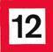|
|Correct Answer|Die Geschwindigkeit durch das Wasser in km/h, auf dem Nord-Ostsee-Kanal (NOK) über Grund in km/h, die nicht überschritten werden darf.|
|Wrong Answer 1|Mindestabstand in Metern, der in der nachfolgenden Strecke vom Aufstellungsort der Tafel an eingehalten werden muss.|
|Wrong Answer 2|Die Geschwindigkeit durch das Wasser in sm/h (Knoten) auf dem Nord-Ostsee-Kanal (NOK) über Grund in sm/h, die nicht überschritten werden darf.|
|Wrong Answer 3|Mindestabstand zu anderen Fahrzeugen in Metern, der im bekanntgemachten Streckenabschnitt nicht unterschritten werden darf.|

### 177. Card

|Attribut|Value|
|---|---|
|Id|86d83e2b1d5aa241341a293020040721|
|Question|177. Welche Bedeutung haben folgende Sichtzeichen?|
|Image||
|Correct Answer|Schutzbedürftige Anlage.|
|Wrong Answer 1|Dauernde Sperrung einer Teilstrecke der Seeschifffahrtsstraße.|
|Wrong Answer 2|Dauernde Sperrung der Seeschifffahrtsstraße.|
|Wrong Answer 3|Außergewöhnliche Schifffahrtsbehinderung.|

### 178. Card

|Attribut|Value|
|---|---|
|Id|d298abeb26085a4fa324e921d36efa66|
|Question|178. Welche Bedeutung hat folgendes Schallsignal und was ist zu beachten?|
|Image||
|Correct Answer|Brücke, Sperrwerk, Schleuse kann vorübergehend nicht geöffnet werden; Fahrt unterbrechen, Freigabe abwarten.|
|Wrong Answer 1|Ein Ausweichpflichtiger wird vom Vorfahrtberechtigten auf seine Ausweichpflicht hingewiesen; sofort Ausweichmanöver einleiten.|
|Wrong Answer 2|Bleib-weg-Signal, Gefahr durch gefährliche Ladung; sofort den Gefahrenbereich verlassen. Offenes Feuer vermeiden (Explosionsgefahr).|
|Wrong Answer 3|Brücke, Sperrwerk, Schleuse wird zur Öffnung vorbereitet; Fahrt fortsetzen.|

### 179. Card

|Attribut|Value|
|---|---|
|Id|ae51b48e40e78ad22ccb23cfce8a1b5c|
|Question|179. Welche Bedeutung hat folgendes Sichtzeichen?|
|Image||
|Correct Answer|Geschwindigkeit von 8 km/h Fahrt durch das Wasser, die innerhalb eines Bereiches von 500 m von der jeweiligen Uferlinie wegen Badebetriebs nicht überschritten werden darf.|
|Wrong Answer 1|Kennzeichnung besonderer Gebiete und Stellen, z. B. Warngebiete; die Bedeutung kann der Seekarte entnommen und aus der Beschriftung des Schifffahrtszeichens erkannt werden.|
|Wrong Answer 2|Geschwindigkeit von 8 sm/h Fahrt durch das Wasser, die innerhalb eines Mindestabstandes von 500 m von der jeweiligen Uferlinie wegen Badebetriebs nicht überschritten werden darf.|
|Wrong Answer 3|Buhnenbauwerk, Gefahr durch Sog und Wellenschlag. Insbesondere auf Badebetrieb und Schwimmer achten.|

### 180. Card

|Attribut|Value|
|---|---|
|Id|c08b06805732a5bd95c502b423a560f9|
|Question|180. Welche Bedeutung hat folgendes Schifffahrtszeichen?|
|Image||
|Correct Answer|Gesperrt für alle Maschinenfahrzeuge und Wassermotorräder wegen Badebetriebs.|
|Wrong Answer 1|Höchstgeschwindigkeit von 4,3 Knoten Fahrt durch das Wasser, die innerhalb von 500 m von der jeweiligen Uferlinie wegen Badebetriebs nicht überschritten werden darf.|
|Wrong Answer 2|Einzelgefahrenstelle, erkennbar an ihrer Farbgebung, die an allen Seiten mit einer maximalen Geschwindigkeit von 4,3 Knoten passiert werden kann.|
|Wrong Answer 3|Kennzeichnung besonderer Gebiete und Stellen, z. B. Warngebiet.|

### 181. Card

|Attribut|Value|
|---|---|
|Id|6991a06923bc139e056a891a50970c18|
|Question|181. Welche Höchstgeschwindigkeit darf vor Stellen mit erkennbarem Badebetrieb - außerhalb des Fahrwassers - in einem Abstand von 500 m und weniger vom Ufer nicht überschritten werden?|
|Correct Answer|4,3 Knoten.|
|Wrong Answer 1|3,4 Knoten.|
|Wrong Answer 2|4,8 Knoten.|
|Wrong Answer 3|3,8 Knoten.|

### 182. Card

|Attribut|Value|
|---|---|
|Id|6048cef4b8a341f5c1756dc2c6b93c3c|
|Question|182. Welche Bedeutung hat folgendes Schifffahrtszeichen?|
|Image||
|Correct Answer|Kennzeichnung von besonderen Gebieten und Stellen.|
|Wrong Answer 1|Kennzeichnung von Sperrgebieten.|
|Wrong Answer 2|Kennzeichnung von Schießgebieten.|
|Wrong Answer 3|Kennzeichnung von Badegebieten.|

### 183. Card

|Attribut|Value|
|---|---|
|Id|8e3adb96d375e5ff9e113e8675b19109|
|Question|183. Woran ist ein militärisches Warngebiet zu erkennen, das wegen Schießübungen für die Schifffahrt gesperrt ist?|
|Correct Answer|An bestimmten Tag- und Nachtsignalen, die nach der Sperr- und Warngebietsverordnung der Generaldirektion Wasserstraßen- und Schifffahrt (GDWS) für militärische Sperr- und Warngebiete an entsprechenden Signalstellen und auf Sicherungsfahrzeugen gezeigt werden.|
|Wrong Answer 1|An bestimmten Tag- und Nachtsignalen, die nach der Rheinpolizeiverordnung der Generaldirektion Wasserstraßen- und Schifffahrt (GDWS) für militärische Sperr- und Warngebiete an entsprechenden Signalstellen am Ufer und auf Sicherungsfahrzeugen gezeigt werden.|
|Wrong Answer 2|An bestimmten Tag- und Nachtsignalen, die nach der zuständigen Polizeiverordnung des Wasserwirtschaftsamtes für Übungs-, Sperr- und Warngebiete an entsprechenden Signalstellen am Ufer und auf Sicherungsfahrzeugen gezeigt werden.|
|Wrong Answer 3|An bestimmten Tag- und Nachtsignalen, die nach der Schifffahrtsordnung der Generaldirektion Wasserstraßen- und Schifffahrt (GDWS) für militärische Sperr- und Warngebiete an entsprechenden Signalstellen am Ufer und auf Sicherungsfahrzeugen gezeigt werden.|

### 184. Card

|Attribut|Value|
|---|---|
|Id|16c7a00f89bd40763e4c8cb5d9827e58|
|Question|184. Welche Bedeutung haben folgende Schifffahrtszeichen?|
|Image||
|Correct Answer|Sperrgebiet.|
|Wrong Answer 1|Sperrgebiet und Badezone.|
|Wrong Answer 2|Sperrgebiet wegen Aquakulturen und Muschelzuchtanlagen.|
|Wrong Answer 3|Schießgebiet.|

### 185. Card

|Attribut|Value|
|---|---|
|Id|620c1a2117cc91d7ef6a42007041032e|
|Question|185. Welche Bedeutung hat folgendes Flaggensignal?|
|Image|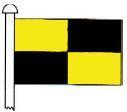|
|Correct Answer|Anhalten.|
|Wrong Answer 1|Seenotsignal.|
|Wrong Answer 2|Anker behindert Schifffahrt.|
|Wrong Answer 3|Schleppverband, länger als 200 m|

### 186. Card

|Attribut|Value|
|---|---|
|Id|1a93e1eed59b01dfcd7b3b80f65a76a5|
|Question|186. Welche Bedeutung hat folgendes Schallsignal?|
|Image||
|Correct Answer|Polizeifahrzeug fordert zum Anhalten auf.|
|Wrong Answer 1|Ankerlieger macht auf gefährliche Annäherung aufmerksam.|
|Wrong Answer 2|Letzter bemannter Anhang eines Schleppverbandes.|
|Wrong Answer 3|Manövrierbehindertes Fahrzeug blockiert das Fahrwasser.|

### 187. Card

|Attribut|Value|
|---|---|
|Id|37d7bdb151a224c897887946c6d56cb4|
|Question|187. Welche Bedeutung haben folgende Sichtzeichen?|
|Image||
|Correct Answer|Dauernde Sperrung der Seeschifffahrtsstraße. Weiterfahrt verboten.|
|Wrong Answer 1|Schutzbedürftige Anlage. Sog und Wellenschlag vermeiden.|
|Wrong Answer 2|Außergewöhnliche Schifffahrtsbehinderung. Vorsichtig passieren.|
|Wrong Answer 3|Ende einer Gebots- oder Verbotsstrecke. Freie Weiterfahrt.|

### 188. Card

|Attribut|Value|
|---|---|
|Id|c6733631b6ab4e9dd54213344b622cf5|
|Question|188. Welche Bedeutung hat folgendes Schallsignal?|
|Image||
|Correct Answer|Sperrung der Seeschifffahrtsstraße, Weiterfahrt verboten.|
|Wrong Answer 1|Einfahrt in Schleuse oder Anlage gesperrt, auf Freigabe warten.|
|Wrong Answer 2|Ein Ankerlieger bei schlechter Sicht, vorsichtig weiter navigieren.|
|Wrong Answer 3|Fahrzeug des öffentlichen Dienstes, anhalten.|

### 189. Card

|Attribut|Value|
|---|---|
|Id|02ad12b96db828a9e8c91bc672b386f9|
|Question|189. Welche Bedeutung haben folgende Sichtzeichen?|
|Image||
|Correct Answer|Außergewöhnliche Schifffahrtsbehinderung.|
|Wrong Answer 1|Dauernde Sperrung der Seeschifffahrtsstraße.|
|Wrong Answer 2|Schutzbedürftige Anlage.|
|Wrong Answer 3|Zeitweilige Sperrung der Seeschifffahrtsstraße.|

### 190. Card

|Attribut|Value|
|---|---|
|Id|8644245abc18d1752fd963a8d9d95711|
|Question|190. Welche Bedeutung hat folgende Tonne?|
|Image|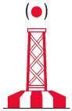|
|Correct Answer|Kennzeichnung der Mitte von Schifffahrtswegen.|
|Wrong Answer 1|Kennzeichnung von Einzelgefahrenstellen.|
|Wrong Answer 2|Kennzeichnung einer Reede.|
|Wrong Answer 3|Kennzeichnung der Backbordseite eines Fahrwassers.|

### 191. Card

|Attribut|Value|
|---|---|
|Id|32f6c5209bb9559fa3291fcac9c89306|
|Question|191. Welche Bedeutung hat folgendes Schifffahrtszeichen?|
|Image||
|Correct Answer|Die Steuerbordseite des Fahrwassers.|
|Wrong Answer 1|Die Backbordseite des Fahrwassers.|
|Wrong Answer 2|Die Mitte eines Schifffahrtsweges.|
|Wrong Answer 3|Die Kennzeichnung von Hindernissen.|

### 192. Card

|Attribut|Value|
|---|---|
|Id|b466613dca358d485111b056730bd83e|
|Question|192. Welche Bedeutung hat folgendes Schifffahrtszeichen?|
|Image||
|Correct Answer|Die Backbordseite des Fahrwassers.|
|Wrong Answer 1|Die Steuerbordseite des Fahrwassers.|
|Wrong Answer 2|Die Mitte eines Wattfahrwassers.|
|Wrong Answer 3|Die Kennzeichnung eines Hindernisses im Wattfahrwasser.|

### 193. Card

|Attribut|Value|
|---|---|
|Id|be3ddab1fc9101d802e588264b70d86c|
|Question|193. Welche Bedeutung hat folgende(s) Tonne/Schifffahrtszeichen?|
|Image||
|Correct Answer|Die Steuerbordseite des Fahrwassers.|
|Wrong Answer 1|Die Backbordseite des Fahrwassers.|
|Wrong Answer 2|Die Mitte eines Schifffahrtsweges.|
|Wrong Answer 3|Die Kennzeichnung von Hindernissen.|

### 194. Card

|Attribut|Value|
|---|---|
|Id|022aa776018bb89d9e0c10c2f8a7cc36|
|Question|194. Welche Bedeutung hat folgende(s) Tonne/Schifffahrtszeichen?|
|Image|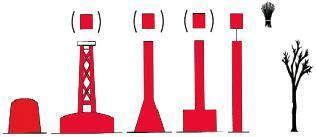|
|Correct Answer|Die Backbordseite des Fahrwassers.|
|Wrong Answer 1|Die Steuerbordseite des Fahrwassers.|
|Wrong Answer 2|Die Mitte eines Wattfahrwassers.|
|Wrong Answer 3|Die Kennzeichnung eines Hindernisses im Wattfahrwasser.|

### 195. Card

|Attribut|Value|
|---|---|
|Id|b28576205bfdf575922d913fbb6bd772|
|Question|195. Welche Bedeutung hat folgende Tonne?|
|Image|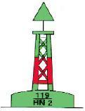|
|Correct Answer|Steuerbordseite des durchgehenden Fahrwassers/Backbordseite des abzweigenden oder einmündenden Fahrwassers.|
|Wrong Answer 1|Backbordseite des durchgehenden Fahrwassers/Steuerbordseite des abzweigenden oder einmündenden Fahrwassers.|
|Wrong Answer 2|Steuerbordseite des durchgehenden Fahrwassers.|
|Wrong Answer 3|Backbordseite des durchgehenden Fahrwassers.|

### 196. Card

|Attribut|Value|
|---|---|
|Id|5f88b04ff7691c64a0c912c6d6a543e8|
|Question|196. Welche Bedeutung hat folgende Tonne?|
|Image|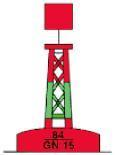|
|Correct Answer|Backbordseite des durchgehenden Fahrwassers, Steuerbordseite des abzweigenden oder einmündenden Fahrwassers.|
|Wrong Answer 1|Steuerbordseite des durchgehenden Fahrwassers, Backbordseite des abzweigenden oder einmündenden Fahrwassers.|
|Wrong Answer 2|Steuerbordseite des durchgehenden Fahrwassers.|
|Wrong Answer 3|Backbordseite des durchgehenden Fahrwassers.|

### 197. Card

|Attribut|Value|
|---|---|
|Id|9735d13b694dd7a78d23094fce31b45c|
|Question|197. Welche Bedeutung hat folgende Kennung: "Oc (2) R. Whis."?|
|Correct Answer|Unterbrochen (2) rot, Heultonne.|
|Wrong Answer 1|Blitz (2) rot, Glockentonne.|
|Wrong Answer 2|Blink (2) rot, Glockentonne.|
|Wrong Answer 3|Leitfeuer rot, zwei Warnsektoren.|

### 198. Card

|Attribut|Value|
|---|---|
|Id|dc2e9884f6839831c5b5a4d9781426fe|
|Question|198. Welche Kennung und Farbe haben die Feuer der Leuchttonnen an der Steuerbordseite des Fahrwassers?|
|Correct Answer|Grünes Blitzfeuer, Funkelfeuer oder unterbrochenes Feuer in Gruppen.|
|Wrong Answer 1|Grünes Blitzfeuer, Funkelfeuer oder Festfeuer.|
|Wrong Answer 2|Grünes Blitzfeuer, Funkelfeuer oder schnelles Funkelfeuer.|
|Wrong Answer 3|Grünes Blitzfeuer, Funkelfeuer oder Blinkfeuer.|

### 199. Card

|Attribut|Value|
|---|---|
|Id|2f552b92de7f650bf8c675d1fddab68b|
|Question|199. Welche Kennung und Farbe haben die Feuer der Leuchttonnen an der Backbordseite des Fahrwassers?|
|Correct Answer|Rotes Blitzfeuer, Funkelfeuer oder unterbrochenes Feuer in Gruppen.|
|Wrong Answer 1|Rotes Blitzfeuer, Funkelfeuer oder Festfeuer.|
|Wrong Answer 2|Rotes Blitzfeuer, Funkelfeuer oder schnelles Funkelfeuer.|
|Wrong Answer 3|Rotes Blitzfeuer, Funkelfeuer oder Blinkfeuer.|

### 200. Card

|Attribut|Value|
|---|---|
|Id|72ec64d2779db6c5b0d1e435e7a7ee93|
|Question|200. Welche Bedeutung hat folgendes Schifffahrtszeichen?|
|Image||
|Correct Answer|Kennzeichnung einer allgemeinen Gefahrenstelle, Nordquadrant.|
|Wrong Answer 1|Kennzeichnung einer allgemeinen Gefahrenstelle, Südquadrant.|
|Wrong Answer 2|Kennzeichnung einer allgemeinen Gefahrenstelle, Westquadrant.|
|Wrong Answer 3|Kennzeichnung einer allgemeinen Gefahrenstelle, Ostquadrant.|

### 201. Card

|Attribut|Value|
|---|---|
|Id|2905cbb597cfddc17e9288e04f9763a4|
|Question|201. Welche Bedeutung hat folgendes Schifffahrtszeichen?|
|Image||
|Correct Answer|Kennzeichnung einer allgemeinen Gefahrenstelle, Ostquadrant.|
|Wrong Answer 1|Kennzeichnung einer allgemeinen Gefahrenstelle, Nordquadrant.|
|Wrong Answer 2|Kennzeichnung einer allgemeinen Gefahrenstelle, Westquadrant.|
|Wrong Answer 3|Kennzeichnung einer allgemeinen Gefahrenstelle, Südquadrant.|

### 202. Card

|Attribut|Value|
|---|---|
|Id|3d47fdce4ebb14346738caf037f5cdde|
|Question|202. Welche Bedeutung hat folgendes Schifffahrtszeichen?|
|Image||
|Correct Answer|Kennzeichnung einer allgemeinen Gefahrenstelle, Südquadrant.|
|Wrong Answer 1|Kennzeichnung einer allgemeinen Gefahrenstelle, Nordquadrant.|
|Wrong Answer 2|Kennzeichnung einer allgemeinen Gefahrenstelle, Westquadrant.|
|Wrong Answer 3|Kennzeichnung einer allgemeinen Gefahrenstelle, Ostquadrant.|

### 203. Card

|Attribut|Value|
|---|---|
|Id|6cdfd335cc52638c62f794c309957843|
|Question|203. Welche Bedeutung hat folgendes Schifffahrtszeichen?|
|Image||
|Correct Answer|Kennzeichnung einer allgemeinen Gefahrenstelle, Westquadrant.|
|Wrong Answer 1|Kennzeichnung einer allgemeinen Gefahrenstelle, Ostquadrant.|
|Wrong Answer 2|Kennzeichnung einer allgemeinen Gefahrenstelle, Nordquadrant.|
|Wrong Answer 3|Kennzeichnung einer allgemeinen Gefahrenstelle, Südquadrant.|

### 204. Card

|Attribut|Value|
|---|---|
|Id|39a4b1ad52f70be95bcf045734a9af83|
|Question|204. Welche Bedeutung hat das Feuer einer Leuchttonne mit folgender Kennung?|
|Image|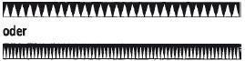|
|Correct Answer|Kennzeichnung einer allgemeinen Gefahrenstelle, die nördlich zu passieren ist.|
|Wrong Answer 1|Kennzeichnung einer allgemeinen Gefahrenstelle, die südlich zu passieren ist.|
|Wrong Answer 2|Kennzeichnung einer allgemeinen Gefahrenstelle, die östlich zu passieren ist.|
|Wrong Answer 3|Kennzeichnung einer allgemeinen Gefahrenstelle, die westlich zu passieren ist.|

### 205. Card

|Attribut|Value|
|---|---|
|Id|55a8cec116ea4be08db140d840197055|
|Question|205. Welche Bedeutung hat das Feuer einer Leuchttonne mit folgender Kennung?|
|Image||
|Correct Answer|Kennzeichnung einer allgemeinen Gefahrenstelle, die östlich zu passieren ist.|
|Wrong Answer 1|Kennzeichnung einer allgemeinen Gefahrenstelle, die nördlich zu passieren ist.|
|Wrong Answer 2|Kennzeichnung einer allgemeinen Gefahrenstelle, die südlich zu passieren ist.|
|Wrong Answer 3|Kennzeichnung einer allgemeinen Gefahrenstelle, die westlich zu passieren ist.|

### 206. Card

|Attribut|Value|
|---|---|
|Id|af370236cb26df8cc6c15c22d083a213|
|Question|206. Welche Bedeutung hat das Feuer einer Leuchttonne mit folgender Kennung?|
|Image||
|Correct Answer|Kennzeichnung einer allgemeinen Gefahrenstelle, Südquadrant.|
|Wrong Answer 1|Kennzeichnung einer allgemeinen Gefahrenstelle, Westquadrant.|
|Wrong Answer 2|Kennzeichnung einer allgemeinen Gefahrenstelle, Ostquadrant.|
|Wrong Answer 3|Kennzeichnung einer allgemeinen Gefahrenstelle, Nordquadrant.|

### 207. Card

|Attribut|Value|
|---|---|
|Id|c98fade8425730c8f750761d32c7ad7d|
|Question|207. Welche Bedeutung hat das Feuer einer Leuchttonne mit folgender Kennung?|
|Image|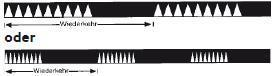|
|Correct Answer|Kennzeichnung einer allgemeinen Gefahrenstelle, Westquadrant. Sie ist westlich zu passieren.|
|Wrong Answer 1|Kennzeichnung einer allgemeinen Gefahrenstelle, Südquadrant. Sie ist südlich zu passieren.|
|Wrong Answer 2|Kennzeichnung einer allgemeinen Gefahrenstelle, Ostquadrant. Sie ist östlich zu passieren.|
|Wrong Answer 3|Kennzeichnung einer allgemeinen Gefahrenstelle, Nordquadrant. Sie ist nördlich zu passieren.|

### 208. Card

|Attribut|Value|
|---|---|
|Id|a65f9ec2e0ccd3b06ed17ede8a71db85|
|Question|208. Was kennzeichnet eines der folgenden Schifffahrtszeichen und welches Verhalten wird gefordert?|
|Image||
|Correct Answer|Eine Einzelgefahrenstelle, die an allen Seiten passiert werden kann.|
|Wrong Answer 1|Den nördlichen Quadranten einer allgemeinen Gefahrenstelle, die nördlich passiert werden muss.|
|Wrong Answer 2|Den südlichen Quadranten einer allgemeinen Gefahrenstelle, die südlich passiert werden muss.|
|Wrong Answer 3|Den westlichen Quadranten einer allgemeinen Gefahrenstelle, die westlich passiert werden muss.|

### 209. Card

|Attribut|Value|
|---|---|
|Id|1caba7bba23e7ad61103f891a844618b|
|Question|209. Welche Bedeutung hat das Feuer einer Leuchttonne mit folgender Kennung: Fl. (2)?|
|Correct Answer|Eine Einzelgefahrenstelle, die an allen Seiten passiert werden kann.|
|Wrong Answer 1|Nördlicher Quadrant einer allgemeinen Gefahrenstelle, die nördlich passiert werden muss.|
|Wrong Answer 2|Südlicher Quadrant einer allgemeinen Gefahrenstelle, die südlich passiert werden muss.|
|Wrong Answer 3|Westlicher Quadrant einer allgemeinen Gefahrenstelle, die westlich passiert werden muss.|

### 210. Card

|Attribut|Value|
|---|---|
|Id|77009b0be22a8feb701e94e95e9d9e70|
|Question|210. Was versteht man unter einem Leitfeuer?|
|Correct Answer|Sektorenfeuer, das ein Fahrwasser bezeichnet.|
|Wrong Answer 1|Sektorenfeuer, das auf eine Kursänderung im Fahrwasser hinweist.|
|Wrong Answer 2|Ober- und Unterfeuer, die in Deckung zu bringen sind.|
|Wrong Answer 3|Ober- und Unterfeuer mit unterschiedlichen Farbsektoren.|

### 211. Card

|Attribut|Value|
|---|---|
|Id|918606035366e8a553d1d24d1de8e2d9|
|Question|211. Wie navigiert man mittels eines Leitfeuers?|
|Correct Answer|In Fahrtrichtung an der rechten Seite des weißen Leitsektors halten.|
|Wrong Answer 1|In Fahrtrichtung an der linken Seite des weißen Leitsektors halten.|
|Wrong Answer 2|In Fahrtrichtung in der Mitte des weißen Leitsektors halten.|
|Wrong Answer 3|In Fahrtrichtung Ober- und Unterfeuer in Deckung halten.|

### 212. Card

|Attribut|Value|
|---|---|
|Id|1c028ef425069332394b07984d01575b|
|Question|212. Was versteht man unter einem Richtfeuer?|
|Correct Answer|Ober- und Unterfeuer, die in Deckung zu bringen sind.|
|Wrong Answer 1|Sektorenfeuer, das ein Fahrwasser bezeichnet.|
|Wrong Answer 2|Sektorenfeuer, das auf eine Kursänderung im Fahrwasser hinweist.|
|Wrong Answer 3|Ober- und Unterfeuer mit unterschiedlichen Farbsektoren.|

### 213. Card

|Attribut|Value|
|---|---|
|Id|12fb1510254e10575c4529d18d8b1240|
|Question|213. Was versteht man unter einem Quermarkenfeuer?|
|Correct Answer|Sektorenfeuer, das auf eine Kursänderung im Fahrwasser hinweist.|
|Wrong Answer 1|Sektorenfeuer, das ein Fahrwasser bezeichnet.|
|Wrong Answer 2|Ober- und Unterfeuer, die in Deckung zu bringen sind.|
|Wrong Answer 3|Ober- und Unterfeuer mit unterschiedlichen Farbsektoren.|

### 214. Card

|Attribut|Value|
|---|---|
|Id|945443b7bc41150417f8de2a4c63c6e7|
|Question|214. Wie navigiert man mittels eines Quermarkenfeuers?|
|Correct Answer|Beim Übergang vom Ankündigungssektor in den Kursänderungssektor die Kursänderung vornehmen.|
|Wrong Answer 1|Beim Erreichen des Ankündigungssektors die Kursänderung vornehmen.|
|Wrong Answer 2|Beim Erreichen des Kursänderungssektors den Kurs beibehalten.|
|Wrong Answer 3|Beim Erreichen des Ankündigungssektors Ober- und Unterfeuer in Deckung halten.|

### 215. Card

|Attribut|Value|
|---|---|
|Id|3182b1df532fe35a773c96cb96297233|
|Question|215. Was versteht man unter einem unterbrochenen Feuer?|
|Correct Answer|Die Lichterscheinung ist stets länger als die Verdunkelung.|
|Wrong Answer 1|Die Lichterscheinung ist stets kürzer als die Verdunkelung.|
|Wrong Answer 2|Die Lichterscheinung ist stets gleich lang wie die Verdunkelung.|
|Wrong Answer 3|Die Lichterscheinung ist stets kürzer als 2 Sekunden.|

### 216. Card

|Attribut|Value|
|---|---|
|Id|e3eb5d9f7a46a65c684d8d04886d6341|
|Question|216. Wo findet man die Grenzen der Naturschutzgebiete auf See?|
|Correct Answer|In Seekarten und Sportschifffahrtskarten des Bundesamtes für Seeschifffahrt und Hydrographie.|
|Wrong Answer 1|Im Bundesnaturschutzgesetz.|
|Wrong Answer 2|In der Seeschifffahrtsstraßen-Ordnung.|
|Wrong Answer 3|In den Kollisionsverhütungsregeln.|

### 217. Card

|Attribut|Value|
|---|---|
|Id|c7c69a70a5d6f5d4fefa79c22209129e|
|Question|217. Wo findet man auszugsweise Hinweise zu Befahrensmöglichkeiten der Naturschutzgebiete in Küstengewässern?|
|Correct Answer|In Seekarten und Sportschifffahrtskarten des Bundesamtes für Seeschifffahrt und Hydrographie.|
|Wrong Answer 1|Im Bundesnaturschutzgesetz.|
|Wrong Answer 2|In der Seeschifffahrtsstraßen-Ordnung.|
|Wrong Answer 3|In den Kollisionsverhütungsregeln.|

### 218. Card

|Attribut|Value|
|---|---|
|Id|045ea540fef75590e7a8ee337c3bb012|
|Question|218. Weshalb sollte das Anlaufen von Seehundbänken im Bereich der Watten vermieden werden?|
|Correct Answer|Die Tiere sollen nicht gestört oder vertrieben werden.|
|Wrong Answer 1|Im Bereich von Seehundbänken ist mit Untiefen zu rechnen.|
|Wrong Answer 2|Tiefenangaben zu Seehundbänken sind im Kartenwerk nicht verzeichnet.|
|Wrong Answer 3|Seehundbänke sind gesperrte Wasserflächen.|

### 219. Card

|Attribut|Value|
|---|---|
|Id|a437c67e997f70c681207c89dcc09bd3|
|Question|219. Welcher Abstand sollte gemäß den "10 Goldenen Regeln" für das Verhalten von Wassersportlern mindestens zu Liegeplätzen von Seehunden und zu Vogelansammlungen eingehalten werden?|
|Correct Answer|300 m bis 500 m.|
|Wrong Answer 1|150 m bis 200 m.|
|Wrong Answer 2|100 m bis 300 m.|
|Wrong Answer 3|200 m bis 300 m.|

### 220. Card

|Attribut|Value|
|---|---|
|Id|96c8d18350ae31ab06ad651a3fe92a2d|
|Question|220. Was versteht man unter einem Blinkfeuer?|
|Correct Answer|Lichterscheinung kürzer als Verdunkelung, Blink mindestens 2 s lang.|
|Wrong Answer 1|Lichterscheinung kürzer als Verdunkelung, Blink weniger als 2 s lang.|
|Wrong Answer 2|Lichterscheinung länger als Verdunkelung, Blink mindestens 2 s lang.|
|Wrong Answer 3|Lichterscheinung länger als Verdunkelung, Blink weniger als 2 s lang.|

### 221. Card

|Attribut|Value|
|---|---|
|Id|53751e0c3706401c4d333f4ac551dd4d|
|Question|221. Was versteht man unter einem Blitzfeuer?|
|Correct Answer|Lichterscheinung kürzer als Verdunkelung, Blitz weniger als 2 s lang.|
|Wrong Answer 1|Lichterscheinung kürzer als Verdunkelung, Blitz länger als 2 s lang.|
|Wrong Answer 2|Lichterscheinung länger als Verdunkelung, Blitz mindestens 2 s lang.|
|Wrong Answer 3|Lichterscheinung länger als Verdunkelung, Blitz weniger als 2 s lang.|

### 222. Card

|Attribut|Value|
|---|---|
|Id|837330286f23dfd3b29e48fef6169e3b|
|Question|222. Was versteht man unter einem Funkelfeuer?|
|Correct Answer|50 bis 60 aufeinanderfolgende Lichterscheinungen pro Minute.|
|Wrong Answer 1|100 bis 120 aufeinanderfolgende Lichterscheinungen pro Minute.|
|Wrong Answer 2|130 bis 150 aufeinanderfolgende Lichterscheinungen pro Minute.|
|Wrong Answer 3|30 bis 40 aufeinanderfolgende Lichterscheinungen pro Minute.|

### 223. Card

|Attribut|Value|
|---|---|
|Id|f7d0ad984ba03fb8c9dd8be8fe7127fd|
|Question|223. Was versteht man unter einem Gleichtaktfeuer?|
|Correct Answer|Lichterscheinung und Verdunkelung von gleicher Länge.|
|Wrong Answer 1|Lichterscheinung kürzer als Verdunkelung.|
|Wrong Answer 2|Lichterscheinung länger als Verdunkelung.|
|Wrong Answer 3|Lichterscheinung zweifach länger als Verdunkelung.|

### 224. Card

|Attribut|Value|
|---|---|
|Id|4107398858bed3dd3e91a4fc3062a431|
|Question|224. Was versteht man unter der Wiederkehr eines Leuchtfeuers?|
|Correct Answer|Zeitraum vom Einsetzen der Taktkennung bis zum Einsetzen der nächsten gleichen Taktkennung.|
|Wrong Answer 1|Zeitraum vom Ende der Taktkennung bis zum Einsetzen der nächsten gleichen Taktkennung.|
|Wrong Answer 2|Zeitraum vom Einsetzen der Taktkennung bis zum Ende der nächsten gleichen Taktkennung.|
|Wrong Answer 3|Zeitraum vom Einsetzen der Taktkennung bis zum Ende der Taktkennung.|

### 225. Card

|Attribut|Value|
|---|---|
|Id|ac3553ecd8a5ed6548b0d3488a53e6fa|
|Question|225. Wie hat man sich beim Befahren von Naturschutzgebieten und Nationalparken zu verhalten?|
|Correct Answer|Befahrensregelungen beachten.|
|Wrong Answer 1|Befahrensregelungen beachten und sich bei der Nationalparkverwaltung anmelden.|
|Wrong Answer 2|Befahrensregelungen beachten sowie Wasserschutzpolizei und Wasserstraßen- und Schifffahrtsamt informieren.|
|Wrong Answer 3|Befahrensregelungen sowie Festlegungen der Ordnungsämter beachten.|

### 226. Card

|Attribut|Value|
|---|---|
|Id|c855bd69e1a6d26f9c472cc42ad2129a|
|Question|226. Welche Sondervorschriften enthalten die örtlichen Befahrensregelungen in den Naturschutzgebieten und Nationalparks?|
|Correct Answer|Befahrensverbote, Befahrensbeschränkungen, Geschwindigkeitsbeschränkungen, besondere Regelungen für das Wasserskilaufen, das Fahren mit Wassermotorrädern und das Segelsurfen.|
|Wrong Answer 1|Befahrensverbote, Schifffahrtssperrungen, Geschwindigkeitsbeschränkungen, besondere Regelungen für das Befahren von Windparks.|
|Wrong Answer 2|Befahrensverbote, Befahrensbeschränkungen, Mindestgeschwindigkeiten, besondere Regelungen für das Befahren von Verkehrstrennungsgebieten.|
|Wrong Answer 3|Befahrensverbote, meteorologische Beschränkungen, besondere Regelungen für das Befahren der Tiefwasserzonen.|

### 227. Card

|Attribut|Value|
|---|---|
|Id|82b6b279c3690dfdfc11e02e72ba5c12|
|Question|227. Welche Verkehre können in einer ausgewiesenen Erlaubniszone zugelassen werden?|
|Correct Answer|Bestimmte Wassersportgeräte.|
|Wrong Answer 1|Bestimmte Fischereifahrzeuge.|
|Wrong Answer 2|Bestimmte Bodeneffekt- und Luftkissenfahrzeuge.|
|Wrong Answer 3|Bestimmte Arbeitsgeräte für die Erkundung fossiler Brennstoffe.|

### 228. Card

|Attribut|Value|
|---|---|
|Id|f2218ec277a0d6f9c8ea4d26dbeb5af3|
|Question|228. Was verstehen Sie gemäß Nordsee-Befahrens-Verordnung (NordSBefV) unter Schnellfahrkorridore?|
|Correct Answer|Ausgewiesene Wasserflächen für den gewerblichen Verkehr.|
|Wrong Answer 1|Ausgewiesene Wasserflächen für bestimmte Sportbootverkehre.|
|Wrong Answer 2|Wasserflächen zum Starten und Landen von Wasserflugzeugen.|
|Wrong Answer 3|Wasserflächen, von denen Taucher 500 m Abstand halten müssen.|

### 229. Card

|Attribut|Value|
|---|---|
|Id|6f717d376f3ad36aea07bf9b70849f14|
|Question|229. Wie hoch, soweit die Nordsee-Befahrens-Verordnung (NordSBefV) nicht ausdrücklich etwas anderes bestimmt, ist die maximale Geschwindigkeit, die ein Maschinenfahrzeug in Nationalparken im Bereich der Nordsee fahren darf?|
|Correct Answer|12 Knoten über Grund.|
|Wrong Answer 1|12 Knoten Fahrt durchs Wasser.|
|Wrong Answer 2|10 Knoten Fahrt über Grund.|
|Wrong Answer 3|10 Knoten Fahrt durchs Wasser.|

### 230. Card

|Attribut|Value|
|---|---|
|Id|e6df3838604cba8809b67808d3ae4402|
|Question|230. Welche Verpflichtung hat man als Bootsführer, um einen Beitrag zur Reinhaltung der Gewässer zu leisten?|
|Correct Answer|Sämtliche Abfälle einschließlich Öle und Betriebsstoffe an Bord in geeigneten Behältern sammeln und an Land vorschriftsmäßig entsorgen.|
|Wrong Answer 1|Abfälle und Öle nur auf offener See entsorgen.|
|Wrong Answer 2|Nur Bioabfälle und restentleerte Behälter auf See entsorgen.|
|Wrong Answer 3|Abwässer in Ufer- und Strandnähe sowie in Häfen einleiten.|

### 231. Card

|Attribut|Value|
|---|---|
|Id|71d1b90fee2c2ba59105403c9b6a83da|
|Question|231. Welche amtlichen nautischen Veröffentlichungen geben Aufschluss über das Fahrtgebiet?|
|Correct Answer|Seekarten, Leuchtfeuerverzeichnis, Seehandbücher, Gezeitentafeln oder -kalender, Funkdienst für die Klein- und Sportschifffahrt, Nachrichten für Seefahrer (NfS), Bekanntmachungen für Seefahrer (BfS).|
|Wrong Answer 1|Seekarten, Verordnung über die Sicherung der Seefahrt, Seehandbücher, Gezeitentafeln oder -kalender, Funkdienst für die Klein- und Sportschifffahrt, Nachrichten für Seefahrer (NfS).|
|Wrong Answer 2|Seeschifffahrtsstraßen-Ordnung, Leuchtfeuerverzeichnis, Seehandbücher, Verordnung über die Sicherung der Seefahrt, Gezeitentafeln oder -kalender, Bekanntmachungen der Generaldirektion Wasserstraßen und Schifffahrt (GDWS).|
|Wrong Answer 3|Schifffahrtspolizeiliche Anordnungen, Gezeitentafeln oder Funkdienst für die Klein- und Sportschifffahrt, Nachrichten für Seefahrer (NfS), Bekanntmachungen für Seefahrer (BfS).|

### 232. Card

|Attribut|Value|
|---|---|
|Id|d55b7015e4a2201e491d4b77352f66b1|
|Question|232. Welche Angaben enthalten die Nachrichten für Seefahrer (NfS) und die Bekanntmachungen für Seefahrer (BfS)?|
|Correct Answer|Sie enthalten alle Veränderungen hinsichtlich Betonnung, Befeuerung, Wracks, Untiefen sowie andere die Schifffahrt betreffende Maßnahmen und Ereignisse.|
|Wrong Answer 1|Sie enthalten alle Veränderungen hinsichtlich Betonnung, Befeuerung, Wracks, Untiefen sowie andere Änderungen der Seeschifffahrtsstraßen-Ordnung.|
|Wrong Answer 2|Sie enthalten alle Veränderungen hinsichtlich Betonnung, Befeuerung, Wracks sowie die aktuellen Wasserstände.|
|Wrong Answer 3|Sie enthalten alle Veränderungen hinsichtlich Betonnung, Befeuerung, Wracks, Untiefen sowie andere die Schifffahrt betreffende meteorologische Hinweise.|

### 233. Card

|Attribut|Value|
|---|---|
|Id|b6cfaad1765cedbbc6e8d12cf932cff3|
|Question|233. Welchen Effekt können Wind und gegenläufiger Tidenstrom im Bereich von Seegaten haben?|
|Correct Answer|Steile und aufbäumende Seen (Brecher).|
|Wrong Answer 1|Der Tidenstrom wird durch den Wind verstärkt.|
|Wrong Answer 2|Keinen.|
|Wrong Answer 3|Der Tidenstrom glättet die Windsee.|

### 234. Card

|Attribut|Value|
|---|---|
|Id|0f0bf10042890ca3f850a3ddf784037c|
|Question|234. Wo findet man Angaben über Küsten-, Häfen- und Naturverhältnisse?|
|Correct Answer|In den See- und Hafenhandbüchern.|
|Wrong Answer 1|In den Bekanntmachungen und Nachrichten für Seefahrer.|
|Wrong Answer 2|Im Nautischen Revierfunkdienst.|
|Wrong Answer 3|In der Seekarte INT1.|

### 235. Card

|Attribut|Value|
|---|---|
|Id|663e40b38f5ea5e219b5311b3352ea9b|
|Question|235. Wovon sollte man sich vor Gebrauch einer Seekarte überzeugen?|
|Correct Answer|Dass die Karte auf den neuesten Stand berichtigt ist.|
|Wrong Answer 1|Dass die Nummerierung mit dem Katalog übereinstimmt.|
|Wrong Answer 2|Dass die Seekarte auf mittleres Tidehochwasser bezogen ist.|
|Wrong Answer 3|Dass die obere Kante in Nordrichtung weist.|

### 236. Card

|Attribut|Value|
|---|---|
|Id|03062642f5a3211f2e6cea0648a17cdb|
|Question|236. In welchen Maßeinheiten werden in deutschen Seekarten die Tiefen angegeben?|
|Correct Answer|In Meter und Dezimeter.|
|Wrong Answer 1|In Meter und Zentimeter.|
|Wrong Answer 2|In Fuß und Inch.|
|Wrong Answer 3|In Dezimeter und Zentimeter.|

### 237. Card

|Attribut|Value|
|---|---|
|Id|77330466e8102c1df027655e16556fca|
|Question|237. Wo findet man Bedeutungen und Erläuterungen zu Zeichen, Abkürzungen und Begriffen in deutschen Seekarten?|
|Correct Answer|In der INT1/Karte 1.|
|Wrong Answer 1|In den Seehandbüchern.|
|Wrong Answer 2|In den Leuchtfeuerverzeichnissen.|
|Wrong Answer 3|In allen Seekarten unten links.|

### 238. Card

|Attribut|Value|
|---|---|
|Id|abca5a9547b58697f08b34fa19063dd7|
|Question|238. Wo findet man die für die Navigation wichtigen Beschreibungen der Schifffahrtszeichen, Angaben über deren Befeuerung und Angaben über Signalstellen?|
|Correct Answer|Leuchtfeuerverzeichnis, Seehandbuch, Seekarten.|
|Wrong Answer 1|Leuchtfeuerverzeichnis, Seehandbuch, Handbuch für Brücke und Kartenhaus.|
|Wrong Answer 2|Leuchtfeuerverzeichnis, Seehandbuch, Kollisionsverhütungsregeln.|
|Wrong Answer 3|Leuchtfeuerverzeichnis, Seehandbuch, Gezeitenatlas.|

### 239. Card

|Attribut|Value|
|---|---|
|Id|e9313a1464500f95ad5f4482b683c999|
|Question|239. Wo entnimmt man in der Seekarte die Seemeilen?|
|Correct Answer|Am rechten oder linken Kartenrand in Höhe des Standortes.|
|Wrong Answer 1|Am oberen oder unteren Kartenrand in Höhe des Standortes.|
|Wrong Answer 2|An der in der Seekarte abgebildeten Kompassrose.|
|Wrong Answer 3|Aus der in der Seekarte abgebildeten Entfernungstabelle.|

### 240. Card

|Attribut|Value|
|---|---|
|Id|c7a175ed4f1dc377eb43bb23e9ada093|
|Question|240. Was versteht man unter einer Seemeile und wie lang ist eine Seemeile (in Metern)?|
|Correct Answer|Die Länge einer Bogenminute auf einem größten Kreis der Erdkugel, 1.852 m.|
|Wrong Answer 1|Die Länge einer Bogenminute auf einem Breitenparallel, 1.652 m.|
|Wrong Answer 2|Die Länge einer Bogenminute auf dem Nullmeridian, 18,52 km.|
|Wrong Answer 3|Sie entspricht der in einer Stunde zurückgelegten Distanz in Meter, 16,52 km.|

### 241. Card

|Attribut|Value|
|---|---|
|Id|81787a171e2c8124d9c6b90b8f1ddcab|
|Question|241. Was versteht man unter dem Geschwindigkeitsbegriff "Knoten"?|
|Correct Answer|Das sind die in einer Stunde zurückgelegten Seemeilen.|
|Wrong Answer 1|Das sind die in einer Stunde zurückgelegten Kilometer.|
|Wrong Answer 2|Das sind die an einem Tag zurückgelegten Seemeilen.|
|Wrong Answer 3|Das sind die von Mittag bis Mittag zurückgelegten Seemeilen.|

### 242. Card

|Attribut|Value|
|---|---|
|Id|bbce89f32d2a7b62f5ba5b492ac350b4|
|Question|242. Woraus entnimmt man die Magnetkompassablenkung?|
|Correct Answer|Aus der für das betreffende Schiff aufgestellten Deviationstabelle.|
|Wrong Answer 1|Aus dem Nautischen Handbuch für Kompassfehlweisung.|
|Wrong Answer 2|Aus dem Betriebshandbuch des Kompassherstellers.|
|Wrong Answer 3|Aus der Kompassrose der aktuellen Seekarte.|

### 243. Card

|Attribut|Value|
|---|---|
|Id|f29d939d79de0a481040e01980bc47d4|
|Question|243. Was versteht man in der terrestrischen Navigation unter einer Peilung?|
|Correct Answer|Das Feststellen der Richtung eines bekannten feststehenden Objektes durch Winkelmessung.|
|Wrong Answer 1|Das Feststellen der Abweichung des Steuerkompasses vom Peilkompass.|
|Wrong Answer 2|Das Feststellen des Koppelortes durch Winkelmessung.|
|Wrong Answer 3|Das Feststellen der Entfernung zu einem bekannten feststehenden Objekt.|

### 244. Card

|Attribut|Value|
|---|---|
|Id|845fabd5e83af19dee6148af30d37b89|
|Question|244. Wie erhält man eine Standlinie?|
|Correct Answer|Durch die Peilung eines bekannten feststehenden Objektes und Eintragung der rechtweisenden Peilung in die Seekarte.|
|Wrong Answer 1|Durch Eintragen des rechtweisenden Kurses in die Seekarte.|
|Wrong Answer 2|Durch mehrmaliges Peilen eines anderen Fahrzeugs.|
|Wrong Answer 3|Durch Eintragung der Peilung in die Seekarte ohne Berücksichtigung der Fehlweisung.|

### 245. Card

|Attribut|Value|
|---|---|
|Id|e28c98a8a95a7705df1352d1ed403f2b|
|Question|245. Was versteht man unter Stromversetzung?|
|Correct Answer|Die Versetzung des Schiffes über Grund in Richtung und Distanz.|
|Wrong Answer 1|Die Versetzung des Schiffes vom Magnetkompasskurs.|
|Wrong Answer 2|Die Versetzung des Schiffes durch das Wasser in Richtung und Distanz.|
|Wrong Answer 3|Die Richtung und Stärke der Meeresströmung.|

### 246. Card

|Attribut|Value|
|---|---|
|Id|90fec5f8dcab98543585c21c04a41c7c|
|Question|246. Was versteht man unter Windversetzung?|
|Correct Answer|Die Versetzung des Schiffes über Grund in Richtung und Distanz.|
|Wrong Answer 1|Die Versetzung des Schiffes vom Magnetkompasskurs.|
|Wrong Answer 2|Die Versetzung des Schiffes durch das Wasser in Richtung und Distanz.|
|Wrong Answer 3|Die Richtung und Stärke des Windes und der Windsee.|

### 247. Card

|Attribut|Value|
|---|---|
|Id|398527a94e401eb465cb2a10a4663486|
|Question|247. Was versteht man unter einem Koppelort?|
|Correct Answer|Schiffsort, der unter Berücksichtigung der gesteuerten Kurse und zurückgelegten Distanzen und aller vorhersehbaren Einflüsse rechnerisch und zeichnerisch ermittelt wird.|
|Wrong Answer 1|Schiffsort, der ermittelt wird durch Peilung zweier feststehender und bekannter Objekte, die in einem möglichst rechten Winkel (90 Grad) zueinander stehen.|
|Wrong Answer 2|Schiffsort, der durch Eintragung der rechtweisenden Peilungen zweier feststehender und bekannter Objekte als Standlinien in die Seekarte ermittelt wird; ihr Schnittpunkt ist der Standort.|
|Wrong Answer 3|Schiffsort, der unter Berücksichtigung der gesteuerten Kurse und zurückgelegten Distanzen infolge mehrerer Peilungen ermittelt wird.|

### 248. Card

|Attribut|Value|
|---|---|
|Id|6f6f0062d0332f3c34b3be2b93068bb1|
|Question|248. Was ist bei der Aufstellung eines Magnetkompasses an Bord zu beachten?|
|Correct Answer|Der Steuerstrich muss parallel zur Kiellinie verlaufen. Der Kompass muss gut ablesbar sein und darf nicht in der Nähe von Eisenteilen aufgestellt werden.|
|Wrong Answer 1|Der Kompass muss parallel zur Kiellinie verlaufen. Der Kompass muss gut ablesbar sein und darf nicht in der Nähe von Eisenteilen aufgestellt werden.|
|Wrong Answer 2|Der Steuerstrich muss parallel zur Kiellinie verlaufen. Der Kompass muss gut ablesbare Zahlen aufweisen und darf nicht in der Nähe von Eisenteilen aufgestellt werden.|
|Wrong Answer 3|Der Kompass muss parallel zur Kiellinie verlaufen. Der Kompass muss gut ablesbare Zahlen aufweisen und darf nicht in der Nähe von Eisenteilen aufgestellt werden.|

### 249. Card

|Attribut|Value|
|---|---|
|Id|dc4e5d1892b22a0e8210efd846ef6818|
|Question|249. Was versteht man unter Ebbe?|
|Correct Answer|Das Fallen des Wassers vom Hochwasser zum folgenden Niedrigwasser.|
|Wrong Answer 1|Den Zeitraum vom Hochwasser zum folgenden Niedrigwasser.|
|Wrong Answer 2|Der niedrigste Wasserstand einer Tide.|
|Wrong Answer 3|Die Differenz zwischen Hoch- und Niedrigwasser.|

### 250. Card

|Attribut|Value|
|---|---|
|Id|4c9d2469292469489e48dc6e4f1bfaa0|
|Question|250. Was versteht man unter Flut?|
|Correct Answer|Das Steigen des Wassers vom Niedrigwasser zum folgenden Hochwasser.|
|Wrong Answer 1|Den Zeitraum vom Niedrigwasser zum folgenden Hochwasser.|
|Wrong Answer 2|Der höchste Wasserstand einer Tide.|
|Wrong Answer 3|Die Differenz zwischen Hoch- und Niedrigwasser.|

### 251. Card

|Attribut|Value|
|---|---|
|Id|335966ed3ddf3da0bd6095bb4f9bb3e4|
|Question|251. Was versteht man unter einer Tide?|
|Correct Answer|Der Zeitraum zwischen einem Niedrigwasser und dem nächstfolgenden Niedrigwasser.|
|Wrong Answer 1|Der Zeitraum zwischen einem Hochwasser und dem nächstfolgenden Niedrigwasser.|
|Wrong Answer 2|Der Zeitraum zwischen einem Hochwasser und dem nächstfolgenden Hochwasser.|
|Wrong Answer 3|Der Zeitraum zwischen einem Niedrigwasser und dem nächstfolgenden Hochwasser.|

### 252. Card

|Attribut|Value|
|---|---|
|Id|d923513ca6c73aef6e8095605d2c8a60|
|Question|252. Was versteht man unter einem Niedrigwasser?|
|Correct Answer|Eintritt des niedrigsten Wasserstands beim Übergang vom Fallen zum Steigen.|
|Wrong Answer 1|Fallen des Wassers nach Eintritt des höchsten Wasserstands.|
|Wrong Answer 2|Eintritt des höchsten Wasserstands beim Übergang vom Steigen zum Fallen.|
|Wrong Answer 3|Steigen des Wassers nach Eintritt des niedrigsten Wasserstands.|

### 253. Card

|Attribut|Value|
|---|---|
|Id|cd484b53eb2ef56229948df13f17a9ef|
|Question|253. Was versteht man unter einem Hochwasser?|
|Correct Answer|Eintritt des höchsten Wasserstands beim Übergang vom Steigen zum Fallen.|
|Wrong Answer 1|Steigen des Wassers nach Eintritt des niedrigsten Wasserstands.|
|Wrong Answer 2|Eintritt des niedrigsten Wasserstands beim Übergang vom Fallen zum Steigen.|
|Wrong Answer 3|Fallen des Wassers nach Eintritt des höchsten Wasserstands.|

### 254. Card

|Attribut|Value|
|---|---|
|Id|5bd49b34e793b5a45ce6c55f75c54cad|
|Question|254. Was versteht man unter "Tidenhub"?|
|Correct Answer|Unterschied zwischen den Höhen des Hoch- und des Niedrigwassers.|
|Wrong Answer 1|Unterschied zwischen den Höhen zweier aufeinanderfolgender Hochwasser.|
|Wrong Answer 2|Der Zeitraum zwischen einem Niedrigwasser und dem nächstfolgenden Hochwasser.|
|Wrong Answer 3|Der Zeitraum zwischen einem Niedrigwasser und dem nächstfolgenden Niedrigwasser.|

### 255. Card

|Attribut|Value|
|---|---|
|Id|48946ee8e5f6373302af2b2b0006556c|
|Question|255. Wo sind für einen bestimmten Ort die Angaben über Hoch- und Niedrigwasserzeiten und den Tidenhub zu finden?|
|Correct Answer|In den Gezeitentafeln oder dem Gezeitenkalender des Bundesamtes für Seeschifffahrt und Hydrographie.|
|Wrong Answer 1|In der Flutvorhersage des Bundesamtes für Seeschifffahrt und Hydrographie.|
|Wrong Answer 2|Im Gezeitenatlas des Bundesamtes für Seeschifffahrt und Hydrographie.|
|Wrong Answer 3|Im Mondphasenkalender der Bundesanstalt für Gewässerkunde.|

### 256. Card

|Attribut|Value|
|---|---|
|Id|ff2bb5e0929b436152edb6a02734e257|
|Question|256. Wie lang sollte eine Schleppleine bei starkem Seegang sein?|
|Correct Answer|Mindestens zwei- oder dreifache Wellenlänge.|
|Wrong Answer 1|Mindestens zwei- oder dreifache Wellenhöhe.|
|Wrong Answer 2|Mindestens zwei- oder dreifache Schiffslänge.|
|Wrong Answer 3|Mindestens zwei- oder dreifache Wassertiefe.|

### 257. Card

|Attribut|Value|
|---|---|
|Id|db2235968bb99a24ecec2fe1fb1d79e7|
|Question|257. Was ist zu beachten, wenn ein Sportboot geschleppt werden soll?|
|Correct Answer|Die Schleppleine ist den Seegangsverhältnissen anzupassen. Die Schleppgeschwindigkeit darf nicht größer sein als die Geschwindigkeit, die der Anhang frei fahrend bei Verdrängerfahrt erreichen kann. Ein ruckartiges Steifkommen der Schleppleine ist zu vermeiden.|
|Wrong Answer 1|Die Schleppleine ist den Seegangsverhältnissen anzupassen. Die Schleppgeschwindigkeit darf nicht größer sein als die Geschwindigkeit, die das schleppende Fahrzeug frei fahrend bei Verdrängerfahrt erreichen kann. Ein ruckartiges Steifkommen der Schleppleine ist zu vermeiden.|
|Wrong Answer 2|Die Schleppleine ist den Wetterverhältnissen anzupassen. Die Schleppgeschwindigkeit darf nicht größer sein als die Geschwindigkeit, die der Anhang frei fahrend bei Gleitfahrt erreichen kann. Ein ruckartiges Steifkommen der Schleppleine ist zu vermeiden.|
|Wrong Answer 3|Die Schleppleine ist den Wetterverhältnissen anzupassen. Die Schleppgeschwindigkeit darf nicht größer sein als die Geschwindigkeit, die das schleppende Fahrzeug frei fahrend bei Gleitfahrt erreichen kann. Ein ruckartiges Steifkommen der Schleppleine ist zu vermeiden.|

### 258. Card

|Attribut|Value|
|---|---|
|Id|8116c625e26062443b8aa53d11d848bd|
|Question|258. Womit kann ein steuerunfähiges Sportboot mit dem Bug in den Wind gehalten werden?|
|Correct Answer|Mit dem Treibanker oder anderen geeigneten schwimmfähigen Gegenständen.|
|Wrong Answer 1|Durch wiederholtes kurzes Ein- und Auskuppeln der Antriebsmaschine.|
|Wrong Answer 2|Mit achteraus ausgebrachtem Treibanker oder ähnlichen schwimmfähigen Gegenständen.|
|Wrong Answer 3|Mit vorn und achtern ausgebrachten Treibankern oder anderen geeigneten schwimmfähigen Gegenständen.|

### 259. Card

|Attribut|Value|
|---|---|
|Id|5bf84793169ea364f4c0c83674f3a096|
|Question|259. Warum sollte bei starkem Seegang die Fahrt vermindert werden?|
|Correct Answer|Um Schäden durch Seeschlag zu vermeiden.|
|Wrong Answer 1|Um das Austauchen der Schraube zu vermeiden und Kraftstoff zu sparen.|
|Wrong Answer 2|Um die Schlinger- und Rollbewegungen zu minimieren.|
|Wrong Answer 3|Um Schiffs- und Wellenlänge nicht in Resonanz zu bringen.|

### 260. Card

|Attribut|Value|
|---|---|
|Id|50863e16dbeeb25afc7ce9ad1b171541|
|Question|260. Was bedeutet folgendes Zeichen?|
|Image||
|Correct Answer|Wind aus Richtung Nordwest; Stärke: Bft. 3; wolkenlos.|
|Wrong Answer 1|Wind in Richtung Nordwest; Stärke: Bft. 3; wolkenlos.|
|Wrong Answer 2|Strom aus Richtung Nordwest; Stärke: 3 Knoten; Tidegebiet.|
|Wrong Answer 3|Strom in Richtung Nordwest; Stärke: 3 Knoten; Tidegebiet.|

### 261. Card

|Attribut|Value|
|---|---|
|Id|72f145a3d4ac2f4af3339561bc148222|
|Question|261. Welche Angaben liefert die Beaufort-Skala?|
|Correct Answer|Windstärken von 0 bis 12 und die Auswirkungen auf die See.|
|Wrong Answer 1|Windstärken von 0 bis 12 und die Auswirkungen auf die Küste.|
|Wrong Answer 2|Den Tidenhub an der Küste bei Vollmond und bei Neumond.|
|Wrong Answer 3|Die Wellenhöhe und die Windgeschwindigkeit bei Sturmstärke.|

### 262. Card

|Attribut|Value|
|---|---|
|Id|203aaf9cbb422964f2963287b5cf5a5d|
|Question|262. Wie werden Orte gleichen Luftdrucks in der Wetterkarte dargestellt und in welcher Maßeinheit wird der Luftdruck angegeben?|
|Correct Answer|Durch Isobaren und in Hektopascal.|
|Wrong Answer 1|Durch Isobaren und in Millipascal.|
|Wrong Answer 2|Durch Isoklinen und in Hektopascal.|
|Wrong Answer 3|Durch Isoklinen und in Dezipascal.|

### 263. Card

|Attribut|Value|
|---|---|
|Id|b19ac11884a034c1febe0284406432bb|
|Question|263. Womit muss bei rasch fallendem Luftdruck gerechnet werden?|
|Correct Answer|Mit Starkwind oder Sturm.|
|Wrong Answer 1|Mit Schwachwind oder Windstille.|
|Wrong Answer 2|Mit einer Wetterbesserung.|
|Wrong Answer 3|Mit einer Wetterverschlechterung.|

### 264. Card

|Attribut|Value|
|---|---|
|Id|ffc71158f1307e6bdbb6f142c81548a0|
|Question|264. Was bedeuten die in der Wetterkarte abgebildeten Isobaren?|
|Correct Answer|Orte gleichen Luftdrucks.|
|Wrong Answer 1|Orte gleicher Windstärke.|
|Wrong Answer 2|Orte gleicher Wolkenbildung.|
|Wrong Answer 3|Orte gleicher Luftfeuchtigkeit.|

### 265. Card

|Attribut|Value|
|---|---|
|Id|560401803e6d9d4d67c521ca13615726|
|Question|265. Was zeigt die folgende Abbildung?|
|Image||
|Correct Answer|Abbildung eines Hochdruckgebietes auf der Nordhalbkugel, Isobaren mit Angabe des Luftdrucks in hPa.|
|Wrong Answer 1|Abbildung eines Hochdruckgebietes auf der Südhalbkugel, Isobaren mit Angabe des Luftdrucks in hPa.|
|Wrong Answer 2|Abbildung eines Hochdruckgebietes auf der Nordhalbkugel, Isobaren mit Angabe des Luftdrucks in hPa, Zugrichtung Nordwest.|
|Wrong Answer 3|Abbildung eines Hochdruckgebietes auf der Südhalbkugel, Isobaren mit Angabe des Luftdrucks in hPa, Zugrichtung Südwest.|

### 266. Card

|Attribut|Value|
|---|---|
|Id|6047f4e087cd96d6d2cc93414117d7ad|
|Question|266. Was zeigt die folgende Abbildung?|
|Image||
|Correct Answer|Abbildung eines Tiefdruckgebietes auf der Nordhalbkugel mit Warm- und Kaltfront, Isobaren mit Angabe des Luftdrucks in hPa, warme und kalte Luftströmung.|
|Wrong Answer 1|Abbildung eines Tiefdruckgebietes auf der Südhalbkugel mit Kalt- und Warmfront, Isobaren mit Angabe des Luftdrucks in hPa, kalte und warme Luftströmung.|
|Wrong Answer 2|Abbildung eines Tiefdruckgebietes auf der Nordhalbkugel mit Kaltfront vor der Warmfront, Angabe des Luftdrucks in hPa, Warmfront südlich, Kaltfront nördlich des Zentrums.|
|Wrong Answer 3|Abbildung eines Tiefdruckgebietes auf der Südhalbkugel mit Warmfront vor der Kaltfront, Angabe des Luftdrucks in hPa, Darstellung des Kalt- und Warmluftstroms.|

### 267. Card

|Attribut|Value|
|---|---|
|Id|d9d0205a34ce7709083564d87ff73062|
|Question|267. Für welche Windstärken wird eine Starkwindwarnung herausgegeben?|
|Correct Answer|Windstärke 6 und 7 der Beaufortskala.|
|Wrong Answer 1|Windstärke 5 und 6 der Beaufortskala.|
|Wrong Answer 2|Windstärke 4 bis 5 der Beaufortskala.|
|Wrong Answer 3|Windstärke 7 bis 8 der Beaufortskala.|

### 268. Card

|Attribut|Value|
|---|---|
|Id|2dd5eafad11775942c5492d476313034|
|Question|268. Für welche Windstärken wird eine Sturmwarnung herausgegeben?|
|Correct Answer|Windstärke 8 und mehr der Beaufortskala.|
|Wrong Answer 1|Windstärke 6 und mehr der Beaufortskala.|
|Wrong Answer 2|Windstärke 9 und mehr der Beaufortskala.|
|Wrong Answer 3|Windstärke 7 und mehr der Beaufortskala.|

### 269. Card

|Attribut|Value|
|---|---|
|Id|50bb2a2cefd52f75d13879880efb389e|
|Question|269. Was ist in amtlichen Wetterberichten unter "frischem Wind" zu verstehen?|
|Correct Answer|Windstärke 5 der Beaufortskala.|
|Wrong Answer 1|Windstärke 4 der Beaufortskala.|
|Wrong Answer 2|Windstärke 6 der Beaufortskala.|
|Wrong Answer 3|Windstärke 7 der Beaufortskala.|

### 270. Card

|Attribut|Value|
|---|---|
|Id|2f882fc8c20cb7fbb0d13a961d43c939|
|Question|270. Was ist in amtlichen Wetterberichten unter "schwerem Sturm", "orkanartigem Sturm" und "Orkan" zu verstehen?|
|Correct Answer|Windstärken 10, 11 und 12 der Beaufortskala.|
|Wrong Answer 1|Windstärken 9, 10 und 11 der Beaufortskala.|
|Wrong Answer 2|Windstärken 11, 12 und 13 der Beaufortskala.|
|Wrong Answer 3|Windstärken 8, 9 und 10 der Beaufortskala.|

### 271. Card

|Attribut|Value|
|---|---|
|Id|38781a647b9475416c9d2a27bbf6601f|
|Question|271. Wie hat man seine Fahrweise im Fahrwasser bei verminderter Sicht aufgrund seemännischer Sorgfaltspflicht einzurichten, wenn das Fahrzeug nicht über die technische Ausrüstung, insbesondere zur Ortung anderer Fahrzeuge, verfügt?|
|Correct Answer|Das Fahrwasser verlassen und wenn möglich, Flachwassergebiet aufsuchen und ankern. Wenn dies nicht möglich ist, im Fahrwasser äußerst rechts halten.|
|Wrong Answer 1|Unverzüglich die Fahrt einstellen und ankern, wenn dies nicht möglich ist, vorsichtig weiterfahren und möglichst im Kielwasser eines vorausfahrenden Fahrzeugs halten.|
|Wrong Answer 2|Umsichtig, aber zügig weiterfahren, um den übrigen Verkehr nicht zu behindern. Beim Hören fremder Nebelsignale aufstoppen und abwarten, dabei fortlaufend die Wassertiefe loten.|
|Wrong Answer 3|Im Fahrwasser äußerst rechts halten und den nächstgelegenen Hafen oder Liegeplatz anlaufen. Im Zweifel andere Fahrzeuge nach Position und richtigem Kurs fragen.|

### 272. Card

|Attribut|Value|
|---|---|
|Id|91f9d13e77838faf8bed3261b43798ec|
|Question|272. Wozu dient primär das Automatische Identifikationssystem (AIS)?|
|Correct Answer|Der Kollisionsverhütung.|
|Wrong Answer 1|Dem Empfang von Wetterdaten.|
|Wrong Answer 2|Der Positionsbestimmung.|
|Wrong Answer 3|Dem Senden nautischer Warnnachrichten.|

### 273. Card

|Attribut|Value|
|---|---|
|Id|0e5b00a1a564e0f794735f8a9239ffbb|
|Question|273. Welche Informationen können über das Automatische Identifikationssystem (AIS) ausgetauscht werden?|
|Correct Answer|Schiffsdaten (statisch und dynamisch), reisebezogene Daten.|
|Wrong Answer 1|Schiffsdaten (statisch und dynamisch), Wetterdaten.|
|Wrong Answer 2|Schiffsdaten (statisch), reisebezogene Daten.|
|Wrong Answer 3|Schiffsdaten (dynamisch), Wetterdaten.|

### 274. Card

|Attribut|Value|
|---|---|
|Id|18fa717dffda3a194b80c5ce3319b17a|
|Question|274. Welche Sicherheitsmaßnahmen sind an Bord aufgrund der seemännischen Sorgfaltspflicht neben den in den Kollisionsverhütungsregeln vorgeschriebenen Verhaltensmaßregeln bei verminderter Sicht zu treffen?|
|Correct Answer|Insbesondere alle Navigationsanlagen sorgfältig gebrauchen, die Sichtbarkeit des eigenen Fahrzeugs erhöhen (z. B. Radarreflektor, AIS) und in einem Revier mit Landradarberatung die Radarberatung über UKW-Sprechfunk mithören.|
|Wrong Answer 1|Insbesondere alle technischen Anlagen, z. B. Radar, AIS, Echolot, Selbststeueranlage einschalten und in einem Revier mit Landradarberatung die Radarberatung über UKW-Sprechfunk anfordern.|
|Wrong Answer 2|Insbesondere alle Navigationsanlagen sorgfältig gebrauchen, die Sichtbarkeit des eigenen Fahrzeugs erhöhen (z. B. Radarreflektor, AIS) und die Verkehrszentrale ständig über Kurs und Geschwindigkeit informieren.|
|Wrong Answer 3|Insbesondere alle technischen Anlagen, z. B. Radar, Echolot, AIS, Selbststeueranlage, einschalten und die Verkehrszentrale ständig über Kurs und Geschwindigkeit informieren.|

### 275. Card

|Attribut|Value|
|---|---|
|Id|c748c010c1f96cb554ad870853a20094|
|Question|275. Welche Sicherheitsmaßnahmen sind auf See vor Eintritt von schwerem Wetter (Starkwind, Sturm) zu treffen?|
|Correct Answer|Verschlusszustand herbeiführen, lose Gegenstände festzurren, Rettungsweste anlegen und andere Rettungsmittel bereithalten; wenn erforderlich und möglich Schutzhafen anlaufen.|
|Wrong Answer 1|Verschlusszustand herbeiführen, lose Gegenstände festzurren, Rettungsweste und andere Rettungsmittel bereithalten, Seenotsignalmittel zum Einsatz vorbereiten.|
|Wrong Answer 2|Türen schließen, lose Gegenstände festzurren, Rettungsweste und andere Rettungsmittel bereithalten, Radar, Ruder und UKW besetzen.|
|Wrong Answer 3|Türen schließen, lose Gegenstände festzurren, Rettungsweste und andere Rettungsmittel bereithalten, Seenotsignalmittel zum Einsatz vorbereiten.|

### 276. Card

|Attribut|Value|
|---|---|
|Id|e75fce882eab0c9429f306785187a81c|
|Question|276. Mit welchen Hilfsmitteln kann eine im Wasser treibende Person schnell und sicher an Bord genommen werden?|
|Correct Answer|Leinenverbindung, Rettungsschlaufe, Bergenetz, Talje, Badeleiter, Großbaum.|
|Wrong Answer 1|Leinenverbindung, Badeleiter, Treibanker, Rettungsschlaufe, Bergenetz, Talje.|
|Wrong Answer 2|Leinenverbindung, Großbaum, Ankerkette, Talje, Badeleiter, Rettungsschlaufe.|
|Wrong Answer 3|Leinenverbindung, Badeleiter, Rettungsboje, Bergenetz, Großbaum, Talje.|

### 277. Card

|Attribut|Value|
|---|---|
|Id|14b03c17ccdd1073355bd959f60d76da|
|Question|277. Was ist zu tun, wenn das Fahrzeug gekentert ist?|
|Correct Answer|Möglichst am Fahrzeug bleiben und die Besatzung zusammenhalten; unnötigen Kräfteverschleiß vermeiden und Aufmerksamkeit zur Hilfeleistung erregen.|
|Wrong Answer 1|Möglichst am Fahrzeug bleiben und Seenotsignale geben. Die Besatzung zusammenhalten und unnötigen Kräfteverschleiß vermeiden.|
|Wrong Answer 2|Möglichst am Fahrzeug bleiben und Unfallstelle kennzeichnen; unnötigen Kräfteverschleiß vermeiden und Aufmerksamkeit zur Hilfeleistung erregen.|
|Wrong Answer 3|Möglichst am Fahrzeug bleiben und die Besatzung zusammenhalten; Wertgegenstände und Seetagebuch bergen.|

### 278. Card

|Attribut|Value|
|---|---|
|Id|491c087737d2e7f66f742d9db25ca13b|
|Question|278. Wie verhindert man das Überbordfallen von Personen bei starkem Seegang?|
|Correct Answer|Sicherheitsleinen bzw. -gurte spannen, Sicherheitsgurt anlegen und an den dafür vorgesehenen Stellen einpicken.|
|Wrong Answer 1|Sicherheitsleinen bzw. -gurte spannen, Besatzung an Deck sammeln. Rettungswesten anlegen.|
|Wrong Answer 2|Sicherheitsleinen bzw. -gurte aufschießen, Sicherheitsgurt anlegen und in die Reling einpicken.|
|Wrong Answer 3|Besatzung in der Plicht versammeln, Rettungswesten anlegen, Sicherheitsleinen bzw. -gurte spannen.|

### 279. Card

|Attribut|Value|
|---|---|
|Id|49c29ac4ff55ead4e5667f4ba8024760|
|Question|279. Welche Notsignale können gegeben werden?|
|Correct Answer|Leuchtrakete mit rotem Leuchtstern oder rot brennende Handfackel, anhaltendes Ertönen eines Nebelsignalgerätes, dreimaliges Gebenper Licht oder Ton, dreimal das Wort MAYDAY über Sprechfunk, seitliches Heben und Senken der Arme, Flaggensignal NC, EPIRB, DSC, Radartransponder.|
|Wrong Answer 1|Leuchtrakete mit rotem Leuchtstern oder rot brennende Handfackel, anhaltendes Ertönen eines Nebelsignalgerätes, dreimaliges Gebenper Licht oder Ton, Seewasserfärber, seitliches Heben und Senken der Arme, Ball über oder unter Flaggensignal NC, EPIRB, DSC, Radartransponder.|
|Wrong Answer 2|Leuchtrakete mit orangem Leuchtstern oder orange brennende Handfackel, rotes Rauchsignal, anhaltendes Ertönen eines Nebelsignalgerätes, dreimaliges Gebenper Licht oder Ton, dreimal das Wort MAYDAY über Sprechfunk, seitliches Heben und Senken der Arme, Flaggensignal NC, EPIRB, DSC, Radartransponder.|
|Wrong Answer 3|Leuchtrakete mit rotem Leuchtstern oder rot brennende Handfackel, anhaltendes Ertönen eines Nebelsignalgerätes, dreimaliges Gebenper Licht oder Ton, dreimal das Wort MAYDAY über Sprechfunk, seitliches Heben und Senken der Arme, Flaggensignal NC, EPIRB, DSC, Radartransponder.|

### 280. Card

|Attribut|Value|
|---|---|
|Id|7179f154a1f44617a0a393b316d4e2d1|
|Question|280. Was bedeutet das Flaggensignal "NC" auf einem Fahrzeug?|
|Correct Answer|Fahrzeug in Seenot.|
|Wrong Answer 1|Fahrzeug des öffentlichen Dienstes.|
|Wrong Answer 2|Fahrzeug mit gefährlichen Gütern.|
|Wrong Answer 3|Fahrzeug verlässt Liegeplatz.|

### 281. Card

|Attribut|Value|
|---|---|
|Id|9ddf312ed94525ce45ddc5fa6f685de3|
|Question|281. Was bedeutet anhaltendes Ertönen eines Nebelsignalgerätes von einem Fahrzeug?|
|Correct Answer|Fahrzeug in Seenot.|
|Wrong Answer 1|Fahrzeug mit gefährlichen Gütern.|
|Wrong Answer 2|Bleib-weg-Signal.|
|Wrong Answer 3|Achtungssignal.|

### 282. Card

|Attribut|Value|
|---|---|
|Id|638ca9abc4a8a075cee9dd873177756b|
|Question|282. Was bedeutet das folgende durch Licht oder Schallsignal gegebene Morsesignal?|
|Image||
|Correct Answer|Seenotsignal.|
|Wrong Answer 1|Nebelsignal.|
|Wrong Answer 2|Bleib-weg-Signal.|
|Wrong Answer 3|Überholsignal.|

### 283. Card

|Attribut|Value|
|---|---|
|Id|dfe953ea3229f99ed5bf2a0651b117b2|
|Question|283. Was bedeutet eine Leuchtrakete mit einem roten Stern?|
|Correct Answer|Seenotfall.|
|Wrong Answer 1|Aufforderung zum Aufstoppen.|
|Wrong Answer 2|Schießübung.|
|Wrong Answer 3|Aufforderung zur Kursänderung.|

### 284. Card

|Attribut|Value|
|---|---|
|Id|b05ad8a78a57e03c5d4a617ed258e59b|
|Question|284. Was bedeutet folgendes Flaggensignal?|
|Image|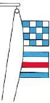|
|Correct Answer|Fahrzeug in Seenot.|
|Wrong Answer 1|Fahrzeug des öffentlichen Dienstes.|
|Wrong Answer 2|Fahrzeug mit gefährlichen Gütern.|
|Wrong Answer 3|Fahrzeug verlässt Liegeplatz.|

### 285. Card

|Attribut|Value|
|---|---|
|Id|5c94f649ead9f8e727896b225698573c|
|Question|285. Was bedeutet auf einem Schiff eines der folgenden Signale?|
|Image||
|Correct Answer|Fahrzeug in Seenot.|
|Wrong Answer 1|Fahrzeug ist manövrierbehindert.|
|Wrong Answer 2|Fahrzeug mit gefährlichen Gütern.|
|Wrong Answer 3|Fahrzeug vor Anker mit mehr als 100 m Länge.|

## Internal Id
665e109d-26f5-4c50-a848-ef8ccb4618ff