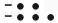
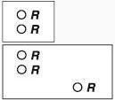
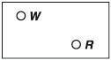
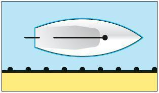

# SKS - Sportküstenschifferschein Theorie Fragen

## Description

Dies sind die Lernzettel für den SKS - Sportküstenschifferschein.
Hierzu wurden die offiziellen Prüfungsfragen von <https://www.elwis.de/> in Karteikarten übersetzt.

Stand des Exports ist: Stand: 01. Juli 2006

## Cards

### 1. Card

|Attribut|Value|
|---|---|
|Id|8b287ba273f435f214ce835cdf9732c4|
|Question|Worauf müssen Sie als Schiffsführer vor Reiseantritt hinsichtlich der Seekarten und Seebücher achten?|
|Answer|Auf Vollständigkeit der Unterlagen und deren Berichtigung auf den neuesten Stand.|

### 2. Card

|Attribut|Value|
|---|---|
|Id|4bd869c97de30c2c02ce503322a66198|
|Question|Warum muss in der GPS-Navigation das jeweilige Kartendatum unbedingt berücksichtigt werden?|
|Answer|Weil sich das von GPS verwendete Bezugssystem WGS 84 (World Geodetic System 1984) von anderen verwendeten Bezugssystemen (Kartendatum) unterscheiden kann.|

### 3. Card

|Attribut|Value|
|---|---|
|Id|e3bfa80c7e37867ebefcb435fd115901|
|Question|Welche Differenzen können zwischen WGS 84 und anderen Bezugssystemen auftreten?|
|Answer|Die Differenzen von φ und λ liegen im Allgemeinen in der Größenordnung von 0,1 kbl bis 1 kbl, also etwa von 20 bis 200 m. Es können größere Unterschiede auftreten.|

### 4. Card

|Attribut|Value|
|---|---|
|Id|15e79e156e6346fd23aef009deff378b|
|Question|Wo finden Sie in der Seekarte Angaben über das benutzte Bezugssystem und ggf. entsprechende Korrekturhinweise?|
|Answer|Am Kartenrand unter dem Titel.|

### 5. Card

|Attribut|Value|
|---|---|
|Id|96c9afc8d0c114751c28eedc3cd0aef6|
|Question|Wie lautet ggf. der Korrekturhinweis bezüglich GPS in der Seekarte, wenn das benutzte Kartendatum (z. B. ED 50) und WGS 84 nicht übereinstimmen?|
|Answer|Durch Satellitennavigation (z. B. GPS) erhaltene Positionen im WGS 84 sind 0, ... Minuten nordwärts/südwärts und 0, ... Minuten westwärts/ostwärts zu verlegen, um mit dieser Karte übereinzustimmen.|

### 6. Card

|Attribut|Value|
|---|---|
|Id|1c3fb94af05033a5881658ea1b08b1c2|
|Question|Woran erkennen Sie, bis wann eine deutsche Seekarte "amtlich" berichtigt ist?|
|Answer|Am Berichtigungsstempel des BSH oder einer amtlichen Seekartenberichtigungsstelle.|

### 7. Card

|Attribut|Value|
|---|---|
|Id|fbd09624f3ebc178aeaa1f33356c486c|
|Question|Woran erkennen Sie, bis wann eine britische Seekarte "amtlich" berichtigt ist?|
|Answer|Am Berichtigungsstempel auf der Rückseite der Seekarte.|

### 8. Card

|Attribut|Value|
|---|---|
|Id|9eef05486045c0f581f11fe162a1dcea|
|Question|Was bedeutet der Stempel auf der britischen Seekarte: Corrected up to N.T.M. 3595 1998?|
|Answer|Seekarte ist berichtigt bis zur Mitteilung Nummer 3595 der Admiralty Notices to Mariners (N.T.M.) in 1998.|

### 9. Card

|Attribut|Value|
|---|---|
|Id|a1836b928cfa04ec947e8925ca3c5028|
|Question|Welche Angaben enthalten die Nachrichten für Seefahrer (NfS)?|
|Answer|In den NfS werden für die sichere Schiffsführung wichtige Maßnahmen, Ereignisse und Veränderungen auf den Seeschifffahrtsstraßen, auf der Hohen See sowie in den Hoheitsgewässern anderer Staaten im europäischen und angrenzenden Bereich bekannt gegeben.|

### 10. Card

|Attribut|Value|
|---|---|
|Id|ce9782b21d12e310c7e597bbab4ae630|
|Question|In welcher Sprache werden die Nachrichten für Seefahrer (NfS) verfasst?|
|Answer|Die Angaben erfolgen in deutscher und in englischer Sprache.|

### 11. Card

|Attribut|Value|
|---|---|
|Id|9731d63083db97a04a7cc5fa1727abb9|
|Question|Welche Angaben enthalten deutsche und britische Leuchtfeuerverzeichnisse?|
|Answer|Beschreibung der Leuchtfeuer, Feuerschiffe und Großtonnen sowie deren geographische Lage.|

### 12. Card

|Attribut|Value|
|---|---|
|Id|d3d201f3014a2152a1888397eba3a7b8|
|Question|Welche schwimmenden Schifffahrtszeichen werden in der britischen List of Lights und in deutschen Leuchtfeuerverzeichnissen nicht angegeben?|
|Answer|Tonnen kleiner als 8 m Höhe.|

### 13. Card

|Attribut|Value|
|---|---|
|Id|1a0d19ecb9a0b0afce541e6aff58e65a|
|Question|Wo finden Sie Angaben über die Merkmale der Schifffahrtszeichen?|
|Answer|In den Leuchtfeuerverzeichnissen bzw. in der List of Lights sowie auszugsweise in den Seekarten.  In der Karte 1/INTInternational Hydrographic 1 des BSH.  Schwimmende Schifffahrtszeichen zusätzlich in der Anlage I zur SeeSchStrO (z. B. Tonnen des Lateral- bzw. Kardinalsystems).|

### 14. Card

|Attribut|Value|
|---|---|
|Id|5c442ef3b7e065d443e531ae723319b8|
|Question|Worauf beziehen sich die Höhenangaben der Leuchtfeuer in Leuchtfeuerverzeichnissen in der Nord- und Ostsee?|
|Answer|In Gewässern mit Gezeiten (z. B. Nordsee) auf mittleres Hochwasser, in gezeitenlosen Gewässern (z. B. Ostsee) auf mittleren Wasserstand.|

### 15. Card

|Attribut|Value|
|---|---|
|Id|95a5d896ebfa49c492bc873c1ca46f67|
|Question|Wo finden Sie Angaben über Brückensignale?|
|Answer|In den See- und Hafenhandbüchern und in den Seekarten.|

### 16. Card

|Attribut|Value|
|---|---|
|Id|4724c73fe1474c49353b9813da603cb3|
|Question|Welche Themen (Grobgliederung) enthalten die Seehandbücher des BSH?|
|Answer|Schifffahrtsangelegenheiten,  Naturverhältnisse,  Küstenkunde und Segelanweisungen.|

### 17. Card

|Attribut|Value|
|---|---|
|Id|5aa00fe6ad8bca0cd4df0b5f93b21958|
|Question|Wie werden Richtungsangaben in nautischen Veröffentlichungen gemacht?|
|Answer|Rechtweisend in Grad,  im Uhrzeigersinn (rechtsherum) zählend.|

### 18. Card

|Attribut|Value|
|---|---|
|Id|453a109c226d3ddccea696fa6e309210|
|Question|In welchem Quadranten liegt der rote Warnsektor eines Leitfeuers mit der Angabe rot 030°-042° (Begründung!)|
|Answer|Im Südwest-Quadranten. Angegeben sind die Peilungen zum Leuchtfeuer.|

### 19. Card

|Attribut|Value|
|---|---|
|Id|393e1a1e40660f127b496288ddd0aec1|
|Question|Was sind Leitfeuer (direction lights)?|
|Answer|Leitfeuer sind Einzelfeuer, die durch Sektoren verschiedener Farbe oder Kennung (Leit- oder Warnsektoren) im Allgemeinen ein Fahrwasser, eine Hafeneinfahrt oder einen freien Seeraum zwischen Untiefen bezeichnen.|

### 20. Card

|Attribut|Value|
|---|---|
|Id|62090c982cc56cf7489606bbbebedd03|
|Question|1. Was sind Richtfeuer (leading lights)? 2. Wann befindet man sich in einer Richtlinie eines Richtfeuers?|
|Answer|Richtfeuer sind Feuer, die als Unter- und Oberfeuer in Deckpeilung als Richtlinie beispielsweise einen Kurs im Fahrwasser, durch eine Hafeneinfahrt oder im freien Seeraum zwischen Untiefen bezeichnen.  Ein Schiff befindet sich in der Richtlinie, wenn Unter- und Oberfeuer senkrecht unter-/übereinander erscheinen.|

### 21. Card

|Attribut|Value|
|---|---|
|Id|aa38fc2366f812186d21fd71236f8250|
|Question|Was ist ein Torfeuer?|
|Answer|Ein Torfeuer besteht aus zwei Feuern gleicher Höhe, gleicher Lichtstärke und gleicher Kennung, die zu beiden Seiten der Fahrwasserachse einander genau gegenüber (rechtwinklig zur Fahrwasserachse) und von der Fahrwasserachse gleich weit entfernt angeordnet sind.|

### 22. Card

|Attribut|Value|
|---|---|
|Id|eb6485b28beca79451ed6cfb3c2506a4|
|Question|Was ist die "Tragweite" eines Feuers?|
|Answer|Unter Tragweite versteht man denjenigen Abstand, in dem ein Feuer einen eben noch deutlichen Lichteindruck im Auge des Beobachters hervorruft.|

### 23. Card

|Attribut|Value|
|---|---|
|Id|f70537f23726f95acf5e77f912201abb|
|Question|Was ist die "Nenntragweite" eines Feuers?|
|Answer|Nenntragweite ist die Tragweite eines Feuers für einen definierten Wert bei einer meteorologischen Sichtweite am Tage von 10 sm.|

### 24. Card

|Attribut|Value|
|---|---|
|Id|6abdacc6a1ec01d96afbd6fc80ec1504|
|Question|Wovon hängt die "Tragweite" eines Feuers ab?|
|Answer|Sie hängt u. a. ab  von der Lichtstärke (Helligkeit) des Feuers und  vom Sichtwert (Lichtdurchlässigkeit der Atmosphäre).|

### 25. Card

|Attribut|Value|
|---|---|
|Id|053938580cb5053ea8f089980dfdff4f|
|Question|In der Seekarte finden Sie bei einem Leuchtfeuer die Eintragung: 18 M. Was bedeutet diese Angabe?|
|Answer|Es ist die Nenntragweite, hier 18 Seemeilen.|

### 26. Card

|Attribut|Value|
|---|---|
|Id|99d1a2ffd53c4f2c485b51a122882a50|
|Question|Was ist die "Sichtweite" eines Feuers? Wovon hängt sie ab?|
|Answer|Sichtweite ist die Entfernung, auf die ein Leuchtfeuer über die Erdkrümmung (Kimm) hinweg vom Beobachter gesehen werden kann.  Sie hängt ab  von der Feuerhöhe und  von der Augeshöhe des Beobachters.|

### 27. Card

|Attribut|Value|
|---|---|
|Id|c4e813e6b54d479860202a8b92acc368|
|Question|Wie müssen sich Tragweite und Sichtweite zueinander verhalten, damit das Verfahren zur Ortsbestimmung "Feuer in der Kimm" angewandt werden kann?|
|Answer|Die Tragweite muss mindestens gleich der Sichtweite sein.|

### 28. Card

|Attribut|Value|
|---|---|
|Id|531befbcb87510b3f38b253ee8bbd231|
|Question|Wo findet man Tabellen zur Ermittlung des Abstandes eines Feuers in der Kimm?|
|Answer|In deutschen und britischen Leuchtfeuerverzeichnissen.|

### 29. Card

|Attribut|Value|
|---|---|
|Id|37a31f1de75f6c54d21dd9efeb7949e2|
|Question|Wo sind die in Seekarten verwendeten Symbole und Abkürzungen erklärt?|
|Answer|In der Karte 1/INT des BSH.|

### 30. Card

|Attribut|Value|
|---|---|
|Id|a54256b96547a9cf1610bf49c8011bdb|
|Question|Wer veröffentlicht die Bekanntmachungen für Seefahrer (BfS) und was umfassen diese Veröffentlichungen?|
|Answer|Die BfS werden von den jeweils zuständigen Behörden der Wasser- und Schifffahrtsverwaltung des Bundes bzw. der Länder veröffentlicht.  Sie enthalten alle wichtigen Maßnahmen und Ereignisse auf den Seeschifffahrtsstraßen und der ausschließlichen Wirtschaftszone Deutschlands.|

### 31. Card

|Attribut|Value|
|---|---|
|Id|5246921a40efd3b7f2b13a4f6219caaf|
|Question|Wie werden die Bekanntmachungen für Seefahrer (BfS) der Sportschifffahrt zur Kenntnis gebracht?|
|Answer|Die BfS werden an den amtlichen Aushangstellen (z. B. bei Wasser- und Schifffahrtsämtern, Hafenverwaltungen, WSP-Dienststellen, Schleusen, Yachthäfen) für das betreffende Seegebiet, in dem die Aushangstelle liegt, und für die angrenzenden Reviere und Gebiete sowie im Internet unter <www.elwis.de> zur Kenntnis gebracht.|

### 32. Card

|Attribut|Value|
|---|---|
|Id|a1c3154ea86231d3b54e02336468f7f4|
|Question|Zählen Sie die am häufigsten vorkommenden Ereignisse und Maßnahmen auf, über die die Bekanntmachungen für Seefahrer (BfS) unterrichten.|
|Answer|Änderungen an Befeuerung, Betonnung und Landmarken,  veränderte Wassertiefen,  Wracke, Schifffahrtshindernisse, Rohrleitungen usw.,  Bauarbeiten, Baggerarbeiten, militärische Übungen und damit zusammenhängende Sperrungen oder Behinderungen.|

### 33. Card

|Attribut|Value|
|---|---|
|Id|f2c39e2d01db65570aac0f31d5a03003|
|Question|Wer gibt die nautischen Warnnachrichten (NWN) heraus und von wem werden sie verbreitet?|
|Answer|Nautische Warnnachrichten (NWN) werden von den Verkehrszentralen für deren Zuständigkeitsbereich und von dem ständig besetzten Seewarndienst Emden für das gesamte deutsche Warngebiet zur Verbreitung über Funk herausgegeben. Der Rundfunksender Deutschlandfunk verbreitet alle über Funk abgegebenen NWN.|

### 34. Card

|Attribut|Value|
|---|---|
|Id|39fe1e83b5b8afe9d036aec92439a9e0|
|Question|Was bedeutet der Zusatz "vital" bei einer nautischen Warnnachricht (NWN)?|
|Answer|Die NWN erhält den Zusatz "vital", wenn die Warnung auf eine lebensbedrohende Gefahr hinweist.|

### 35. Card

|Attribut|Value|
|---|---|
|Id|1302fdccaeb2a206b36f40256efeb4f2|
|Question|Welche Besonderheit bezüglich des Zusatzes "vital" bei einer nautischen Warnnachricht (NWN) gibt es für die Sportschifffahrt?|
|Answer|Vitale nautische Warnnachrichten für die Sportschifffahrt werden während der Zeit vom 1. April bis zum 31. Oktober zur Verbreitung über ausgewählte private und öffentlich-rechtliche Rundfunkanstalten weitergeleitet.|

### 36. Card

|Attribut|Value|
|---|---|
|Id|c3a4627435a0717856f5e20f3b3178c6|
|Question|Wer gibt die Nachrichten für Seefahrer (NfS) heraus und wie und wie oft erfolgt die Herausgabe?|
|Answer|Die NfS werden vom BSH in Heftform und im Internet herausgegeben und erscheinen einmal wöchentlich.|

### 37. Card

|Attribut|Value|
|---|---|
|Id|3cba5305ffe81942a45dcecb1a3adf97|
|Question|Welche Unterlage steht Ihnen zur Verfügung zur Berichtigung von britischen Seekarten, die nicht von den NfS erfasst werden?|
|Answer|Die britischen Notices to Mariners.|

### 38. Card

|Attribut|Value|
|---|---|
|Id|397cc32901d7cf1dd958461712da3754|
|Question|1. Was sind P-Nachrichten? 2. Wie verfährt man mit diesen Nachrichten im Berichtigungsverfahren? (Begründung!)|
|Answer|P-Nachrichten sind solche, die eine bevorstehende (preliminary) Maßnahme ankündigen.  Wegen der begrenzten Geltungsdauer werden keine Berichtigungen auf der Grundlage von P-Nachrichten vom BSH bzw. von amtlichen Seekartenberichtigungsstellen durchgeführt. Deshalb müssen vor Gebrauch jeder Seekarte die noch gültigen P-Nachrichten erfasst und in der Karte vermerkt werden.|

### 39. Card

|Attribut|Value|
|---|---|
|Id|123558a2285457d7d87a5efd437aff99|
|Question|1. Was sind T-Nachrichten? 2. Wie verfährt man mit diesen Nachrichten im Berichtigungsverfahren? (Begründung!)|
|Answer|T-Nachrichten sind solche, die über einen zeitweiligen (temporary) Zustand unterrichten.  Wegen der begrenzten Geltungsdauer werden keine Berichtigungen auf der Grundlage von T-Nachrichten vom BSH bzw. amtlichen Seekartenberichtigungsstellen durchgeführt. Deshalb müssen vor Gebrauch jeder Seekarte die noch gültigen T-Nachrichten erfasst und in der Karte vermerkt werden.|

### 40. Card

|Attribut|Value|
|---|---|
|Id|90a48a00b1cfc116589059af0dd1a94d|
|Question|Worauf muss beim Ansteuern einer Küste bei der Auswahl von Seekarten geachtet werden? Begründen Sie Ihre Antwort.|
|Answer|Seekarten mit größtmöglichem Maßstab verwenden. Nur in diesen Karten sind alle Schifffahrtszeichen und weitere für die Navigation wichtigen Informationen eingetragen.|

### 41. Card

|Attribut|Value|
|---|---|
|Id|8b50d6f161f13b9338809e19306a8316|
|Question|Was müssen Sie bei Kursberechnungen hinsichtlich der in der Seekarte angegebenen Ortsmissweisungen beachten?|
|Answer|Die für ein bestimmtes Jahr angegebene Missweisung muss mittels der in der Seekarte angegebenen jährlichen Änderung für das aktuelle Jahr berichtigt werden.|

### 42. Card

|Attribut|Value|
|---|---|
|Id|fbfceb3577902a2dcaef0dfa905c197e|
|Question|Was müssen Sie bei der Benutzung von deutschen "Sportbootkarten" beachten?|
|Answer|Sie werden nach dem Druck weder vom BSH noch von den Seekartenvertriebsstellen berichtigt. Sie müssen also vom Nutzer nach dem Kauf vor Benutzung über die NfS auf den aktuellen Stand berichtigt werden.|

### 43. Card

|Attribut|Value|
|---|---|
|Id|0d63c765acd83a21332184d605549a85|
|Question|Nach welcher Faustregel können Sie m/s in Knoten umrechnen?|
|Answer|"Doppelt so viele Knoten (kn) wie m/s" oder "m/s multipliziert mit 2 = kn".|

### 44. Card

|Attribut|Value|
|---|---|
|Id|6276467d6b3b744dd815e800f8aeadd0|
|Question|Was müssen Sie beachten, wenn Sie die mit Loggen ermittelte Fahrt z. B. für das Arbeiten in Seekarten berücksichtigen wollen?|
|Answer|Die üblichen Logmethoden liefern ausschließlich die "Fahrt durchs Wasser (FdW)". Um die "Fahrt über Grund (FüG)" zu ermitteln, müssen Stromrichtung und Stromgeschwindigkeit berücksichtigt werden.|

### 45. Card

|Attribut|Value|
|---|---|
|Id|899df897f246c08b212b13c5117e24cc|
|Question|Welche Fahrt zeigen GPS-Geräte an?|
|Answer|Die Fahrt über Grund (FüG).|

### 46. Card

|Attribut|Value|
|---|---|
|Id|3cb008345bb93631770c22f01f58fc75|
|Question|Welchen Kurs zeigen GPS-Geräte an?|
|Answer|Den Kurs über Grund (KüG).|

### 47. Card

|Attribut|Value|
|---|---|
|Id|db2c6ba0005696ef2a42b1a80d3c4d45|
|Question|Warum müssen Sie Ihre Position regelmäßig in die Seekarte eintragen?|
|Answer|Um Abweichungen von der Kurslinie frühzeitig und sicher zu erkennen und um ggf. den Kurs zu berichtigen.|

### 48. Card

|Attribut|Value|
|---|---|
|Id|a0d03f846d51beda782812625d43e53a|
|Question|Was ist die Besteckversetzung (BV)?|
|Answer|Richtung (rw) und Entfernung (in sm) vom Koppelort (Ok) zum beobachteten Ort (Ob), bezogen auf den gleichen Zeitpunkt.|

### 49. Card

|Attribut|Value|
|---|---|
|Id|02f37226a8546988bbf8d42000f2a548|
|Question|Welche Ursachen kann die Besteckversetzung (BV) haben?|
|Answer|Die BV kann folgende Ursachen haben:  ungenaues Steuern und Koppeln,  Kursfehler (z. B. ungenaue Steuertafel) und  fehlende oder unvollständige Berücksichtigung von Strom und Wind.|

### 50. Card

|Attribut|Value|
|---|---|
|Id|3a2d99bf29b345d1f64b82d7e282621e|
|Question|Warum sollte der Winkel zwischen zwei Peilungen nicht kleiner als 30° und nicht größer als 150° sein?|
|Answer|Damit der gefundene Standort eine ausreichend sichere Positionsbestimmung ergibt.|

### 51. Card

|Attribut|Value|
|---|---|
|Id|cd996b27d142536439618c5cc9d3d1bc|
|Question|Warum sind regelmäßige Kompasskontrollen erforderlich?|
|Answer|Zur Überprüfung der Funktionsfähigkeit des Kompasses und der Werte in der Ablenkungstabelle.|

### 52. Card

|Attribut|Value|
|---|---|
|Id|d56885a3a092fc1beae3db381662adcb|
|Question|Wodurch können auch in gezeitenlosen Revieren erhebliche Wasserstandsschwankungen und Strömungen (z. B. Triftstrom) hervorgerufen werden?|
|Answer|Durch Stärke, Dauer und Richtung des Windes oder "Zurückschwappen" aufgestauter Wassermassen (z. B. Ostsee).|

### 53. Card

|Attribut|Value|
|---|---|
|Id|1e806754baa2ae662e88ba3553c90d4f|
|Question|Welche navigatorischen Vorbereitungen treffen Sie vor einer Fahrt in Dunkelheit?|
|Answer|Kurse und Kursänderungspunkte möglichst vorausbestimmen,  Untiefen und Hindernisse in der Karte besonders kennzeichnen,  in der Seekarte markieren, welche Leuchtfeuer wann und wo in der Kimm erscheinen und  Wegstrecke nach unbefeuerten Tonnen absuchen.|

### 54. Card

|Attribut|Value|
|---|---|
|Id|0b42d6eec272e41e8c14d4db6ed8b06a|
|Question|Welche Möglichkeiten der terrestrischen Ortsbestimmung muss man kennen?|
|Answer|Kreuzpeilung,  Peilung und Abstand (Feuer in der Kimm, Radarabstand),  Peilung und Lotung.|

### 55. Card

|Attribut|Value|
|---|---|
|Id|0152d8ce9010a5efe3be16ff76f1d355|
|Question|Nennen Sie zwei Möglichkeiten der Ortsbestimmung, wenn Sie nur ein Objekt mit bekannten Merkmalen (z. B. Leuchtturm) in Sicht haben.|
|Answer|Peilung und Abstand (Feuer in der Kimm, Radarabstand),  Peilung und Lotung.|

### 56. Card

|Attribut|Value|
|---|---|
|Id|7425afe295943d5169653b1b3eab0394|
|Question|Welche Nordrichtungen werden in der Navigation unterschieden? Erläutern Sie diese kurz.|
|Answer|rwN: rechtweisend Nord ist die Richtung eines Meridians zum geographischen Nordpol.  mwN: missweisend Nord ist die Richtung des erdmagnetischen Feldes zum magnetischen Nordpol, abhängig von Schiffsort und Datum (Jahr). In diese Richtung stellt sich eine ungestörte Magnet-(Kompass-)nadel ein.  MgN: ist die Richtung zu Magnetkompass-Nord. In diese Richtung zeigt die durch das schiffsmagnetische Feld beeinflusste Kompassnadel an Bord.|

### 57. Card

|Attribut|Value|
|---|---|
|Id|51ab477ef9aff8348c227563b2c61723|
|Question|Nennen Sie die Winkel zwischen den Nordrichtungen rechtweisend Nord (rwN), missweisend Nord (mwN) und Magnetkompass-Nord (MgN).|
|Answer|Mw: Missweisung ist der Winkel von rwN nach mwN.  Abl: Ablenkung (Abl) oder Deviation (Dev) ist der Winkel von mwN nach MgN.|

### 58. Card

|Attribut|Value|
|---|---|
|Id|8c97bd0dc39ad90e39491162c73da2a2|
|Question|Nennen Sie den Winkel zwischen den Nordrichtungen rwN und MgN.|
|Answer|Der Winkel von rwN nach MgN ist die Fehlweisung (Fw; Abl + Mw = Fw).|

### 59. Card

|Attribut|Value|
|---|---|
|Id|23fec5dc4c67399bb918fca4f6e71dfb|
|Question|Wo finden Sie die erforderlichen Werte der Missweisung? Worauf ist dabei zu achten?|
|Answer|Die Missweisung findet sich in der Seekarte eingedruckt für ein bestimmtes Jahr.  Dieser Wert muss mit der ebenfalls in der Seekarte angegebenen jährlichen Änderung auf das Jahr der Benutzung berichtigt werden.|

### 60. Card

|Attribut|Value|
|---|---|
|Id|c16dca77e1da9c9acb8f01d983d8ac20|
|Question|Wo finden Sie die erforderlichen Werte der Ablenkung (Abl)? Worauf ist dabei zu achten?|
|Answer|Die Abl wird einer Ablenkungstabelle entnommen.  Die Abl ist abhängig vom anliegenden Kurs.|

### 61. Card

|Attribut|Value|
|---|---|
|Id|d4ac5112a3c92551bd5ec67526a6eb3f|
|Question|Warum muss für jedes Fahrzeug eine eigene Ablenkungstabelle (Steuertafel) erstellt werden?|
|Answer|Die Ablenkungstabelle kann auf jedem Schiff andere Werte haben.|

### 62. Card

|Attribut|Value|
|---|---|
|Id|3fdd058270be4f3d3490a18b2ee989bc|
|Question|Worauf müssen Sie achten, wenn eine Magnetkompasspeilung (MgP) auf eine rechtweisende Peilung (rwP) beschickt werden soll?|
|Answer|Abl für den anliegenden MgK (Magnetkompasskurs) aus der Steuertafel (Ablenkungstabelle) entnehmen; an den so erhaltenen mwK (missweisenden Kurs) die für das laufende Jahr der Seekarte entnommene Mw anbringen.|

### 63. Card

|Attribut|Value|
|---|---|
|Id|84e14596e65ac583d3ebbe83473bbcfb|
|Question|Unter welchen Voraussetzungen ergibt sich eine brauchbare Standlinie aus einer Lotung?|
|Answer|Der Meeresgrund muss ausreichend regelmäßig und ausreichend steil ansteigen/abfallen.|

### 64. Card

|Attribut|Value|
|---|---|
|Id|cf126b8a55e8ae708f6f191099016706|
|Question|Neben den Fahrwassertonnen liegen auf den Seeschifffahrtsstraßen weitere Tonnen aus, die für die Sportschifffahrt besonders wichtig sind. Welche Schifffahrtszeichen sind das?|
|Answer|Sonderzeichen zur Bezeichnung von Sperrgebieten und Kardinalzeichen für allgemeine Gefahrenstellen.|

### 65. Card

|Attribut|Value|
|---|---|
|Id|2374245b38c5786a297e90d3c7c5d550|
|Question|Aus welchen nautischen Publikationen können Sie Sperr- und Verbotsgebiete mit ihren Grenzen ersehen?|
|Answer|Aus den Seekarten, Bekanntmachungen für Seefahrer (BfS) und Nautischen Warnnachrichten (NWN).|

### 66. Card

|Attribut|Value|
|---|---|
|Id|f5ffcba271d86afe0dede4ad0ea67bc4|
|Question|Welche Sonderzeichen kennzeichnen Reeden, besondere Gebiete oder Stellen, z. B. Warngebiete?|
|Answer|Gelbe Fasstonnen, Leuchttonnen, Spierentonnen oder Stangen.|

### 67. Card

|Attribut|Value|
|---|---|
|Id|df63dbb93af13bbceee30c70cc2be2c5|
|Question|Welche Sonderzeichen kennzeichnen Sperrgebiete?|
|Answer|Gelbe Fasstonnen, Leuchttonnen, Spierentonnen oder Stangen mit einem breiten roten Band. Beschriftung auf Fasstonne oder Leuchttonne mit schwarzen Buchstaben: "Sperrgebiet" oder "Sperr-G".|

### 68. Card

|Attribut|Value|
|---|---|
|Id|0f7d388597e7334f847885ac2389af95|
|Question|Welche Farbe haben Feuer auf Sonderzeichen, wenn vorhanden?|
|Answer|Farbe gelb.|

### 69. Card

|Attribut|Value|
|---|---|
|Id|e0ec95bc0ade2c691ee8faa3d30d0f76|
|Question|Was bedeutet das Ausliegen der folgenden Schifffahrtszeichen: weiße Fasstonne, Kugeltonne oder Stange mit einem - von oben gesehen - rechtwinkligen gelben Kreuz bzw. bei Stangen mit einem breiten gelben Band?|
|Answer|Fahrverbot für Maschinenfahrzeuge und Wassermotorräder auf wegen Badebetrieb gesperrten Wasserflächen.|

### 70. Card

|Attribut|Value|
|---|---|
|Id|38c2b8d1aaa5665bdee74b8b8963b9c8|
|Question|Wie stehen Sonne und Mond winkelmäßig zur Erde bei Springzeit und bei Nippzeit (die Springverspätung soll hier unberücksichtigt bleiben)?|
|Answer|Bei Springzeit befinden sich Mond und Sonne in einer Ebene mit der Erde, bei Nippzeit stehen die Verbindungslinien Erde/Sonne und Erde/Mond im rechten Winkel zueinander.|

### 71. Card

|Attribut|Value|
|---|---|
|Id|cb35bc55569612b79bc83c05e1e15271|
|Question|Erklären Sie den Begriff "Alter der Gezeit".|
|Answer|Das Alter der Gezeit gibt an, in welcher Phase (Nippzeit, Mittzeit, Springzeit) sich das aktuelle Tidengeschehen befindet.|

### 72. Card

|Attribut|Value|
|---|---|
|Id|052f3547dbccc35ff7019f4c81f0febf|
|Question|Warum findet man z. B. bei Bezugsorten in der Nordsee bzw. im Englischen Kanal zeitweise nur ein Hoch- bzw. Niedrigwasser pro Tag?|
|Answer|Die Umlaufzeit des Mondes um die Erde dauert im Mittel 24 h 50 min. (Mondtag) gegenüber dem Sonnentag (= 24 h). Deshalb "rutscht" das letzte HW oder NW zeitweise in den nächsten Tag.|

### 73. Card

|Attribut|Value|
|---|---|
|Id|1355d004714bd3b6aa8a03dc542435ac|
|Question|Weshalb und wie können die tatsächlichen Wasserstände von den Angaben in den Gezeitentafeln teilweise erheblich abweichen?|
|Answer|Durch Wind und/oder durch sehr hohen bzw. sehr niedrigen Luftdruck können erhebliche Wasserstandsänderungen entstehen. HWH bzw. NWH können höher oder niedriger sein als angegeben, die Hoch- und Niedrigwasserzeit kann füher oder später eintreten als angegeben.|

### 74. Card

|Attribut|Value|
|---|---|
|Id|3a2b9c21893c70f0e6495ceda83033e0|
|Question|Worauf beziehen sich die Tiefenangaben in Seekarten in den deutschen Gewässern der Ost- und Nordsee?|
|Answer|Auf Kartennull (KN).|

### 75. Card

|Attribut|Value|
|---|---|
|Id|3b1ccdb11cbaf2180a73a69e46a83814|
|Question|Was ist Kartennull?|
|Answer|Kartennull (KN) ist die Bezugsfläche für die Tiefenangaben in einer Seekarte.|

### 76. Card

|Attribut|Value|
|---|---|
|Id|acb41d405db2417dd75be2c63a06bc96|
|Question|Wie ist Kartennull (KN) in der Ost- und Nordsee und im Englischen Kanal definiert? Wo finden Sie die entsprechenden Angaben zur Kartennullebene?|
|Answer|In der Ostsee entspricht KN dem mittleren Wasserstand. In der Nordsee und im Englischen Kanal entspricht KN dem niedrigstmöglichen Gezeitenwasserstand (LAT = Lowest Astronomical Tide). In der jeweiligen Seekarte ist die Kartennullebene beschrieben.|

### 77. Card

|Attribut|Value|
|---|---|
|Id|f8bc40c9d6f555a29e4725613f070960|
|Question|Was müssen Sie bedenken, wenn Sie die Wassertiefe außerhalb der Niedrigwasserzeit loten?|
|Answer|Beim folgenden Niedrigwasser wird die Wassertiefe geringer sein als zum Zeitpunkt der Lotung.|

### 78. Card

|Attribut|Value|
|---|---|
|Id|f63cb272f6a9a6e57dec67c8ee647303|
|Question|Was ist die Kartentiefe?|
|Answer|Die Kartentiefe (KT) ist die auf Kartennull bezogene Wassertiefe. Kartentiefe ist Wassertiefe abzüglich Höhe der Gezeit.|

### 79. Card

|Attribut|Value|
|---|---|
|Id|d2c74cb02dc2d63912a48810c6ed9619|
|Question|Mit welcher Wassertiefe können Sie bei einer Lotung normalerweise mindestens rechnen?|
|Answer|Mit der Kartentiefe.|

### 80. Card

|Attribut|Value|
|---|---|
|Id|a4fd86fc13712ef3a5ec8f35559397c1|
|Question|Welche Bedeutung hat die Angabe "Springzeit" für die Wasserstände in Gezeitengebieten?|
|Answer|Zur Springzeit sind besonders hohe Hochwasser und besonders niedrige Niedrigwasser zu erwarten.|

### 81. Card

|Attribut|Value|
|---|---|
|Id|eac15b28672312085ad9ef183921b6ca|
|Question|Welche Bedeutung hat die Angabe "Nippzeit" für die Wasserstände in Gezeitengebieten?|
|Answer|Zur Nippzeit sind besonders niedrige Hochwasser und besonders hohe Niedrigwasser zu erwarten.|

### 82. Card

|Attribut|Value|
|---|---|
|Id|eecaabab3df7f9a53026d77c06630b10|
|Question|Welche Bedeutung haben die Angaben "Nippzeit" bzw. "Springzeit" für die Gezeitenströme?|
|Answer|Zur Springzeit setzen die Gezeitenströme z. T. deutlich stärker als zur Nippzeit.|

### 83. Card

|Attribut|Value|
|---|---|
|Id|657ca981313daad1a64cf6757fbe27a3|
|Question|Wo können Sie Informationen über Gezeitenströme in Küstengewässern finden?|
|Answer|In Gezeitenstromatlanten, Seehandbüchern,  in Seekarten aus Gezeitenstromtabellen, die bezogen sind auf die Hochwasserzeiten des dort genannten Bezugsortes.|

### 84. Card

|Attribut|Value|
|---|---|
|Id|8e98d173b48bffb2b46dbe20761e7ad6|
|Question|Auf einer Seekarte finden Sie in Küstennähe die Tiefenangabe 23. Was bedeutet das?|
|Answer|Der Ort der Zahl liegt 2,3 m über Kartennull und kann trockenfallen.|

### 85. Card

|Attribut|Value|
|---|---|
|Id|29b3276364d692decad4d83c13978f8d|
|Question|In welchem Zusammenhang stehen Kartentiefe (KT), Wassertiefe (WT) und Höhe der Gezeit (H)?|
|Answer|WT - H = KT oder KT + H = WT (Lösung auch als Skizze möglich).|

### 86. Card

|Attribut|Value|
|---|---|
|Id|0d06fd7bd8cf0a446b515b21dffe431c|
|Question|Warum ist es in Tidengewässern wichtig, die Uhrzeit einer Lotung festzuhalten?|
|Answer|Um anhand der Gezeitentafel feststellen zu können, ob das Wasser steigt oder fällt.|

### 87. Card

|Attribut|Value|
|---|---|
|Id|2b6f81c952e5d3e4918fec6ed89f7fa2|
|Question|Was ist ein Pegel?|
|Answer|Eine Skala zur Anzeige des Wasserstandes.|

### 88. Card

|Attribut|Value|
|---|---|
|Id|0ec59d501a5eed1d6d625877decb14a7|
|Question|Welchen Einfluss kann der Wind auf die Gezeiten haben?|
|Answer|Der Wind kann Strömungen und Wasserstandsänderungen hervorrufen, die zu den Gezeitenströmen und den Gezeiten hinzutreten.|

### 89. Card

|Attribut|Value|
|---|---|
|Id|4624c4e2963489b0291a4a86867ede22|
|Question|Nennen Sie drei wichtige Vorzüge von GPS.|
|Answer|GPS arbeitet weltweit.  Die Positionsanzeige ist jederzeit verfügbar.  Der Positionsfehler ist gering.|

### 90. Card

|Attribut|Value|
|---|---|
|Id|27f64ae8d0523890fd200bda5ef22816|
|Question|Wie groß ist die typische und realistische Genauigkeit von Positionen, die mit GPS und DGPS ermittelt werden?|
|Answer|GPS: 10 - 20 m bei einer Wahrscheinlichkeit von etwa 95 %.  DGPS: 1 - 10 m bei einer Wahrscheinlichkeit von etwa 95 %.|

### 91. Card

|Attribut|Value|
|---|---|
|Id|d49fec7eb322e5766fcca7f6cfc7db24|
|Question|Wo muss man mit ungenauen Anzeigen des GPS rechnen?|
|Answer|Bei Abschattung der GPS-Antenne.  In der Nähe von Flughäfen und in der Nähe von Fernsehsendern.  In der Nähe von Marineeinrichtungen.  Bei Nutzung von UKW-Geräten und anderen elektronischen/elektrischen Geräten an Bord.|

### 92. Card

|Attribut|Value|
|---|---|
|Id|42a6b24cc931506738160e28db1ef963|
|Question|Was bedeutet die Abkürzung GPS?|
|Answer|Global Positioning System.|

### 93. Card

|Attribut|Value|
|---|---|
|Id|8357b951b5204f9e14db21cb22399b45|
|Question|Was ist das Grundprinzip von GPS?|
|Answer|Durch Laufzeitmessungen von GPS-Signalen vom Satelliten zum Empfänger und damit durch Abstandsmessungen zu den Satelliten wird die Ortsbestimmung ermöglicht.|

### 94. Card

|Attribut|Value|
|---|---|
|Id|07a63aebe0a7b20478595c77e2f139b7|
|Question|Was bedeutet die Abkürzung DGPS und nach welchem Prinzip arbeitet DGPS?|
|Answer|DGPS = Differential Global Positioning System. Hierbei handelt es sich um eine regionale Verbesserung der Ortsbestimmung. Dabei werden von Referenzstationen über Funk Korrekturwerte für die GPS-Messwerte an die Schiffe übertragen.|

### 95. Card

|Attribut|Value|
|---|---|
|Id|8c8dc467acc8a81926cac7da19d63fd5|
|Question|Was ist bei Anbringung einer GPS-Antenne zu beachten?|
|Answer|Sie muss ringsum freie Sicht (ohne Abschattungen) haben.  Einwandfreie Erdung.|

### 96. Card

|Attribut|Value|
|---|---|
|Id|01910e311dff858ecbd236a9cbdaf687|
|Question|Was bewirkt die Bedienung der MOB-Taste bei GPS-Geräten?|
|Answer|Die Position zur Zeit des Tastendrucks wird gespeichert.  Rechtweisende Peilung (rwP) und Distanz zu diesem Punkt werden angezeigt.|

### 97. Card

|Attribut|Value|
|---|---|
|Id|d796bfcefd3676863f21f599ca122ef5|
|Question|Was bedeutet die Aussage: "Die Ortsgenauigkeit beträgt 100 m mit einer Wahrscheinlichkeit von 95 %"?|
|Answer|Das Schiff befindet sich mit einer Wahrscheinlichkeit von 95 % in einem Fehlerkreis von 100 m Radius um den beobachteten Ort. Also: jede 20. Ortsbestimmung (5 %) ist ungenauer als ca. 100 m.|

### 98. Card

|Attribut|Value|
|---|---|
|Id|4161aaecf0ce0e7459397939940fecb9|
|Question|Wie kann man feststellen, ob die GPS-Position genau bzw. zuverlässig ist?|
|Answer|Durch den vom Empfänger angezeigten HDOP (horizontal dilution of precision = Satellitenverteilung).  Durch die vom Empfänger angezeigte Anzahl der getrackten Satelliten.  Durch Vergleich mit anderen Navigationssystemen und der Koppelposition.|

### 99. Card

|Attribut|Value|
|---|---|
|Id|86192150b8ff85a9e02e348b342c93c7|
|Question|Was ist bei Eintragung eines GPS-Ortes in eine Seekarte zu beachten?|
|Answer|Das Bezugssystem muss übereinstimmen. Dieses kann geschehen durch:  Auswahl und Einstellung des Kartenbezugssystems im Empfänger.  Manuelle Verschiebung des GPS-Ortes um die in der Seekarte angegebenen N/S- und E/W-Korrektur.  Verwendung von Seekarten, die auf dem System WGS 84 beruhen.|

### 100. Card

|Attribut|Value|
|---|---|
|Id|d6c12d5bcbf2195e12f41dbd178aa1d9|
|Question|Was ist ein Wegpunkt?|
|Answer|Geographische Koordination eines anzusteuernden Punktes.|

### 101. Card

|Attribut|Value|
|---|---|
|Id|4df652d9a1c9b5d312d8a809f0303133|
|Question|Was bedeutet WGS 84 und was wird damit erreicht?|
|Answer|Globales Bezugssystem "World Geodetic System 1984".  Mit diesem System (= Referenzellipsoid bei GPS) wird weltweit eine optimale Anpassung an die reale Form des gesamten Erdkörpers erreicht.|

### 102. Card

|Attribut|Value|
|---|---|
|Id|530e26c097abf766be7747d36df4a691|
|Question|Wodurch können Radarechos von kleinen Fahrzeugen und Tonnen auf den Sichtschirmen von Radargeräten "verschwinden"?|
|Answer|Durch Seegang und/oder Niederschlag,  durch falsche Bedienung,  durch zu große Entfernung,  durch Gieren des eigenen Fahrzeugs bei relativ vorausorientierter Radarstellung (head up).|

### 103. Card

|Attribut|Value|
|---|---|
|Id|9840863c5967309e41a89ff93953b1c0|
|Question|Wie kann man mit Radar den eigenen Schiffsort bestimmen?|
|Answer|Peilung des Objektes gibt einen Peilstrahl als Standlinie.  Abstandsmessung mit dem VRM (Variable Range Marker) gibt einen Abstandskreis als Standlinie.|

### 104. Card

|Attribut|Value|
|---|---|
|Id|6f2baeb70680501765776d6f5a43c1df|
|Question|Wie kann man gegebenenfalls verhindern, dass sich Echoanzeigen von Zielen (z. B. 2 Tonnen, 2 Molenköpfe) überlappen?|
|Answer|Kurze Impulslänge wählen.  Messbereich verkleinern.|

### 105. Card

|Attribut|Value|
|---|---|
|Id|91abf29695b4064e329b128490a84a52|
|Question|Was bedeutet der Begriff AIS auf See?|
|Answer|AIS bezeichnet das automatische Identifizierungssystem (Automatic Identification System).|

### 106. Card

|Attribut|Value|
|---|---|
|Id|20c65a952494af4da471b0381b61fa29|
|Question|Welche Aufgaben hat AIS?|
|Answer|Alle ausgerüsteten Schiffe senden automatisch (also ohne Aufforderung und menschliches Eingreifen) in regelmäßigen kurzen Abständen ihre Identität und einen schiffsbezogenen Datensatz. Außerdem können bei Bedarf sicherheitsrelevante Nachrichten ("safety related messages") von Bord oder von Landstationen gesendet werden.|

### 107. Card

|Attribut|Value|
|---|---|
|Id|c3e9af8c50345ed2e65acd138f707804|
|Question|Welche Reichweite hat ein AIS-Bordgerät und wovon ist sie abhängig?|
|Answer|Die Reichweite und Ausbreitungsbedingungen entsprechen denen von UKW. Bei Handelsschiffen kann man von 20 bis 30 sm ausgehen. Die Reichweite ist abhängig von der Antennenhöhe.|

### 108. Card

|Attribut|Value|
|---|---|
|Id|2b1d91482ffd590e43e18387b50a9a78|
|Question|Wie kann die Reichweite eines AIS-Bordgerätes landseitig erhöht werden und wie wirken sich dabei Hindernisse (z. B. Berge) aus?|
|Answer|Unter bestimmten Umständen kann die Reichweite heraufgesetzt werden (z. B. mit Hilfe von "Relaisstationen"), wobei ggf. auch abschattende Hindernisse umgangen werden können.|

### 109. Card

|Attribut|Value|
|---|---|
|Id|9d06fa6aaaa864bd16bb5abb29ad874d|
|Question|Welche AIS-Daten werden von Schiffen aus der Berufsschifffahrt gesendet?|
|Answer|Statische Daten: ID, Rufzeichen, Länge und Breite des Schiffes u. a.  Dynamische Daten (i. W. Sensordaten): UTC, Position, Heading, Kurs und Fahrt über Grund, ggf. Rate-of-turn, Fahrtstatus (z. B. Maschinenfahrzeug mit Fahrt durchs Wasser, Ankerlieger, manövrierbehindertes Fahrzeug).  Reisebezogene Daten: Tiefgang, Zielort (Destinaton), ETA u. a.|

### 110. Card

|Attribut|Value|
|---|---|
|Id|1642a01893ff7af9fa58d6d6cf0d0852|
|Question|Wann kann man sich auf die Verfügbarkeit und Anzeige vn AIS-Signalen anderer Fahrzeuge verlassen? Nennen Sie die wesentlichen Voraussetzungen!|
|Answer|Andere Fahrzeuge werden nur angezeigt, wenn das Fahrzeug auch sendet, d. h., wenn  das Fahrzeug mit AIS ausgerüstet ist,  das sendende Fahrzeug AIS nicht abgeschaltet hat (darf der Kapitän allerdings nur bei bestimmten zwingenden Gründen),  GPS aktiv ist und  aus Kapazitätsgründen (z. B. durch zu viele Schiffe in einem Seegebiet = "target overflow") keine Fahrzeuge ausgeschlossen werden.|

### 111. Card

|Attribut|Value|
|---|---|
|Id|4e6afaad81d1fbc52b5f083fb158a1cb|
|Question|Wie ist die Genauigkeit von AIS-Daten zu beurteilen (Position und manuell eingegebene Daten)?|
|Answer|Position: Mit AIS wird zusätzlich zur GPS-Position eines Schiffes die Information übertragen, ob es sich um einen GPS- oder DGPS-Ort handelt. Ist die GPS-Position eines Schiffes falsch, wird diese falsche Position auf allen anderen Schiffen angezeigt.  Manuell eingegebene Daten: Es muss damit gerechnet werden, dass Zielort, Tiefgang, Fahrtstatus u. a. falsch sind, wenn sie - z. B. aus Nachlässigkeit - nicht von der Schiffsführung aufdatiert werden.|

### 112. Card

|Attribut|Value|
|---|---|
|Id|4dd1c775742c23fcdd17fdb85d26af18|
|Question|Welche besondere Bedeutung hat AIS für die Sportschifffahrt im Vergleich mit der Radaranzeige auf anderen Schiffen?|
|Answer|Sportfahrzeuge werden häufig auf den Radargeräten anderer Schiffe nicht sicher angezeigt bzw. die Anzeigen gehen im Seegangsclutter oder in der Informationsfülle unter. Da jetzt auf vielen Schiffen die AIS-Daten zusätzlich im Radar dargestellt werden, besteht die Gefahr, dass Sportfahrzeuge noch weniger auffällig sind, wenn sie nicht selbst mit AIS ausgerüstet sind.|

### 113. Card

|Attribut|Value|
|---|---|
|Id|f57bb7dc99ea270533b1ed9f2166166d|
|Question|Welche Navigationsgeräte sollten Sie auf einer Yacht auch bei Kurzfahrten nahe der Küste mindestens an Bord haben?|
|Answer|Steuerkompass, Peilkompass, Lot, Log, Uhr.|

### 114. Card

|Attribut|Value|
|---|---|
|Id|a94d80581ffaff7584fa7a8428bc01ce|
|Question|Was gehört zur navigatorischen Mindestausrüstung einer Yacht in Küstengewässern? Nennen Sie mindestens 6 Beispiele.|
|Answer|Steuerkompass,  Peileinrichtung,  terrestrisches oder satellitengestütztes Funknavigationsgerät,  Log,  Lot,  Fernglas,  Barometer,  Weltempfänger für Rundfunk,  Seebücher und auf den neuesten Stand berichtigte Seekarten für das zu befahrende Seegebiet,  Logbuch,  Uhr/Zeitmesser.|

### 115. Card

|Attribut|Value|
|---|---|
|Id|ab104db132472ab29ddc7011543285f1|
|Question|Welchen Vorteil hat ein Kugelkompass gegenüber einem Fernglaskompass?|
|Answer|Der Kugelkompass kann auch bei größerer Krängung noch als Messinstrument benutzt werden.  Die Kugelform verbessert die Ablesbarkeit der Kompassrose (Vergrößerungseffekt).|

### 116. Card

|Attribut|Value|
|---|---|
|Id|cb2a4321b9f7248ec5e1568f53c322a7|
|Question|Was beeinflusst die Ablenkung eines Kompasses dauerhaft?|
|Answer|Veränderung des magnetischen Zustandes an Bord, z. B. Einbauten und Lageänderung von Ausrüstungsgegenständen.|

### 117. Card

|Attribut|Value|
|---|---|
|Id|b7f275990a3c28ee92fe8b4ed5860edd|
|Question|Was beeinflusst die Ablenkung eines Kompasses vorübergehend?|
|Answer|Elektronische Geräte (z. B. Radio, Handy), magnetisierte Gegenstände (z. B. Werkzeug, Peilkompass) und Gleichstromleitungen in der Nähe des Kompasses.|

### 118. Card

|Attribut|Value|
|---|---|
|Id|fe422dc71f78710ebdb84cb433299434|
|Question|Welchen Abstand muss magnetisierbares Material vom Magnetkompass haben?|
|Answer|Mindestens 1 Meter.|

### 119. Card

|Attribut|Value|
|---|---|
|Id|3f6c95ca410687baeed1af075faecafb|
|Question|Was sind "Sicherheitszonen" im Sinne der Verordnung zu den KVR?|
|Answer|Sicherheitszonen sind Wasserflächen im Umkreis von 500 m um Plattformen, Bohrinseln, Forschungsanlagen u. a., die nicht befahren werden dürfen.|

### 120. Card

|Attribut|Value|
|---|---|
|Id|3a69760f776e80004596c75310d54f46|
|Question|Die Verordnung zu den KVR verbietet die Führung eines Fahrzeugs, wenn man infolge des Genusses alkoholischer Getränke in der sicheren Führung des Fahrzeugs behindert ist. Welchen örtlichen Geltungsbereich hat die vorgenannte Verordnung?|
|Answer|Die Verordnung gilt auf Seeschifffahrtsstraßen und für Schiffe, die die Bundesflagge führen, seewärts der Begrenzung des Küstenmeeres der Bundesrepublik Deutschland (also weltweit), soweit nicht in den Hoheitsgewässern anderer Staaten abweichende Regelungen gelten.|

### 121. Card

|Attribut|Value|
|---|---|
|Id|a92eecd8eaa875ba3aa11dbb624cf79b|
|Question|Wer darf laut Verordnung zu den KVR ein Fahrzeug nicht führen oder als Mitglied der Crew eine andere Tätigkeit des Brücken- oder Decksdienstes nicht ausüben (allgemein ohne Zahlen zu beantworten)?|
|Answer|Wer infolge körperlicher oder geistiger Mängel oder des Genusses alkoholischer Getränke oder anderer berauschender Mittel in der sicheren Führung eines Fahrzeugs oder in der sicheren Ausübung einer anderen Tätigkeit des Brücken- oder Decksdienstes behindert ist.|

### 122. Card

|Attribut|Value|
|---|---|
|Id|afd46a5af44322ee76cc3978d256ced0|
|Question|Welche Atem- bzw. Blutalkoholkonzentration darf laut Verordnung zu den KVR nicht erreicht werden, damit kein Verbot für ein Führen eines Fahrzeugs oder als Mitglied der Crew für ein Ausüben des Brückendienstes besteht?|
|Answer|0,25 mg/l oder mehr Alkohol in der Atemluft oder 0,5 Promille oder mehr Alkohol im Blut oder eine Alkoholmenge, die zu einer solchen Atem- oder Blutalkoholkonzentration führt.|

### 123. Card

|Attribut|Value|
|---|---|
|Id|c5fa6e070cc8f5cf3ccc20c54114dee9|
|Question|Die KVR regeln u. a. das Verhalten der Schiffsführungen bei Kollisionsgefahr. Was ist im Rahmen der Verantwortlichkeit bei der Auslegung und Befolgung der KVR zu berücksichtigen?|
|Answer|Bei der Auslegung und Befolgung der KVR sind stets alle Gefahren der Schifffahrt und des Zusammenstoßes sowie alle besonderen Umstände einschließlich Behinderungen der betroffenen Fahrzeuge gebührend zu berücksichtigen, die zum Abwenden unmittelbarer Gefahr ggf. auch ein Abweichen von diesen Regeln erfordern können (z. B. Abweichen von der Kurshaltepflicht, wenn der Ausweichpflichtige nicht angemessen handelt).|

### 124. Card

|Attribut|Value|
|---|---|
|Id|e576a47fe0e91592918fda168a2cc50a|
|Question|Welche Grundregeln für das Verhalten im Verkehr verlangen die KVR, die ein Schiffsführer zu berücksichtigen hat, auch wenn keine konkrete Regel anwendbar ist?|
|Answer|Die KVR befreien nicht von den Folgen, die durch unzureichende Einhaltung der KVR oder unzureichende Vorsichtsmaßnahmen entstehen, d. h., allgemeine seemännische Praxis oder besondere Umstände des Falles können über die Mindestanforderungen der KVR hinausgehende Maßnahmen erfordern.|

### 125. Card

|Attribut|Value|
|---|---|
|Id|42ae02119907db86ebcd142821c69b72|
|Question|Was sind Verkehrstrennungsgebiete? Wie sind sie zu befahren?|
|Answer|Verkehrstrennungsgebiete sind Schifffahrtswege, die durch Trennlinien oder Trennzonen in Einbahnwege geteilt sind.  Diese dürfen nur in Fahrtrichtung rechts der Trennlinie/Trennzone befahren werden, aber unter Nutzung der vollen Breite des Einbahnweges.|

### 126. Card

|Attribut|Value|
|---|---|
|Id|85ac6929c15b0457ba65dc94790f34d3|
|Question|Was ist ein "manövrierunfähiges Fahrzeug"?|
|Answer|Manövrierunfähig ist ein Fahrzeug, das wegen außergewöhnlicher Umstände (z. B. Ruderbruch) nicht regelgerecht manövrieren und daher einem anderen Fahrzeug nicht ausweichen kann.|

### 127. Card

|Attribut|Value|
|---|---|
|Id|b91909beacd7e0a70af354f8db0d41d4|
|Question|Was ist ein "manövrierbehindertes Fahrzeug"?|
|Answer|Manövrierbehindert ist ein Fahrzeug, das durch die Art seines Einsatzes behindert ist (z. B. Bagger, Kabelleger), regelgerecht zu manövrieren, und daher einem anderen Fahrzeug nicht ausweichen kann.|

### 128. Card

|Attribut|Value|
|---|---|
|Id|7a409cd344400d3ff8b626df244f7142|
|Question|Nennen Sie mindestens 3 Beispiele für "manövrierbehinderte Fahrzeuge".|
|Answer|Tonnenleger, Kabelleger, Rohrleger im Einsatz,  Bagger, Vermessungsfahrzeuge im Einsatz,  Versorger im Einsatz,  Flugzeugträger im Einsatz,  Minenräumfahrzeuge im Einsatz,  Fahrzeuge während eines Schleppvorganges, bei dem das schleppende Fahrzeug und sein Anhang erheblich behindert sind, vom Kurs abzuweichen.|

### 129. Card

|Attribut|Value|
|---|---|
|Id|60063b86d2a736aa128f54a50ca85812|
|Question|Was ist unter "sicherer Geschwindigkeit" zu verstehen?|
|Answer|Das Fahrzeug muss jederzeit innerhalb einer solchen Entfernung zum Stehen gebracht werden können, dass ein Zusammenstoß vermieden wird.|

### 130. Card

|Attribut|Value|
|---|---|
|Id|ea1b875ac2cf3cb17c578a055d693928|
|Question|Ab welcher Länge müssen Sportfahrzeuge mit den Lichtern/Signalkörpern ausgerüstet sein, die bei Manövrierunfähigkeit zu setzen sind?|
|Answer|Fahrzeuge ab 12 m Länge.|

### 131. Card

|Attribut|Value|
|---|---|
|Id|4bc836aa01e8b84358df011e5b087278|
|Question|Sie sehen in der Dämmerung in der Nordsee in der Zufahrt zur Jade einen großen Tanker mit der üblichen Lichterführung, auf dem kurze Zeit später die Lichter rot-weiß-rot senkrecht übereinander zusätzlich zu den Fahrtlichtern gesetzt werden. Welche rechtliche Bedeutung hat die geänderte Signalgebung für Sie?|
|Answer|Beim Erreichen des Geltungsbereiches der SeeSchStrO kennzeichnet sich der Tanker als Wegerechtschiff, das als manövrierbehindertes Fahrzeug gilt. Diesem so gekennzeichneten Fahrzeug muss im Falle einer Kollisionsgefahr ausgewichen werden.|

### 132. Card

|Attribut|Value|
|---|---|
|Id|096bc432a170641e66f55df849a5beb2|
|Question|Welche Lichter müssen manövrierbehinderte Fahrzeuge (außer Minenräumfahrzeuge) führen 1. ohne Fahrt durchs Wasser (FdW), 2. mit FdW, 3. vor Anker?|
|Answer|Ohne FdW: rot-weiß-rot senkrecht übereinander.  Mit FdW: rot-weiß-rot senkrecht übereinander und Lichter eines Maschinenfahrzeugs (Topplicht[er]), Seitenlichter, Hecklicht.  Vor Anker: rot-weiß-rot senkrecht übereinander und Ankerlicht(er).|

### 133. Card

|Attribut|Value|
|---|---|
|Id|a1d349cfc0b0b5547bb91c7e48540ea0|
|Question|Wie sind manövrierbehinderte und manövrierunfähige Fahrzeuge am Tage bezeichnet?|
|Answer|Manövrierbehinderte Fahrzeuge: Ball-Rhombus-Ball senkrecht übereinander.  Manövrierunfähige Fahrzeuge: zwei schwarze Bälle senkrecht übereinander.|

### 134. Card

|Attribut|Value|
|---|---|
|Id|2f7c0f9d44cf0008a66652a138051644|
|Question|Wie müssen Sie Ihr Fahrzeug unter Segel bei Tage und bei Nacht kennzeichnen, wenn Sie gleichzeitig mit Maschinenkraft fahren?|
|Answer|Bei Nacht Lichterführung eines Maschinenfahrzeugs entsprechender Größe,  bei Tage einen Kegel - Spitze unten - im Vorschiff gut sichtbar.|

### 135. Card

|Attribut|Value|
|---|---|
|Id|47cf9881ac0f0088841f653dc570cbef|
|Question|Was müssen Sie hinsichtlich der Zeiten der Lichterführung beachten?|
|Answer|Die Lichter müssen geführt werden  zwischen Sonnenuntergang und Sonnenaufgang,  bei verminderter Sicht auch zwischen Sonnenaufgang und Sonnenuntergang.|

### 136. Card

|Attribut|Value|
|---|---|
|Id|79d9c1c07f11fcaaec337e6c7ada9aa4|
|Question|Sie sehen am Tage ein Fahrzeug, augenscheinlich kürzer als 50 m, mit dem Sichtzeichen "schwarzer Rhombus", dahinter in gleichbleibendem Abstand ein weiteres Fahrzeug mit dem gleichen Signalkörper. 1. Worum handet es sich? 2. Wie sind die Fahrzeuge bei Nacht gekennzeichnet?|
|Answer|Es handelt sich um einen Schleppverband länger als 200 m (Heck des Schleppers - Heck des Anhangs).  Der Schlepper führt nachts drei weiße Topplichter senkrecht übereinander, Seitenlichter, Hecklicht und das gelbe Schlepplicht über dem Hecklicht. Der Anhang führt Seitenlichter und Hecklicht.|

### 137. Card

|Attribut|Value|
|---|---|
|Id|b0b0976263620704a4ed269019acafa4|
|Question|Man hört bei Nebel folgendes Schallsignal mit der Pfeife      (lang-kurz-kurz), unmittelbar gefolgt von      (lang-kurz-kurz-kurz) etwa jede Minute. Worum handelt es sich dabei?|
|Image||
|Answer|Es ist das Schallsignal eines Schleppverbandes in Fahrt (schleppendes Fahrzeug lang-kurz-kurz; Anhang lang-kurz-kurz-kurz).|

### 138. Card

|Attribut|Value|
|---|---|
|Id|b50d34e8ab05f2db60fb89756a003d4d|
|Question|Bei Nebel im Küstenbereich fahrend, hört man etwa jede Minute folgendes Signal: drei Glockenschläge, dann ca. 5 Sekunden lang rasches Läuten einer Glocke, dann drei Glockenschläge. Wer gibt dieses Signal?|
|Answer|Dieses Signal gibt ein Fahrzeug auf Grund unter 100 m Länge.|

### 139. Card

|Attribut|Value|
|---|---|
|Id|e2f14e640d4cfec6fd556523b7837d78|
|Question|Sie sehen ein Fahrzeug mit folgender Lichterführung:     1. Worum handelt es sich? 2. Welches Schallsignal müsste dieses Fahrzeug bei unsichtigem Wetter geben?|
|Image||
|Answer|Treibnetzfischer (Fahrzeug, das nicht trawlt) in Fahrt oder vor Anker mit ausgebrachtem Fanggerät, das waagerecht weiter als 150 m ins Wasser reicht. (Das untere weiße Licht kann auch das Hecklicht sein).  Schallsignal      (lang-kurz-kurz) mindestens alle 2 Minuten.|

### 140. Card

|Attribut|Value|
|---|---|
|Id|42622d0324d05e109a5276a36c4a1d08|
|Question|Sie sehen nachts auf See 2 rote Lichter senkrecht übereinander:|
|Answer|Worum handelt es sich?  Um ein manövrierunfähiges Fahrzeug in Fahrt ohne Fahrt durchs Wasser.|

### 141. Card

|Attribut|Value|
|---|---|
|Id|bdfb408f16a97cd76f55d4f712dab962|
|Question|Die Lichteranordnung eines Fahrzeugs ändert sich plötzlich von      in|
|Image||
|Answer|Was schließen Sie daraus?  Ein manövrierunfähiges Fahrzeug in Fahrt ohne Fahrt durchs Wasser (FdW) hat FdW aufgenommen, da man jetzt auch das Backbord-Seitenlicht sieht.|

### 142. Card

|Attribut|Value|
|---|---|
|Id|e1049f8be501beb5303a29c1db991de8|
|Question|Was bestimmen die KVR über das Ausguckhalten?|
|Answer|Es muss jederzeit durch Sehen und Hören sowie durch jedes andere verfügbare Mittel gehöriger Ausguck gehalten werden, der einen vollständigen Überblick über die Lage und die Möglichkeit der Gefahr eines Zusammenstoßes gibt.|

### 143. Card

|Attribut|Value|
|---|---|
|Id|9355bc8040e0b1d86e632a2ba4a1bb17|
|Question|Was bestimmen die KVR für das Verhalten von Fahrzeugen von weniger als 20 m Länge oder von Segelfahrzeugen im Fahrwasser einer Seeschifffahrtsstraße?|
|Answer|Fahrzeuge von weniger als 20 m Länge oder Segelfahrzeuge dürfen nicht die Durchfahrt eines Fahrzeuges behindern, das nur innerhalb eines engen Fahrwassers oder einer Fahrrinne sicher fahren kann. Sie müssen, wenn es die Umstände erfordern, frühzeitig Maßnahmen ergreifen, um genügend Raum für die sichere Durchfahrt des anderen Fahrzeugs zu lassen.|

### 144. Card

|Attribut|Value|
|---|---|
|Id|55df1f77d25678041213a3e38034d5cd|
|Question|Was ist eine "Küstenverkehrszone"?|
|Answer|Das Gebiet zwischen der Küste und der landwärtigen Grenze eines Verkehrstrennungsgebietes.|

### 145. Card

|Attribut|Value|
|---|---|
|Id|c4da81f5fc9db801b095fe619aab325b|
|Question|Welche Fahrzeuge dürfen die Küstenverkehrszone benutzen, ohne einen Hafen innerhalb der Küstenverkehrszone anzusteuern?|
|Answer|Fahrzeuge von weniger als 20 m Länge und Segelfahrzeuge.|

### 146. Card

|Attribut|Value|
|---|---|
|Id|600ffff51a0057c29d9f7cf94aef724d|
|Question|Wie müssen Maschinenfahrzeuge ohne Radar bei verminderter Sicht ihre Fahrweise einrichten?|
|Answer|Maschinenfahrzeuge müssen mit sicherer Geschwindigkeit fahren, die den gegebenen Umständen und Bedingungen der verminderten Sicht angepasst ist.|

### 147. Card

|Attribut|Value|
|---|---|
|Id|d48bcdd20ce0e5edb3e07b625e8e7388|
|Question|Wie müssen sich Segelfahrzeuge ohne Radar bei verminderter Sicht verhalten? Was gehört dabei zu den Regeln guter Seemannschaft?|
|Answer|Segelfahrzeuge müssen mit sicherer Geschwindigkeit fahren, die den gegebenen Umständen und Bedingungen der verminderten Sicht angepasst ist.  Bei Segelfahrzeugen, die eine Maschine an Bord haben, gehört das Bereithalten der Maschine zu den Regeln guter Seemannschaft.|

### 148. Card

|Attribut|Value|
|---|---|
|Id|4e29d2f9786ea6c47bbbf8214780911b|
|Question|Wie müssen sich Fahrzeuge ohne Radar bei verminderter Sicht verhalten, wenn sie voraus das Schallsignal eines anderen Fahrzeuges hören?|
|Answer|Jedes Fahrzeug, das anscheinend vorlicher als querab das Schallsignal eines anderen Fahrzeuges hört, muss seine Fahrt auf das für die Erhaltung der Steuerfähigkeit geringstmögliche Maß verringern. Erforderlichenfalls muss es jegliche Fahrt wegnehmen und in jedem Fall mit äußerster Vorsicht manövrieren, bis die Gefahr eines Zusammenstoßes vorüber ist.|

### 149. Card

|Attribut|Value|
|---|---|
|Id|c3286a07b89129bef98f179185dfd88f|
|Question|Sie segeln in der Nordsee bei guter Sicht. Ihnen kommt in stehender Peilung ein Maschinenfahrzeug entgegen, das keine Anstalten macht, seiner Ausweichpflicht nachzukommen. Geben Sie in einer sinnvollen Reihenfolge an, was von Ihnen zu unternehmen ist. Welche dieser Maßnahmen sind zwingend vorgeschrieben?|
|Answer|Über Funk versuchen, das andere Fahrzeug auf seine Ausweichpflicht aufmerksam zu machen.  Schallsignal: mindestens fünf kurze, rasch aufeinander folgende Pfeifentöne geben.  Ggf. Ergänzung zu 2.: Lichtsignal von mindestens fünf kurzen, rasch aufeinander folgenden Blitzen.  Manöver des sogenannten "vorletzten Augenblicks" fahren.  Manöver des sogenannten "letzten Augenblicks" fahren.  Zwingend vorgeschrieben sind die Maßnahmen nach 2. und 5.|

### 150. Card

|Attribut|Value|
|---|---|
|Id|a3bd855cf82d33ec2c0f5a33e8a7c108|
|Question|Auf einem Segelfahrzeug unter Motor sieht man nachts fast recht voraus ein näher kommendes Fahrzeug mit folgender Lichterführung: oben ein weißes Licht, seitlich darunter ein grünes Licht, zeitweise rechts von dem grünen Licht auf gleicher Höhe auch ein rotes Licht. Um was für ein Fahrzeug handelt es sich, was ist von Ihnen und was ist auf dem anderen Fahrzeug zu unternehmen?|
|Answer|Es handelt sich um ein Maschinenfahrzeug von weniger als 50 m Länge, das im Seegang oder durch schlechtes Steuern giert. Man muss annehmen, dass sich zwei Maschinenfahrzeuge auf entgegengesetzten oder fast entgegengesetzten Kursen nähern und die Möglichkeit der Gefahr eines Zusammenstoßes besteht. Beide Fahrzeuge müssen den Kurs nach Steuerbord ändern und dieses durch einen kurzen Ton anzeigen.|

### 151. Card

|Attribut|Value|
|---|---|
|Id|e8c2249675410e055653d134680c47ab|
|Question|Wie muss man sich verhalten, wenn man gezwungen ist, ein Verkehrstrennungsgebiet zu queren?|
|Answer|Kielrichtung (rwK) muss möglichst rechtwinklig zur allgemeinen Verkehrsrichtung zeigen.|

### 152. Card

|Attribut|Value|
|---|---|
|Id|520d3fcd66292911dbb297a15e44fb10|
|Question|Wie muss man sich verhalten, wenn man einen betonnten Schifffahrtsweg (z. B. in der Ostsee) queren will?|
|Answer|Die Ausweichregeln der KVR beachten.|

### 153. Card

|Attribut|Value|
|---|---|
|Id|a81d74a97e4d89f42833f38946485c11|
|Question|Wie ist die Gefahr eines Zusammenstoßes sicher erkennbar?|
|Answer|Wenn die Kompasspeilung zu einem anderen Fahrzeug steht und sie sich einander nähern.|

### 154. Card

|Attribut|Value|
|---|---|
|Id|0c0a1329828806aa2c3fbdec8c307fca|
|Question|Wie müssen Sie Ausweichmanöver durchführen?|
|Answer|Möglichst frühzeitig,  durchgreifend, sodass das andere Fahrzeug rasch Ihre Absicht erkennen kann, und um sich gut klar zu halten.|

### 155. Card

|Attribut|Value|
|---|---|
|Id|f6f2908a42f15b3e88886b7d37e86c7e|
|Question|Wie müssen Sie sich verhalten, nachdem Sie ein vorgeschriebenes Ausweichmanöver eingeleitet haben?|
|Answer|Der Erfolg des Manövers ist laufend zu überprüfen, bis das andere Fahrzeug klar passiert ist.|

### 156. Card

|Attribut|Value|
|---|---|
|Id|6ae498298126aca44f3ed029c7a63450|
|Question|Sie segeln mit Wind von Steuerbord und sehen nachts in Luv ein einzelnes rotes Licht, das in stehender Peilung näher kommt. 1. Was ist das für ein Licht? 2. Wer muss ausweichen? (Begründung!)|
|Answer|Das Licht ist das Backbordlicht eines Segelfahrzeugs in Fahrt.  Das Segelfahrzeug in Luv muss ausweichen, entweder weil es den Wind von Backbord hat oder weil es - wenn mit Wind von Steuerbord segelnd - luvwärts steht.|

### 157. Card

|Attribut|Value|
|---|---|
|Id|0ccf94120f8b899b462506a9d435d70b|
|Question|Sie segeln mit Wind von Backbord und sehen nachts in Luv ein einzelnes grünes Licht, das in stehender Peilung näher kommt. 1. Was ist das für ein Licht? 2. Wer muss ausweichen? (Begründung!)|
|Answer|Das Licht ist das Steuerbordlicht eines Segelfahrzeugs in Fahrt.  Ihr Fahrzeug muss als leewärtiges Fahrzeug ausweichen, weil Sie (mit Wind von Backbord segelnd) nicht erkennen können, von welcher Seite das andere Fahrzeug den Wind hat.|

### 158. Card

|Attribut|Value|
|---|---|
|Id|18ac3c85e98d39f23e43765920c0c49f|
|Question|Sie segeln nachts mit raumem Wind und machen gute Fahrt. Sie sehen an Steuerbord voraus ein einzelnes weißes Licht in (nahezu) stehender Peilung. Näher kommend verschwindet das weiße Licht gelegentlich und es erscheint stattdessen in etwa gleicher Höhe und links davon ein rotes Licht. Jeweils kurzfristig sind beide Lichter gleichzeitig zu sehen. 1. Worum handelt es sich bei diesen Lichtern? 2. Wer muss ausweichen? (Begründung!)|
|Answer|Man sieht Hecklicht und/oder Backbord-Seitenlicht eines Segelfahrzeugs in Fahrt, das im Seegang giert.  Ihr Fahrzeug nähert sich aus dem Hecksektor des anderen Fahrzeugs. Es steht eben auf dessen Sektorengrenze und muss als überholendes Fahrzeug ausweichen. Im Zweifel (hier Sektorengrenze!) muss man sich als Überholer betrachten.|

### 159. Card

|Attribut|Value|
|---|---|
|Id|7a1ea6a3fb373b8d5bc041c3ce3038d6|
|Question|Sie segeln nachts mit raumem Wind und sehen nahezu achteraus ein Fahrzeug mit der Lichterführung rot-weiß-rot senkrecht übereinander, das näher kommt. Zusätzlich sehen Sie neben zwei weißen Topplichtern links ein grünes und rechts ein rotes Licht auf gleicher Höhe. 1. Was bedeuten diese Lichter? 2. Wer muss ausweichen? (Begründung!)|
|Answer|Man sieht ein manövrierbehindertes Fahrzeug mit FdW (Topplichter, Seitenlichter).  Dieses Fahrzeug nähert sich im Hecklichtsektor und muss deshalb als Überholer ausweichen.|

### 160. Card

|Attribut|Value|
|---|---|
|Id|1e0b759078941e22c9ad953aec74ea13|
|Question|Welcher Zeitpunkt ist im freien Seeraum entscheidend für die Verantwortlichkeit (hier = Ausweichpflicht!) der Fahrzeuge untereinander?|
|Answer|Der Augenblick des ersten Insichtkommens. Eine spätere Änderung der Lage der Fahrzeuge zueinander verändert nicht die Verantwortlichkeit.|

### 161. Card

|Attribut|Value|
|---|---|
|Id|959fa41edd94f95abb011edac236a521|
|Question|Ein anderes Fahrzeug muss Ihnen ausweichen. Welche Verpflichtung nach KVR haben Sie? Was unternehmen Sie, wenn das andere Fahrzeug nicht ausweicht?|
|Answer|Mein Fahrzeug ist "Kurshalter", d. h. es muss Kurs und Geschwindigkeit beibehalten.  Mein Fahrzeug darf zur Abwendung eines Zusammenstoßes manövrieren, sobald erkennbar wird, dass das andere Fahrzeug nicht angemessen (= regelgerecht) manövriert ("Manöver des vorletzten Augenblicks!")  Mein Fahrzeug muss zweckdienlich manövrieren, wenn ein Manöver des Ausweichpflichtigen allein einen Zusammenstoß nicht mehr vermeiden kann ("Manöver des letzten Augenblicks!")|

### 162. Card

|Attribut|Value|
|---|---|
|Id|c8d1772b7a00f982549c159f851944d3|
|Question|Welchen Fahrzeugen muss ein Segelfahrzeug ausweichen?|
|Answer|Einem manövrierunfähigen Fahrzeug,  einem manövrierbehinderten Fahrzeug,  einem fischenden Fahrzeug,  ggf. einem anderen Segelfahrzeug, abhängig von der Segelstellung in Bezug auf den Wind.|

### 163. Card

|Attribut|Value|
|---|---|
|Id|a9433119d4f39328810b37b4548b3fc1|
|Question|1. Wie muss sich ein Sportfahrzeug gegenüber einem tiefgangbehinderten Fahrzeug verhalten? 2. Schlagen Sie entsprechende Maßnahmen/Manöver vor.|
|Answer|Das Sportfahrzeug muss vermeiden, die sichere Durchfahrt eines tiefgangbehinderten Fahrzeugs zu behindern.  Dieses kann durch eine frühzeitige Kursänderung, Geschwindigkeitsänderung oder beides geschehen.|

### 164. Card

|Attribut|Value|
|---|---|
|Id|c054e12f9dea79e76f7ee40c7aee7b5b|
|Question|Wo unterliegt Ihr Segelfahrzeug bzw. Ihre Motoryacht unter 20 m Länge einem Behinderungsverbot?|
|Answer|In engen Fahrwassern,  auf dem Einbahnweg eines Verkehrstrennungsgebietes (VTG) gegenüber Maschinenfahrzeugen im VTG.|

### 165. Card

|Attribut|Value|
|---|---|
|Id|dde59b2cae89670f2e50ba48d5d25b81|
|Question|Welchen Abstand muss man von Minenräumfahrzeugen halten?|
|Answer|Mindestens 1 000 m.|

### 166. Card

|Attribut|Value|
|---|---|
|Id|cbc244b8dc19256fdbfcfed9ed9a3ee6|
|Question|Auf einer Motoryacht A sieht man nachts etwa recht voraus Topplicht und beide Seitenlichter eines Fahrzeugs B. Die Lichter werden rasch heller. 1. Was ist B? 2. Wie ist die Situation zu klären?|
|Answer|B ist ein Maschinenfahrzeug von weniger als 50 m Länge in Fahrt.  A und B müssen ihren Kurs so nach Steuerbord ändern, dass sie einander an der Backbord-Seite passieren. Dabei müssen A und B das Signal "ein kurzer Ton" geben.|

### 167. Card

|Attribut|Value|
|---|---|
|Id|1114d51d37b926979e0e546f0fa0d3f9|
|Question|Auf einer Motoryacht A erkennt man nachts etwa 2 Strich an Backbord folgende Lichter des Fahrzeugs B, die rasch näher kommen.     Die Kompasspeilung zum Fahrzeug B ändert sich dabei nur geringfügig. 1. Worum handelt es sich bei Fahrzeug B? 2. Wer muss ausweichen? 3. Was muss Fahrzeug A tun?|
|Image||
|Answer|B ist ein Maschinenfahrzeug von weniger als 50 m Länge in Fahrt, dessen Steuerbord-Seite man sieht.  B muss ausweichen, weil es die Motoryacht A an seiner Steuerbord-Seite hat.  Die Motoryacht A muss Kurs und Geschwindigkeit beibehalten.|

### 168. Card

|Attribut|Value|
|---|---|
|Id|0c1ce18fc1cd933785da25faa9cdfce8|
|Question|Welchen Fahrzeugen muss eine Motoryacht ausweichen?|
|Answer|Manövrierunfähigen Fahrzeugen,  manövrierbehinderten Fahrzeugen,  fischenden Fahrzeugen,  Segelfahrzeugen,  ggf. einem anderen Maschinenfahrzeug.|

### 169. Card

|Attribut|Value|
|---|---|
|Id|11c63aed962f870c2b92041793db15ed|
|Question|Auf einer Motoryacht A sieht man nachts etwa querab an Steuerbord ein einzelnes weißes Licht in (nahezu) stehender Kompasspeilung. Näher kommend erkennt man unterhalb des weißen Lichtes und etwas rechts davon ein rotes Licht (Fahrzeug B).     1. Worum handelt es sich? 2. Was müssen jeweils beide Fahrzeuge tun? (Begründung!)|
|Image||
|Answer|Topplicht und später Backbord-Seitenlicht eines Maschinenfahrzeuges B von weniger als 50 m Länge in Fahrt.  A muss ausweichen, weil es B an seiner Steuerbord-Seite hat. A muss das Signal "ein kurzer Ton" geben.  B muss Kurs und Geschwindigkeit beibehalten.|

### 170. Card

|Attribut|Value|
|---|---|
|Id|a0adf0921008209f6cc131527cb7dfef|
|Question|Eine Motoryacht, Länge 8 m, treibt nachts manövrierunfähig in der Nordsee und sieht ein großes Fahrzeug direkt auf sich zukommen. Welche Maßnahmen hat die Motoryacht zu ergreifen?|
|Answer|Ein Fahrzeug von weniger als 12 m Länge, das die zwei roten Rundumlichter senkrecht übereinander nicht führt, muss folgende Maßnahmen ergreifen:  Durch jedes andere verfügbare Mittel anzeigen, dass es manövrierunfähig ist, z. B. über UKW-Sprechfunk oder durch ein Schallsignal oder das Lichtsignal lang-kurz-kurz.  Bei weiterer Annäherung das andere Fahrzeug mit einer starken Handlampe anleuchten und so auf sich aufmerksam machen.  Führen eines weißen Rundumlichtes, das mit keinem anderen Licht verwechselt werden kann.  Abfeuern eines Signals "weißer Stern" oder "Blitz-Knall".  Sofort bei Eintritt der Manövrierunfähigkeit Verkehrszentrale informieren (wenn vorhanden).|

### 171. Card

|Attribut|Value|
|---|---|
|Id|0c005bf432f7f8fc0d0c4b96514e5bd5|
|Question|Wie sind Fahrwasser in der Seeschifffahrtsstraßen-Ordnung im Sinne der KVR eingestuft?|
|Answer|Fahrwasser der Seeschifffahrtsstraßen gelten als enge Fahrwasser im Sinne der KVR.|

### 172. Card

|Attribut|Value|
|---|---|
|Id|992f995ae8889655fde9168642277a26|
|Question|Erläutern Sie den Begriff "durchgehende Schifffahrt" auf einem Fahrwasser einer Seeschifffahrtsstraße.|
|Answer|Die durchgehende Schifffahrt umfasst alle Fahrzeuge, die deutlich dem Fahrwasserverlauf einer Seeschifffahrtsstraße folgen. Dies erlaubt nach allgemeiner Verkehrsauffassung ein Abweichen von höchstens ± 10° von der Richtung des Fahrwassers. Dabei ist es gleichgültig, zu welchem Zweck das Fahrzeug betrieben wird.|

### 173. Card

|Attribut|Value|
|---|---|
|Id|d888b68d14bea3301eb52cdfbcd0a20e|
|Question|Was fordern die Grundregeln für das Verhalten im Verkehr?|
|Answer|Jeder Verkehrsteilnehmer  muss die Sicherheit und Leichtigkeit des Verkehrs gewährleisten,  darf andere (nicht nur Verkehrsteilnehmer!) nicht schädigen, gefährden oder mehr als unvermeidbar behindern oder belästigen.|

### 174. Card

|Attribut|Value|
|---|---|
|Id|15d2505664f589708ef2c47c61d61ba4|
|Question|Welche verkehrsrechtliche Verantwortung hat der Schiffsführer?|
|Answer|Befolgung der Vorschriften im Verkehr, u. a. KVR, SeeSchStrO.  Ausrüstung/Einrichtung seines Fahrzeugs zum Führen und Zeigen von Lichtern und Signalkörpern und Geben von Schallsignalen.|

### 175. Card

|Attribut|Value|
|---|---|
|Id|2d16229aa0c82a212540a9c1442e54d8|
|Question|Was sind Seeschifffahrtsstraßen im Sinne der SeeSchStrO?|
|Answer|Seeschifffahrtsstraßen im Sinne dieser Verordnung sind:  Wasserflächen zwischen der Küstenlinie bei mittlerem Hochwasser oder der seewärtigen Begrenzung der Binnenwasserstraßen und einer Linie von drei Seemeilen seewärts der Basislinie,  die durchgehend durch laterale Zeichen (Tonnen) begrenzten Wasserflächen der seewärtigen Teile der Fahrwasser im Küstenmeer,  Wasserflächen zwischen den Ufern bestimmter Binnenwasserstraßen.|

### 176. Card

|Attribut|Value|
|---|---|
|Id|872f4391a7a9e39330f52c5b97bb1232|
|Question|Was sind Fahrwasser im Sinne der SeeSchStrO?|
|Answer|Fahrwasser sind die Teile der Wasserflächen, die durch Tonnen (laterale Zeichen) begrenzt oder gekennzeichnet sind oder die, soweit das nicht der Fall ist, auf den Binnenwasserstraßen für die durchgehende Schifffahrt bestimmt sind.|

### 177. Card

|Attribut|Value|
|---|---|
|Id|4b5f39c4259a4c974928e4acef5fcb40|
|Question|Welche verkehrsrechtlichen Bestimmungen gelten auf deutschen Seeschifffahrtsstraßen?|
|Answer|Auf deutschen Seeschifffahrtsstraßen gelten:  die KVR,  die Seeschifffahrtsstraßen-Ordnung, ggf. die Bekanntmachungen der Wasser- und Schifffahrtsdirektionen (WSD) Nord und Nordwest,  ggf. die Hafenordnungen.|

### 178. Card

|Attribut|Value|
|---|---|
|Id|8b1fc52333c33b545f985eccf084451d|
|Question|Wo und unter welcher Bedingung gelten im Geltungsbereich der SeeSchStrO die KVR?|
|Answer|Die KVR gelten im gesamten Geltungsbereich der SeeSchStrO innerhalb und außerhalb der Fahrwasser, soweit die SeeSchStrO nicht ausdrücklich etwas anderes bestimmt (z. B. Vorfahrt, Grundsatz des Vorranges der spezielleren Rechtsvorschrift vor der allgemeineren).|

### 179. Card

|Attribut|Value|
|---|---|
|Id|5ff826b4aa127045debfa35be024990d|
|Question|Wie haben Segelfahrzeuge in einem Fahrwasser der SeeSchStrO untereinander auszuweichen, wenn sie nicht deutlich der Richtung eines Fahrwassers folgen?|
|Answer|Sie haben untereinander nach den Regeln der KVR auszuweichen, wenn sie dadurch vorfahrtberechtigte Fahrzeuge nicht gefährden oder behindern.|

### 180. Card

|Attribut|Value|
|---|---|
|Id|9c8d1437c36222bdfc7ecf8861bf1e1b|
|Question|Auf der Elbe hören Sie nachts vor sich von einem Fahrzeug, das zusätzlich zu seinen Fahrtlichtern ein rotes Rundumlicht führt, fortwährend das Schallsignal kurz-lang. Um welches Schallsignal handelt es sich, wann ist es zu geben und wie verhalten Sie sich?|
|Answer|Es handelt sich um das Bleib-weg-Signal, das von einem Fahrzeug gegeben wird, bei dem bestimmte gefährliche Güter oder radioaktive Stoffe frei werden oder drohen frei zu werden oder es besteht Explosionsgefahr.  Man hat sich mit seinem Fahrzeug möglichst weit von dem anderen Fahrzeug zu entfernen (sicherer Abstand) und darf keine elektrischen Schalter bedienen. Kein offenes Feuer.|

### 181. Card

|Attribut|Value|
|---|---|
|Id|3b77c82ae32078ac5918da264408f852|
|Question|Wann ist von einem Fahrzeug auf einer Seeschifffahrtsstraße das "allgemeine Gefahr- und Warnsignal" zu geben und wie lautet es?|
|Answer|Gefährdet ein Fahrzeug ein anderes Fahrzeug oder wird es durch dieses selbst gefährdet, hat es, soweit möglich, rechtzeitig das Schallsignal zu geben: ein langer Ton, vier kurze Töne; ein langer Ton, vier kurze Töne.|

### 182. Card

|Attribut|Value|
|---|---|
|Id|1c96ea7f33a7fada2c71592ab34cea21|
|Question|Nennen Sie die speziellen Verhaltensregeln für Sportfahrzeuge im Nord-Ostsee-Kanal (NOK).|
|Answer|Sportfahrzeuge dürfen in der Regel die Zufahrten und den NOK lediglich zur Durchfahrt und ohne Lotsen nur während der Tagfahrzeiten und nicht bei verminderter Sicht benutzen.  Sportfahrzeuge müssen ihre Kanalfahrt so einrichten, dass sie vor Ablauf der Tagfahrzeit eine für Sportfahrzeuge bestimmte Liegestelle erreichen können.  Bei plötzlich auftretender verminderter Sicht dürfen Sportfahrzeuge in den Weichengebieten hinter den Dalben oder an geeigneten Liegestellen festmachen.|

### 183. Card

|Attribut|Value|
|---|---|
|Id|5fb985610a45ccc55b2cfda1c062fdeb|
|Question|Welche speziellen Fahrregeln haben Sportfahrzeuge im Nord-Ostsee-Kanal (NOK) einzuhalten?|
|Answer|Das Segeln ist auf dem NOK verboten.  Sportfahrzeuge mit Maschinenantrieb dürfen zusätzlich die Segel setzen.  Ein motorbetriebenes Sportfahrzeug darf nur ein Sportfahrzeug schleppen.|

### 184. Card

|Attribut|Value|
|---|---|
|Id|109767e76e34ff95555363a43472ce59|
|Question|Während der Durchfahrt durch den Nord-Ostsee-Kanal (NOK) wird man auf einem Sportboot von Nebel überrascht. Was ist zu unternehmen?|
|Answer|Schnellstmöglich in einem Weichengebiet hinter den Dalben oder an geeigneten Liegestellen festmachen.|

### 185. Card

|Attribut|Value|
|---|---|
|Id|463ca9d4418fba12ced2a95852f6fab8|
|Question|Sie sehen vor dem Einlaufen in den NOK in Brunsbüttel folgende Lichtsignale: 1. ein unterbrochenes rotes Licht, 2. ein unterbrochenes weißes Licht über einem unterbrochenen roten Licht, 3. ein unterbrochenes weißes Licht. Geben Sie die Bedeutung dieser Signale an.|
|Answer|Einfahren verboten.  Freigabe wird vorbereitet.  Sportfahrzeuge können einfahren.|

### 186. Card

|Attribut|Value|
|---|---|
|Id|b16e9bb7503d1fc31b09c1c7a9a02bb2|
|Question|Erläutern Sie den Begriff "Vorfahrt beachten".|
|Answer|"Vorfahrt beachten" begründet eine Wartepflicht. Wer die Vorfahrt zu beachten hat, muss rechtzeitig durch sein Fahrverhalten erkennen lassen, dass er warten wird. Er darf nur weiterfahren, wenn er übersehen kann, dass die Schifffahrt im Fahrwasser nicht beeinträchtigt wird. Ggf. hat der Wartepflichtige seinen Kurs und/oder seine Geschwindigkeit zu ändern (gilt rechtlich nicht als Ausweichen!).|

### 187. Card

|Attribut|Value|
|---|---|
|Id|0a925b1f57dbde4b3a83f47dd4b59bca|
|Question|Erläutern Sie den Begriff "Vorfahrt haben".|
|Answer|"Vorfahrt haben" gilt nur für ein im Fahrwasser fahrendes oder dem Fahrwasserverlauf folgendes Fahrzeug. Das bedeutet, dass andere Fahrzeuge, die in das Fahrwasser einlaufen wollen, dort drehen oder an- und ablegen wollen, mit diesem Vorhaben warten müssen, bis das vorfahrtberechtigte Fahrzeug vorüber ist. "Vorfahrt haben" bedeutet aber nicht: Vorfahrt erzwingen! Ggf. muss ein vorfahrtberechtigtes Fahrzeug Maßnahmen zur Verhinderung einer drohenden Kollision ergreifen.|

### 188. Card

|Attribut|Value|
|---|---|
|Id|720a0035ce429cc0608171409308dc7e|
|Question|Wie hat sich ein in das Fahrwasser einlaufendes Fahrzeug gegenüber im Fahrwasser fahrenden Fahrzeugen zu verhalten?|
|Answer|Es muss die Vorfahrt der Fahrzeuge im Fahrwasser beachten, d. h., es muss warten, bis das Fahrwasser frei ist. Es muss rechtzeitig durch sein Fahrverhalten erkennen lassen, dass es warten wird.|

### 189. Card

|Attribut|Value|
|---|---|
|Id|137851adb9d3af9ecf44dea0bafe69aa|
|Question|Wie hat sich ein den Ankerplatz oder Liegeplatz verlassendes Fahrzeug gegenüber im Fahrwasser fahrenden Fahrzeugen zu verhalten?|
|Answer|Es muss die Vorfahrt der Fahrzeuge im Fahrwasser beachten, d. h. es muss warten, bis das Fahrwasser frei ist. Es muss rechtzeitig durch sein Fahrverhalten erkennen lassen, dass es warten wird.|

### 190. Card

|Attribut|Value|
|---|---|
|Id|d5716ebc337163831a13984b9e3e1032|
|Question|Welche Fahrregeln muss ein Sportfahrzeug beachten, wenn es der Richtung des Fahrwassers folgt?|
|Answer|Beim Fahren im Fahrwasser muss das Sportfahrzeug sich so nahe am äußeren Rand des Fahrwassers an seiner Steuerbordseite halten, wie dieses ohne Gefahr möglich ist.|

### 191. Card

|Attribut|Value|
|---|---|
|Id|372ea7072388640e0df2d91308ef1e09|
|Question|Was muss ein Sportfahrzeug in Bezug auf das Fahrwasser beachten, wenn es außerhalb des Fahrwassers fährt?|
|Answer|Außerhalb des Fahrwassers ist so zu fahren, dass klar erkennbar ist, dass das Fahrwasser nicht benutzt wird.|

### 192. Card

|Attribut|Value|
|---|---|
|Id|142431fbb1bed0c4ccac26c39f3948ce|
|Question|Wie müssen sich Segelfahrzeuge verhalten, die, dem Fahrwasserverlauf folgend, sich auf (nahezu) entgegengesetzten Kursen begegnen?|
|Answer|Jedes Fahrzeug muss nach Steuerbord ausweichen.|

### 193. Card

|Attribut|Value|
|---|---|
|Id|4da0b509480463fb10b66be78fd8d747|
|Question|Was bedeutet "Queren eines Fahrwassers" im Sinne der SeeSchStrO?|
|Answer|Queren bedeutet deutliches Abweichen vom Fahrwasserverlauf, nach allgemeiner Verkehrsmeinung mehr als 10° (z. B. Kreuzen eines Segelfahrzeuges über die gesamte oder auch nur teilweise Fahrwasserbreite).|

### 194. Card

|Attribut|Value|
|---|---|
|Id|680e825d603cdcab62d14e0559d777a3|
|Question|Wie müssen Sie die Geschwindigkeit Ihres Sportbootes einrichten, wenn Sie außerhalb eines Fahrwassers an Stellen mit erkennbarem Badebetrieb vorbeifahren?|
|Answer|Höchstgeschwindigkeit 8 km/h im Abstand von weniger als 500 m vom Ufer.|

### 195. Card

|Attribut|Value|
|---|---|
|Id|d3c6876eed0abc902a7b6dbbad65bae7|
|Question|Sie sehen auf der Elbe bei Nacht ein Fahrzeug mit der nachfolgenden Lichterführung. Um was für ein Fahrzeug handelt es sich? Was bedeuten die beiden roten und die beiden grünen Lichter senkrecht übereinander?|
|Image||
|Answer|Manövrierbehindertes Fahrzeug, Länge wahrscheinlich 50 m oder mehr, von vorn mit Fahrt durchs Wasser, das Unterwasserarbeiten ausführt (z. B. baggert).  Passierseite an Steuerbord (zwei grüne Rundumlichter übereinander), Passierbehinderung an Backbord-Seite (zwei rote Rundumlichter übereinander).|

### 196. Card

|Attribut|Value|
|---|---|
|Id|075c81871ba4325b9cd4a80232a02b79|
|Question|Sie sehen auf der Elbe bei Tage ein Fahrzeug mit den nachfolgenden schwarzen Signalkörpern, dessen Bugwelle man klar erkennen kann. Um was für ein Fahrzeug handelt es sich? Was bedeuten die beiden schwarzen Bälle und die beiden schwarzen Rhomben senkrecht übereinander?|
|Image||
|Answer|Entgegenkommendes manövrierbehindertes Fahrzeug von vorn, mit Fahrt durchs Wasser, das Unterwasserarbeiten ausführt (z. B. baggert).  Passierseite an Backbord des Baggers (zwei schwarze Rhomben übereinander), Passierbehinderung an Steuerbord-Seite des Baggers (zwei schwarze Bälle übereinander).|

### 197. Card

|Attribut|Value|
|---|---|
|Id|782115c60db0304ae531a43d5cdbaa3e|
|Question|Beim Passieren von Cuxhaven sichten Sie, elbabwärts segelnd, an Ihrer Steuerbord-Seite die Tonne 32a. Um was für eine Tonne handelt es sich, welche Bezeichnung hat die nächste Tonne an der gleichen Seite?|
|Answer|Es handelt sich um eine Backbordfahrwassertonne; die nächste Tonne hat die Aufschrift 32.|

### 198. Card

|Attribut|Value|
|---|---|
|Id|cb121a183b207116e1246e2356a5e016|
|Question|Welche besondere Lichterführung/Kennzeichnung ist vorgeschrieben, wenn ein Motorsportfahrzeug ein anderes Sportfahrzeug schleppt?|
|Answer|Motorsportfahrzeuge, die andere Sportfahrzeuge schleppen, gelten nicht als schleppende Maschinenfahrzeuge im Sinne der KVR. Daher keine besondere Lichterführung/Kennzeichnung.|

### 199. Card

|Attribut|Value|
|---|---|
|Id|329d60184b39818314b8a5afdc7e7583|
|Question|Welche besonderen Bestimmungen gelten auf dem Nord-Ostsee-Kanal (NOK) für Sportfahrzeuge beim Schleppen?|
|Answer|Ein motorbetriebenes Sportfahrzeug darf nur ein Sportfahrzeug schleppen.  Das geschleppte Sportfahrzeug darf nur eine Höchstlänge von weniger als 15 m haben.  Die Mindestgeschwindigkeit beim Schleppen muss 9 km/h betragen.|

### 200. Card

|Attribut|Value|
|---|---|
|Id|619b3b37311c2263e9dfb5f36e8f7e3f|
|Question|Während einer Revierfahrt erkennen Sie ein Signal an Land, jeweils schwarze Signalkörper:     1. Was bedeutet dieses Signal? 2. Welches Signal wird stattdessen nachts gezeigt?|
|Image||
|Answer|Außergewöhnliche Schifffahrtsbehinderung.  Nachts: Rundumlichter rot-rot-grün senkrecht übereinander.|

### 201. Card

|Attribut|Value|
|---|---|
|Id|e06948568efa195a94f414f292334529|
|Question|Wer darf laut SeeSchStrO ein Fahrzeug nicht führen oder als Mitglied der Crew eine andere Tätigkeit des Brücken- oder Decksdienstes nicht ausüben (allgemein ohne Zahlen zu beantworten)?|
|Answer|Wer infolge körperlicher oder geistiger Mängel oder des Genusses alkoholischer Getränke oder anderer berauschender Mittel in der sicheren Führung eines Fahrzeugs oder in der sicheren Ausübung einer anderen Tätigkeit des Brücken- oder Decksdienstes behindert ist.|

### 202. Card

|Attribut|Value|
|---|---|
|Id|8cf39ea6fda13286c1b0e11c3915a1e3|
|Question|Welche Atem- bzw. Blutalkoholkonzentration darf laut SeeSchStrO nicht erreicht werden, damit kein Verbot für ein Führen eines Fahrzeugs oder als Mitglied der Crew für ein Ausüben des Brückendienstes besteht?|
|Answer|0,25 mg/l oder mehr Alkohol in der Atemluft oder 0,5 Promille oder mehr Alkohol im Blut oder eine Alkoholmenge, die zu einer solchen Atem- oder Blutalkoholkonzentration führt.|

### 203. Card

|Attribut|Value|
|---|---|
|Id|d4596d39761feefd82471344963668e2|
|Question|Was müssen Sie beim ersten Anlaufen eines ausländischen Hafens beachten?|
|Answer|Die Einreise-, Gesundheits- und Zollformalitäten sind zu erledigen.|

### 204. Card

|Attribut|Value|
|---|---|
|Id|69d5eec2545c5860451c18a28f1ff8f2|
|Question|Was ist ein Flaggenzertifikat? Für welche Fahrzeuge kann es ausgestellt werden?|
|Answer|Vom BSH ausgestellter Ausweis, mit dem das Recht und die Pflicht zum Führen der Bundesflagge nachgewiesen wird. Für Fahrzeuge unter 15 m Lüa = "nicht registerpflichtige Fahrzeuge".|

### 205. Card

|Attribut|Value|
|---|---|
|Id|0312e200c5bd7a2e7cb72d7f1c42c9ea|
|Question|Was ist das Schiffszertifikat, wer stellt es aus, ab welcher Schiffslänge ist es vorgeschrieben?|
|Answer|Das Schiffszertifikat ist der Nachweis, dass ein Schiff im Seeschiffsregister eingetragen ist. Ausgestellt wird es vom Registergericht, Vorgeschrieben ist es ab 15 m Rumpflänge.|

### 206. Card

|Attribut|Value|
|---|---|
|Id|c69ea4b4cc619fd880a513499964c9f0|
|Question|Was versteht man unter dem Begriff "Küstenmeer"?|
|Answer|Die seewärts der Küstenlinie bei mittlerem Hochwasser oder der Basislinie gelegenen Meeresgewässer bis zu einer Breite von 12 sm.|

### 207. Card

|Attribut|Value|
|---|---|
|Id|77da4ed13ffb7504cc7014ec36a5119e|
|Question|Was versteht man unter dem Begriff "innere Gewässer"?|
|Answer|Als "innere Gewässer" bezeichnet man die Gewässer landwärts der Basislinien.|

### 208. Card

|Attribut|Value|
|---|---|
|Id|78b303707a9b38880a0b87f92cf41cd5|
|Question|Was versteht man unter dem Begriff "Basislinie" und wo finden Sie diese?|
|Answer|Als Basislinie bezeichnet man die Grenze zwischen den inneren Gewässern (eines Staates) und dem Küstenmeer. Basislinien sind in Seekarten eingezeichnet.|

### 209. Card

|Attribut|Value|
|---|---|
|Id|3aa79c4f0563f7e40e1ae76717c95099|
|Question|Welche Aufgaben hat die Bundesstelle für Seeunfalluntersuchung?|
|Answer|Amtliche Untersuchung eines schaden- oder gefahrverursachenden Vorkommnisses (Seeunfall) im Zusammenhang mit dem Betrieb eines Schiffes (z. B. Kollision zwischen zwei Fahrzeugen) und Ermittlung der Umstände, durch die es zu dem Seeunfall gekommen ist.  Herausgabe von Untersuchungsberichten und insbesondere Sicherheitsempfehlungen zur Verhütung von Seeunfällen.|

### 210. Card

|Attribut|Value|
|---|---|
|Id|a5ce1f8678d465298d00c3860ccb8f22|
|Question|Wann liegt ein schaden- oder gefahrverursachendes Vorkommnis (Seeunfall) im Sinne des Seesicherheits-Untersuchungs-Gesetzes (SUG) vor? Nennen Sie mindestens 3 Merkmale.|
|Answer|Schiffsverlust, Aufgrundlaufen, Kollision eines Schiffes,  Tod oder Verschollenheit oder schwere Verletzung einer Person,  maritimer Umweltschaden oder sonstiger Sachschaden,  Gefahr für einen Menschen oder ein Schiff,  Gefahr eines schweren Schadens an einem Schiff, einem meerestechnischen Bauwerk oder an der Meeresumwelt.|

### 211. Card

|Attribut|Value|
|---|---|
|Id|4f6c0849953726c9996eadc47e944579|
|Question|Was müssen Sie nach einem Seeunfall veranlassen? Wie kann es umgesetzt werden?|
|Answer|Den Seeunfall unverzüglich der Bundesstelle für Seeunfalluntersuchung melden. Das kann in einem deutschen Einlaufhafen auch über die Wasserschutzpolizei bzw. im Ausland über die zuständigen Hafenbehörden veranlasst werden.|

### 212. Card

|Attribut|Value|
|---|---|
|Id|ca74456d8acc1413de45b00bd8151f04|
|Question|Welche Angaben müssen der Bundesstelle für Seeunfalluntersuchung gemeldet werden? Nennen Sie mindestens 5 dieser Angaben.|
|Answer|Es sind folgende Angaben zu melden:  Name und derzeitiger Aufenthalt des Meldenden,Ort (geographische Position) und Zeit des Unfalles,Name, Rufzeichen und Flagge des Schiffes sowie Rufnummer des zu diesem Schiff gehörenden mobilen Seefunkdienstes (MMSI),Typ, Verwendungszweck,Name des Betreibers des Schiffes,Name des verantwortlichen Schiffsführers,Herkunfts- und Zielhafen des Schiffes,Anzahl der Besatzungsmitglieder und weiterer Personen an Bord,Umfang des Personen- und Sachschadens,Darstellung des Verlaufs des Vorkommnisses,Angaben über andere Schiffe, die am Unfall beteiligt sind,Wetterbedingungen,Darstellung der Gefahr einer Meeresverschmutzung.|

### 213. Card

|Attribut|Value|
|---|---|
|Id|7bd86d854f13976209d09f0e6687fc8e|
|Question|In welcher Vorschrift ist geregelt, welche Angaben der Bundesstelle für Seeunfalluntersuchung bei einem schaden- oder gefahrverursachenden Vorkommnis (Seeunfall) gemeldet werden müssen? Wer ist verantwortlich für die Meldung?|
|Answer|Geregelt in der "Verordnung über die Sicherung der Seefahrt".  Verantwortlich für die Meldung sind der Schiffsführer oder bei dessen Verhinderung ein anderes Besatzungsmitglied bzw. ggf. auch der Betreiber des Schiffes, falls keine der vorgenannten Personen dazu in der Lage ist.|

### 214. Card

|Attribut|Value|
|---|---|
|Id|7cbb1d431a723bfb4c2b64688375e87e|
|Question|Was sind Seeämter und was sind ihre Aufgaben?|
|Answer|Seeämter sind bei den Wasser- und Schifffahrtsdirektionen Nord und Nordwest gebildete Untersuchungsausschüsse zur Untersuchung der Frage, ob gegenüber einem Verfahrensbeteiligten ein Fahrverbot ausgesprochen oder ein Befähigungszeugnis bzw. ein amtlicher Führerschein der Sportschifffahrt entzogen werden muss.|

### 215. Card

|Attribut|Value|
|---|---|
|Id|11d7331704a23489473f95cd1bc40775|
|Question|Welche behördlichen Veröffentlichungen für Wassersportler geben Ihnen rechtliche Informationen und Hinweise über das Verhalten auf Seeschifffahrtsstraßen?|
|Answer|"Sicherheit auf dem Wasser, Leitfaden für Wassersportler". "Sicherheit im See- und Küstenbereich, Sorgfaltsregeln für Wassersportler".|

### 216. Card

|Attribut|Value|
|---|---|
|Id|92df4c873c9c94cbae01ffbe30adcdde|
|Question|Sie sehen von Ihrem Sportfahrzeug aus in der Nordsee nördlich von Helgoland eine noch unbekannte Gefahr, z. B. einen teibenden Container. Was haben Sie zu unternehmen?|
|Answer|Man muss dies auf dem schnellsten Weg direkt oder über eine Verkehrszentrale bzw. Küstenfunkstelle dem Maritimen Lagezentrum (MLZ) in Cuxhaven als Meldestelle für Unfälle auf See mitteilen.|

### 217. Card

|Attribut|Value|
|---|---|
|Id|c3ef7a8a72ad0106ab16af14c750832a|
|Question|Wann und wo wird eine Flagge des Gastlandes gehisst?|
|Answer|Beim Einlaufen in die Küstengewässer des Gastlandes unter der Steuerbordsaling.|

### 218. Card

|Attribut|Value|
|---|---|
|Id|0ceccbff5ff7e409cfee2cfd774a0f02|
|Question|Wann und wo wird die Bundesflagge geführt?|
|Answer|Auf in Betrieb befindlichen Yachten während der Flaggzeit in den Küstengewässern, auf See und im Hafen am Flaggenstock am Heck, auf segelnden mehrmastigen Yachten auch im Topp des hintersten Mastes (nicht am Achterstag).|

### 219. Card

|Attribut|Value|
|---|---|
|Id|668c50baaf5a720666d0d7185129a333|
|Question|Welche Befahrensregelungen gelten für die Schutzzonen I in den Nationalparks im Deutschen Wattenmeer außerhalb der speziellen Schutzgebiete?|
|Answer|Das Verlassen der Fahrwasser zwischen 3 h nach Hochwasser und 3 h vor dem folgenden Hochwasser ist untersagt. In der übrigen Zeit beträgt für Sportfahrzeuge die Höchstgeschwindigkeit außerhalb des Fahrwassers 8 kn und generell im Fahrwasser 12 kn.|

### 220. Card

|Attribut|Value|
|---|---|
|Id|0986ae7f09984f8a2ab932c85f109159|
|Question|Wo sind die Grenzen der Schutzzonen I und der speziellen Schutzgebiete in den Nationalparks aufgeführt?|
|Answer|In den Seekarten.|

### 221. Card

|Attribut|Value|
|---|---|
|Id|9e3d56c984eeea3f343133f4ba768f8d|
|Question|Welchen Zweck soll das MARPOL-Übereinkommen erfüllen?|
|Answer|Das MARPOL-Übereinkommen soll die Verschmutzung der Meere verhindern.|

### 222. Card

|Attribut|Value|
|---|---|
|Id|96bb445798d734da408b2c9131c068ea|
|Question|Was sind Sondergebiete im Sinne des MARPOL-Übereinkommens in Europa?|
|Answer|Ostsee, Nordsee und Mittelmeer.|

### 223. Card

|Attribut|Value|
|---|---|
|Id|3eeebb8cef4bef52f952e6139a1aabde|
|Question|Was ist nach dem MARPOL-Übereinkommen für die Sportschifffahrt in Sondergebieten grundsätzlich verboten?|
|Answer|Das Einleiten von Öl, Schiffsabwässern, Schiffsmüll und anderen Schadstoffen.|

### 224. Card

|Attribut|Value|
|---|---|
|Id|0bf087e2af43bc876e87c17300bde354|
|Question|Gilt das MARPOL-Übereinkommen grundsätzlich auch für Sportfahrzeuge?|
|Answer|Das MARPOL-Übereinkommen gilt grundsätzlich für alle Schiffe, somit auch für Sportfahrzeuge.|

### 225. Card

|Attribut|Value|
|---|---|
|Id|99b1eb42de032e5bf0135cf2af71ce5d|
|Question|Woraus können Sie Informationen über Entsorgungsmöglichkeiten in deutschen Sportboothäfen entnehmen?|
|Answer|Aus der Broschüre "Entsorgungsmöglichkeiten für Öl, Schiffsmüll und Schiffsabwässer - eine Übersicht für Sport- und Kleinschifffahrt" des BSH.|

### 226. Card

|Attribut|Value|
|---|---|
|Id|a9678f01f4d26560fc50f10116f1c60b|
|Question|Wie ist auf Sportfahrzeugen mit ölhaltigem Bilgenwasser zu verfahren, wenn die Bedingungen, unter denen nach MARPOL das Lenzen zulässig ist, nicht eingehalten werden können?|
|Answer|Es muss im Hafen entsorgt werden.|

### 227. Card

|Attribut|Value|
|---|---|
|Id|e69f7729ddcd2431b5e6c36e15a76a3a|
|Question|Was ist hinsichtlich der Entsorgung von Müll in Nord- und Ostsee und im Mittelmeer zu beachten? (Begründung!)|
|Answer|Da Nord-, Ostsee und Mittelmeer Sondergebiete nach MARPOL sind, darf dort kein Müll in die See entsorgt werden.|

### 228. Card

|Attribut|Value|
|---|---|
|Id|900c621b5dc5a859fee60a1a9ab5f8c9|
|Question|Welche Müllanteile dürfen in Sondergebieten nicht auf See entsorgt werden?|
|Answer|Synthetische Seile, Netze, Segel, Kunststofftüten u. Ä., Papiererzeugnisse, Lumpen, Glas, Metall, Steingut, Schalungs- oder Verpackungsmaterial.|

### 229. Card

|Attribut|Value|
|---|---|
|Id|7f3f63c70fb11084e5a4788f577474c9|
|Question|Was ist Wind und wie entsteht er?|
|Answer|Wind ist bewegte Luft. Die Bewegung entsteht durch die Druckunterschiede zwischen Hoch- und Tiefdruckgebieten.|

### 230. Card

|Attribut|Value|
|---|---|
|Id|f6a7eed51e321051bd8500fe8c933579|
|Question|Was ist der Taupunkt?|
|Answer|Der Taupunkt ist die Temperatur, auf die Luft abgekühlt werden muss, damit sie mit Feuchtigkeit gesättigt ist. Es setzt Kondensation (Taubildung) ein.|

### 231. Card

|Attribut|Value|
|---|---|
|Id|8fbfca2398544cef6eded52ac7b03f1f|
|Question|In welcher Größe wird in der Schifffahrt die Luftfeuchtigkeit allgemein angegeben?|
|Answer|Relative Feuchtigkeit in Prozent.|

### 232. Card

|Attribut|Value|
|---|---|
|Id|af7a6fc674a602a849b0fca9452a0ee9|
|Question|Nennen Sie mindestens 6 Parameter, aus denen sich eine Wetterbeobachtung an Bord zusammensetzt.|
|Answer|Windrichtung, Windstärke, Luftdruck, aktuelles Wetter, Bedeckungsgrad, Wolken, Seegang, Strom, Temperatur und ggf. Luftfeuchte.|

### 233. Card

|Attribut|Value|
|---|---|
|Id|87f06496f711e2815ae42866dc8719cc|
|Question|1. In welcher Maßeinheit wird die Windstärke angegeben? 2. In welchen Maßeinheiten wird die Windgeschwindigkeit angegeben?|
|Answer|Nach der Beaufortskala (Bft).  In kn, m/s und km/h.|

### 234. Card

|Attribut|Value|
|---|---|
|Id|8328a7751ae6242f2267466cffb17ba2|
|Question|1. Wie heißen die Linien gleichen Luftdrucks? 2. In welcher Maßeinheit wird der Luftdruck angegeben?|
|Answer|Isobaren.  Hektopascal (hPa) oder vereinzelt auch noch Millibar (mb, teilweise auch mbar).|

### 235. Card

|Attribut|Value|
|---|---|
|Id|1aa920b52be9c9e3364615cc1306a175|
|Question|Welche Gefahren kann ein Gewitter mit sich bringen?|
|Answer|Böen bis Orkanstärke,  plötzliche Winddrehungen,  Regen- oder Hagelschauer mit zum Teil starker Sichtminderung,  Blitzschlag.|

### 236. Card

|Attribut|Value|
|---|---|
|Id|9ca8c1319f1905f46a0c9d5b43472c45|
|Question|Wann entstehen besonders starke Gewitter?|
|Answer|Besonders zum Ende einer hochsommerlichen Schönwetterperiode im Zusammenhang mit Kaltfronten.|

### 237. Card

|Attribut|Value|
|---|---|
|Id|afd603e838aa643b53d7b256e97c0064|
|Question|Welche Skala wird verwendet für die Angabe der Windrichtung in Seewetterberichten bei 1. den Vorhersagen und Aussichten, 2. den Stationsmeldungen?|
|Answer|Die 8-teilige mit Auflösung in 45°-Stufen.  Die 16-teilige mit Auflösung in 22,5°-Stufen.|

### 238. Card

|Attribut|Value|
|---|---|
|Id|f6043d8b1ea6bedde5c3aa7ee2c59da8|
|Question|Ab welcher Windstärke werden Orkanwarnungen ausgegeben?|
|Answer|Ab Windstärke 10 Bft, erfahrungsgemäß mit Böen über Bft 12.|

### 239. Card

|Attribut|Value|
|---|---|
|Id|6db437f7770df1b176eb53ec5f308447|
|Question|1. Welche Skala wird für die Schätzung der Windstärke verwendet? 2. Was verstehen Sie unter mäßigem Wind, was unter Starkwind?|
|Answer|Die 12-teilige Beaufortskala.  Mäßiger Wind bedeutet Stärke 4 der Beaufortskala, Starkwind 6 und 7 Beaufort.|

### 240. Card

|Attribut|Value|
|---|---|
|Id|784eeb2d5052965eec8bca2705ab0dd7|
|Question|Welche amtlichen Veröffentlichungen enthalten Sendezeiten und Frequenzen für Seewetterberichte 1. für Europa, 2. Europa und weltweit?|
|Answer|Das "Handbuch Nautischer Funkdienst" und der "Jachtfunkdienst".  Die "Admiralty List of Radio Signals".|

### 241. Card

|Attribut|Value|
|---|---|
|Id|dd958379bfdab8c706f6a002691ce588|
|Question|Nennen Sie 6 Möglichkeiten, um Wetterinformationen an Bord zu erhalten.|
|Answer|Hörfunksender (UKW, KW, MW, LW), Küstenfunkstellen, Verkehrszentralen, NAVTEX, SafetyNet (Satcom), Online-Dienste (z. B. SEEWIS-Online des Deutschen Wetterdienstes, T-Online), RTTY (Funkfernschreiben), Faskimile (Wetterfax), Faxpolling (z. B. SEEWIS-Fax des Deutschen Wetterdienstes), Telefonabruf, Törnberatung.|

### 242. Card

|Attribut|Value|
|---|---|
|Id|8a3da4ef9a42d9ffe995de97d597025f|
|Question|Welche Bedeutung für die Wetterentwicklung hat ein Halo um die Sonne und ein Hof um den Mond?|
|Answer|Wolkenaufzug, meist Cirrostratus. Ggf. Niederschlag und Wetterverschlechterung.|

### 243. Card

|Attribut|Value|
|---|---|
|Id|bd0f249cf67cb106c029169faa58ec1f|
|Question|Bei welchen Wolkenformen müssen Sie mit erhöhter Böigkeit rechnen?|
|Answer|Bei Haufenwolken, besonders beim Cumulonimbus (Schauer- und Gewitterwolke).|

### 244. Card

|Attribut|Value|
|---|---|
|Id|6303c69588efc3837592e60cb1f93919|
|Question|1. Welche Formen von Wolken gibt es? 2. Nennen Sie 6 der 10 Haupttypen!|
|Answer|Es gibt Haufenwolken und Schichtwolken.  Cirrus, Cirrostratus, Cirrocumulus, Altostratus, Altocumulus, Nimbostratus, Stratocumulus, Stratus, Cumulus, Cumulonimbus.|

### 245. Card

|Attribut|Value|
|---|---|
|Id|43000b893788ba488da56ba4caa83490|
|Question|1. Welche Höhen unterscheidet man bei Wolken? 2. Welche Höhen haben sie etwa in den gemäßigten Breiten?|
|Answer|Tiefe, mittelhohe und hohe Wolken.  Tiefe Wolken zwischen 0 und 2 km, mittelhohe Wolken zwischen 2 und 7 km und hohe Wolken zwischen 7 und 13 km.|

### 246. Card

|Attribut|Value|
|---|---|
|Id|471dda2aab765fa0fd6512b888be9a15|
|Question|Woraus bestehen hohe Wolken?|
|Answer|Aus kleinen Eiskristallen.|

### 247. Card

|Attribut|Value|
|---|---|
|Id|09c2fae42f2e20c1eea7178ae3e39717|
|Question|Woran erkennt man bei Wolkenbildung eine kräftige Gewitterentwicklung?|
|Answer|Am Cumulonimbus, wenn er in großer Höhe einen ambossförmigen Schirm hat.|

### 248. Card

|Attribut|Value|
|---|---|
|Id|44784a571e90f50e3e6a64e32083ca7b|
|Question|Welche Wolken kündigen oft schon vormittags kräftige Wärmegewitter an?|
|Answer|Altocumulus castellanus (mittelhohe türmchenartige Haufenwolken).|

### 249. Card

|Attribut|Value|
|---|---|
|Id|c91a27dd41a10aba452fddc18b1f80f4|
|Question|Wie verhält sich der Wind in Bodennähe auf der Nordhalbkugel zwischen Hoch- und Tiefdruckgebieten?|
|Answer|Er weht rechtsherum aus dem Hochdruckzentrum heraus und linksherum in den Tiefdruckkern hinein.|

### 250. Card

|Attribut|Value|
|---|---|
|Id|162297264ac3ff7f1a570ff405302bf7|
|Question|1. Was ist eine Front? 2. Welche Fronten unterscheidet man im Allgemeinen?|
|Answer|Front ist die vordere Grenze einer Luftmasse in Bewegungsrichtung.  Warm-, Kalt- und Okklusionsfronten.|

### 251. Card

|Attribut|Value|
|---|---|
|Id|66d62e3038a772cb45e632619129e94b|
|Question|Wie verhält sich typischerweise der Luftdruck 1. vor, 2. während und 3. nach dem Durchzuug einer Kaltfront?|
|Answer|Der Luftdruck ist gleichbleibend oder fälllt nur wenig.  Während des Durchgangs der Front erreicht der Luftdruck seinen tiefsten Wert.  Der Luftdruck steigt wieder deutlich an.|

### 252. Card

|Attribut|Value|
|---|---|
|Id|de9f27489fb34f8381a5dcc8a8b7fb43|
|Question|Was lässt sich aus der Darstellung der Isobaren in einer Wetterkarte erkennen?|
|Answer|Windrichtung und Druckgefälle; je enger sie liegen, desto größer ist das Druckgefälle und desto stärker ist der Wind.|

### 253. Card

|Attribut|Value|
|---|---|
|Id|713283d4cd0372e2123212802e0001dd|
|Question|Warum weht der Wind nicht parallel zu den Isobaren? (Begründung)|
|Answer|Durch die Bodenreibung ist der Wind rückgedreht (gegen den Uhrzeigersinn).|

### 254. Card

|Attribut|Value|
|---|---|
|Id|b185d4d80c71ab1816a5f190e9298fe1|
|Question|1. Wie weht der Wind über See in Bodennähe um ein Tiefdruckgebiet? 2. Mit wie viel Grad Änderung in der Windrichtung müssen Sie etwa rechnen?|
|Answer|Der Wind weht nicht parallel zu den Isobaren, er ist rückgedreht und weht in das Tief hinein.  Ein bis zwei Strich bzw. ca. 10° bis 20°.|

### 255. Card

|Attribut|Value|
|---|---|
|Id|6acfe9cdcd5c512ce0949fbd4c458482|
|Question|1. Wie weht der Wind über See in Bodennähe um ein Hochdruckgebiet? 2. Mit wie viel Grad Änderung in der Windrichtung müssen Sie etwa rechnen?|
|Answer|Der Wind weht nicht parallel zu den Isobaren, er ist rückgedreht und weht aus dem Hoch hinaus.  Ein bis zwei Strich bzw. 10° bis 20°.|

### 256. Card

|Attribut|Value|
|---|---|
|Id|8000aa3dd17c330abae3e2eef5050004|
|Question|Welche Verlagerungsgeschwindigkeiten haben Tiefdruckgebiete: 1. schnelle, 2. mittlere, 3. langsame?|
|Answer|Schnelle: 30 bis 50 kn.  Mittlere: 15 bis 30 kn.  Langsame: bis 15 kn.|

### 257. Card

|Attribut|Value|
|---|---|
|Id|2b8ac48a31f3a6eda19f381ec6bbd252|
|Question|Wie entstehen Tiefdruckgebiete?|
|Answer|Durch das Aufeinandertreffen von kalten Luftmassen aus hohen Breiten und subtropischen warmen Luftmassen.|

### 258. Card

|Attribut|Value|
|---|---|
|Id|424d9b6f4c36177220990b5354370d28|
|Question|Welche Windverhältnisse herrschen in der Nähe des Zentrums eines Hochdruckgebiets?|
|Answer|Meist schwache umlaufende Winde.|

### 259. Card

|Attribut|Value|
|---|---|
|Id|8dea3f9dde5fa963d2fdc9d7e0778f7b|
|Question|In welchem Abstand werden Isobaren international dargestellt oder gezeichnet?|
|Answer|Im Abstand von 5 hPa oder im Abstand von 5 mbar.|

### 260. Card

|Attribut|Value|
|---|---|
|Id|241aa53c363cadfaca3c8d9f9bfe4c2f|
|Question|Welche Sicht- und Wetterverhältnisse erwarten Sie typischerweise 1. vor oder nahe der Warmfront, 2. im Warmsektor, 3. hinter der Kaltfront?|
|Answer|Sichtverschlechterung durch Niederschlag, bedeckt, länger andauernder Regen.  Diesig oder mäßige Sicht, Wolkenauflockerung, zeitweise Regen  Sichtbesserung, meist gute Sicht. Schauer mit zum Teil kräftigen Böen.|

### 261. Card

|Attribut|Value|
|---|---|
|Id|538172532e3d9bcb86965f7a12618e5c|
|Question|Welche Windrichtungen erwarten Sie an den Punkten 1, 2, 3, 4, 5 eines Tiefdruckgebiets auf der Nordhalbkugel?|
|Image||
|Answer|Nordost.  Süd.  Südwest.  Nordwest.  Umlaufender Wind.|

### 262. Card

|Attribut|Value|
|---|---|
|Id|24069267eca9b705b76482af15e0eb81|
|Question|Um welche Arten von Fronten handelt es sich in der Abbildung, die mit 1, 2 und 3 bezeichnet sind?|
|Image||
|Answer|Okklusionsfront (Tiefausläufer).  Warmfront.  Kaltfront.|

### 263. Card

|Attribut|Value|
|---|---|
|Id|cc643f91e08bb8be682bf546d6bfdb64|
|Question|1. Was sind Luftmassengrenzen? 2. Welche Luftmassengrenzen kennen Sie? Nennen Sie mindestens 2 Beispiele.|
|Answer|Luftmassengrenzen sind Fronten. Sie trennen Luftmassen mit unterschiedlicher Temperatur und Luftfeuchtigkeit.  Kaltfront, Warmfront, Okklusion.|

### 264. Card

|Attribut|Value|
|---|---|
|Id|ffdc3a4aec62f0c2c7663708a484c369|
|Question|Mit welchen lokalen Windsystemen müssen Sie insbesondere im Mittelmeer rechnen?|
|Answer|Mit der Land-/Seewind-Zirkulation.|

### 265. Card

|Attribut|Value|
|---|---|
|Id|fea11d58c2ddc635d10f52af64179455|
|Question|Nennen Sie mindestens 3 regionale Windsysteme im Mittelmeer, die beim küstennahen Segeln im Mittelmeer besonders beachtet werden müssen.|
|Answer|Mistral,Scirocco,Bora undEtesien/Meltemi.|

### 266. Card

|Attribut|Value|
|---|---|
|Id|2204f0d1c90880c8851b8c8ae09fc0d3|
|Question|Mit welchem regionalen Windsystem muss in der Adria gerechnet werden?|
|Answer|Mit Bora.|

### 267. Card

|Attribut|Value|
|---|---|
|Id|7dbc0f98b57d0c6b66fe1787fb49cbda|
|Question|Mit welchem regionalen Windsystem muss in der Ägäis gerechnet werden?|
|Answer|Mit den Etesien/dem Meltemi.|

### 268. Card

|Attribut|Value|
|---|---|
|Id|adb04be67704a59ab15d1a098a06aaa9|
|Question|Wo bilden sich Tröge um ein Tiefdruckgebiet?|
|Answer|Auf der Rückseite von Tiefdruckgebieten in hochreichender Kaltluft. Ein Trog folgt typischerweise einer Kaltfront.|

### 269. Card

|Attribut|Value|
|---|---|
|Id|a8e11c9ac6374f2338bfa77715c2c032|
|Question|Welche Front wird auch als "Ausläufer" bezeichnet?|
|Answer|Die Okklusion.|

### 270. Card

|Attribut|Value|
|---|---|
|Id|9b330334af7d94220bd605424ea360c6|
|Question|Wodurch und wie entsteht am Tage Seewind?|
|Answer|Das Land erwärmt sich bei Sonneneinstrahlung tagsüber stärker als das Wasser. Über Land steigt die erwärmte Luft auf. Das dabei entstehende Bodentief wird durch Seewind (Wind von See) aufgefüllt.|

### 271. Card

|Attribut|Value|
|---|---|
|Id|90e5f103f6ef6ff7d35a0bd0b7cfd974|
|Question|Welche Wolkenform zeigt sich am späten Vormittag über Land am Himmel und kündigt Seewind an?|
|Answer|Haufenwolke (Cumulus).|

### 272. Card

|Attribut|Value|
|---|---|
|Id|bdde2577fe701c33948126a6f83883f9|
|Question|Welche Windgeschwindigkeiten in Knoten oder Beaufort erreicht der Seewind etwa 1. im Mittelmeer, 2. in Nord- und Ostsee?|
|Answer|Bis zu 25 kn oder Bft 6.  Bis 15 kn, in Einzelfällen bis 20 kn oder Bft 4/5, in Einzelfällen Bft 5/6.|

### 273. Card

|Attribut|Value|
|---|---|
|Id|dd2546af184b0be162c73d70e556311a|
|Question|Zu welcher Tageszeit müssen Sie mit Seewind rechnen?|
|Answer|Von Mittag bis zum frühen Abend.|

### 274. Card

|Attribut|Value|
|---|---|
|Id|00fc041dc6f37d7266a753f402091356|
|Question|Welche Windänderung kann der einsetzende Seewind bewirken?|
|Answer|Er verändert den vorher wehenden Wind zum Teil erheblich in Richtung und Stärke.|

### 275. Card

|Attribut|Value|
|---|---|
|Id|c6ce168e8c4f6b3ec5ccdd8b14985970|
|Question|Wodurch und wie entsteht nachts Landwind?|
|Answer|Das Land kühlt sich bei geringer Bewölkung stark ab. Das Wasser ändert seine Temperatur an der Oberfläche dagegen nur geringfügig. Über dem Wasser steigt daher erwärmte Luft auf. Das dabei entstehende Bodentief wird durch Landwind (Wind von Land) aufgefüllt.|

### 276. Card

|Attribut|Value|
|---|---|
|Id|0a067113504f3d38050e19a9e2666414|
|Question|Welche Windgeschwindigkeiten erreicht nachts der Landwind?|
|Answer|Er weht allgemein schwächer als der Seewind, etwa 1 bis 10 kn oder Bft 1-3.|

### 277. Card

|Attribut|Value|
|---|---|
|Id|a00c97ebb03d03925b7193b6659563b0|
|Question|Wann müssen Sie im Laufe eines Tages mit Landwind rechnen?|
|Answer|Von Mitternacht bis zum frühen Morgen.|

### 278. Card

|Attribut|Value|
|---|---|
|Id|fe2ea8cb99f94e936571cfa836f737d3|
|Question|Im Internet finden Sie auf einer "Wetterseite" eine Vorhersagekarte mit Windpfeilen. In welcher Höhe über dem Erdboden/der Wasseroberfläche gelten die vorhergesagten Windgeschwindigkeiten?|
|Answer|Meistens etwa 10 Meter über dem Erdboden/der Wasseroberfläche.|

### 279. Card

|Attribut|Value|
|---|---|
|Id|b336919bfe4a62c3493c75fb0d28bef6|
|Question|Sie segeln mit Ihrer Yacht "raumschots". Nach der nächsten Tonne müssen Sie anluven. Wie wird sich die wahre Windgeschwindigkeit auf Ihrem Windmesser/Anemometer entwickeln?|
|Answer|Sie bleib unverändert.|

### 280. Card

|Attribut|Value|
|---|---|
|Id|510f7d9fa08e38e7da3e67b806f3c7f9|
|Question|Welche Windsituation ist mit der Formulierung "Nordwest 6" bezüglich 1. der Schwankungsbreite in Windrichtung und 2. der Schwankungsbreite in der Windstärke (Böen) verbunden?|
|Answer|Die Schwankung in der Windrichtung kann bis zu 45° um die Hauptwindrichtung betragen, also von Westnordwest (WNW) bis Nordnordwest (NNW).  Es können Böen auftreten, die etwa 1 bis 2 Bft über dem Mittelwind liegen.|

### 281. Card

|Attribut|Value|
|---|---|
|Id|4a30d599730507dee73bbeecb7607beb|
|Question|Was ist mit dem Zusatz "Schauerböen" bei der Windvorhersage verbunden?|
|Answer|Besonders während der Passage und auf der Rückseite von Kaltfronten treten in der näheren Umgebung von Schauern Böen auf, die den Mittelwind um 2 Bft überschreiten können.|

### 282. Card

|Attribut|Value|
|---|---|
|Id|ab287ab8e3fbe00964f4920d65864416|
|Question|Warum werden Gewitterböen in der Windvorhersage zusätzlich angegeben?|
|Answer|Besonders im Sommer können bei Schwachwindlagen Gewitter mit Böen auftreten, die Sturm- oder Orkanstärke erreichen können.|

### 283. Card

|Attribut|Value|
|---|---|
|Id|e7c721fa85c326c35b726506ef5a5e32|
|Question|Wie ist der Aufbau von Seewetterberichten?|
|Answer|Hinweise auf Starkwind oder Sturm, Wetterlage, Vorhersagen, Aussichten und Stationsmeldungen.|

### 284. Card

|Attribut|Value|
|---|---|
|Id|f338b6b185a296ba688878182e2d555c|
|Question|Welche lokalen Effekte, die das vorherrschende Windfeld stark verändern, können in Seewetterberichten nur eingeschränkt berücksichtigt werden?|
|Answer|U. a. Land-/Seewind-Zirkulation, Düsen- und Kapeffekte.|

### 285. Card

|Attribut|Value|
|---|---|
|Id|bab9ee2c4349c0bf940f50ef5f843ca6|
|Question|1. Wann werden Starkwindwarnungen verbreitet? 2. Welche Bezeichnung hat die Starkwindwarnung im internationalen Sprachgebrauch?|
|Answer|Bei erwarteten oder noch andauernden Windstärken zwischen 6 und 7 Bft.  Near-gale warning.|

### 286. Card

|Attribut|Value|
|---|---|
|Id|c5d520697ad2ef2cfa161bfb3234d71e|
|Question|1. Wann werden Sturmwarnungen verbreitet? 2. Welche Bezeichnung hat die Sturmwarnung im internationalen Sprachgebrauch?|
|Answer|Bei zu erwartenden oder noch andauernden Windstärken von mindestens 8 Bft.  Gale warning.|

### 287. Card

|Attribut|Value|
|---|---|
|Id|4c6aa9ee828dbaeeb159c66eee0f9cf7|
|Question|Welche Wellenhöhe wird bei der Angabe des Seegangs in Seewetterberichten verwendet?|
|Answer|Die kennzeichnende (charakteristische) Wellenhöhe.|

### 288. Card

|Attribut|Value|
|---|---|
|Id|7992d704678ce104811a8a9f9d366714|
|Question|1. Wie ist die kennzeichnende (charakteristische) Wellenhöhe definiert? 2. Womit müssen Sie rechnen?|
|Answer|Mittlere Höhe der gut ausgeprägten (Mittel des oberen Drittels) - nicht extremen - Wellen.  Einzelne Wellen können das 1,5fache der kennzeichnenden Wellenhöhe erreichen.|

### 289. Card

|Attribut|Value|
|---|---|
|Id|a9df7a5f75d8db3fe34b4f318ccbfcea|
|Question|Was bedeutet rechtdrehender bzw. rückdrehender Wind?|
|Answer|Rechtdrehend bedeutet Änderung der Windrichtung im Uhrzeigersinn. Rückdrehend bedeutet Änderung der Windrichtung gegen den Uhrzeigersinn um mindestens 45°.|

### 290. Card

|Attribut|Value|
|---|---|
|Id|603c6153d5c582b836a2a5708a087b84|
|Question|Sie hören am Ende eines Seewetterberichts die Stationsmeldungen. Was sagen Windrichtung und Windgeschwindigkeit gegenüber den Verhältnissen auf See aus?|
|Answer|Durch die Umgebung der Wetterstation kann die Windrichtung verfälscht werden. Die Windgeschwindigkeit ist meist reduziert, in Einzelfällen auch erhöht.|

### 291. Card

|Attribut|Value|
|---|---|
|Id|bd617936f122d6b7b6e267aac38d19a4|
|Question|Welche Sichtweiten umfasst der Begriff "diesig"?|
|Answer|Sichtweiten über 1 km bis 10 km (bzw. ca. 0,5 bis 6 Seemeilen).|

### 292. Card

|Attribut|Value|
|---|---|
|Id|8f95130e9e2768769fb0b7b159d646dc|
|Question|Seegebiete sind international festgelegt. In welchen amtlichen Veröffentlichungen können Sie nachlesen, wo sich das Seegebiet "Fischer" befindet?|
|Answer|Im "Handbuch Nautischer Funkdienst", im "Jachtfunkdienst für Nord- und Ostsee" oder in der "Admiralty List of Radio Signals".|

### 293. Card

|Attribut|Value|
|---|---|
|Id|2e351cc75310376bbdec707b507359f9|
|Question|Sie wollen einen Törn in einem für Sie fremden Küstenrevier fahren. Wie können Sie sich über mittlere Windverhältnisse für bestimmte Jahreszeiten oder Monate informieren?|
|Answer|In den entsprechenden Hafen-, Revierführern. Außerdem z. B. in Monatskarten.|

### 294. Card

|Attribut|Value|
|---|---|
|Id|9f346cc0da50d7bb877e49877c627c1d|
|Question|1. Was für Wetter muss meistens erwartet werden, wenn der Luftdruck über einen Zeitraum von 3 Stunden um 10 hPa fällt? 2. Was muss bei einem an Bord beobachteten starken Luftdruckfall beachtet werden?|
|Answer|Schwerer Sturm.  Der Kurs und die Fahrt des Schiffes in Bezug auf das Tiefdruckgebiet.|

### 295. Card

|Attribut|Value|
|---|---|
|Id|aa57feea9e86432254b91bd02ef17381|
|Question|Wie verändert sich der an Bord beobachtete Luftdruckfall, wenn sich ein Fahrzeug mit Westkurs dem Zentrum eines ostwärts ziehenden Tiefdruckgebiets nähert?|
|Answer|Der Luftdruckfall wird verstärkt.|

### 296. Card

|Attribut|Value|
|---|---|
|Id|1d4b774898d6d7bbec0fb489b48b4ccb|
|Question|Mit welchen Windverhältnissen müssen Sie rechnen, wenn Sie im Hafen liegen und der Wind ablandig weht?|
|Answer|Die im Hafen vorherrschenden Windgeschwindigkeiten entsprechen nicht den Verhältnissen auf der freien See.|

### 297. Card

|Attribut|Value|
|---|---|
|Id|3001859326a2a8c1d02bf47399e5ab11|
|Question|Mit welchen Windverhältnissen müssen Sie rechnen, wenn Sie in einem relativ ungeschützten Hafen liegen und der Wind auflandig weht?|
|Answer|Die im Hafen vorherrschenden Windgeschwindigkeiten entsprechen etwa den Verhältnissen auf der freien See.|

### 298. Card

|Attribut|Value|
|---|---|
|Id|57af6255a205decdfb1e09682dc6ca8b|
|Question|Warum verstärkt sich der Wind in engen Durchfahrten?|
|Answer|Durch den Düseneffekt (Trichtereffekt) in Durchfahrten. Dabei wird die Luftströmung "zusammengepresst" und beschleunigt.|

### 299. Card

|Attribut|Value|
|---|---|
|Id|ae63cbb30a4c09a1e2a4d6d76ed47f14|
|Question|Mit welcher Windentwicklung ist zu rechnen 1. in Luv und 2. in Lee von Kaps oder Inseln?|
|Answer|Die Windrichtung ändert sich in Luv des Kaps zum Teil stark und verläuft oft parallel zum Kap. Die Windgeschwindigkeit nimmt zu.  Die Windrichtung kann bei besonders hohen Gebirgen auch umlaufend werden. Die Windgeschwindigkeit ist meist schwach, kann dafür örtlich aber sehr böig sein (Fallwinde).|

### 300. Card

|Attribut|Value|
|---|---|
|Id|cd94f431fdf6ee008ee3353da7dab2d1|
|Question|Welche Windverhältnisse erwarten Sie in der Nähe von Steilküsten 1. bei auflandigem und 2. bei ablandigem Wind?|
|Answer|Der Wind wird durch Küstenführung zum Teil beschleunigt, wenn er nahezu auflandig oder parallel zur Küste weht.  Weht der Wind ablandig, muss örtlich mit umlaufenden Winden und erhöhter Böigkeit (Fallwinden) gerechnet werden.|

### 301. Card

|Attribut|Value|
|---|---|
|Id|35e0bf819b94f1ca14e0c9b12aa0a809|
|Question|Wie wird sich das Wetter wahrscheinlich entwickeln, wenn der Wind am Abend 1. abflaut oder 2. zunimmt?|
|Answer|Langsames Abflauen des Windes ist oft ein Zeichen für gutes Wetter.  Windzunahme am Abend kündigt häufig Starkwind, Sturm und Regen an.|

### 302. Card

|Attribut|Value|
|---|---|
|Id|59a6da4d50cae18a8ccc62afb76d4d6a|
|Question|1. Womit müssen Sie auf der Nordhalbkugel rechnen, wenn nach Durchzug einer Kaltfront der Wind rückdreht und der Luftdruck wieder fällt? 2. Wie nennt man die Wetterlage?|
|Answer|Meist deutliche Wetterverschlechterung mit erneut auffrischendem Wind bis Sturmstärke.  Troglage.|

### 303. Card

|Attribut|Value|
|---|---|
|Id|5abf58e78ff8e8f33c5cc51cf9aaafbb|
|Question|Welche Windverhältnisse erwarten Sie auf der Nordhalbkugel während der unmittelbaren Passage eines markanten Troges?|
|Answer|Der Wind dreht recht, meist über 60 bis 90°. Winde bis Orkanstärke besonders auf der Rückseite eines Troges.|

### 304. Card

|Attribut|Value|
|---|---|
|Id|e4081751a6df71e758711cfe382ab62d|
|Question|Wie entsteht Nebel?|
|Answer|Zufuhr von Feuchte, Mischung von Luftmassen mit hoher Feuchtigkeit und verschiedener Temperatur, Abkühlung der Luftmasse.|

### 305. Card

|Attribut|Value|
|---|---|
|Id|2cb4a28b6e5f52e9261973ea43c3eef7|
|Question|Wie ist Nebel definiert?|
|Answer|Sichtweite unter 1 000 Meter.|

### 306. Card

|Attribut|Value|
|---|---|
|Id|f16afa95863abce3d3cca25fce1ab5eb|
|Question|1. Wie entsteht Kaltwassernebel? 2. Zu welcher Jahreszeit tritt diese Nebelart in europäischen Gewässern bevorzugt auf?|
|Answer|Warme und feuchte Luftmassen werden durch den kalten Untergrund (Meer) unter den Taupunkt abgekühlt.  Überwiegend im Frühjahr.|

### 307. Card

|Attribut|Value|
|---|---|
|Id|e41851c34a39b4946ebdcf4318992f8d|
|Question|1. Wie entsteht Warmwassernebel? 2. Zu welcher Jahreszeit tritt diese Nebelart in europäischen Gewässern bevorzugt auf?|
|Answer|Kalte Luft strömt über warmes Wasser. Durch Verdunstung an der Wasseroberfläche kommt es bei hoher Differenz zwischen der Luft- und Wassertemperatur zur Feuchtesättigung.  Überwiegend im Herbst.|

### 308. Card

|Attribut|Value|
|---|---|
|Id|7f2e89eadddb2059f4dc3e9974234d44|
|Question|1. Wie entsteht Strahlungsnebel? 2. Wo ist diese Nebelart anzutreffen?|
|Answer|Nach Sonnenuntergang kann sich bei klarem Himmel die bodennahe Luftschicht über Land unter den Taupunkt abkühlen.  Besonders auf Flüssen und engen Durchfahrten, außerdem durch seewärtige Windverdriftung in Küstennähe.|

### 309. Card

|Attribut|Value|
|---|---|
|Id|32524ef8015e6eca87b08fa8b7cb6083|
|Question|Wodurch kann es im Mittelmeerraum in besonderen Fällen zur Sichtreduktion kommen?|
|Answer|Bei bestimmten Wetterlagen kann mit der Luftmasse transportierter Saharastaub die Sicht stark vermindern.|

### 310. Card

|Attribut|Value|
|---|---|
|Id|38f99d5d3197b18b04058858e46bc0ce|
|Question|Woraus besteht Seegang?|
|Answer|Aus Windsee und Dünung.|

### 311. Card

|Attribut|Value|
|---|---|
|Id|71e4f17d72a0332d8e859dbf925c4118|
|Question|Was verstehen Sie unter Windsee?|
|Answer|Seegang, der durch den Wind am Ort oder in der näheren Umgebung angefacht wird.|

### 312. Card

|Attribut|Value|
|---|---|
|Id|0a1396d262a4ff2888cbd117362e7ea1|
|Question|Wovon hängt die Höhe der Windsee ab?|
|Answer|Windgeschwindigkeit, Fetch (Windwirklänge) und Wirkdauer des Windes.|

### 313. Card

|Attribut|Value|
|---|---|
|Id|77ec89ceaa89eb059e92f8187f7b85a5|
|Question|1. Was verstehen Sie unter Dünung? 2. Was kann einsetzende hohe Dünung andeuten?|
|Answer|Seegang, der dem erzeugenden Windfeld vorausläuft, sowie abklingender (alter) Seegang.  Einen eventuell aufziehenden Sturm.|

### 314. Card

|Attribut|Value|
|---|---|
|Id|c891a7a7fffc956068f0c3d304d682b8|
|Question|Was verstehen Sie unter der Wellenhöhe?|
|Answer|Der senkrechte Abstand zwischen Wellenberg und Wellental.|

### 315. Card

|Attribut|Value|
|---|---|
|Id|e2d8107fd218a8569c64b41c53ee78c0|
|Question|Was verstehen Sie unter der Wellenlänge?|
|Answer|Der horizontale Abstand zwischen zwei Wellenbergen.|

### 316. Card

|Attribut|Value|
|---|---|
|Id|c6c4bb0933dd222e8cfe81a6ab67a9b3|
|Question|Welchen Seegang müssen Sie erwarten, wenn Sie küstennah bei ablandigem Wind fahren?|
|Answer|Der Seegang wird nicht so hoch sein wie auf der freien See, da der Fetch (Windwirklänge) nur sehr kurz ist.|

### 317. Card

|Attribut|Value|
|---|---|
|Id|0b1b2424409609009e5d9cc9242d1eec|
|Question|1. Welchen Seegang müssen Sie erwarten, wenn Sie küstennah bei auflandigem Wind fahren? 2. Welche Gefahr besteht bezüglich der Entwicklung des Seegangs außerdem?|
|Answer|Der Seegang wird ähnlich ausgeprägt sein wie auf der freien See, da genügend Fetch (Windwirklänge) vorhanden ist.  Dort, wo das Wasser flacher wird, oder im Bereich von Untiefen muss mit Brechern und Grundseen gerechnet werden.|

### 318. Card

|Attribut|Value|
|---|---|
|Id|f5b5c7e7fa16b83011071323f735c832|
|Question|1. Was verstehen Sie unter einer Grundsee? 2. Welche Höhen kann sie erreichen?|
|Answer|Meereswellen mit besonders hohen Brechern, die durch Untiefen oder Küstennähe bzw. durch ansteigenden Meeresboden entstehen.  Etwa das 2,5fache der kennzeichnenden (charakteristischen) Wellenhöhe.|

### 319. Card

|Attribut|Value|
|---|---|
|Id|c4d06281e36f5a1cabe4ecccae0ad304|
|Question|Wie verändert sich Seegang, wenn Wind und Meeresströmungen (z. B. Gezeitenstrom) entgegengesetzte Richtungen haben?|
|Answer|Die Wellen werden kürzer und steiler.|

### 320. Card

|Attribut|Value|
|---|---|
|Id|31a1847b657a08f7eab38f0d8527509d|
|Question|Wie verändert sich Seegang, wenn Wind und Meeresströmungen (z. B. Gezeitenstrom) die gleiche Richtung haben?|
|Answer|Die Wellen werden länger und flacher.|

### 321. Card

|Attribut|Value|
|---|---|
|Id|60ee29177760d91e778c558cc85d8d1e|
|Question|1. Was verstehen Sie unter einer Kreuzsee? 2. Geben Sie 3 Beispiele an, wo mit Kreuzsee zu rechnen ist.|
|Answer|Windsee und Dünung laufen aus unterschiedlichen Richtungen heran.  Kurz vor und bei dem Durchzug einer Kaltfront oder eines Troges sowie in der Nähe des Tiefkerns.|

### 322. Card

|Attribut|Value|
|---|---|
|Id|8449df40a91aec94334c507fcfeb37a0|
|Question|Welcher Seegang ist in Lee kleiner Inseln zu erwarten?|
|Answer|Kreuzlaufende See, die meist kurz und kabbelig ist.|

### 323. Card

|Attribut|Value|
|---|---|
|Id|2110e25d1d2820fce1d37423cdff4783|
|Question|Welche Faktoren können die Länge und Höhe des Seegangs erheblich verändern?|
|Answer|Wassertiefe sowie Meeres- und Gezeitenströmungen.|

### 324. Card

|Attribut|Value|
|---|---|
|Id|e2f6fc991b1ac818b347b93b4022edc1|
|Question|Im Internet finden Sie auf einer "Wetterseite" eine Vorhersagekarte für die Dünung. Können Sie daraus ungefähr den vorherrschenden Wind über See ableiten?|
|Answer|Nein. Dünung kann vorhanden sein, auch wenn kein Windfeld unmittelbar vorhanden ist.|

### 325. Card

|Attribut|Value|
|---|---|
|Id|74497c72fe37ab059ea66d6fe239c744|
|Question|Mit welchem Messinstrument wird an Bord die Windgeschwindigkeit gemessen?|
|Answer|Mit einem Anemometer.|

### 326. Card

|Attribut|Value|
|---|---|
|Id|b2836b19fe2d14bf8b9df3e00445dcba|
|Question|Welche Windgeschwindigkeit zeigt das Anemometer an, wenn das Fahrzeug Fahrt durchs Wasser macht?|
|Answer|Die scheinbare Windgeschwindigkeit.|

### 327. Card

|Attribut|Value|
|---|---|
|Id|29bf55fde2bc20fd871021b919fd0fcd|
|Question|1. Warum sollten Luftdrucktendenzen an Bord beobachtet und aufgezeichnet werden? 2. In welchem zeitlichen Abstand sollte man den Luftdruck aufzeichnen?|
|Answer|Eventuelle Wetterveränderungen (z. B. Trog, Annäherung eines Tiefdruckgebiets) können registriert werden.  Mindestens alle 4 Stunden.|

### 328. Card

|Attribut|Value|
|---|---|
|Id|f2b7836ceab8a0f5141e34d9540b95c1|
|Question|Mit welchem Messinstrument wird an Bord der Luftdruck gemessen?|
|Answer|Mit dem Barometer oder Barographen.|

### 329. Card

|Attribut|Value|
|---|---|
|Id|08d1ff5ac5533dc49483c507bf31b71b|
|Question|1. Wie bestimmen Sie an Bord die Windstärke, wenn keine Windmessanlage vorhanden ist? 2. Wie bestimmen Sie an Bord die Windrichtung, wenn keine Windmessanlage vorhanden ist?|
|Answer|Die Windstärke wird geschätzt mit Hilfe der Beaufortskala in Anlehnung an das Seegangsbild.  Die Windrichtung wird anhand der Verlagerung der Wellenkämme geschätzt.|

### 330. Card

|Attribut|Value|
|---|---|
|Id|24ac744a21ea450ab2e1caec5635ec4b|
|Question|Was versteht man im Bootsbau unter Gelcoat?|
|Answer|Die äußere Schutzschicht eines Bauteils aus glasfaserverstärktem Kunststoff.|

### 331. Card

|Attribut|Value|
|---|---|
|Id|063445f4377b82a6dccd70896f251208|
|Question|Was versteht man beim GFK-Bootsbau unter Sandwichverfahren (GFK = glasfaserverstärkter Kunststoff)?|
|Answer|Zwischen zwei GFK-Schichten wird eine Zwischenlage zur Versteifung einlaminiert, z. B. aus Balsaholz.|

### 332. Card

|Attribut|Value|
|---|---|
|Id|7090bb099f83c1a01feac3bdf4d6f6f0|
|Question|Welchen Vorteil hat die Sandwichbauweise gegenüber der Massivbauweise bei GFK-Yachten (GFK = glasfaserverstärkter Kunststoff)?|
|Answer|Große Steifheit, Verwindungsfestigkeit, geringes Gewicht, gute Isolierung.|

### 333. Card

|Attribut|Value|
|---|---|
|Id|5574d8400a550f22b2966578a743d883|
|Question|Beschreiben Sie die Vor- und Nachteile von Stahl als Baumaterial für Yachten.|
|Answer|Vorteile: zuverlässiges, problemloses Baumaterial mit sehr hoher Festigkeit und langer Lebensdauer.  Nachteile: hohes Gewicht, Rostanfälligkeit.|

### 334. Card

|Attribut|Value|
|---|---|
|Id|6265158c38a0f3e00aef7191d0c6f2b6|
|Question|Was bedeutet der Begriff "Kategorie" im Zusammenhang mit dem CE-Zeichen für Wassersportfahrzeuge?|
|Answer|Mit der Kategorie legt der Hersteller fest, in welchem Fahrgebiet, bis zu welcher Windstärke und bis zu welcher charakteristischen Wellenhöhe das Fahrzeug sicher betrieben werden kann.|

### 335. Card

|Attribut|Value|
|---|---|
|Id|71e744f40b15fe12892c9fd7165d238c|
|Question|Welche Kategorien können im Zusammenhang mit dem CE-Zeichen für Wassersportfahrzeuge vergeben werden?|
|Answer|A Hochsee,  B Außerhalb von Küstengewässern,  C Küstennahe Gewässer,  D Geschützte Gewässer.|

### 336. Card

|Attribut|Value|
|---|---|
|Id|148cdca3647b9b26fa9c3ecb438f44ea|
|Question|Was bedeutet die im Zusammenhang mit dem CE-Zeichen für Wassersportfahrzeuge angegebene Kategorie "B Außerhalb von Küstengewässern"?|
|Answer|Das Fahrzeug ist ausgelegt für Fahrten außerhalb von Küstengewässern, in denen Windstärken bis einschließlich 8 Bft und signifikante Wellenhöhen bis einschließlich 4 m auftreten können.|

### 337. Card

|Attribut|Value|
|---|---|
|Id|e8a781457d073db4c3113e6f83700d53|
|Question|Beschreiben Sie den Aufbau einer Radsteuerung mit Seilzügen.|
|Answer|Das Rad dreht ein Zahnrad, über das eine Kette in der Steuersäule nach unten verläuft. Die Kette ist mit den Steuerseilen verbunden, welche über Umlenkrollen zum Ruderquadranten führen.|

### 338. Card

|Attribut|Value|
|---|---|
|Id|1062cb95c0113dfa226fcf4e6cb9b734|
|Question|Wie nennt man die Teile des "stehenden Gutes", die den Mast nach vorn, achtern und seitlich verankern?|
|Answer|Stagen und Wanten.|

### 339. Card

|Attribut|Value|
|---|---|
|Id|77aaf5d906ee8bbaf73d89ecf3a76460|
|Question|1. Wozu dienen Backstagen? 2. Bei welchen Takelungen werden sie vor allem gefahren?|
|Answer|Zum zusätzlichen Abstagen des Mastes nach achtern.  Bei 7/8-Takelung und anderen nicht toppgetakelten Yachten.|

### 340. Card

|Attribut|Value|
|---|---|
|Id|046e6dc7b0c42e32f5e5de509c269480|
|Question|Was ist das "laufende Gut"?|
|Answer|Tauwerk, das zum Setzen, Bergen oder Bedienen der Segel oder anderer Teile der Takelage dient.|

### 341. Card

|Attribut|Value|
|---|---|
|Id|2aace376efe8833f11222db22d974124|
|Question|Was gehört zur regelmäßigen Pflege der Segel?|
|Answer|Nasse Segel trocknen,  Segel vor Sonnenlicht schützen,  Salzwasserreste abspülen und  Beschädigungen umgehend beseitigen.|

### 342. Card

|Attribut|Value|
|---|---|
|Id|09023493a344cc267db75f38b4ec6686|
|Question|Warum sollten Vorsegel für schweres Wetter im Unterliek hoch geschnitten sein?|
|Answer|Damit überkommende Seen nicht ins Segel schlagen und so Rigg und Segel belasten.|

### 343. Card

|Attribut|Value|
|---|---|
|Id|65958c283db52619a94875ad81c3ee73|
|Question|Was ist ein Trysegel und wie wird es gefahren?|
|Answer|Ein Schwerwettersegel, das anstelle des Großsegels mit losem Unterliek gefahren wird.|

### 344. Card

|Attribut|Value|
|---|---|
|Id|29993087c2d965d57368aeaa9c2ac4da|
|Question|Warum soll man das Schlagen eines Segels vermeiden, vor allem bei stärkerem Wind?|
|Answer|Um Beschädigungen zu vermeiden.|

### 345. Card

|Attribut|Value|
|---|---|
|Id|05c5001cb7975f8b02556797f0c43c6e|
|Question|Wozu dienen Segellatten?|
|Answer|Zur Profilierung des Segels, damit das Achterliek nicht einklappt.|

### 346. Card

|Attribut|Value|
|---|---|
|Id|2affe45dc75b81ca22be37c5e4bcb997|
|Question|Wozu dient ein "Cunningham-Stropp"?|
|Answer|Zur Regulierung der Vorliekspannung des Großsegels, um es so zu trimmen.|

### 347. Card

|Attribut|Value|
|---|---|
|Id|c78748694d402f3087724d24bd8cd3cc|
|Question|Welche Segel sollte eine Segelyacht in der Küstenfahrt mindestens an Bord haben?|
|Answer|Reffbares Großsegel,  reffbare Rollfock oder Vorsegel verschiedener Größen,  Sturmfock.|

### 348. Card

|Attribut|Value|
|---|---|
|Id|993e0f12177dd69e66b517637e2af060|
|Question|Wozu dient eine Vorsegel-Rollreffeinrichtung?|
|Answer|Mit ihr wird das Vorsegel um das Vorstag gerollt und kann so stufenlos verkleinert werden.|

### 349. Card

|Attribut|Value|
|---|---|
|Id|f3ede0e806d02c7cea06776df2a5d9f1|
|Question|Wozu dient eine Großsegel-Rollreffeinrichtung?|
|Answer|Mit ihr wird das Großsegel entweder im Mast oder im Baum aufgerollt und kann stufenlos verkleinert werden.|

### 350. Card

|Attribut|Value|
|---|---|
|Id|b2f5bb78ff02d2a44016b06b0e498f0e|
|Question|Wozu dient der Lenzkorb am Ansaugstutzen einer Lenzpumpe und wie erhalten Sie damit ihre Funktionsfähigkeit?|
|Answer|Der Lenzkorb verhindert Verunreinigungen und Verstopfungen der Lenzpumpe. Er muss regelmäßig überprüft und gereinigt werden.|

### 351. Card

|Attribut|Value|
|---|---|
|Id|f84bdb0ca991a30f50824b07b7d33139|
|Question|Welche Lenzvorrichtungen und -möglichkeiten sollten auf jeder seegehenden Yacht vorhanden sein?|
|Answer|Zwei voneinander unabhängige Bilgenpumpen, von denen eine über Deck und eine unter Deck bedienbar ist, sowie 2 Pützen mit Leinen.|

### 352. Card

|Attribut|Value|
|---|---|
|Id|bc39bbb2845f11616cab52249f656316|
|Question|Warum sollten Sie mehr als einen Anker an Bord haben, möglichst unterschiedlicher Art?|
|Answer|Als Ersatz bei Verlust,  zum Verwarpen oder Verkatten,  um unterschiedliche Ankergründe berücksichtigen zu können,  um bei schwerem Wetter oder in Tidengewässern vor 2 Ankern liegen zu können.|

### 353. Card

|Attribut|Value|
|---|---|
|Id|5bec2512c61269ad63f7d88e73e36d30|
|Question|Wie viele Fender und Festmacherleinen sollten Sie mindestens an Bord haben?|
|Answer|4 Festmacherleinen und 4 Fender.|

### 354. Card

|Attribut|Value|
|---|---|
|Id|f3fe9f520bc9dfa5032fc0d2b6a7f140|
|Question|Was sollte auf jeder Yacht außer Festmacherleinen, Fallen und Schoten an Tauwerk vorhanden sein?|
|Answer|Reservetauwerk, Wurfleine, Schlepptrosse und Ankerleine.|

### 355. Card

|Attribut|Value|
|---|---|
|Id|84874455bf5b4d1af13f327e9c36dfcb|
|Question|Für welche unterschiedlichen Reparaturbereiche sollten Sie Ersatzteile und Werkzeug an Bord haben?|
|Answer|Segelreparaturen,  Reparaturen an Rumpf und Rigg,  Motorreparaturen,  Elektroreparaturen und  Reparaturen an Schlauchleitungen.|

### 356. Card

|Attribut|Value|
|---|---|
|Id|d4f42a108af62c9bec4ab0376066c953|
|Question|Welches Werkzeug sollten Sie zur Segelreparatur an Bord haben?|
|Answer|Segelhandschuh, Segelnadeln, Segelgarn, Wachs, Zange und selbstklebendes Segeltuch.|

### 357. Card

|Attribut|Value|
|---|---|
|Id|2beb0bf8ec4e6a386c9e26f8e3c56614|
|Question|Ihr Mast ist gebrochen, eine Bergung ist nicht möglich. Welche Werkzeuge benötigen Sie, um die Takelage zu kappen?|
|Answer|Bolzenschneider, Metallsäge mit Ersatzblättern, Schraubenschlüssel und verschiedene Zangen.|

### 358. Card

|Attribut|Value|
|---|---|
|Id|873cdb6c36df607ae188a679a1aa6e64|
|Question|Welches Kleinmaterial und Kleinwerkzeug muss an Bord jederzeit greifbar sein?|
|Answer|Zeisinge, Bändselwerk, Tape, Reserveschäkel, Schäkelöffner, Bordmesser und Kombizange.|

### 359. Card

|Attribut|Value|
|---|---|
|Id|94da60182ac5de56caefbcdac7b28255|
|Question|Womit muss insbesondere eine Yacht mit Radsteuerung zusätzlich ausgerüstet sein, und warum sollten alle Mitsegler mit dieser Einrichtung vertraut sein?|
|Answer|Mit einer Notpinne. Sie muss ggf. in kürzester Zeit einsatzbereit sein.|

### 360. Card

|Attribut|Value|
|---|---|
|Id|e152e3cc5e346b35d022320dab8c44c2|
|Question|Wo finden Sie amtliche Informationen über die Ausrüstung und Sicherheit von Sportbooten, die auch bei der Beurteilung von Sportbootunfällen herangezogen werden?|
|Answer|"Sicherheit im See- und Küstenbereich, Sorgfaltsregeln für Wassersportler", herausgegeben vom BSH,  "Sicherheit auf dem Wasser, Leitfaden für Wassersportler", herausgegeben vom Bundesministerium für Verkehr, Bau und Stadtentwicklung.|

### 361. Card

|Attribut|Value|
|---|---|
|Id|1b91d968be01127beaca1e82e8334a02|
|Question|Warum müssen auf Yachten zusätzlich zu elektrisch oder motorgetriebenen Lenzpumpen auch Handlenzpumpen vorhanden sein?|
|Answer|Weil sie auch bei Strom- oder Motorausfall betätigt werden können.|

### 362. Card

|Attribut|Value|
|---|---|
|Id|6f7723e2e2dd1ff00d7e8f8defed5b4c|
|Question|Warum ist Flüssiggas (Propan, Butan) an Bord einer Yacht besonders gefährlich?|
|Answer|Es ist schwerer als Luft, sinkt nach unten und bildet mit Luft ein explosives Gemisch; es kann sich im Schiffsinneren (z. B. in der Bilge) sammeln.|

### 363. Card

|Attribut|Value|
|---|---|
|Id|51fbe724d22c74085c5bae1d99595be1|
|Question|Welche 4 Bedienelemente besitzt ein mit Handpumpe betriebenes Bord-WC auf einer Yacht?|
|Answer|Seeventil und Spülwasserschlauch (Seewasser),  Handpumpe für Toilettenspülung,  Hebel zur Unterbrechung der Seewasserzufuhr (Handpumpe dient dann nur noch zum Abpumpen),  Abwasserschlauch (via Fäkalientank) zum Seeventil.|

### 364. Card

|Attribut|Value|
|---|---|
|Id|bc24bc8e4dc28bbc6759e522cbc9113e|
|Question|Beschreiben Sie in 5 Schritten die Bedienung eines Bord-WC auf einer Yacht.|
|Answer|Seeventil für Seewasserspülung öffnen,  Handpumpe betätigen, sodass das Becken gespült wird und gleichzeitig die Fäkalien abfließen - ausgiebig spülen,  Seewasserzufuhr unterbrechen (Hebel umlegen),  Becken mit Handpumpe leer pumpen,  Seeventile für Zu- und Abfluss schließen.|

### 365. Card

|Attribut|Value|
|---|---|
|Id|83075dce16b52ebbfca8d3e1b7248bed|
|Question|Was versteht man unter der "Stabilität" eines Schiffes?|
|Answer|Unter Stabilität eines Schiffes versteht man seine Eigenschaft, in aufrechter Lage zu schwimmen und sich aus einer Krängung wieder aufzurichten.|

### 366. Card

|Attribut|Value|
|---|---|
|Id|b8dd0be1bba80af015c836bdde2eb7c9|
|Question|Wovon hängt die Stabilität eines Schiffes in ruhigem Wasser ab? Nennen Sie Beispiele für äußere Momente, welche die Stabilität beanspruchen.|
|Answer|Die Stabilität eines Schiffes hängt ab von:  seiner Geometrie (Form),  der Gewichtsverteilung im Schiff (Ausrüstung, Crew, Ballast).  Beispiele für eine Beanspruchung der Stabilität sind krängende Momente durch Seitenwind, Trossenzug oder Drehkreisfahrt bei schnellen Motoryachten.|

### 367. Card

|Attribut|Value|
|---|---|
|Id|486b0333d61ff6642cc46a67cc1b2d26|
|Question|Wovon hängt eine in ruhigem Wasser vorhandene Stabilität zusätzlich in schwerem Wetter ab?|
|Answer|Die Stabilität in schwerem Wetter hängt zusätzlich von Wind und Seegang, besonders von brechenden Wellen ab.|

### 368. Card

|Attribut|Value|
|---|---|
|Id|caceb97311af5fa93235453c66f82249|
|Question|Was versteht man unter 1. Formschwerpunkt (F)? 2. Massenschwerpunkt (Gewichtsschwerpunkt, G)? Welche Kräfte wirken in den beiden Punkten?|
|Answer|Im Formschwerpunkt F kann man sich die Masse des vom Schiff verdrängten Wassers vereinigt denken. In F wirkt die Auftriebskraft senkrecht zur Wasseroberfläche nach oben.  Im Massenschwerpunkt G kann man sich die Masse des Schiffes einschließlich Ausrüstung und Besatzung vereinigt denken. In G wirkt die Gewichtskraft senkrecht zur Wasseroberfläche nach unten.|

### 369. Card

|Attribut|Value|
|---|---|
|Id|7989f552bc5551d84df7b0d44d2e1949|
|Question|Was geschieht bei einer Neigung des Schiffes, z. B. durch seitlichen Winddruck, solange sich die Lage des Massenschwerpunktes (Gewichtsschwerpunktes) nicht verändert? (Begründung!)|
|Answer|Der Formschwerpunkt F wandert zur geneigten Seite aus, weil dort ein größerer Teil des Bootskörpers unter Wasser gelangt. Die Wirklinie der Auftriebskraft bekommt dadurch einen seitlichen Abstand zur Wirklinie der Gewichtskraft. Es entsteht ein Kräftepaar, der seitliche Abstand zwischen den Wirklinien ist der Hebelarm. Es entsteht ein aufrichtendes Moment, welches gleich dem Produkt aus Gewichtskraft und Hebelarm ist.|

### 370. Card

|Attribut|Value|
|---|---|
|Id|a9a5687f1f69ac0c9eeab3f565182a1d|
|Question|Erklären Sie mit Hilfe eines Vektorparallelogramms aus "wahrem Wind (wW)", "Fahrtwind (Fw)" und "scheinbarem Wind (sW)", warum beim Einfallen einer Bö (Windzunahme) der "scheinbare Wind" raumt. Welcher Vorteil ergibt sich dadurch beim Kreuzen? (Zeichnung!)|
|Answer|Verhältnisse vor Einfall der Bö        Verhältnisse bei Einfall der Bö: Der "scheinbare Wind" fällt etwas achterlicher ein, er "raumt", und das Segelboot kann etwas höher an den "wahren Wind" gehen.|

### 371. Card

|Attribut|Value|
|---|---|
|Id|c9ba999fffc4cc1a20b4a2b6b8ce2f9f|
|Question|Auf Amwindkurs mussten Sie reffen. Ein entgegenkommendes Boot gleicher Größe segelt ungerefft. Wie erklären Sie das?|
|Answer|Der "scheinbare Wind" ist unterschiedlich stark. Er ist auf Amwindkursen stärker und auf Raumschot- oder Vorwindkursen schwächer als der "wahre Wind".|

### 372. Card

|Attribut|Value|
|---|---|
|Id|1b72f7f91af81fcb49f4b30b025c4170|
|Question|Warum wird die Versetzung einer Yacht durch den Wind mit zunehmender Krängung größer?|
|Answer|Der Lateralplan wird kleiner, dadurch verringert sich der seitliche Widerstand des Schiffes im Wasser.|

### 373. Card

|Attribut|Value|
|---|---|
|Id|6fdcdd6cdfbbd39364402e5fe0378915|
|Question|Welchen Einfluss hat zunehmende Krängung auf den Trimm eines Segelbootes? (Begründung!)|
|Answer|Die Luvgierigkeit nimmt zu, weil der Segeldruckpunkt nach Lee auswandert.|

### 374. Card

|Attribut|Value|
|---|---|
|Id|d79d7c206c39eb374c85ec61ecda1577|
|Question|Sie segeln am Wind, Krängung und Ruderdruck nehmen stark zu. 1. Wie bezeichnet man das Verhalten des Bootes? 2. Mit welchen Mitteln können Sie die Krängung und den Ruderdruck vermindern?|
|Answer|Luvgierigkeit.  Traveller nach Lee setzen und/oder Großschot (etwas) fieren, Großsegel reffen.|

### 375. Card

|Attribut|Value|
|---|---|
|Id|7ad01579ad9ca606cc95ca48428f50c6|
|Question|Welche Funktion hat ein Unterliekstrecker und wie kann mit dem Unterliekstrecker der Trimm des Großsegels beeinflusst werden?|
|Answer|Er reguliert die Spannung der Unterlieks. Je nach Zugkraft wird der untere Teil des Großsegels flacher oder bauchiger.|

### 376. Card

|Attribut|Value|
|---|---|
|Id|bb53e0ae0d7ee409dd91fe9feb447038|
|Question|Das Vorliek der Fock wirft Falten. Welches ist die häufigste Ursache?|
|Answer|Das Fall ist nicht genügend durchgesetzt.|

### 377. Card

|Attribut|Value|
|---|---|
|Id|08309fcaf0b1379a3e2cb2fba6afebb4|
|Question|Das Unterliek Ihres Vorsegels killt. Was ist die Ursache?|
|Answer|Der Holepunkt der Schot liegt zu weit vorne.|

### 378. Card

|Attribut|Value|
|---|---|
|Id|0948fde8d7e95ed21ba195f9aa119349|
|Question|Das Achterliek Ihres Vorsegels killt. Was ist die Ursache?|
|Answer|Der Holepunkt der Schot liegt zu weit achtern.|

### 379. Card

|Attribut|Value|
|---|---|
|Id|ba015009bd3fe53b481b521d0bc08aec|
|Question|Wozu dienen Windfäden am Segel?|
|Answer|Sie machen den Strömungsverlauf am Segel sichtbar, um das Segel optimal trimmen zu können.|

### 380. Card

|Attribut|Value|
|---|---|
|Id|1c4d16f0d8091357281434158758e5fd|
|Question|1. Wann sollte ein Großsegel flach getrimmt sein? 2. Wie kann ein Großsegel flach getrimmt werden?|
|Answer|Bei Starkwind.  Dichtholen von Unterliek- und Vorliekstrecker, Dichtholen der Großschot, Durchsetzen des Großfalls, Spannung des Achterstags erhöhen, Traveller nach Lee.|

### 381. Card

|Attribut|Value|
|---|---|
|Id|ef839f3c2a9b9caa1e9ed4a5242b431f|
|Question|Mit welchen 6 Teilen des laufenden und stehenden Guts können Sie ein Großsegel trimmen?|
|Answer|Großschot, Traveller, Unterliekstrecker, Cunninghamstrecker, Großfall, Achterstagspanner.|

### 382. Card

|Attribut|Value|
|---|---|
|Id|c9e96950d34005af10fcd289f72b9ef4|
|Question|Wozu dienen "Opferanoden" und wann sollten sie ausgewechselt werden?|
|Answer|Sie dienen dem Schutz gegen Schäden durch Elektrolyse. Verbrauchte Anoden müssen nach einer Saison ersetzt werden, nicht erst wenn sie verbraucht sind.|

### 383. Card

|Attribut|Value|
|---|---|
|Id|b8f98b4a7cbf18c1a243afcc7743e2c8|
|Question|Wie schützt man auf Kunststoffyachten den Propeller gegen Elektrolyse?|
|Answer|Durch eine Zinkanode auf der Propellerwelle.|

### 384. Card

|Attribut|Value|
|---|---|
|Id|cecb6eab7e077bb64d3b0f6e6f6e72e7|
|Question|Welche Sicherheitsmaßnahmen sind vor und beim Tanken von Diesel zu treffen?|
|Answer|Maschine abstellen,  offenes Feuer löschen (Rauchen einstellen),  Maßnahmen gegen Überlaufen treffen.|

### 385. Card

|Attribut|Value|
|---|---|
|Id|64fc5e981af9dfd02c3d40b427ec5244|
|Question|Wie können Sie beim Tanken Umweltverschmutzungen vermeiden?|
|Answer|Tanköffnung mit Ölbindetüchern umlegen,  möglichst an Zapfsäulen mit Zapfhahn tanken,  beim Tanken aus Kanistern großen Trichter mit Schlauch benutzen,  Nachfüllen aus Kanistern bei Wind und bewegter See möglichst vermeiden.|

### 386. Card

|Attribut|Value|
|---|---|
|Id|058d84d7d9072be457b447e425ac3247|
|Question|Wozu dient das Wendegetriebe eines Motors?|
|Answer|Zum Ein- und Auskuppeln des Propellers,  zum Umsteuern des Propellers auf Rückwärtsfahrt,  zur Drehzahluntersetzung.|

### 387. Card

|Attribut|Value|
|---|---|
|Id|e1c98eb89d5e85087114d18b4376642a|
|Question|Welche Maßnahmen sind vor dem Anlassen eines eingebauten Motors zu treffen?|
|Answer|Hauptstromschalter einschalten,  Kraftstoff- und Kühlwasserventile öffnen,  Getriebe auf "neutral" stellen.|

### 388. Card

|Attribut|Value|
|---|---|
|Id|74cb14fe7835fe0bc84f7107508f927c|
|Question|Was sollte nach dem Anlassen der Maschine kontrolliert werden?|
|Answer|Kühlwasserdurchlauf,  Öldruck und Ladung,  Motorengeräusche und  Auspuffgase.|

### 389. Card

|Attribut|Value|
|---|---|
|Id|9f905b04e252bd2e59c418d3bee07f68|
|Question|Was können erste Störungsanzeichen im Motorbetrieb sein?|
|Answer|Ungewöhnliche und fremde Motorengeräusche, Vibrationen, Verfärbung der Abgase, Aufleuchten der Ladekontrolle bzw. Öldruckkontrolle und die entsprechenden akustischen Warnungen.|

### 390. Card

|Attribut|Value|
|---|---|
|Id|2579cf432a08bd4d0899c652ca95788e|
|Question|Wie können Sie einen Dieselmotor abstellen, wenn die vorgesehene Abstellvorrichtung defekt ist?|
|Answer|Kraftstoffzufuhr unterbrechen.  Verschließen des Luftansaugrohres/der Luftansaugrohre.|

### 391. Card

|Attribut|Value|
|---|---|
|Id|b0750d61185b17e7ff117c52b1c5e597|
|Question|Der Dieselmotor Ihres Bootes startet nicht. Welche Fehler, die Sie selber überprüfen können, könnten die Ursache sein?|
|Answer|Anlasserdrehzahl zu gering (Batterie zu schwach),  kein Kraftstoff im Tank,  Luft in der Kraftstoffleitung,  falsche Bedienung der Kaltstarthilfe (eventuell Vorglühen zu kurz),  Anlasser defekt.|

### 392. Card

|Attribut|Value|
|---|---|
|Id|e41362ef35e3ee16abf54e29c00b30e4|
|Question|Der Motor Ihres Bootes bleibt beim Einkuppeln stehen. Nennen Sie mögliche Ursachen.|
|Answer|Propellerwelle durch Tauwerk o. Ä. blockiert,  Schwerlauf des Getriebes wegen defekter Zahnräder, Lagerschaden, dicken Öls oder  verbogene Propellerwelle.|

### 393. Card

|Attribut|Value|
|---|---|
|Id|d26f5e572d9a0767611345269955aabc|
|Question|Während Sie unter Maschine laufen, steigt plötzlich die Kühlwassertemperatur stark an. Ihre Yacht ist mit einem Saildrive-Antrieb ausgestattet. 1. Welche typische Ursache hat der Temperaturanstieg, wenn eine technische Störung unwahrscheinlich ist? 2. Wie können Sie die Störung einfach beheben?|
|Answer|Fremdkörper (Folienstücke, Plastiktüten, Pflanzenteile o. Ä.) haben den Kühlwassereinlass verstopft.  Mehrmals abwechselnd vor- und zurückfahren, sodass sich die Fremdkörper vom Kühlwassereinlass lösen.|

### 394. Card

|Attribut|Value|
|---|---|
|Id|fe1b39afb0e78e8c78587b662ae6e6a3|
|Question|Welche Propeller werden auf Yachten mit Einbaumotor eingesetzt?|
|Answer|Festflügelpropeller, Faltpropeller, Drehflügelpropeller und Verstellpropeller.|

### 395. Card

|Attribut|Value|
|---|---|
|Id|d54281d7f45027766e7526c8d0950686|
|Question|Was müssen Sie beim Aufstoppen unter Maschine mit einem Faltpropeller beachten?|
|Answer|Der Propeller entfaltet sich eventuell erst bei relativ hoher Drehzahl und der Wirkungsgrad ist geringer als beim Festflügelpropeller.|

### 396. Card

|Attribut|Value|
|---|---|
|Id|b7d822fb1b34edea2545838793824375|
|Question|Mit welchen 4 Angaben werden Propeller auf Yachten beschrieben?|
|Answer|Anzahl der Flügel, Größe ihrer Fläche, Durchmesser und Steigung.|

### 397. Card

|Attribut|Value|
|---|---|
|Id|555fcafeca753851909fa8dad10c7d0a|
|Question|Was sollten Sie beachten, wenn Sie den kleinen Außenborder mit eingebautem Tank Ihres Beibootes an Bord verstauen? (Begründung!)|
|Answer|Tank und Vergaser müssen leer sein.  Lagerung an Deck oder in einer Backskiste mit Außenentlüftung, niemals unter Deck.  Restbenzin und entweichende Benzingase bilden mit Luft ein leicht entzündliches Gemisch.|

### 398. Card

|Attribut|Value|
|---|---|
|Id|9a39505e485778453541cc8f860178cb|
|Question|Wozu dient ein Wasserabscheider in der Kraftstoffleitung?|
|Answer|In ihm sammelt sich das Kondenswasser aus dem Tank; dadurch werden Startschwierigkeiten vermieden.|

### 399. Card

|Attribut|Value|
|---|---|
|Id|c2785e50d0731a0e1f80c0f02165f238|
|Question|Warum sollten Sie bei seltener Motorbenutzung den eingebauten Tank eines Dieselmotors möglichst voll getankt halten?|
|Answer|Um Kondenswasserbildung zu verringern, was zu Startschwierigkeiten führen kann.|

### 400. Card

|Attribut|Value|
|---|---|
|Id|63c42868e5311b4c203500c870809192|
|Question|Welche Motor-Ersatzteile bzw. Schmierstoffe sollten Sie mindestens an Bord haben?|
|Answer|Impeller für die Wasserpumpe,  Reservekeilriemen,  Motorenöl,  Dichtungsmaterial.|

### 401. Card

|Attribut|Value|
|---|---|
|Id|8384578c548b10d6695d9a1a046ba295|
|Question|1. Was bedeutet die Angabe einer Batteriekapazität "2 x 60 Ah"? (Begründung!) 2. Welche Nettokapazität steht in dem Fall zur Verfügung? (Begründung!)|
|Answer|Es handelt sich um 2 Batterien (Akkus) mit jeweils 60 Amperestunden, insgesamt also 120 Ah Nennkapazität.  Dem entspricht eine Nettokapazität von etwa 72 Ah, da ein Akku kaum über 80 % seiner Nennkapazität geladen werden kann.|

### 402. Card

|Attribut|Value|
|---|---|
|Id|92c29f928c90a7329ea6691db311ffb7|
|Question|Geben Sie die benötigte Strommenge (in Amperestunden) an, um bei einer 12-Volt-Anlage zwei Verbraucher mit je 24 Watt 10 Stunden betreiben zu können (mit Angabe der Berechnung)!|
|Answer|Benötigte Strommenge je Verbraucher: 24 : 12 = 2 Ampere mal Anzahl der Verbraucher mal Stunden ergibt: 2 x 2 A x 10 h = 40 Ah.|

### 403. Card

|Attribut|Value|
|---|---|
|Id|b3f9958551f7b49c9012b64dc7d4e3e3|
|Question|Wie muss Tauwerk beschaffen sein, das für Festmacherleinen, Anker- und Schlepptrossen verwendet wird?|
|Answer|Es muss bruchfest und elastisch sein.|

### 404. Card

|Attribut|Value|
|---|---|
|Id|fd66db4cd128f0a453526453482e1554|
|Question|Wodurch können Sie verhindern, dass Festmacherleinen durch Schamfilen in Klüsen oder an Kanten an der Pier beschädigt werden?|
|Answer|Durch einen gegen Verrutschen gesicherten Plastikschlauch, der über den Festmacher an der Scheuerstelle gezogen wird, hilfsweise mit Tuchstreifen.|

### 405. Card

|Attribut|Value|
|---|---|
|Id|1d2f438fda3c96494e2863d5daecc1e4|
|Question|Was müssen Sie hinsichtlich der Festigkeit bedenken, wenn Sie Leinen zusammenknoten?|
|Answer|Beim Knoten können Festigkeitsverluste bis zu 50 % auftreten.|

### 406. Card

|Attribut|Value|
|---|---|
|Id|79ce0c324c965eb9e934a8b847897ee6|
|Question|Wodurch können Sie verhindern, dass bei Tauwerk aus unterschiedlichem Innen- und Außenmaterial die Seele in den Mantel rutscht?|
|Answer|Durch einen genähten Takling.|

### 407. Card

|Attribut|Value|
|---|---|
|Id|21b4e2542ed9e87ee9d0d412420c691a|
|Question|Wie sind längsseits liegende Fahrzeuge festzumachen? Ergänzen Sie die Skizze und benennen Sie die Leinen.|
|Image||
|Answer|Achterleine,Achterspring,Vorspring,Vorleine.|

### 408. Card

|Attribut|Value|
|---|---|
|Id|04276f365795bafd33ec3c314cab9daa|
|Question|Wie können Sie mit Hilfe von zwei Fendern und einem Fenderbrett Ihr Boot festmachen, wenn die Pier mit vorspringenden Pfählen versehen ist? Ergänzen Sie die Skizze mit Leinen.|
|Image||
|Answer||

### 409. Card

|Attribut|Value|
|---|---|
|Id|656e6d0dbf4397363c4ee8fb1940eb1a|
|Question|Was ist an Land beim Reinigen eines mit Antifouling behandelten Unterwasserschiffes zu beachten?|
|Answer|Umweltschutzbestimmungen beachten, d. h., das Schiff nur auf einem entsprechend ausgerüsteten Reinigungsplatz abspritzen und Wasser und Schmutz auffangen, also nicht in die Kanalisation leiten.|

### 410. Card

|Attribut|Value|
|---|---|
|Id|d5864cf22f57e50487ef8055023ed835|
|Question|Ein funktionsfähiges elektrisches Gerät arbeitet an Bord nicht. Nennen Sie häufige Ursachen und was kann zur Behebung getan werden?|
|Answer|Schlechte Kontakte und Korrosion.  Kontakte fest anziehen, korrodierte Stellen mit feinstem Schleifpapier säubern, Kontaktspray verwenden.|

### 411. Card

|Attribut|Value|
|---|---|
|Id|75fa15d0f27fd8cdc8558b1ad6169153|
|Question|Warum müssen Schäden im Gelcoat unverzüglich beseitigt werden?|
|Answer|Das Laminat unter der Gelcoatschicht nimmt sonst Wasser auf und wird dadurch geschädigt.|

### 412. Card

|Attribut|Value|
|---|---|
|Id|1fc780fb2a0c48dc924ac51ed188fad6|
|Question|Welche Daten sollten mindestens an Bord im Logbuch dokumentiert werden?|
|Answer|Namen und Funktionen der Crewmitglieder,  Beginn und Ende einer Fahrt und  in angemessenen Zeitabständen: Position, Kurs, Geschwindigkeit, Strömung, Wetter, Luftdruck.|

### 413. Card

|Attribut|Value|
|---|---|
|Id|ca76ff66665cc179007686cea3fbf8c8|
|Question|Worauf müssen Sie vor dem Setzen des Großsegels achten? Welche Gefahr besteht nach dem Setzen des Großsegels, solange der Wind von vorne kommt?|
|Answer|Großschot und Baumniederholer müssen ausreichend Lose haben.  Das Großfall muss frei laufen und darf nicht vertörnt sein.  Verletzungsgefahr durch schlagenden Großbaum.|

### 414. Card

|Attribut|Value|
|---|---|
|Id|597788059901c288219b8447ee29f8b3|
|Question|Was tun Sie, wenn Ihr Großsegel unter der untersten Lattentasche einreißt?|
|Answer|Untere Latte entfernen.  Segel bis über den Riss reffen.|

### 415. Card

|Attribut|Value|
|---|---|
|Id|52d285c832d3407b43990c8cedb46b89|
|Question|Beschreiben Sie die Schritte für den Reffvorgang mit dem Bindereff.|
|Answer|Sicherstellen, dass Dirk angeschlagen oder Baum durch stützenden Baumniederholer in der Höhe gehalten wird,  Fall fieren und Segel etwas herunterholen,  Segelhals in Reffhaken am Lümmelbeschlag einhaken und festsetzen,  Fall wieder dichtholen,  Segelschothorn (hintere Reffkausch) mit Schmeerreep oder Reffleine nach achtern auf den Baum holen und  eventuell loses Segeltuch auftuchen und mit Reffbändseln/Reffleine einbinden.|

### 416. Card

|Attribut|Value|
|---|---|
|Id|c5a94526cf0a15505a8a346984ea85e6|
|Question|1. Wozu dient ein "Bullenstander"? 2. Wie wird er gefahren?|
|Answer|Er soll das ungewollte Überkommen des Großbaums bei achterlichen Winden verhindern.  Von der Baumnock zum Vorschiff.|

### 417. Card

|Attribut|Value|
|---|---|
|Id|540a8303af88822bc68890ff5b1ec201|
|Question|Warum muss beim Segeln vor dem Wind oder mit raumem Wind der Baumniederholer entsprechend der Windstärke durchgesetzt werden?|
|Answer|Um das Steigen des Baumes zu verhindern.|

### 418. Card

|Attribut|Value|
|---|---|
|Id|aac17da633a4c6b8c54ad4aa7b99e285|
|Question|Wenn gleich große Boote im Päckchen oder in der Box zusammenliegen, kann es zu Berührungen und Schäden in der Takelage kommen. Wie ist das zu verhindern?|
|Answer|Boote versetzt legen, damit Masten nicht auf gleicher Höhe sind oder im Wechsel Heck-Bug zur Pier legen.|

### 419. Card

|Attribut|Value|
|---|---|
|Id|9b4e57ab9183411e8194c5e54ee3d34c|
|Question|Worauf ist beim Liegen in einer Box in Bezug auf benachbarte Boote zu achten, wenn Schwell in den Hafen läuft?|
|Answer|Dass benachbarte Boote mit ihren Masten versetzt liegen und nicht gegeneinander schlagen.|

### 420. Card

|Attribut|Value|
|---|---|
|Id|a550134cc8bc6174e6b1296745f06791|
|Question|Sie sind mit Ihrer Segelyacht auf See. Was veranlassen Sie bei einem Gewitteraufzug?|
|Answer|Vorsegel rechtzeitig verkleinern,  Großsegel klar zum Reffen oder Bergen,  Schlechtwetterkleidung, Sicherheitsgurte und Rettungswesten anlegen,  Position in Karte eintragen.|

### 421. Card

|Attribut|Value|
|---|---|
|Id|ea57620c099d35b09570bbe647b9cd08|
|Question|Sie übernehmen in einem Hafen eine Ihnen unbekannte Yacht. Wie machen Sie sich zu Reisebeginn mit den Segeleigenschaften vertraut?|
|Answer|Ich fahre diverse Manöver - Wende, Halse, Q-Wende, verschiedene Rettungsmanöver - mit unterschiedlicher Geschwindigkeit und Besegelung.|

### 422. Card

|Attribut|Value|
|---|---|
|Id|4d28742dc4e5ab123900351441705511|
|Question|Wie verhalten Sie sich nach einem Mastbruch, was müssen Sie veranlassen?|
|Answer|Nach Möglichkeit den Mast an Bord nehmen und sichern.  Falls nicht möglich, Mast und Wanten kappen, um Rumpfschäden zu vermeiden.|

### 423. Card

|Attribut|Value|
|---|---|
|Id|be59b8a2e8f930783693b915ada4cbd1|
|Question|Von welchen Faktoren ist die Länge eines Nahezu-Aufschießers zu einer im Wasser treibenden Person abhängig?|
|Answer|Geschwindigkeit, Wind, Seegang, Strömung und Form und Gewicht des Bootes.|

### 424. Card

|Attribut|Value|
|---|---|
|Id|b39eeba27105ad432e0047fb0d8ff8a0|
|Question|Sie wollen in eine Box einlaufen. Wie bereiten Sie die Achterleinen vor und machen sie fest?|
|Answer|Achterleinen mit Auge versehen (z. B. Palstek), möglichst früh über die Pfähle legen, bei seitlichem Wind zuerst über den Luvpfahl.|

### 425. Card

|Attribut|Value|
|---|---|
|Id|f83ed1ce54dedd3998aba72535cd58cf|
|Question|Welche Vorbereitung haben Sie für ein Anlegemanöver zu treffen?|
|Answer|Crew für Manöver einteilen.  Leinen und Fender bereitlegen.|

### 426. Card

|Attribut|Value|
|---|---|
|Id|ff74052b5953a557d9e670c7b40880d7|
|Question|Welchen Nachteil hat ein "Saildrive-Antrieb" insbesondere bei Hafenmanövern?|
|Answer|Durch den großen Abstand zwischen Propeller und Ruder wird dieses nicht direkt angeströmt. Das kann die Manövrierfähigkeit beim Anfahren etwas verschlechtern.|

### 427. Card

|Attribut|Value|
|---|---|
|Id|ee1fdb55ee12ce7013ead7f956628866|
|Question|Was ist ein Bugstrahlruder und wozu dient es?|
|Answer|Eine im Bug einer Yacht befindliche Röhre mit einem Propeller, mit dem ein Querschub und damit ein Drehen des Buges bei geringen Vorausgeschwindigkeiten erreicht werden kann.|

### 428. Card

|Attribut|Value|
|---|---|
|Id|3598d5891d5ec628c3ec71a5ab0dd7da|
|Question|Bei welchen Manövern können Sie ein Bugstrahlruder sinnvoll einsetzen?|
|Answer|Beim An- und Ablegen.  Beim Drehen auf engem Raum.|

### 429. Card

|Attribut|Value|
|---|---|
|Id|ff2c02aeb7b9c649a5e47f009027c163|
|Question|Sie liegen längsseits mit der Steuerbordseite an einer Pier. Beschreiben Sie ein Ablegemanöver unter gleichzeitigem Einsatz von Bugstrahlruder und Maschine.|
|Answer|Hebel für Bugstrahlruder nach Backbord legen, sodass der Bug von der Pier weggedrückt wird (nach Backbord schwenkt) und gleichzeitig  Ruderlage deutlich nach Steuerbord und langsame Fahrt voraus, sodass das Heck nach Backbord ausschwenkt.  So wird das Schiff fast parallel von der Pier abgedrückt.|

### 430. Card

|Attribut|Value|
|---|---|
|Id|ec1f6cc6ac832cac7483419c82609f61|
|Question|Wie können Sie im freien Seeraum auf einer Segelyacht einen Sturm abwettern?|
|Answer|Durch Beiliegen; Lenzen vor Topp und Takel, dabei Leinen achteraus schleppen; Liegen vor Treibanker oder  unter Sturmbesegelung aktiv segelnd und nach Möglichkeit brechende Seen aussteuernd.|

### 431. Card

|Attribut|Value|
|---|---|
|Id|05171b6a6205c87e9b95039e524f5af4|
|Question|Warum kann das Anlaufen eines Hafens bei auflandigem Starkwind bzw. schwerem Wetter gefährlich werden?|
|Answer|Gefahr durch Grundseen bzw. Kreuzseen. Möglichkeit von Querstrom.|

### 432. Card

|Attribut|Value|
|---|---|
|Id|2f41c36a1318ae6ff90fb69f080f1b45|
|Question|Warum kann eine Leeküste bei schwerem Wetter einer Segelyacht gefährlich werden?|
|Answer|Wenn die Yacht sich nicht freikreuzen kann, droht Strandung.|

### 433. Card

|Attribut|Value|
|---|---|
|Id|c369f3f5cf80a3a4b928d58609214275|
|Question|Mit welchem Manöver können Sie bei Starkwind das Halsen vermeiden (Name)? Vervollständigen Sie die Skizze durch Einzeichnen der Kurslinie und geben Sie die erforderlichen Manöver an.|
|Image||
|Answer||

### 434. Card

|Attribut|Value|
|---|---|
|Id|0610ba30ce91375cde6a7e4b483ca48a|
|Question|Was erreicht man mit dem Ausbringen eines Treibankers bei schwerer See?|
|Answer|Man hält bei richtiger Leinenlänge den Bug im Wind und verringert die Driftgeschwindigkeit.|

### 435. Card

|Attribut|Value|
|---|---|
|Id|8ee28343a685ee2b7ccc08bf7b23a5e4|
|Question|Worauf müssen Sie achten, wenn Sie in Tidengewässern längsseits einer Pier festgemacht haben?|
|Answer|Die Wassertiefe muss auch bei Niedrigwasser ausreichen oder sicheres Aufsetzen muss gewährleistet sein.  Die Leinen müssen für den Tidenstieg oder -fall ausreichend lang sein. Bei größerem Tidenhub darf das Fahrzeug keinesfalls unbeaufsichtigt bleiben.|

### 436. Card

|Attribut|Value|
|---|---|
|Id|040226880c49af7dd6104edb104c0e31|
|Question|Sie kreuzen bei frischem Wind und mitlaufendem Strom (Wind gegen Strom) nach Luv auf. Welche Auswirkungen hat ein gegen den Wind setzender Strom auf den Seegang?|
|Answer|Durch den Strom entsteht eine kurze, steile und kabbelige See.|

### 437. Card

|Attribut|Value|
|---|---|
|Id|745053a0a700172ed6649005f7b4dfc6|
|Question|Wie wirkt sich mitlaufender Strom auf die Fahrt eines Fahrzeugs und die Loganzeige aus?|
|Answer|Der Strom erhöht die Fahrt über Grund.  Das Log zeigt dies nicht an.|

### 438. Card

|Attribut|Value|
|---|---|
|Id|1243a269cb7a773e0a4264eaa14d8431|
|Question|Welche Hilfsmittel können Sie einsetzen, um einen Überbordgefallenen an Deck zu bekommen?|
|Answer|Bewegliche (und gesicherte) Badeleiter, eventuell Großschot, beschwerte Trittschlinge, Rettungstalje, Unterfangen mit kleinem Segel, Bergegurt, Dingi.|

### 439. Card

|Attribut|Value|
|---|---|
|Id|9e88f8e6c72c294b19c459fbccfa0652|
|Question|Welche Sofortmaßnahmen sind einzuleiten, wenn jemand über Bord gefallen ist?|
|Answer|Ruf "Mensch über Bord!"  Rettungsmittel zuwerfen,  Ausguck halten, Mensch im Auge behalten,  Maschine starten,  "Mensch-über-Bord-Manöver" einleiten,  Notmeldung abgeben,  ggf. Markierungsblitzboje werfen,  ggf. MOB-Taste eines satellitengestützten Navigationsgerätes drücken,  Bergung durchführen.|

### 440. Card

|Attribut|Value|
|---|---|
|Id|de61da08e64222f445f3d54fa95b9565|
|Question|Welche Maßnahmen können gegen das Überbordfallen getroffen werden?|
|Answer|Sicherheitsgurte anlegen und einpicken.  Anbringen von "Streck-" oder Laufleinen vom Bug zum Heck.  Crew auf Befestigungspunkte (Einpickpunkte für Karabinerhaken) hinweisen.|

### 441. Card

|Attribut|Value|
|---|---|
|Id|22ac67deb2618c42df3418c3cfea05ab|
|Question|Nennen Sie die grundsätzlichen Schritte und ihre Ziele zur Rettung einer über Bord gegangenen Person.|
|Answer|Maschine starten,  Suche, Herstellung eines Sichtkontaktes zur über Bord gegangenen Person,  "Mensch-über-Bord-Manöver", Annäherung an die im Wasser treibende Person und Herstellung einer ersten Leinenverbindung,  Bergung, sicheres und schnelles Anbordnehmen der Person,  Erste Hilfe, Betreuung,  ggf. Notalarm abgeben.|

### 442. Card

|Attribut|Value|
|---|---|
|Id|5a31fabb39abf10404867c9727b0ed48|
|Question|Mit welchen Hilfsmitteln können Sie den Bezugspunkt (internationaler Begriff: Datum) für die Suche nach einem Überbordgefallenen sichern?|
|Answer|Markierungsblitzboje,  MOB-Taste eines satellitengestützten Navigationsgerätes (z. B. GPS).|

### 443. Card

|Attribut|Value|
|---|---|
|Id|39e72a7b3bba47a4dacc91f262636c28|
|Question|Was gehört u. a. zur Sicherheitsausrüstung z. B. einer 10-m-Yacht? Nennen Sie mindestens 6 Ausrüstungsgegenstände.|
|Answer|Lenzpumpen und Pützen,  Lecksicherungsmaterial,  Feuerlöscher,  Werkzeuge und Ersatzteile,  Seenotsignalmittel,  Handlampen,  Funkeinrichtung,  Anker,  Erste-Hilfe-Ausrüstung,  Radarreflektor und  Rettungsmittel.|

### 444. Card

|Attribut|Value|
|---|---|
|Id|8b54167fc706b50cf8c6cdd6780212a9|
|Question|Was gehört zur Sicherheitsausrüstung der Besatzung in der Küstenfahrt?|
|Answer|Rettungsweste und Sicherheitsgurt (Lifebelt) für jedes Besatzungsmitglied,  Rettungsfloß (Rettungsinsel),  Rettungskragen mit Tag- und Nachtsignal und  Erste-Hilfe-Ausrüstung mit Anleitung.|

### 445. Card

|Attribut|Value|
|---|---|
|Id|fbc41c0aa17781bc90841c1541d3bea5|
|Question|Wie erhalten Sie Kenntnis über das nächste Wartungsdatum eines Rettungsfloßes?|
|Answer|Die runde, auf der Insel klebende farbige Serviceplakette oder das bei der letzten Wartung mitgelieferte Zertifikat geben Auskunft über den nächsten Wartungstermin.|

### 446. Card

|Attribut|Value|
|---|---|
|Id|565cca609baecc1aa47abab78a521798|
|Question|Worauf müssen Sie bei Ihren Automatikrettungswesten hinsichtlich der Funktionssicherheit achten?|
|Answer|Auf regelmäßige Wartung. Wartungsfälligkeit erkennbar an der farbigen Serviceplakette.|

### 447. Card

|Attribut|Value|
|---|---|
|Id|bbe9f34f22a09635a43ab7c918f0f3bf|
|Question|Was ist auf Deck einer Yacht ein Strecktau (auch Laufleine genannt) und wozu dient es?|
|Answer|Ein neben der Fußreling verlaufender Draht, Gurt oder eine starke Leine zwischen Cockpit und Vorschiff straff gespannt zum Einpicken der Sicherheitsleine (Lifebelt).|

### 448. Card

|Attribut|Value|
|---|---|
|Id|4f76cee8c58896fa3a0b4573590c6cc9|
|Question|Welche Seenotsignalmittel sollten Sie an Bord haben? Nennen Sie mindestens 6 Beispiele.|
|Answer|Handfackeln, rot,  Handraketen, rot,  Rauchfackeln oder Rauchtopf, orange,  Signalpistole mit Munition,  Seewasserfärber,  Signalflaggen N und C,  Signallampe,  Seenotfunkboje.|

### 449. Card

|Attribut|Value|
|---|---|
|Id|18994f4c5dce9c9e94fa24a0bf04a06b|
|Question|Welche Feuerlöscheinrichtungen sollten an Bord vorhanden sein?|
|Answer|Feuerlöscher (ABC-Pulverlöscher und eventuell CO22-Löscher),  Pütz zum Löschen von Bränden fester Stoffe,  Feuerlöschdecke,  Löschdurchlass für geschlossene Motorräume, der das Löschen von Bränden mit CO2-Löschern ohne Sauerstoffzutritt ermöglicht.|

### 450. Card

|Attribut|Value|
|---|---|
|Id|1263d2e49173417a7547b3e5fa65d69f|
|Question|Welche Feuerlöscharten sind für Sportboote geeignet? Wie und wo sind sie an Bord unterzubringen?|
|Answer|Der ABC-Pulverlöscher, für geschlossene Motorräume der CO2-Löscher,  Der Feuerlöscher muss gebrauchsfertig und leicht erreichbar sein, CO2-Löscher nicht im Schiffsinneren unterbringen (Erstickungsgefahr bei Leckage).  Er soll in der Nähe der Maschinenräume, der Kombüse bzw. der Koch- oder Heizstelle montiert sein.|

### 451. Card

|Attribut|Value|
|---|---|
|Id|d2a9e94045d30e9d41dd248de872f127|
|Question|Wie wird die ständige Funktionssicherheit eines Feuerlöschers sichergestellt?|
|Answer|Durch Einhaltung des vorgeschriebenen Prüftermins, ersichtlich aus der Prüfplakette.  Der Feuerlöscher muss vor Feuchtigkeit und Korrosion geschützt werden.|

### 452. Card

|Attribut|Value|
|---|---|
|Id|d8f8ed0d4653bf04bb86e1880c13ec0c|
|Question|Wie wird ein Brand an Bord wirksam bekämpft?|
|Answer|Alle Öffnungen schließen,  Brennstoffzufuhr (Hauptschalter) unterbrechen,  Feuerlöscher erst am Brandherd betätigen,  Feuer von unten und von vorn bekämpfen,  Löschdecke einsetzen,  Flüssigkeitsbrände nicht mit Wasser bekämpfen.|

### 453. Card

|Attribut|Value|
|---|---|
|Id|65804bc1bad35117118dae28b1ffdd6e|
|Question|Was ist vor Reisebeginn beim Seeklarmachen zu überprüfen und zu beachten? Nennen Sie mindestens 6 Beispiele.|
|Answer|Seetüchtigkeit der Yacht,  Zahl und Zustand der Segel,  Treibstoffvorrat,  Navigationsunterlagen,  Sicherheitseinweisung der Besatzung,  Rettungsmittel,  Seenotsignale,  Trinkwasser- und Proviantvorräte,  Funktionsfähigkeit des Motors,  Funktionsfähigkeit der elektronischen Navigationsgeräte,  Lenzeinrichtungen,  Feuerlöscher,  Boots- und Personalpapiere,  Betriebsfähigkeit der UKW-Seefunkanlage.|

### 454. Card

|Attribut|Value|
|---|---|
|Id|6efd80a70ad2377ad196863f7cf3acfb|
|Question|Was gehört zur Sicherheitseinweisung der gesamten Besatzung vor Reisebeginn? Nennen Sie mindestens 6 Beispiele.|
|Answer|Einweisung in Gebrauch und Bedienung  der Rettungswesten und Sicherheitsgurte,  des Rettungsfloßes,  der Signalmittel,  der Lenzpumpen,  der Seeventile und des Bord-WC,  der Kocheinrichtung,  der Feuerlöscher,  der Motoranlage,  der Elektroanlage,  des Rundfunkgerätes und der UKW-Seefunkanlage,  Verhalten bei "Mensch-über-Bord",  Erkennen und Verhalten bei Seekrankheit.|

### 455. Card

|Attribut|Value|
|---|---|
|Id|9a67c80d3500dd588ef176ba5b93c1fb|
|Question|In welche technischen Einrichtungen/Ausrüstungen muss der Schiffsführer die Besatzung vor Reiseantritt unbedingt einweisen? Nennen Sie mindestens 6 Beispiele.|
|Answer|Ankergeschirr,  Lenzeinrichtung,  Feuerlöscheinrichtungen,  Motoranlage,  Seeventile,  UKW-Seefunkanlage,  MOB-Taste von satellitengestützten Navigationsgerät (z. B. GPS),  Seenotsignalmittel,  Notrudereinrichtung.|

### 456. Card

|Attribut|Value|
|---|---|
|Id|7d833673630efaae9c70bafe01afcb79|
|Question|Welche Sicherheitsmaßnahmen sind vor jedem Auslaufen durchzuführen? Nennen Sie mindestens 6 Beispiele.|
|Answer|Wetterbericht einholen,  Kontrolle der Sicherheitseinrichtung,  Kontrolle von Motor und Schaltung,  Kontrolle der nautischen Geräte,  Kontrolle der Bilge,  Überprüfen des Wasser- und Kraftstoffvorrats,  Kontrolle der Schall- und Lichtsignaleinrichtung,  Kontrolle der Navigationslichter,  Bereitlegen der aktuellen Seekarten und nautischen Veröffentlichungen.|

### 457. Card

|Attribut|Value|
|---|---|
|Id|bee7ea4a89ec734c32cda18d2db573bc|
|Question|Warum sollten alle Crewmitglieder Lage und Funktion sämtlicher Pumpen und Ventile kennen?|
|Answer|Damit im Bedarfsfall sie jeder bedienen kann.|

### 458. Card

|Attribut|Value|
|---|---|
|Id|e7bf9327fd84904ed07b315e5b7deb5f|
|Question|Warum sollte die Crew in die Funktion des Bord-WC eingewiesen werden?|
|Answer|Weil durch unsachgemäße Bedienung Wasser ins Bootsinnere gelangen kann.|

### 459. Card

|Attribut|Value|
|---|---|
|Id|6d58506e4dae598683a3183ba97a4adb|
|Question|Warum sollte die Crew vor Reisebeginn in die Funktion des Ankergeschirrs und die Durchführung eines Ankermanövers eingewiesen werden?|
|Answer|Damit jeder den Anker sicher ausbringen und einholen kann.|

### 460. Card

|Attribut|Value|
|---|---|
|Id|c73d62b4e59a1968d5fe7a6ab8ae52cc|
|Question|Wie verhalten Sie sich, wenn Ihr Schiff leckgeschlagen ist?|
|Answer|Meldung abgeben.  Je nach Erfordernissen Fahrt aus dem Schiff nehmen.  Lenzpumpen betätigen, Lecksuche, Leck mit Bordmitteln abdichten.  Küste bzw. flaches Wasser ansteuern.  Fahrzeug so trimmen, dass Leckstelle aus dem Wasser kommt bzw. möglichst wenig unter Wasser ist.|

### 461. Card

|Attribut|Value|
|---|---|
|Id|3f70eed3b59ddd3fa0082273ad05e019|
|Question|Was tun Sie, wenn Ihr Schiff leckgeschlagen ist und das Wasser im Schiff trotz aller Maßnahmen weiter steigt?|
|Answer|Notzeichen geben, Funkmeldung abgeben, ggf. Radartransponder einschalten.  Verlassen des Bootes vorbereiten, Rettungswesten anlegen, Rettungsfloß klarmachen.  Wenn möglich, ruhiges Flachwasser anlaufen und Schiff auf Grund setzen.|

### 462. Card

|Attribut|Value|
|---|---|
|Id|06a9e0a2bc7795e52f1dd506a9a161d2|
|Question|Welche Folgen können Grundberührungen und harte Stöße, z. B. bei Anlegemanövern oder Kollisionen mit treibenden Gegenständen haben?|
|Answer|Eine Beschädigung der Bordwand kann eintreten.  Es kann Sinkgefahr entstehen.|

### 463. Card

|Attribut|Value|
|---|---|
|Id|e0f45620a477a8ce2e2e9d634d559b73|
|Question|Welche grundsätzliche Verhaltensweise sollte beachtet und welche Maßnahmen sollten ergriffen werden, wenn Ihr Schiff in Seenot kommt?|
|Answer|Ruhe bewahren und überlegt handeln.  Notalarm abgeben, ggf. Radartransponder einschalten.  Rettungsfloß klarmachen.  Rettungsweste und Sicherheitsgurt anlegen.  So lange wie möglich an Bord bleiben.  Wärmende Kleidung anziehen.|

### 464. Card

|Attribut|Value|
|---|---|
|Id|29f0bad487e1a10abbf7159540889e15|
|Question|Welche Maßnahmen treffen Sie, bevor Sie von Ihrem Fahrzeug in ein Rettungsfloß übersteigen?|
|Answer|Rettungsweste und Sicherheitsgurt anlegen.  Wärmende Kleidung anziehen.  Nach Möglichkeit vorher reichlich warme Flüssigkeit trinken.  Soweit noch nicht geschehen, Proviant, Wasser, Seenotsignalmittel und ggf. Seenotfunkbake, Radartransponder und UKW-Handsprechfunkgeräte in das Rettungsfloß bringen.|

### 465. Card

|Attribut|Value|
|---|---|
|Id|c41a806d0df6eff6a2f9d8bfbd49830e|
|Question|Warum sollte ein sinkendes Schiff im Notfall so spät wie möglich verlassen werden?|
|Answer|Die Überlebensmöglichkeiten sind auf dem Schiff größer.  Ein Schiff ist besser zu orten.  Einstieg in das Rettungsfloß und Aufenthalt können sehr schwierig sein.|

### 466. Card

|Attribut|Value|
|---|---|
|Id|6330b84ca3341a3929f651dfe1f828ca|
|Question|Erklären Sie die Handhabung der Hubschrauberrettungsschlinge im Einsatz!|
|Answer|Bei offener Rettungsschlinge: zuerst den Karabinerhaken einpicken.  Mit dem Kopf und beiden Armen in die Rettungsschlinge einsteigen.  Die Arme müssen nach unten gedrückt werden und die Hände sind zu schließen.  Das Windenseil muss frei hängen, es darf nicht an Bord befestigt werden.|

### 467. Card

|Attribut|Value|
|---|---|
|Id|84736041fc8ad1644b8e49556025574a|
|Question|Wann dürfen Notzeichen gegeben werden?|
|Answer|Nach Feststellung des Notfalls auf Anordnung des Schiffsführers; bei unmittelbarer Gefahr für das Schiff oder die Besatzung, die ohne fremde Hilfe nicht überwunden werden kann.|

### 468. Card

|Attribut|Value|
|---|---|
|Id|7872b84928d84a350cebdec7082beb5f|
|Question|Wann darf ein UKW-Sprechfunkgerät auch ohne entsprechenden Befähigungsnachweis benutzt werden?|
|Answer|In Notfällen.|

### 469. Card

|Attribut|Value|
|---|---|
|Id|d4d7824f9f424fe6582290ad68cf75cc|
|Question|Worauf ist zu achten, wenn Crewmitglieder seekrank sind?|
|Answer|Aufenthalt im Cockpit beaufsichtigen und Crewmitglieder gegen Überbordfallen sichern,  Flüssigkeitsverlust ausgleichen (Wasser),  Crewmitglied anhalten, zur Küste oder zum Horizont zu schauen,  mit Arbeiten beschäftigen.|

### 470. Card

|Attribut|Value|
|---|---|
|Id|deceed8b1dc2d92206d8fea4fe448728|
|Question|Wozu dient ein Reitgewicht (Gleitgewicht, Ankergewicht) beim Ankern?|
|Answer|Es soll die Ankertrosse auf den Grund ziehen, damit der Anker nicht durch einen zu steilen Winkel aus dem Grund gebrochen wird. Es wirkt ruckdämpfend.|

### 471. Card

|Attribut|Value|
|---|---|
|Id|109e5e1c48728795653b3797434ffb97|
|Question|Warum sollte beim Verwenden einer Ankertrosse ein Kettenvorlauf benutzt werden?|
|Answer|Damit der Zug auf den Anker nicht zu steil wird.|

### 472. Card

|Attribut|Value|
|---|---|
|Id|3de2cd06b10f07f080de775398b65e45|
|Question|Welcher Ankergrund ist für die üblichen Leichtgewichtsanker 1. gut geeignet? 2. mäßig geeignet? 3. ungeeignet?|
|Answer|Sand, Schlick, weicher Ton und Lehm,  harter Ton und Lehm,  steinige, verkrautete und stark schlammige Böden.|

### 473. Card

|Attribut|Value|
|---|---|
|Id|e8d7e452f1f600ce5ffe1c2c7e8a8cc0|
|Question|Was müssen Sie bei der Auswahl eines Ankerplatzes beachten?|
|Answer|Der Ankerplatz sollte Schutz vor Wind und Wellen bieten.  Auf ausreichenden Platz zum Schwojen achten.  Mögliche Winddrehungen einplanen.|

### 474. Card

|Attribut|Value|
|---|---|
|Id|2b3f0fb8274470d4379c720e9fd7d2e5|
|Question|Welchen Ankergrund sollten Sie nach Möglichkeit meiden?|
|Answer|Steinige, verkrautete und stark schlammige Böden.|

### 475. Card

|Attribut|Value|
|---|---|
|Id|790d28038dfb62d0a12659fd5545ca39|
|Question|Wie können Sie die Haltekraft eines Ankers erhöhen, wenn Sie auf engem Raum (z. B. zwischen zwei Stegen) nicht die erforderliche Kettenlänge stecken können?|
|Answer|Mit einem Reitgewicht, um so den Anker besser am Boden zu halten.|

### 476. Card

|Attribut|Value|
|---|---|
|Id|1cef451a1b711990efc81d659b5f7e1c|
|Question|Sie ankern in einer Bucht. Wie können Sie bei zunehmendem Wind die Haltekraft Ihres Ankers verbessern?|
|Answer|Mehr Trosse oder Kette stecken,  Reitgewicht verwenden.|

### 477. Card

|Attribut|Value|
|---|---|
|Id|2c7e0892a99f92561a10b0afae932a85|
|Question|Sie wollen auf verkrautetem Grund ankern. Ihnen steht ein Leichtgewichtsanker und ein Stockanker zur Verfügung. Welchen benutzen Sie und warum?|
|Answer|Den Stockanker, weil er sich insbesondere auch aufgrund seines höheren Gewichtes besser eingräbt.|

### 478. Card

|Attribut|Value|
|---|---|
|Id|5cae6fcb0277cf54f1cb2fb9ff732905|
|Question|Wozu dient eine Ankerboje?|
|Answer|Sie zeigt die Lage des Ankers an.  Mit der Trippleine kann das Bergen eines unklaren Ankers unterstützt werden.|

### 479. Card

|Attribut|Value|
|---|---|
|Id|187a03006b1d793d3ae83cfc3ea20121|
|Question|Wie erkennen Sie, ob der Anker hält?|
|Answer|Vibration von Kette oder Trosse prüfen,  Einrucken des Ankers prüfen,  durch wiederholte Peilungen und ggf. Schätzungen des Abstands zu anderen Schiffen oder zu Landmarken,  falls GPS vorhanden ist, die Ankeralarmfunktion einschalten.|

### 480. Card

|Attribut|Value|
|---|---|
|Id|4f3f5321b05dcea2c4bf55a6ea2da489|
|Question|Welche Ankerarten finden überwiegend auf Sportbooten Verwendung? Nennen Sie 3.|
|Answer|Patentanker,  Stockanker (einklappbarer Stock),  Draggen (klappbare Flunken),  Pflugscharanker.|

### 481. Card

|Attribut|Value|
|---|---|
|Id|2ec8087bff69d37c9695f889d7a702fa|
|Question|Nennen Sie 3 Ankertypen, die vom Germanischen Lloyd als Anker mit hoher Haltekraft anerkannt sind.|
|Answer|Bruce-Anker, CQR-Anker, Danforth-Anker, D'Hone-Anker.|

### 482. Card

|Attribut|Value|
|---|---|
|Id|750d38aae5d6deebc001c95588421dd2|
|Question|1. Welches sind die Vorteile einer Ankerkette gegenüber einer Ankerleine? 2. Wie kombiniert man auf Yachten häufig die Systeme?|
|Answer|Die Kette unterstützt das Eingraben, verkleinert den Schwojeraum, wirkt ruckdämpfend, kann nicht an Steinen durchscheuern und erhöht die Haltekraft des Ankers.  Es wird zwischen Anker und Leine ein Kettenvorlauf von 3 bis 5 m gefahren.|

### 483. Card

|Attribut|Value|
|---|---|
|Id|67dec375c3cb59e0ec859a8f024630c0|
|Question|1. Warum soll eine Ankerleine nicht an den Anker geknotet werden? 2. Warum muss die Ankerkette mit einem Taustropp am Schiff bzw. im Kettenkasten befestigt werden?|
|Answer|Knoten reduzieren die Bruchlast einer Leine um bis zu 50 %.  Damit die Kette im Notfall schnell gekappt werden kann.|

### 484. Card

|Attribut|Value|
|---|---|
|Id|4fa34533f4f36a89647a2735fd482908|
|Question|Sie wollen in einer Bucht ankern, in der das (ausreichend tiefe) Wasser unterschiedliche Färbungen zeigt. Wo wählen Sie den Akerplatz? (Begründung!)|
|Answer|Ich ankere auf hellem Wasser. Begründung: Der Grund ist hier sandig, der Anker hält gut. Dunkler Grund weist auf Bewuchs hin, wo der Anker schlecht hält.|

### 485. Card

|Attribut|Value|
|---|---|
|Id|e49ebbc04ea07f1b53ef1dab78273812|
|Question|Warum darf der Anker nicht zusammen mit seiner Leine am Ankerplatz über Bord geworfen werden?|
|Answer|Die Leine könnte mit dem Anker vertörnen und dadurch das Eingraben des Ankers verhindern. Der Anker würde dann nicht halten.|

### 486. Card

|Attribut|Value|
|---|---|
|Id|6dc4a891e2cbc1e127d09adc05309e5d|
|Question|Was müssen Sie bedenken, wenn ein großes Schiff auf Ihr Sportboot zukommt?|
|Answer|Andere Manövrierfähigkeit (größere Drehkreise, längere Stoppstrecken),  u. U. eingeschränkte Sicht des anderen Fahrzeugs, insbesondere nach voraus,  Möglichkeit des Übersehenwerdens, weil man sich im Radarschatten befindet,  Beeinträchtigung durch Bugwellen des großen Schiffes,  mögliche Beeinträchtigung der Manövrierfähigkeit des eigenen Bootes durch Windabdeckung.|

### 487. Card

|Attribut|Value|
|---|---|
|Id|baf7d042f8d60610f82aebb32c7a6435|
|Question|Warum sollten Sie nicht zu dicht hinter dem Heck eines vorbeifahrenden Schiffes durchfahren?|
|Answer|Sog und Hecksee können das eigene Boot erheblich gefährden.|

### 488. Card

|Attribut|Value|
|---|---|
|Id|a7a804795d464cb4f11883634115c7ac|
|Question|Was müssen Sie beim Passieren eines großen Schiffes bei dessen Kursänderungen, z. B. in einem kurvenreichen Fahrwasser, beachten?|
|Answer|Bei einer Kursänderung schwenkt das Heck deutlich in die entgegengesetzte Richtung aus, also nach Backbord bei einer Kursänderung nach Steuerbord und umgekehrt.|

### 489. Card

|Attribut|Value|
|---|---|
|Id|3f4ac09fc7738e2e08028874c1aad6a9|
|Question|Mit welchen Stoppstrecken und Stoppzeiten müssen Sie bei großen Schiffen in voller Fahrt rechnen und wovon hängen sie ab?|
|Answer|Abhängig von Schiffstyp und -größe, Beladungszustand und Ausgangsgeschwindigkeit ist mit der 8- bis 12fachen Schiffslänge und bis zu 8 bis 12 Minuten Dauer (z. B. ein 300 m langes Containerschiff voll abgeladen mit 24 kn: Stoppstrecke ca. 2 sm, Stoppzeit ca. 12 Minuten) zu rechnen.|

### 490. Card

|Attribut|Value|
|---|---|
|Id|f2347e8de5bda8a9aff666dbf747a642|
|Question|Wie reagiert ein großes Schiff, wenn bei ca. 20 kn Fahrt ein Ausweichmanöver durch Hartruderlage eingeleitet wird? Nach welcher Distanz verlässt es in etwa die alte Kurslinie?|
|Answer|Der Steven bewegt sich in Richtung der Hartruderlage, das Heck schlägt relativ weit zur entgegengesetzten Richtung aus. Das Schiff verlässt mit seinem Heck erst nach mehreren Schiffslängen seine bisherige Kurslinie, bewegt sich also zunächst in der alten Kursrichtung fort. Diese Strecke kann bei 300 m langen Containerschiffen 1,5 bis 2,5 Schiffslängen, d. h. ca. 500 bis 600 m betragen.|

### 491. Card

|Attribut|Value|
|---|---|
|Id|642e96a1011e6e5a08e45f37d0daf8cd|
|Question|Auf vielen großen Schiffen ist die Sicht nach vorne eingeschränkt. Welchen Abstand vor einem Schiff müssen Sie als nicht einsehbar mindestens berücksichtigen?|
|Answer|Sichtbeschränkung nach voraus maximal 2 Schiffslängen oder 500 m.|

### 492. Card

|Attribut|Value|
|---|---|
|Id|036f282e33136c740d37d90c967364cd|
|Question|Wie können Sie die Wahrscheinlichkeit erhöhen, im Radar von anderen Fahrzeugen gesehen zu werden?|
|Answer|Durch einen möglichst hoch und fest angebrachten passiven Radarreflektor bzw. besser noch durch einen "aktiven" Radarreflektor.|

### 493. Card

|Attribut|Value|
|---|---|
|Id|855ce117c76ce281b4444bd05ca60295|
|Question|Welche Bootsbau-Werkstoffe finden im Sportbootbau für den Rumpf überwiegend Verwendung?|
|Answer|GFK = glasfaserverstärkter Kunststoff,  Stahl,  Aluminium,  wasserfest verleimtes Sperrholz,  Massivholz.|

### 494. Card

|Attribut|Value|
|---|---|
|Id|1e24c4557dc546662b789f69b5bafdf8|
|Question|Was versteht man unter einem Gleiter (schnelle Schiffe) und welche Fahreigenschaften hat solch ein Motorboot?|
|Answer|Schnelle Schiffe, deren Gewicht überwiegend von Antriebskomponenten getragen wird (flache und breite Konstruktion) und die auf glattem Wasser bei höherer Geschwindigkeit in Gleitfahrt kommen. Bei Seegang können die Boote hart aufschlagen, sodass die Konstruktionen stark beansprucht werden.|

### 495. Card

|Attribut|Value|
|---|---|
|Id|5f05a9e2e3bdda00da0ddd0bb9b81e75|
|Question|Was versteht man unter einem "Verdränger" und welche Fahreigenschaften hat solch ein Motorboot?|
|Answer|Konventionelle Schiffe - unabhängig vom Tiefgang -, deren Gewicht ausschließlich vom hydrostatischen Auftrieb getragen wird und deren Geschwindigkeit dementsprechend beschränkt ist (Rumpfgeschwindigkeit).|

### 496. Card

|Attribut|Value|
|---|---|
|Id|a759aea13e0fcc4bd502ff1f4a167fe7|
|Question|Was versteht man unter einem "Halbgleiter" und welche Fahreigenschaften hat solch ein Motorboot?|
|Answer|Halbgleiter sind Motorboote mit geringem Tiefgang, sehr hoher Formstabilität und schneller Fahrweise bei starker Motorisierung.|

### 497. Card

|Attribut|Value|
|---|---|
|Id|24ac744a21ea450ab2e1caec5635ec4b|
|Question|Was versteht man im Bootsbau unter Gelcoat?|
|Answer|Die äußere Schutzschicht eines Bauteils aus glasfaserverstärktem Kunststoff.|

### 498. Card

|Attribut|Value|
|---|---|
|Id|063445f4377b82a6dccd70896f251208|
|Question|Was versteht man beim GFK-Bootsbau unter Sandwichverfahren (GFK = glasfaserverstärkter Kunststoff)?|
|Answer|Zwischen zwei GFK-Schichten wird eine Zwischenlage zur Versteifung einlaminiert, z. B. aus Balsaholz.|

### 499. Card

|Attribut|Value|
|---|---|
|Id|7090bb099f83c1a01feac3bdf4d6f6f0|
|Question|Welchen Vorteil hat die Sandwichbauweise gegenüber der Massivbauweise bei GFK-Yachten (GFK = glasfaserverstärkter Kunststoff)?|
|Answer|Große Steifheit, Verwindungsfestigkeit, geringes Gewicht, gute Isolierung.|

### 500. Card

|Attribut|Value|
|---|---|
|Id|5574d8400a550f22b2966578a743d883|
|Question|Beschreiben Sie die Vor- und Nachteile von Stahl als Baumaterial für Yachten.|
|Answer|Vorteile: zuverlässiges, problemloses Baumaterial mit sehr hoher Festigkeit und langer Lebensdauer.  Nachteile: hohes Gewicht, Rostanfälligkeit.|

### 501. Card

|Attribut|Value|
|---|---|
|Id|a47bb6d3246ea30cd7446ae5ca51db84|
|Question|Was bedeutet der Betriff "Kategorie" im Zusammenhang mit dem CE-Zeichen für Wassersportfahrzeuge?|
|Answer|Mit der Kategorie legt der Hersteller fest, in welchem Fahrgebit, bis zu welcher Windstärke und bis zu welcher charakteristischen Wellenhöhe das Fahrzeug sicher betrieben werden kann.|

### 502. Card

|Attribut|Value|
|---|---|
|Id|71e744f40b15fe12892c9fd7165d238c|
|Question|Welche Kategorien können im Zusammenhang mit dem CE-Zeichen für Wassersportfahrzeuge vergeben werden?|
|Answer|A Hochsee,  B Außerhalb von Küstengewässern,  C Küstennahe Gewässer,  D Geschützte Gewässer.|

### 503. Card

|Attribut|Value|
|---|---|
|Id|148cdca3647b9b26fa9c3ecb438f44ea|
|Question|Was bedeutet die im Zusammenhang mit dem CE-Zeichen für Wassersportfahrzeuge angegebene Kategorie "B Außerhalb von Küstengewässern"?|
|Answer|Das Fahrzeug ist ausgelegt für Fahrten außerhalb von Küstengewässern, in denen Windstärken bis einschließlich 8 Bft und signifikante Wellenhöhen bis einschließlich 4 m auftreten können.|

### 504. Card

|Attribut|Value|
|---|---|
|Id|e8a781457d073db4c3113e6f83700d53|
|Question|Beschreiben Sie den Aufbau einer Radsteuerung mit Seilzügen.|
|Answer|Das Rad dreht ein Zahnrad, über das eine Kette in der Steuersäule nach unten verläuft. Die Kette ist mit den Steuerseilen verbunden, welche über Umlenkrollen zum Ruderquadranten führen.|

### 505. Card

|Attribut|Value|
|---|---|
|Id|1bad0c04903693fbf760138d2b47e1d4|
|Question|Wozu dient der Lenzkorb am Ansaugstutzen einer Lenzpumpe und wie erhalten Sie seine Funktionsfähigkeit?|
|Answer|Der Lenzkorb verhindert Verunreinigungen und Verstopfungen der Lenzpumpe. Er muss regelmäßig überprüft und gereinigt werden.|

### 506. Card

|Attribut|Value|
|---|---|
|Id|f3c812ab6fe943c710ba57fea8581ad2|
|Question|Welche Lenzvorrichtungen und -möglichkeiten sollten auf jeder seegehenden Yacht vorhanden sein?|
|Answer|Zwei voneinander unabhängige Bilgepumpen, von denen eine über Deck bedienbar ist, sowie 2 Pützen mit Leinen.|

### 507. Card

|Attribut|Value|
|---|---|
|Id|bc39bbb2845f11616cab52249f656316|
|Question|Warum sollten Sie mehr als einen Anker an Bord haben, möglichst unterschiedlicher Art?|
|Answer|Als Ersatz bei Verlust,  zum Verwarpen oder Verkatten,  um unterschiedliche Ankergründe berücksichtigen zu können,  um bei schwerem Wetter oder in Tidengewässern vor 2 Ankern liegen zu können.|

### 508. Card

|Attribut|Value|
|---|---|
|Id|5bec2512c61269ad63f7d88e73e36d30|
|Question|Wie viele Fender und Festmacherleinen sollten Sie mindestens an Bord haben?|
|Answer|4 Festmacherleinen und 4 Fender.|

### 509. Card

|Attribut|Value|
|---|---|
|Id|b3257c55b532b8286496abb6b5a1a079|
|Question|Was sollte auf jeder Motoryacht außer Festmacherleinen an Tauwerk vorhanden sein?|
|Answer|Reservetauwerk, Wurfleine, Schlepptrosse und Ankerleine.|

### 510. Card

|Attribut|Value|
|---|---|
|Id|973b38d3cda3603d07883979ec6e22ea|
|Question|In welchen Publikationen finden Sie amtliche Informationen über die Ausrüstung und Sicherheit von Sportbooten, die auch bei der Beurteilung von Sportbootunfällen herangezogen werden?|
|Answer|"Sicherheit im See- und Küstenbereich, Sorgfaltsregeln für Wassersportler", herausgegeben vom BSH,  "Sicherheit auf dem Wasser, Leitfaden für Wassersportler", herausgegeben vom Bundesministerium für Verkehr, Bau und Stadtentwicklung.|

### 511. Card

|Attribut|Value|
|---|---|
|Id|cdb388384696b27c3eb1c4c3f6c386d1|
|Question|Warum müssen auf Yachten zusätzlich zu elektrisch oder motorgetriebenen Lenzpumpen auch Handlenzpumpen vorhanden sein?|
|Answer|Weil sie auch bei Strom- und Motorausfall betätigt werden können.|

### 512. Card

|Attribut|Value|
|---|---|
|Id|5d406146e8afeda19912f4064c74a298|
|Question|Warum ist Flüssiggas (Propan, Butan) auf einer Yacht besonders gefährlich?|
|Answer|Es ist schwerer als Luft, sinkt nach unten und bildet mit Luft ein explosives Gemisch; es kann sich im Schiffsinneren (z. B. in der Bilge) sammeln.|

### 513. Card

|Attribut|Value|
|---|---|
|Id|51fbe724d22c74085c5bae1d99595be1|
|Question|Welche 4 Bedienelemente besitzt ein mit Handpumpe betriebenes Bord-WC auf einer Yacht?|
|Answer|Seeventil und Spülwasserschlauch (Seewasser),  Handpumpe für Toilettenspülung,  Hebel zur Unterbrechung der Seewasserzufuhr (Handpumpe dient dann nur noch zum Abpumpen),  Abwasserschlauch (via Fäkalientank) zum Seeventil.|

### 514. Card

|Attribut|Value|
|---|---|
|Id|bc24bc8e4dc28bbc6759e522cbc9113e|
|Question|Beschreiben Sie in 5 Schritten die Bedienung eines Bord-WC auf einer Yacht.|
|Answer|Seeventil für Seewasserspülung öffnen,  Handpumpe betätigen, sodass das Becken gespült wird und gleichzeitig die Fäkalien abfließen - ausgiebig spülen,  Seewasserzufuhr unterbrechen (Hebel umlegen),  Becken mit Handpumpe leer pumpen,  Seeventile für Zu- und Abfluss schließen.|

### 515. Card

|Attribut|Value|
|---|---|
|Id|83075dce16b52ebbfca8d3e1b7248bed|
|Question|Was versteht man unter der "Stabilität" eines Schiffes?|
|Answer|Unter Stabilität eines Schiffes versteht man seine Eigenschaft, in aufrechter Lage zu schwimmen und sich aus einer Krängung wieder aufzurichten.|

### 516. Card

|Attribut|Value|
|---|---|
|Id|b8dd0be1bba80af015c836bdde2eb7c9|
|Question|Wovon hängt die Stabilität eines Schiffes in ruhigem Wasser ab? Nennen Sie Beispiele für äußere Momente, welche die Stabilität beanspruchen.|
|Answer|Die Stabilität eines Schiffes hängt ab von:  seiner Geometrie (Form),  der Gewichtsverteilung im Schiff (Ausrüstung, Crew, Ballast).  Beispiele für eine Beanspruchung der Stabilität sind krängende Momente durch Seitenwind, Trossenzug oder Drehkreisfahrt bei schnellen Motoryachten.|

### 517. Card

|Attribut|Value|
|---|---|
|Id|486b0333d61ff6642cc46a67cc1b2d26|
|Question|Wovon hängt eine in ruhigem Wasser vorhandene Stabilität zusätzlich in schwerem Wetter ab?|
|Answer|Die Stabilität in schwerem Wetter hängt zusätzlich von Wind und Seegang, besonders von brechenden Wellen ab.|

### 518. Card

|Attribut|Value|
|---|---|
|Id|caceb97311af5fa93235453c66f82249|
|Question|Was versteht man unter 1. Formschwerpunkt (F)? 2. Massenschwerpunkt (Gewichtsschwerpunkt, G)? Welche Kräfte wirken in den beiden Punkten?|
|Answer|Im Formschwerpunkt F kann man sich die Masse des vom Schiff verdrängten Wassers vereinigt denken. In F wirkt die Auftriebskraft senkrecht zur Wasseroberfläche nach oben.  Im Massenschwerpunkt G kann man sich die Masse des Schiffes einschließlich Ausrüstung und Besatzung vereinigt denken. In G wirkt die Gewichtskraft senkrecht zur Wasseroberfläche nach unten.|

### 519. Card

|Attribut|Value|
|---|---|
|Id|6c8129259ed244620b9a3708632ae573|
|Question|Was geschieht bei einer Neigung des Schiffes, z. B. durch seitlichen Winddruck, solange sich die Lage des Massenschwerpunktes (Gewichtsschwerpunktes) nicht verändert? (Begründung!)|
|Answer|Der Formschwerpunkt F wandert zur geneigten Seite aus, weil dort ein größerer Teil des Bootskörpers unter Wasser gelangt. Die Wirklinie der Auftriebskraft bekommt dadurch einen seitlichen Abstand zur Wirklinie der Gewichtskraft. Es entsteht ein Kräftepaar, der seitliche Abstand zwischen den Wirklinien ist der Hebelarm. Es entsteht ein aufrichtendes Moment, welches gleich dem Produkt aus Gewichtskraft und Hebelarm ist.|

### 520. Card

|Attribut|Value|
|---|---|
|Id|aca3f6d46817c3b345e4bad80506cd21|
|Question|Was verstehen Sie unter "Trimm"?|
|Answer|Der Trimm ist der Unterschied zwischen dem vorderen und dem achteren Tiefgang.|

### 521. Card

|Attribut|Value|
|---|---|
|Id|721af8d972b5756b32e7d7596fee37f5|
|Question|Nennen Sie mögliche Trimmlagen einer Motoryacht.|
|Answer|Ist der vordere Tiefgang größer als der achtere, ergibt dies einen vorlichen Trimm. Ist der achtere Tiefgang größer als der vordere, ergibt dies einen achterlichen Trimm. Sind beide gleich, liegt eine Yacht auf ebenem Kiel.|

### 522. Card

|Attribut|Value|
|---|---|
|Id|5b4cbcdffeac69630169f550d5640cd4|
|Question|Was verstehen Sie unter "Rumpfgeschwindigkeit" und wovon ist sie abhängig?|
|Answer|Rumpfgeschwindigkeit ist die rechnerische Höchstfahrt eines Verdrängers. Sie ist abhängig von der Wasserlinienlänge.|

### 523. Card

|Attribut|Value|
|---|---|
|Id|c37a62668cb61837099d8ccc441257d4|
|Question|Erklären Sie die wesentlichen Vorteile des Dieselmotors gegenüber dem Benzinmotor.|
|Answer|Der zum Betrieb erforderliche Kraftstoff (Diesel) ist weniger feuergefährlich als der für einen Benzinmotor.  Er hat einen geringeren Kraftstoffverbrauch.|

### 524. Card

|Attribut|Value|
|---|---|
|Id|205d33e881d6933f51ebb1c0ff1e9721|
|Question|Erklären Sie die wesentlichen Nachteile des Benzinmotors gegenüber dem Dieselmotor.|
|Answer|Das Benzin-Luft-Gemisch birgt Explosions- und Brandgefahr im Schiff.  Die Zündanlage kann störempflindlich gegen Feuchtigkeit und Nässe sein.  Der Motor hat einen höheren Kraftstoffverbrauch als der Dieselmotor.|

### 525. Card

|Attribut|Value|
|---|---|
|Id|058d84d7d9072be457b447e425ac3247|
|Question|Wozu dient das Wendegetriebe eines Motors?|
|Answer|Zum Ein- und Auskuppeln des Propellers,  zum Umsteuern des Propellers auf Rückwärtsfahrt,  zur Drehzahluntersetzung.|

### 526. Card

|Attribut|Value|
|---|---|
|Id|bcd1a8751b22223d0a72c53dc9975a90|
|Question|Wodurch unterscheiden sich Einhebel- und Zweihebelschaltung?|
|Answer|Bei Einhebelschaltung werden Gas und Getriebe gleichzeitig bedient.  Bei Zweihebelschaltung werden Gas und Getriebe mit 2 Hebeln getrennt bedient.|

### 527. Card

|Attribut|Value|
|---|---|
|Id|c29665bc9f56f9216b41a76a1cba6dbd|
|Question|Erklären Sie die Grundstruktur des Zweikreis-Kühlsystems bei der Motorkühlung.|
|Answer|Das Zweikreis-Kühlsystem besteht aus einem geschlossenen inneren Süßwasserkreislauf mit eigenem Kühlwassertank und einem offenen Seewasserkreislauf. Beide Kreisläufe sind in einem thermostatgeregelten Wärmetauscher wärmetechnisch miteinander verbunden. Der innere Süßwasserkreislauf durchfließt den Motor.|

### 528. Card

|Attribut|Value|
|---|---|
|Id|73e418bb7abecadbb23fdf24b1f502ba|
|Question|Welchen Vorteil hat die Zweikreis-Kühlung gegenüber der Einkreis-Kühlung?|
|Answer|Im Zweikreis-Kühlsystem wird im inneren geschlossenen Kühlwasserkreislauf Süßwasser gefahren. Dem geschlossenen Kühlwassersystem können Zusätze (z. B. Frostschutzmittel) zugegeben werden. Ablagerungen durch Fremdwasser werden verhindert. Durch eine thermostatische Regelung des Wärmeaustausches zwischen innerem und äußerem Kreislauf erreicht der Motor schneller seine Betriebstemperatur, diese wird auch konstant gehalten.|

### 529. Card

|Attribut|Value|
|---|---|
|Id|74cb14fe7835fe0bc84f7107508f927c|
|Question|Was sollte nach dem Anlassen der Maschine kontrolliert werden?|
|Answer|Kühlwasserdurchlauf,  Öldruck und Ladung,  Motorengeräusche und  Auspuffgase.|

### 530. Card

|Attribut|Value|
|---|---|
|Id|9f905b04e252bd2e59c418d3bee07f68|
|Question|Was können erste Störungsanzeichen im Motorbetrieb sein?|
|Answer|Ungewöhnliche und fremde Motorengeräusche, Vibrationen, Verfärbung der Abgase, Aufleuchten der Ladekontrolle bzw. Öldruckkontrolle und die entsprechenden akustischen Warnungen.|

### 531. Card

|Attribut|Value|
|---|---|
|Id|7970347abbe1fa5179103fe28e9f8706|
|Question|Der Dieselmotor Ihres Bootes startet nicht. Welche Teile der Kraftstoffanlage sollten überprüft werden?|
|Answer|Kraftstofffüllung,  Kraftstoffabsperrhahn,  Kraftstoffschläuche,  Kraftstofffilter,  Kraftstoffpumpe.|

### 532. Card

|Attribut|Value|
|---|---|
|Id|81390993222516a7d9c729361c599157|
|Question|Der Benzinmotor Ihres Bootes startet nicht. Welche Teile der Kraftstoffanlage sollten überprüft werden?|
|Answer|Kraftstofffüllung,  Kraftstoffabsperrhahn,  Kraftstoffschläuche,  Kraftstofffilter,  Kraftstoffpumpe,  Vergaser.|

### 533. Card

|Attribut|Value|
|---|---|
|Id|80a4cd7a9e9b33d4eb57d450c1c91a44|
|Question|Welche Ursachen können zu einer Anzeige eines zu geringen Öldrucks führen?|
|Answer|Ein verstopftes Ölsieb (Ölwanne),  ein zu geringer Ölstand,  ein verstopfter Ölfilter,  eine defekte Ölpumpe,  ein defektes Öldruckventil,  ein defektes Anzeigegerät.|

### 534. Card

|Attribut|Value|
|---|---|
|Id|064163810aad9effc137e25981aa2526|
|Question|Welche Ursachen kann das Aufleuchten der Warnlampe der Batterie-Ladekontrolle während des Betriebes zur Folge haben?|
|Answer|Die Kabelverbindungen sind unterbrochen (oxydiert, lose oder gebrochen).  Der Keilriemen zum Antrieb der Lichtmaschine ist defekt und es erfolgt keine Stromerzeugung.  Der Regler oder die Lichtmaschine können defekt sein.|

### 535. Card

|Attribut|Value|
|---|---|
|Id|6abcd67a59aa21d6207fa23a3a6693d1|
|Question|Welche Fehlerursachen kann eine schwarze Färbung der Auspuffgase haben?|
|Answer|Unvollständige Verbrennung durch:  kalten Motor,  verschmutzten Luftfilter,  schlechte Kraftstoffqualität,  verstellte Einspritzpumpe,  Überlastung des Motors.|

### 536. Card

|Attribut|Value|
|---|---|
|Id|1e55e3a98c9ef949dce9a0b0cdb603b0|
|Question|Welche Fehlerursachen kann eine weiße Färbung der Auspuffgase haben?|
|Answer|Verdampfung von Wasser durch z. B.  Kondensat im Auspuffsystem bei noch kaltem Motor,  gerissenen Zylinderkopf,  defekte Zylinderkopfdichtung.|

### 537. Card

|Attribut|Value|
|---|---|
|Id|42ffbcec520bc81e93874b0644cd7ec2|
|Question|Welche Vorsichtsmaßnahmen müssen beim Tanken und Umfüllen von Brennstoffen getroffen werden?|
|Answer|Maschine abstellen.  Offenes Feuer löschen (Rauchen einstellen).  Keine elektrischen Schalter betätigen.  Alle Öffnungen schließen.  Tragbare Tanks möglichst außerhalb des Bootes befüllen.|

### 538. Card

|Attribut|Value|
|---|---|
|Id|4e903e1e33ae1f9d42cdb76fd64d4741|
|Question|Welche Maßnahmen sind vor dem Anlassen eines Dieselmotors zu treffen?|
|Answer|Hauptstromschalter einschalten.  Kraftstoff- und Kühlwasserventile öffnen.  Getriebe auf "neutral" stellen.  Kühlwasser prüfen (Zweikreis-Kühlsystem).|

### 539. Card

|Attribut|Value|
|---|---|
|Id|c772a6f74da591c5274a7e0a166eb384|
|Question|Welche Maßnahmen sind vor dem Anlassen eines Benzinmotors zu treffen?|
|Answer|Hauptstromschalter einschalten.  Motorraum mit Bilge entlüften.  Kraftstoff- und Kühlwasserventile öffnen.  Getriebe auf "neutral" stellen.  Kühlwasser prüfen (Zweikreis-Kühlsystem).|

### 540. Card

|Attribut|Value|
|---|---|
|Id|e25a9cf69cabbcd306b50ebc1ed23e1f|
|Question|Wie kontrollieren Sie den ordnungsgemäßen Betrieb des Motors?|
|Answer|Kontrolle der Anzeigegeräte auf:  Öldruck und Öltemperatur,  Kühlwassertemperatur,  Motorendrehzahl und  Batterieladung.  Außerdem auf Motorgeräusche, Vibrationen und Farbe der Auspuffgase achten.|

### 541. Card

|Attribut|Value|
|---|---|
|Id|c146bed62eb09191f4a03924839c97a8|
|Question|Welche Maßnahmen treffen Sie nach dem Abstellen des Motors?|
|Answer|Kraftstoffventil schließen.  Hauptstromschalter (Batterie) ausschalten.  Seeventile schließen.|

### 542. Card

|Attribut|Value|
|---|---|
|Id|d26f5e572d9a0767611345269955aabc|
|Question|Während Sie unter Maschine laufen, steigt plötzlich die Kühlwassertemperatur stark an. Ihre Yacht ist mit einem Saildrive-Antrieb ausgestattet. 1. Welche typische Ursache hat der Temperaturanstieg, wenn eine technische Störung unwahrscheinlich ist? 2. Wie können Sie die Störung einfach beheben?|
|Answer|Fremdkörper (Folienstücke, Plastiktüten, Pflanzenteile o. Ä.) haben den Kühlwassereinlass verstopft.  Mehrmals abwechselnd vor- und zurückfahren, sodass sich die Fremdkörper vom Kühlwassereinlass lösen.|

### 543. Card

|Attribut|Value|
|---|---|
|Id|5a52c4c75e7b27278b5bedfbd4c6e63a|
|Question|Welche Fehlerursachen kann eine blaue Färbung der Auspuffgase haben?|
|Answer|Zweitaktmotor: zu fettes Benzin-Öl-Gemisch. Es ist zu viel Schmieröl im Gemisch.  Viertaktmotor: zu viel Schmieröl, Ölabstreifringe bzw. Kolbenringe defekt.  In beiden Fällen verbrennt/verdampft Schmieröl.|

### 544. Card

|Attribut|Value|
|---|---|
|Id|4b8cd4bf9fd71cfaf34d3c877553ddd6|
|Question|Erklären Sie die Arbeitsweise in Bezug auf die Zündung beim Ottomotor und Dieselmotor.|
|Answer|Beim Ottomotor wird das zündfähige Benzin-Luft-Gemisch im Vergaser durch Einspritzung erzeugt und mit Fremdzündung durch die Zündkerze gezündet.  Beim Dieselmotor wird die angesaugte Luft hoch verdichtet und so erwärmt, dass der eingespritzte Dieselkraftstoff sich durch Eigenzündung in dieser komprimierten Luft entzündet.|

### 545. Card

|Attribut|Value|
|---|---|
|Id|6ba8f724d6e8533ed15da94469cf1468|
|Question|Weshalb sollte dringend vermieden werden, dass beim Dieselmotor der Kraftstofftank leer gefahren wird?|
|Answer|In die Einspritzpumpe/Kraftstoffleitung würde Luft gelangen. Startversuche nach dem Tanken wären erfolglos. Vor dem Tanken müssten die Leitung und die Einspritzpumpe entlüftet werden. Ablagerungen sowie Kondenswasserbildung durch Temperaturschwankungen können entstehen.|

### 546. Card

|Attribut|Value|
|---|---|
|Id|200d8f2ed38ec630b6b4aedec60dcfc4|
|Question|Während der Fahrt lässt plötzlich die Motordrehzahl abrupt nach und der Motor geht beim Zurücklegen des Gashebels gänzlich aus. Was kann die Ursache sein?|
|Answer|Es ist möglicherweise ein schwimmender Fremdkörper (Leine, Trosse, Plane, Persening o. Ä.) in den Propeller geraten und behindert bzw. blockiert ihn.|

### 547. Card

|Attribut|Value|
|---|---|
|Id|96da728a9536f66d9dd964600ef8b706|
|Question|In welchen Bereichen werden an Bord Batterien eingesetzt?|
|Answer|Zum Starten und für das Bordnetz.|

### 548. Card

|Attribut|Value|
|---|---|
|Id|ccb659fc624d9165d2b60e1a56f1f6c9|
|Question|Was ist beim Laden von Batterien dringend zu beachten?|
|Answer|Die Batteriekästen bzw. -räume müssen ausreichend be- und entlüftet sein.|

### 549. Card

|Attribut|Value|
|---|---|
|Id|66a972f217478142d0514bd00c75a622|
|Question|1. Was bedeutet die Angabe einer Batteriekapazität "2 x 60 Ah"? (Begründung!) 2. Welche Nettokapazität steht in dem Fall zur Verfügung? (Begründung!)|
|Answer|Es handelt sich um 2 Batterien (Akkus) mit jeweils 60 Amperestunden, insgesamt also 120 Ah Nennkapazität.  Dem entspricht eine Nettokapazität von etwa 72 Ah, da ein Akku kaum über 80 % seiner Nennkapazität geladen werden kann.|

### 550. Card

|Attribut|Value|
|---|---|
|Id|92c29f928c90a7329ea6691db311ffb7|
|Question|Geben Sie die benötigte Strommenge (in Amperestunden) an, um bei einer 12-Volt-Anlage zwei Verbraucher mit je 24 Watt 10 Stunden betreiben zu können (mit Angabe der Berechnung)!|
|Answer|Benötigte Strommenge je Verbraucher: 24 : 12 = 2 Ampere mal Anzahl der Verbraucher mal Stunden ergibt: 2 x 2 A x 10 h = 40 Ah.|

### 551. Card

|Attribut|Value|
|---|---|
|Id|e5fd8a17a97e37812e93e4703f561f94|
|Question|Was könnte zu möglichen Motorschäden bis hin zum Kolbenfresser führen?|
|Answer|Zu wenig Kühlwasser, Dampfblasen im Kühlwasserschauglas,  Kühlwassertemperatur zu hoch,  zu niedriger oder stetig fallender Öldruck,  zu wenig oder nicht geeignetes Öl,  fallende Drehzahl, zitternde Nadel im Drehzahlmesser, klopfende Motorgeräusche.|

### 552. Card

|Attribut|Value|
|---|---|
|Id|b3f9958551f7b49c9012b64dc7d4e3e3|
|Question|Wie muss Tauwerk beschaffen sein, das für Festmacherleinen, Anker- und Schlepptrossen verwendet wird?|
|Answer|Es muss bruchfest und elastisch sein.|

### 553. Card

|Attribut|Value|
|---|---|
|Id|fd66db4cd128f0a453526453482e1554|
|Question|Wodurch können Sie verhindern, dass Festmacherleinen durch Schamfilen in Klüsen oder an Kanten an der Pier beschädigt werden?|
|Answer|Durch einen gegen Verrutschen gesicherten Plastikschlauch, der über den Festmacher an der Scheuerstelle gezogen wird, hilfsweise mit Tuchstreifen.|

### 554. Card

|Attribut|Value|
|---|---|
|Id|1d2f438fda3c96494e2863d5daecc1e4|
|Question|Was müssen Sie hinsichtlich der Festigkeit bedenken, wenn Sie Leinen zusammenknoten?|
|Answer|Beim Knoten können Festigkeitsverluste bis zu 50 % auftreten.|

### 555. Card

|Attribut|Value|
|---|---|
|Id|79ce0c324c965eb9e934a8b847897ee6|
|Question|Wodurch können Sie verhindern, dass bei Tauwerk aus unterschiedlichem Innen- und Außenmaterial die Seele in den Mantel rutscht?|
|Answer|Durch einen genähten Takling.|

### 556. Card

|Attribut|Value|
|---|---|
|Id|21b4e2542ed9e87ee9d0d412420c691a|
|Question|Wie sind längsseits liegende Fahrzeuge festzumachen? Ergänzen Sie die Skizze und benennen Sie die Leinen.|
|Image||
|Answer|Achterleine,Achterspring,Vorspring,Vorleine.|

### 557. Card

|Attribut|Value|
|---|---|
|Id|04276f365795bafd33ec3c314cab9daa|
|Question|Wie können Sie mit Hilfe von zwei Fendern und einem Fenderbrett Ihr Boot festmachen, wenn die Pier mit vorspringenden Pfählen versehen ist? Ergänzen Sie die Skizze mit Leinen.|
|Image||
|Answer||

### 558. Card

|Attribut|Value|
|---|---|
|Id|580611b82b688974e8a64937332fa747|
|Question|Was ist beim Reinigen eines mit Antifouling behandelten Unterwasserschiffes zu beachten?|
|Answer|Umweltschutzbestimmungen beachten, d. h. das Schiff nur auf einem entsprechend ausgerüsteten Reinigungsplatz abspritzen und Wasser und Schmutz auffangen, also nicht in die Kanalisation lassen.|

### 559. Card

|Attribut|Value|
|---|---|
|Id|d5864cf22f57e50487ef8055023ed835|
|Question|Ein funktionsfähiges elektrisches Gerät arbeitet an Bord nicht. Nennen Sie häufige Ursachen und was kann zur Behebung getan werden?|
|Answer|Schlechte Kontakte und Korrosion.  Kontakte fest anziehen, korrodierte Stellen mit feinstem Schleifpapier säubern, Kontaktspray verwenden.|

### 560. Card

|Attribut|Value|
|---|---|
|Id|644d2150dbd4866ce173caa82d985634|
|Question|Warum müssen Schäden im Gelcoat unverzüglich beseitigt werden?|
|Answer|Das Laminat unter der Gelcoatschicht nimmt Wasser auf und wird dadurch geschädigt.|

### 561. Card

|Attribut|Value|
|---|---|
|Id|71a8f269540414a4d6283fdb2c8b7703|
|Question|Welche Daten sollten an Bord mindestens im Logbuch dokumentiert werden?|
|Answer|Namen und Funktionen der Crewmitglieder,  Beginn und Ende einer Fahrt und  in angemessenen Zeitabständen: Position, Kurs, Geschwindigkeit, Strömung, Wetter, Luftdruck.|

### 562. Card

|Attribut|Value|
|---|---|
|Id|e7028deaa00ae9ad37b6db1b9c997c6a|
|Question|Welche Sicherheitsmaßnahmen müssen auch bei ruhigem Wetter bei Nachtfahrten beachtet werden?|
|Answer|Bei jeder Tätigkeit an Deck Rettungswesten und Sicherheitsgurt tragen.  Nur mit am Schiff eingepickter Sicherheitsleine über Deck gehen.|

### 563. Card

|Attribut|Value|
|---|---|
|Id|21bf79dbedef05b012eb994f125dfae6|
|Question|Was verstehen Sie unter "Radeffekt" des Schiffspropellers (Schraube)?|
|Answer|"Radeffekt" ist die seitliche Versetzung des Hecks durch die drehende Schraube.|

### 564. Card

|Attribut|Value|
|---|---|
|Id|b7d822fb1b34edea2545838793824375|
|Question|Mit welchen 4 Angaben werden Propeller auf Yachten beschrieben?|
|Answer|Anzahl der Flügel, Größe ihrer Fläche, Durchmesser und Steigung.|

### 565. Card

|Attribut|Value|
|---|---|
|Id|854092e32eebebe365a34e5e4d4f0cee|
|Question|Wie wirkt der rechts- bzw. linksdrehende Propeller auf das Schiffsheck bei Rückwärtsfahrt?|
|Answer|Ein rechtsdrehender Propeller versetzt das Heck bei Rückwärtsfahrt nach Backbord, ein linksdrehender nach Steuerbord.|

### 566. Card

|Attribut|Value|
|---|---|
|Id|8e5ee52b8a603bcf3fa3bc2ba2a54021|
|Question|1. Wie drehen bei einem Zweischrauber in der Regel die Propeller? 2. Welchen manövriertechnischen Vorteil haben Yachten mit 2 Propellern?|
|Answer|Gegenläufig.  Mit 2 Propellern kann man nahezu auf der Stelle drehen, indem man einen Propeller vorwärts und einen Propeller rückwärts arbeiten lässt. Die Manövrierfähigkeit wird dadurch verbessert.|

### 567. Card

|Attribut|Value|
|---|---|
|Id|28c2765ff0110ffceb3274dc83279c99|
|Question|Warum gibt es bei einem Zweischrauben-Schiff (in der Regel) keinen Radeffekt?|
|Answer|Die Drehrichtungen der Schrauben sind gegenläufig. So heben sich die jeweiligen Radeffekte gegenseitig auf.|

### 568. Card

|Attribut|Value|
|---|---|
|Id|ee1fdb55ee12ce7013ead7f956628866|
|Question|Was ist ein Bugstrahlruder und wozu dient es?|
|Answer|Eine im Bug einer Yacht befindliche Röhre mit einem Propeller, mit dem ein Querschub und damit ein Drehen des Buges bei geringen Vorausgeschwindigkeiten erreicht werden kann.|

### 569. Card

|Attribut|Value|
|---|---|
|Id|a77c9c398d30056c99fc9115dce64c6a|
|Question|Wann sollte aus Gründen der Sicherheit auf Motoryachten der Außenfahrstand besetzt werden?|
|Answer|Bei verminderter Sicht zum Wahrnehmen der Schallsignale.  Bei Manövern in engen Gewässern zur besseren Rundumsicht.|

### 570. Card

|Attribut|Value|
|---|---|
|Id|f9940798561b244236180b6acd8ebdbe|
|Question|Warum empfiehlt sich beim Schleppen die Verwendung einer Hahnepot und wo sollte sie belegt werden?|
|Answer|Eine Hahnepot verteilt die Zugkräfte auf mehrere Belegpunkte für die Schleppleine an der Durchführung an Bug und auf den beiden Bootsseiten.  Zum Belegen eignen sich zumeist kräftigere Klampen für die Vorspring auf den Bootsseiten.|

### 571. Card

|Attribut|Value|
|---|---|
|Id|2dcc0b1e481c48cf07adcb9c012c6673|
|Question|Sie wollen in eine Box einlaufen. Wie bereiten Sie die Achterleinen vor und machen sie fest?|
|Answer|Achterleinen mit Auge versehen. Möglichst fühzeitig über die Pfähle legen, bei seitlichem Wind zuerst über den Luvpfahl.|

### 572. Card

|Attribut|Value|
|---|---|
|Id|f83ed1ce54dedd3998aba72535cd58cf|
|Question|Welche Vorbereitung haben Sie für ein Anlegemanöver zu treffen?|
|Answer|Crew für Manöver einteilen.  Leinen und Fender bereitlegen.|

### 573. Card

|Attribut|Value|
|---|---|
|Id|61564413cfba23628072826d5ea1feab|
|Question|Beschreiben Sie das Fahrmanöver mit einem Zweischrauben-Schiff bei einer Drehung auf engem Raum über Steuerbord.|
|Answer|Ruder hart Steuerbord, Steuerbordmaschine rückwärts, Backbordmaschine voraus.|

### 574. Card

|Attribut|Value|
|---|---|
|Id|3598d5891d5ec628c3ec71a5ab0dd7da|
|Question|Bei welchen Manövern können Sie ein Bugstrahlruder sinnvoll einsetzen?|
|Answer|Beim An- und Ablegen.  Beim Drehen auf engem Raum.|

### 575. Card

|Attribut|Value|
|---|---|
|Id|3509698215312608276aaff5c301c566|
|Question|Sie liegen längsseits mit der Stuerbordseite an einer Pier. Beschreiben Sie ein Ablegemanöver unter gleichzeitigem Einsatz von Bugstrahlruder und Maschine.|
|Answer|Hebel für Bugstrahlruder nach Backbord legen, sodass der Bug von der Pier weggedrückt wird (nach Backbord schwenkt) und gleichzeitig  Ruderlage deutlich nach Steuerbord und langsame Fahrt voraus, sodass das Heck nach Backbord ausschwenkt.  So wird das Schiff fast parallel von der Pier abgedrückt.|

### 576. Card

|Attribut|Value|
|---|---|
|Id|387a4e7592c37b1558930a7f8e872ddb|
|Question|Warum kann das Anlaufen eines Hafens bei auflandigem Starkwind bzw. schwerem Wetter gefährlich werden?|
|Answer|Gefahr durch Grundseen bzw. Kreuzseen. Möglichkeit von Querstromwirbeln.|

### 577. Card

|Attribut|Value|
|---|---|
|Id|bb3ffeea2355a18c182b90a237bd704a|
|Question|Sie werden in Küstennähe von einem Sturm überrascht. Wie verhalten Sie sich mit einer Motoryacht?|
|Answer|Möglichst rasch versuchen, Hafen oder Landschutz anzulaufen.  Ggf. Motoryacht mit langsamer Fahrt gegen die See halten.  Sicherheitsmaßnahmen für die Besatzung treffen.|

### 578. Card

|Attribut|Value|
|---|---|
|Id|8ee28343a685ee2b7ccc08bf7b23a5e4|
|Question|Worauf müssen Sie achten, wenn Sie in Tidengewässern längsseits einer Pier festgemacht haben?|
|Answer|Die Wassertiefe muss auch bei Niedrigwasser ausreichen oder sicheres Aufsetzen muss gewährleistet sein.  Die Leinen müssen für den Tidenstieg oder -fall ausreichend lang sein. Bei größerem Tidenhub darf das Fahrzeug keinesfalls unbeaufsichtigt bleiben.|

### 579. Card

|Attribut|Value|
|---|---|
|Id|c871883b52be12e6e033db29003772eb|
|Question|Sie fahren bei frischem Wind und mitlaufendem Strom (Wind gegen Strom) nach Luv. Welche Auswirkungen hat ein gegen den Wind setzender Strom auf den Seegang?|
|Answer|Durch den Strom entsteht eine kurze, steile und kabbelige See.|

### 580. Card

|Attribut|Value|
|---|---|
|Id|745053a0a700172ed6649005f7b4dfc6|
|Question|Wie wirkt sich mitlaufender Strom auf die Fahrt eines Fahrzeugs und die Loganzeige aus?|
|Answer|Der Strom erhöht die Fahrt über Grund.  Das Log zeigt dies nicht an.|

### 581. Card

|Attribut|Value|
|---|---|
|Id|138d4060d0b019ba5058cf2b41670460|
|Question|Welcher Kurswinkel ist bei schwerer See am besten geeignet, das Aufschlagen des Bootes zu verringern?|
|Answer|Ein Kurswinkel von 20 bis 25° bezogen auf die Seegangsrichtung ist am besten geeignet, hartes Aufschlagen zu verringern.|

### 582. Card

|Attribut|Value|
|---|---|
|Id|2129efa813589443af30696ee12900a8|
|Question|Welche Hilfsmittel können Sie einsetzen, um einen Überbordgefallenen an Deck zu bekommen?|
|Answer|Bewegliche (und gesicherte) Badeleiter, beschwerte Trittschlinge, Rettungstalje, Bergegurt.|

### 583. Card

|Attribut|Value|
|---|---|
|Id|a59fab906e31b9846373e09ec7856d52|
|Question|Welche Sofortmaßnahmen sind einzuleiten, wenn jemand über Bord gefallen ist?|
|Answer|Ruf: "Mensch über Bord!",  Rettungsmittel zuwerfen,  Ausguck halten, Mann im Auge behalten,  Maschine starten,  "Mensch-über-Bord-Manöver" einleiten,  Notmeldung abgeben,  ggf. Markierungsblitzboje werfen,  ggf. MOB-Taste eines satellitengestützten Navigationsgerätes drücken,  Bergung durchführen.|

### 584. Card

|Attribut|Value|
|---|---|
|Id|27ea627a50bf59dea90dcb1e67a1b6e7|
|Question|Welche Maßnahmen können gegen das Überbordfallen getroffen werden?|
|Answer|Sicherheitsgurte anlegen und einpicken.  Anbringen von Strecktau oder Laufleinen von Bug zum Heck.  Crew auf Befestigungspunkte (Einpickpunkte für Karabinerhaken) hinweisen.|

### 585. Card

|Attribut|Value|
|---|---|
|Id|22ac67deb2618c42df3418c3cfea05ab|
|Question|Nennen Sie die grundsätzlichen Schritte und ihre Ziele zur Rettung einer über Bord gegangenen Person.|
|Answer|Maschine starten,  Suche, Herstellung eines Sichtkontaktes zur über Bord gegangenen Person,  "Mensch-über-Bord-Manöver", Annäherung an die im Wasser treibende Person und Herstellung einer ersten Leinenverbindung,  Bergung, sicheres und schnelles Anbordnehmen der Person,  Erste Hilfe, Betreuung,  ggf. Notalarm abgeben.|

### 586. Card

|Attribut|Value|
|---|---|
|Id|5a31fabb39abf10404867c9727b0ed48|
|Question|Mit welchen Hilfsmitteln können Sie den Bezugspunkt (internationaler Begriff: Datum) für die Suche nach einem Überbordgefallenen sichern?|
|Answer|Markierungsblitzboje,  MOB-Taste eines satellitengestützten Navigationsgerätes (z. B. GPS).|

### 587. Card

|Attribut|Value|
|---|---|
|Id|75a4a3fb63cdcc554d012eac9b70240f|
|Question|Was gehört u. a. zur Sicherheitsausrüstung z. B. einer 10-m-Yacht? Nennen Sie mindestens 6 Ausrüstungsgegenstände.|
|Answer|Lenzpumpen und Pützen,  Lecksicherungsmaterial,  Feuerlöscher,  Werkzeug und Ersatzteile,  Seenotsignalmittel,  Handlampen,  Funkeinrichtung,  Anker,  Erste-Hilfe-Ausrüstung,  Radarreflektor und  Rettungsmittel.|

### 588. Card

|Attribut|Value|
|---|---|
|Id|8b54167fc706b50cf8c6cdd6780212a9|
|Question|Was gehört zur Sicherheitsausrüstung der Besatzung in der Küstenfahrt?|
|Answer|Rettungsweste und Sicherheitsgurt (Lifebelt) für jedes Besatzungsmitglied,  Rettungsfloß (Rettungsinsel),  Rettungskragen mit Tag- und Nachtsignal und  Erste-Hilfe-Ausrüstung mit Anleitung.|

### 589. Card

|Attribut|Value|
|---|---|
|Id|fbc41c0aa17781bc90841c1541d3bea5|
|Question|Wie erhalten Sie Kenntnis über das nächste Wartungsdatum eines Rettungsfloßes?|
|Answer|Die runde, auf der Insel klebende farbige Serviceplakette oder das bei der letzten Wartung mitgelieferte Zertifikat geben Auskunft über den nächsten Wartungstermin.|

### 590. Card

|Attribut|Value|
|---|---|
|Id|565cca609baecc1aa47abab78a521798|
|Question|Worauf müssen Sie bei Ihren Automatikrettungswesten hinsichtlich der Funktionssicherheit achten?|
|Answer|Auf regelmäßige Wartung. Wartungsfälligkeit erkennbar an der farbigen Serviceplakette.|

### 591. Card

|Attribut|Value|
|---|---|
|Id|1cb82a030eff62e4dfae7bd180a886f1|
|Question|Was ist auf Deck einer Yacht ein Strecktau (auch Laufleine genannt) und wozu dient es?|
|Answer|Ein neben der Fußreling verlaufender Draht, Gurt oder eine starke Leine zwischen Cockpit und Vorschiff straff gespannt zum Einpicken der Sicherheitsleine (Lifebelts).|

### 592. Card

|Attribut|Value|
|---|---|
|Id|4f76cee8c58896fa3a0b4573590c6cc9|
|Question|Welche Seenotsignalmittel sollten Sie an Bord haben? Nennen Sie mindestens 6 Beispiele.|
|Answer|Handfackeln, rot,  Handraketen, rot,  Rauchfackeln oder Rauchtopf, orange,  Signalpistole mit Munition,  Seewasserfärber,  Signalflaggen N und C,  Signallampe,  Seenotfunkboje.|

### 593. Card

|Attribut|Value|
|---|---|
|Id|9116a62704fa5df75ec4b3b853fb6e5f|
|Question|Welche Feuerlöscheinrichtungen sollten an Bord sein?|
|Answer|Feuerlöscher (ABC-Pulverlöscher und eventuell CO22-Löscher),  Pütz zum Löschen von Bränden fester Stoffe,  Feuerlöschdecke,  Löschdurchlass für geschlossene Motorräume, der das Löschen von Bränden mit CO2-Löschern ohne Sauerstoffzutritt ermöglicht.|

### 594. Card

|Attribut|Value|
|---|---|
|Id|ee11e98a65694083615b6ebb70644942|
|Question|Welche Feuerlöscharten sind für Sportboote geeignet? Wie und wo sind sie an Bord unterzubringen?|
|Answer|Der ABC-Pulverlöscher, für geschlossene Motorräume der CO2-Löscher.  Der Feuerlöscher muss gebrauchsfertig und leicht erreichbar sein, CO2-Löscher nicht im Schiffsinneren unterbringen (Erstickungsgefahr bei Leckage).  Er soll in der Nähe der Maschinenräume, der Kombüse sowie der Koch- oder Heizstelle montiert sein.|

### 595. Card

|Attribut|Value|
|---|---|
|Id|d2a9e94045d30e9d41dd248de872f127|
|Question|Wie wird die ständige Funktionssicherheit eines Feuerlöschers sichergestellt?|
|Answer|Durch Einhaltung des vorgeschriebenen Prüftermins, ersichtlich aus der Prüfplakette.  Der Feuerlöscher muss vor Feuchtigkeit und Korrosion geschützt werden.|

### 596. Card

|Attribut|Value|
|---|---|
|Id|d8f8ed0d4653bf04bb86e1880c13ec0c|
|Question|Wie wird ein Brand an Bord wirksam bekämpft?|
|Answer|Alle Öffnungen schließen,  Brennstoffzufuhr (Hauptschalter) unterbrechen,  Feuerlöscher erst am Brandherd betätigen,  Feuer von unten und von vorn bekämpfen,  Löschdecke einsetzen,  Flüssigkeitsbrände nicht mit Wasser bekämpfen.|

### 597. Card

|Attribut|Value|
|---|---|
|Id|09247a674c95d3f90e8a1ca6d54ed368|
|Question|Was ist vor Reisebeginn beim Seeklarmachen zu überprüfen und zu beachten? Nennen Sie mindestens 6 Beispiele.|
|Answer|Seetüchtigkeit der Yacht,  Treibstoffvorrat,  Navigationsunterlagen,  Sicherheitseinweisung der Besatzung,  Rettungsmittel,  Seenotsignale,  Trinkwasser- und Proviantvorräte,  Funktionsfähigkeit des Motors,  Funktionsfähigkeit der elektronischen Navigationsgeräte,  Lenzeinrichtungen,  Feuerlöscher,  Boots- und Personalpapiere.|

### 598. Card

|Attribut|Value|
|---|---|
|Id|946d320e053fd50b1f47d71a9471ca9a|
|Question|Was gehört zur Sicherheitseinweisung der gesamten Besatzung vor Reisebeginn? Nennen Sie mindestens 6 Beispiele.|
|Answer|Einweisung in Gebrauch und Bedienung  der Rettungswesten und Sicherheitsgurte,  des Rettungsfloßes,  der Signalmittel,  der Lenzpumpen,  der Seeventile und des Bord-WC,  der Kocheinrichtung,  der Feuerlöscher,  der Motoranlage,  der Elektroanlage,  des Rundfunkgerätes und der UKW-Seefunkanlage,  Verhalten bei "Mensch-über-Bord",  Erkennen der Seekrankheit und entsprechendes Verhalten.|

### 599. Card

|Attribut|Value|
|---|---|
|Id|330bb0ef42ba8b8715aa8328a3738299|
|Question|In welche technischen Einrichtungen/Ausrüstungen muss der Schiffsführer die Besatzung vor Reiseantritt unbedingt einweisen? Nennen Sie mindestens 6 Beispiele.|
|Answer|Ankergeschirr,  Lenzeinrichtung,  Feuerlöscheinrichtungen,  Motoranlage,  Seeventile,  UKW-Seefunkanlage,  MOB-Taste vom satellitengestützten Navigationsgerät (z. B. GPS),  Seenotsignalmittel,  Notrudereinrichtung.|

### 600. Card

|Attribut|Value|
|---|---|
|Id|20442fc9f0391586795ba9c03297e865|
|Question|Welche Sicherheitsmaßnahmen sind vor jedem Auslaufen durchzuführen? Nennen Sie mindestens 6 Beispiele.|
|Answer|Wetterbericht einholen,  Kontrolle der Sicherheitsausrüstung,  Kontrolle von Motor und Schaltung,  Kontrolle der nautischen Geräte,  Kontrolle der Bilge,  Überprüfen des Wasser- und Kraftstoffvorrats,  Kontrolle der Schall- und Lichtsignaleinrichtung,  Kontrolle der Navigationslichter,  Bereitlegen der aktuellen Seekarten und nautischen Veröffentlichungen.|

### 601. Card

|Attribut|Value|
|---|---|
|Id|bee7ea4a89ec734c32cda18d2db573bc|
|Question|Warum sollten alle Crewmitglieder Lage und Funktion sämtlicher Pumpen und Ventile kennen?|
|Answer|Damit im Bedarfsfall sie jeder bedienen kann.|

### 602. Card

|Attribut|Value|
|---|---|
|Id|e7bf9327fd84904ed07b315e5b7deb5f|
|Question|Warum sollte die Crew in die Funktion des Bord-WC eingewiesen werden?|
|Answer|Weil durch unsachgemäße Bedienung Wasser ins Bootsinnere gelangen kann.|

### 603. Card

|Attribut|Value|
|---|---|
|Id|6d58506e4dae598683a3183ba97a4adb|
|Question|Warum sollte die Crew vor Reisebeginn in die Funktion des Ankergeschirrs und die Durchführung eines Ankermanövers eingewiesen werden?|
|Answer|Damit jeder den Anker sicher ausbringen und einholen kann.|

### 604. Card

|Attribut|Value|
|---|---|
|Id|c73d62b4e59a1968d5fe7a6ab8ae52cc|
|Question|Wie verhalten Sie sich, wenn Ihr Schiff leckgeschlagen ist?|
|Answer|Meldung abgeben.  Je nach Erfordernissen Fahrt aus dem Schiff nehmen.  Lenzpumpen betätigen, Lecksuche, Leck mit Bordmitteln abdichten.  Küste bzw. flaches Wasser ansteuern.  Fahrzeug so trimmen, dass Leckstelle aus dem Wasser kommt bzw. möglichst wenig unter Wasser ist.|

### 605. Card

|Attribut|Value|
|---|---|
|Id|3f70eed3b59ddd3fa0082273ad05e019|
|Question|Was tun Sie, wenn Ihr Schiff leckgeschlagen ist und das Wasser im Schiff trotz aller Maßnahmen weiter steigt?|
|Answer|Notzeichen geben, Funkmeldung abgeben, ggf. Radartransponder einschalten.  Verlassen des Bootes vorbereiten, Rettungswesten anlegen, Rettungsfloß klarmachen.  Wenn möglich, ruhiges Flachwasser anlaufen und Schiff auf Grund setzen.|

### 606. Card

|Attribut|Value|
|---|---|
|Id|8376429757765a78cd45fe32cb6a2a51|
|Question|Welche Folgen können Grundberührungen und harte Stöße, z. B. bei Anlegemanövern oder Kollisionen mit treibenden Gegenständen, haben?|
|Answer|Eine Beschädigung der Bordwand kann eintreten.  Es kann Sinkgefahr entstehen.|

### 607. Card

|Attribut|Value|
|---|---|
|Id|e0f45620a477a8ce2e2e9d634d559b73|
|Question|Welche grundsätzliche Verhaltensweise sollte beachtet und welche Maßnahmen sollten ergriffen werden, wenn Ihr Schiff in Seenot kommt?|
|Answer|Ruhe bewahren und überlegt handeln.  Notalarm abgeben, ggf. Radartransponder einschalten.  Rettungsfloß klarmachen.  Rettungsweste und Sicherheitsgurt anlegen.  So lange wie möglich an Bord bleiben.  Wärmende Kleidung anziehen.|

### 608. Card

|Attribut|Value|
|---|---|
|Id|29f0bad487e1a10abbf7159540889e15|
|Question|Welche Maßnahmen treffen Sie, bevor Sie von Ihrem Fahrzeug in ein Rettungsfloß übersteigen?|
|Answer|Rettungsweste und Sicherheitsgurt anlegen.  Wärmende Kleidung anziehen.  Nach Möglichkeit vorher reichlich warme Flüssigkeit trinken.  Soweit noch nicht geschehen, Proviant, Wasser, Seenotsignalmittel und ggf. Seenotfunkbake, Radartransponder und UKW-Handsprechfunkgeräte in das Rettungsfloß bringen.|

### 609. Card

|Attribut|Value|
|---|---|
|Id|c41a806d0df6eff6a2f9d8bfbd49830e|
|Question|Warum sollte ein sinkendes Schiff im Notfall so spät wie möglich verlassen werden?|
|Answer|Die Überlebensmöglichkeiten sind auf dem Schiff größer.  Ein Schiff ist besser zu orten.  Einstieg in das Rettungsfloß und Aufenthalt können sehr schwierig sein.|

### 610. Card

|Attribut|Value|
|---|---|
|Id|6330b84ca3341a3929f651dfe1f828ca|
|Question|Erklären Sie die Handhabung der Hubschrauberrettungsschlinge im Einsatz!|
|Answer|Bei offener Rettungsschlinge: zuerst den Karabinerhaken einpicken.  Mit dem Kopf und beiden Armen in die Rettungsschlinge einsteigen.  Die Arme müssen nach unten gedrückt werden und die Hände sind zu schließen.  Das Windenseil muss frei hängen, es darf nicht an Bord befestigt werden.|

### 611. Card

|Attribut|Value|
|---|---|
|Id|b0512238df00ba85e53418ee3ca09c29|
|Question|Wann dürfen Notzeichen gegeben werden?|
|Answer|Nach Feststellung des Notfalles auf Anordnung des Schiffsführers; bei unmittelbarer Gefahr für das Schiff oder die Besatzung, die ohne fremde Hilfe nicht überwunden werden kann.|

### 612. Card

|Attribut|Value|
|---|---|
|Id|7872b84928d84a350cebdec7082beb5f|
|Question|Wann darf ein UKW-Sprechfunkgerät auch ohne entsprechenden Befähigungsnachweis benutzt werden?|
|Answer|In Notfällen.|

### 613. Card

|Attribut|Value|
|---|---|
|Id|d4d7824f9f424fe6582290ad68cf75cc|
|Question|Worauf ist zu achten, wenn Crewmitglieder seekrank sind?|
|Answer|Aufenthalt im Cockpit beaufsichtigen und Crewmitglieder gegen Überbordfallen sichern,  Flüssigkeitsverlust ausgleichen (Wasser),  Crewmitglied anhalten, zur Küste oder zum Horizont zu schauen,  mit Arbeiten beschäftigen.|

### 614. Card

|Attribut|Value|
|---|---|
|Id|deceed8b1dc2d92206d8fea4fe448728|
|Question|Wozu dient ein Reitgewicht (Gleitgewicht, Ankergewicht) beim Ankern?|
|Answer|Es soll die Ankertrosse auf den Grund ziehen, damit der Anker nicht durch einen zu steilen Winkel aus dem Grund gebrochen wird. Es wirkt ruckdämpfend.|

### 615. Card

|Attribut|Value|
|---|---|
|Id|109e5e1c48728795653b3797434ffb97|
|Question|Warum sollte beim Verwenden einer Ankertrosse ein Kettenvorlauf benutzt werden?|
|Answer|Damit der Zug auf den Anker nicht zu steil wird.|

### 616. Card

|Attribut|Value|
|---|---|
|Id|3de2cd06b10f07f080de775398b65e45|
|Question|Welcher Ankergrund ist für die üblichen Leichtgewichtsanker 1. gut geeignet? 2. mäßig geeignet? 3. ungeeignet?|
|Answer|Sand, Schlick, weicher Ton und Lehm,  harter Ton und Lehm,  steinige, verkrautete und stark schlammige Böden.|

### 617. Card

|Attribut|Value|
|---|---|
|Id|e8d7e452f1f600ce5ffe1c2c7e8a8cc0|
|Question|Was müssen Sie bei der Auswahl eines Ankerplatzes beachten?|
|Answer|Der Ankerplatz sollte Schutz vor Wind und Wellen bieten.  Auf ausreichenden Platz zum Schwojen achten.  Mögliche Winddrehungen einplanen.|

### 618. Card

|Attribut|Value|
|---|---|
|Id|2b3f0fb8274470d4379c720e9fd7d2e5|
|Question|Welchen Ankergrund sollten Sie nach Möglichkeit meiden?|
|Answer|Steinige, verkrautete und stark schlammige Böden.|

### 619. Card

|Attribut|Value|
|---|---|
|Id|790d28038dfb62d0a12659fd5545ca39|
|Question|Wie können Sie die Haltekraft eines Ankers erhöhen, wenn Sie auf engem Raum (z. B. zwischen zwei Stegen) nicht die erforderliche Kettenlänge stecken können?|
|Answer|Mit einem Reitgewicht, um so den Anker besser am Boden zu halten.|

### 620. Card

|Attribut|Value|
|---|---|
|Id|1cef451a1b711990efc81d659b5f7e1c|
|Question|Sie ankern in einer Bucht. Wie können Sie bei zunehmendem Wind die Haltekraft Ihres Ankers verbessern?|
|Answer|Mehr Trosse oder Kette stecken,  Reitgewicht verwenden.|

### 621. Card

|Attribut|Value|
|---|---|
|Id|2c7e0892a99f92561a10b0afae932a85|
|Question|Sie wollen auf verkrautetem Grund ankern. Ihnen steht ein Leichtgewichtsanker und ein Stockanker zur Verfügung. Welchen benutzen Sie und warum?|
|Answer|Den Stockanker, weil er sich insbesondere auch aufgrund seines höheren Gewichtes besser eingräbt.|

### 622. Card

|Attribut|Value|
|---|---|
|Id|5cae6fcb0277cf54f1cb2fb9ff732905|
|Question|Wozu dient eine Ankerboje?|
|Answer|Sie zeigt die Lage des Ankers an.  Mit der Trippleine kann das Bergen eines unklaren Ankers unterstützt werden.|

### 623. Card

|Attribut|Value|
|---|---|
|Id|187a03006b1d793d3ae83cfc3ea20121|
|Question|Wie erkennen Sie, ob der Anker hält?|
|Answer|Vibration von Kette oder Trosse prüfen,  Einrucken des Ankers prüfen,  durch wiederholte Peilungen und ggf. Schätzungen des Abstands zu anderen Schiffen oder zu Landmarken,  falls GPS vorhanden ist, die Ankeralarmfunktion einschalten.|

### 624. Card

|Attribut|Value|
|---|---|
|Id|4f3f5321b05dcea2c4bf55a6ea2da489|
|Question|Welche Ankerarten finden überwiegend auf Sportbooten Verwendung? Nennen Sie 3.|
|Answer|Patentanker,  Stockanker (einklappbarer Stock),  Draggen (klappbare Flunken),  Pflugscharanker.|

### 625. Card

|Attribut|Value|
|---|---|
|Id|2ec8087bff69d37c9695f889d7a702fa|
|Question|Nennen Sie 3 Ankertypen, die vom Germanischen Lloyd als Anker mit hoher Haltekraft anerkannt sind.|
|Answer|Bruce-Anker, CQR-Anker, Danforth-Anker, D'Hone-Anker.|

### 626. Card

|Attribut|Value|
|---|---|
|Id|750d38aae5d6deebc001c95588421dd2|
|Question|1. Welches sind die Vorteile einer Ankerkette gegenüber einer Ankerleine? 2. Wie kombiniert man auf Yachten häufig die Systeme?|
|Answer|Die Kette unterstützt das Eingraben, verkleinert den Schwojeraum, wirkt ruckdämpfend, kann nicht an Steinen durchscheuern und erhöht die Haltekraft des Ankers.  Es wird zwischen Anker und Leine ein Kettenvorlauf von 3 bis 5 m gefahren.|

### 627. Card

|Attribut|Value|
|---|---|
|Id|67dec375c3cb59e0ec859a8f024630c0|
|Question|1. Warum soll eine Ankerleine nicht an den Anker geknotet werden? 2. Warum muss die Ankerkette mit einem Taustropp am Schiff bzw. im Kettenkasten befestigt werden?|
|Answer|Knoten reduzieren die Bruchlast einer Leine um bis zu 50 %.  Damit die Kette im Notfall schnell gekappt werden kann.|

### 628. Card

|Attribut|Value|
|---|---|
|Id|15131cbee43d57b762e3b29fafc9c60d|
|Question|Sie wollen in einer Bucht ankern, in der das (ausreichend tiefe) Wasser unterschiedliche Färbungen zeigt. Wo wählen Sie den Ankerplatz? (Begründung!)|
|Answer|Ich ankere auf hellem Wasser.  Begründung: Der Grund ist hier sandig, der Anker hält gut. Dunkler Grund weist auf Bewuchs hin, wo der Anker schlecht hält.|

### 629. Card

|Attribut|Value|
|---|---|
|Id|e49ebbc04ea07f1b53ef1dab78273812|
|Question|Warum darf der Anker nicht zusammen mit seiner Leine am Ankerplatz über Bord geworfen werden?|
|Answer|Die Leine könnte mit dem Anker vertörnen und dadurch das Eingraben des Ankers verhindern. Der Anker würde dann nicht halten.|

### 630. Card

|Attribut|Value|
|---|---|
|Id|3d677e12c1cc0e1b29136d29d6e9b68e|
|Question|Beschreiben Sie die Vorbereitung eines Ankermanövers.|
|Answer|Auswählen eines geeigneten Ankerplatzes anhand der Seekarte bzw. des Seehandbuches (Meeresgrund/Wassertiefe geeignet?),  Ermitteln der Wind- und/oder Stromrichtung und -stärke,  Klarmachen des Ankergeschirrs und des Ankersignals,  mit langsamster Fahrt - Kurs gegen Strom bzw. Wind - einen Ankerplatz ansteuern.|

### 631. Card

|Attribut|Value|
|---|---|
|Id|4bbe4e2a3380cdad9c34c0d433da7d82|
|Question|Beschreiben Sie wichtige Elemente eines Ankermanövers.|
|Answer|Geeigneten Ankerplatz festlegen/planen,  Ansteuerung planen (in der Regel gegen Wind und/oder Strom),  bei langsamer Fahrt rückwärts über Grund Anker fallen lassen,  Kette/Leine in Abhängigkeit vom Wetter/Strom bis auf das 3- bzw. 5fache der Wassertiefe stecken,  Ankerball/Ankerlicht setzen,  Ankerposition feststellen, dokumentieren und ausreichend kontrollieren.|

### 632. Card

|Attribut|Value|
|---|---|
|Id|64c8ae4e8f970c0a879d7d644e0fbae7|
|Question|Was müssen Sie bedenken, wenn ein großes Schiff auf Ihr Sportboot zukommt?|
|Answer|Andere Manövrierfähigkeit (größere Drehkreise, längere Stoppstrecken),  u. U. eingeschränkte Sicht des anderen Fahrzeugs, insbesondere nach voraus,  Möglichkeit des Übersehenwerdens, weil man sich im Radarschatten befindet,  Beeinträchtigung durch Bugwellen des großen Schiffes.|

### 633. Card

|Attribut|Value|
|---|---|
|Id|baf7d042f8d60610f82aebb32c7a6435|
|Question|Warum sollten Sie nicht zu dicht hinter dem Heck eines vorbeifahrenden Schiffes durchfahren?|
|Answer|Sog und Hecksee können das eigene Boot erheblich gefährden.|

### 634. Card

|Attribut|Value|
|---|---|
|Id|a7a804795d464cb4f11883634115c7ac|
|Question|Was müssen Sie beim Passieren eines großen Schiffes bei dessen Kursänderungen, z. B. in einem kurvenreichen Fahrwasser, beachten?|
|Answer|Bei einer Kursänderung schwenkt das Heck deutlich in die entgegengesetzte Richtung aus, also nach Backbord bei einer Kursänderung nach Steuerbord und umgekehrt.|

### 635. Card

|Attribut|Value|
|---|---|
|Id|3f4ac09fc7738e2e08028874c1aad6a9|
|Question|Mit welchen Stoppstrecken und Stoppzeiten müssen Sie bei großen Schiffen in voller Fahrt rechnen und wovon hängen sie ab?|
|Answer|Abhängig von Schiffstyp und -größe, Beladungszustand und Ausgangsgeschwindigkeit ist mit der 8- bis 12fachen Schiffslänge und bis zu 8 bis 12 Minuten Dauer (z. B. ein 300 m langes Containerschiff voll abgeladen mit 24 kn: Stoppstrecke ca. 2 sm, Stoppzeit ca. 12 Minuten) zu rechnen.|

### 636. Card

|Attribut|Value|
|---|---|
|Id|87cb3caa6d2181aec69d83b4ce711aa9|
|Question|Wie reagiert ein großes Schiff, wenn bei ca. 20 kn Fahrt ein Ausweichmanöver durch Hartruderlage eingeleitet wird? Nach welcher Distanz verlässt es in etwa die alte Kurslinie?|
|Answer|Der Steven bewegt sich in Richtung der Hartruderlage, das Heck schlägt relativ weit zur entgegengesetzten Richtung aus. Das Schiff verlässt mit seinem Heck erst nach mehreren Schiffslängen seine bisherige Kurslinie, bewegt sich also zunächst in der alten Kursrichtung fort. Diese Strecke kann bei 300 m langen Containerschiffen 1,5 bis 2,5 Schiffslängen, d. h. ca. 500 bis 600 m betragen.|

### 637. Card

|Attribut|Value|
|---|---|
|Id|642e96a1011e6e5a08e45f37d0daf8cd|
|Question|Auf vielen großen Schiffen ist die Sicht nach vorne eingeschränkt. Welchen Abstand vor einem Schiff müssen Sie als nicht einsehbar mindestens berücksichtigen?|
|Answer|Sichtbeschränkung nach voraus maximal 2 Schiffslängen oder 500 m.|

### 638. Card

|Attribut|Value|
|---|---|
|Id|036f282e33136c740d37d90c967364cd|
|Question|Wie können Sie die Wahrscheinlichkeit erhöhen, im Radar von anderen Fahrzeugen gesehen zu werden?|
|Answer|Durch einen möglichst hoch und fest angebrachten passiven Radarreflektor bzw. besser noch durch einen "aktiven" Radarreflektor.|

## Internal Id

8f2274f7-889b-4874-aac7-92a6dc0ef16d
